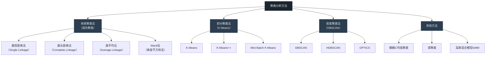
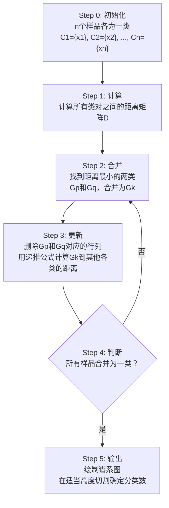

# 第4章 聚类分析及Python分类

## 模块一：精准教学大纲

### 一、教学目标

通过本章学习，学生应具备以下核心能力：

1. **聚类分析概念**：理解聚类分析的基本思想（类内相似性、类间差异性），区分Q型聚类（对样品）与R型聚类（对变量），理解聚类与分类的本质区别。
2. **距离度量**：掌握欧氏距离、曼哈顿距离、切比雪夫距离、马氏距离的计算公式与适用场景，理解距离公理的四条性质，了解相似系数（相关系数、夹角余弦）的计算。
3. **系统聚类法**：掌握最短距离法、最长距离法、类平均法、Ward法的类间距离定义与递推公式（Lance-Williams公式），能够绘制和解读谱系图（树状图）。
4. **K-Means聚类**：掌握K-Means算法的完整迭代流程（初始化→分配→更新→判断），理解目标函数的单调递减性质，了解K-Means++初始化的优势。
5. **最优分类数确定**：掌握肘部法则和轮廓系数法的原理与Python实现。
6. **Python实操**：能够使用scipy.cluster.hierarchy和sklearn.cluster进行系统聚类和K-Means聚类，并对结果进行业务解读。

### 二、建议学时

| 内容 | 学时 | 教学方式 |
|------|------|----------|
| 4.1 聚类分析的概念 | 1 | 讲授+案例讨论 |
| 4.2 聚类统计量 | 2 | 讲授+推导+数值示例 |
| 4.3 系统聚类法 | 3 | 讲授+图解+案例 |
| 4.4 快速聚类法 | 2.5 | 讲授+迭代演示+案例 |
| 4.5 聚类分析注意的问题 | 1.5 | 讨论+练习 |
| **合计** | **10** | |

### 三、重点与难点

**重点**：
- 各种距离度量的计算与选择（特别是欧氏距离与马氏距离的区别）
- 系统聚类法的Lance-Williams统一递推公式
- K-Means算法的迭代过程与目标函数
- 最优分类数的确定方法（肘部法则、轮廓系数法）
- 不同聚类方法的适用场景与选择依据

**难点**：
- 马氏距离的几何直觉与计算（需要理解协方差矩阵的逆）
- Ward法的目标函数推导（需要理解方差分解思想）
- 系统聚类法中距离矩阵的更新过程
- K-Means收敛到局部最优的问题

**化解建议**：
1. 对于马氏距离，建议先理解"标准化欧氏距离"（各变量除以自己的标准差），再理解"考虑变量间相关性的距离"（引入协方差矩阵的逆）。可以通过二维图形直观理解马氏距离的椭圆等距线。
2. 对于Ward法，核心直觉是"每次合并使类内方差增加最少的两类"，可以类比方差分析（ANOVA）的思想——将总方差分解为"类间"和"类内"两部分。
3. 对于K-Means的局部最优问题，建议使用K-Means++初始化，并多次运行取最优结果。

### 四、前置知识

| 前置知识 | 是否已在本课程前序章节出现 | 处理方式 |
|----------|--------------------------|----------|
| 线性代数（矩阵运算、特征值分解） | 是（第1章前置知识补充） | 直接引用 |
| NumPy数组操作 | 是（第2章） | 直接引用 |
| 数据标准化方法 | 是（第2章） | 直接引用 |
| Matplotlib/Seaborn绑图 | 是（第3章） | 直接引用 |
| 描述性统计量 | 是（第2章） | 直接引用 |

---

## 模块二：沉浸式理论讲解

### 4.1 聚类分析的概念

#### 4.1.1 什么是聚类分析？

**【业务场景引入】**

假设你是某大宗商品交易所的风控经理，手头有50家期货公司的交易数据，包括：日均成交量、持仓量、客户数、保证金规模、违规次数等。你需要将这50家公司分为3-5个风险等级，以便实施差异化的监管策略。

**问题**：你没有预先的风险等级标签——没有人告诉你哪些公司是"高风险"、哪些是"低风险"。

**聚类分析**正是解决这类问题的工具：**在没有预先标签的情况下，根据数据本身的结构，将相似的样品自动分组**。

**聚类的两个核心目标**：
- **类内相似性**：同一类中的对象尽可能相似（类内距离小）
- **类间差异性**：不同类之间的对象尽可能不同（类间距离大）

用一个直观的比喻：聚类就像把一堆不同颜色的弹珠自动分成几组——颜色相近的弹珠归为一组，颜色差异大的弹珠分到不同组。

**聚类分析的数学描述**：

给定 $n$ 个样品 $\{x_1, x_2, \ldots, x_n\}$，聚类分析的目标是将其划分为 $K$ 个不重叠的子集（簇）$\{C_1, C_2, \ldots, C_K\}$，使得：

1. $C_i \cap C_j = \emptyset$（各类互不重叠）
2. $\bigcup_{k=1}^{K} C_k = \{x_1, x_2, \ldots, x_n\}$（所有样品都被分配）
3. 类内距离最小化，类间距离最大化

#### 4.1.2 聚类与分类的区别

| 维度 | 聚类分析 | 判别分析/分类 |
|------|----------|---------------|
| **学习类型** | 无监督学习 | 有监督学习 |
| **是否需要标签** | 不需要 | 需要已标签的训练数据 |
| **目标** | 发现数据内在结构 | 建立分类规则 |
| **典型方法** | K-Means、层次聚类 | Fisher判别、SVM、随机森林 |
| **评价方式** | 轮廓系数、CH指数 | 准确率、混淆矩阵、ROC曲线 |
| **例子** | 将客户自动分群 | 根据已知违约数据预测新客户 |
| **数据要求** | 只需要特征矩阵X | 需要特征矩阵X和标签向量y |

**关键区别**：聚类是"让数据自己说话"——我们不知道数据应该分为几类，也不知道每类的含义，完全由数据的内在结构决定。分类是"从已知学习"——我们有已标签的训练数据，学习其中的规律，然后对新数据进行预测。

#### 4.1.3 聚类分析的类型

**（1）按聚类对象分**

**Q型聚类**：对观测样品进行分类。
- 例如：将50家期货公司按交易行为分为几类
- 使用**距离度量**衡量样品间的差异
- 输出：每个样品的类别标签

**R型聚类**：对变量进行分类。
- 例如：将20个经济指标按相关性归为几个类别
- 使用**相似系数**（如相关系数、夹角余弦）衡量变量间的相似性
- 输出：每个变量的类别标签

**（2）按方法分**

| 方法 | 核心思想 | 优点 | 缺点 | 适用场景 |
|------|----------|------|------|----------|
| 系统聚类法 | 自底向上逐步合并 | 不需预设K，可得层次结构 | 计算量O(n³)，不适合大数据 | 小样本探索性分析 |
| K-Means | 迭代划分，最小化类内距离 | 速度快O(nKt)，适合大数据 | 需预设K，对初始值敏感 | 大样本、球形分布 |
| K-Means++ | K-Means的改进初始化 | 减少局部最优风险 | 仍需预设K | 大样本、球形分布 |
| DBSCAN | 基于密度的聚类 | 能发现任意形状的类 | 对参数eps和min_samples敏感 | 非球形分布、有噪声 |
| 模糊聚类 | 样品以不同隶属度属于各类 | 处理边界模糊的数据 | 计算复杂 | 边界不清晰的数据 |



#### 4.1.4 聚类分析的应用场景

| 行业 | 应用场景 | 聚类对象 | 典型指标 |
|------|----------|----------|----------|
| **金融** | 客户细分 | 银行客户 | 月均消费、存款余额、信用评分 |
| **金融** | 商品分类 | 期货品种 | 收益率、波动率、与其他品种的相关性 |
| **医疗** | 疾病分型 | 患者 | 各项检测指标 |
| **营销** | 市场细分 | 消费者 | 年龄、收入、消费频率 |
| **环境** | 水质分区 | 监测站点 | pH、溶解氧、COD等 |
| **地质** | 岩石分类 | 岩石样本 | 各元素含量 |
| **体育** | 球员分类 | 运动员 | 各项技术统计 |

---

### 4.2 聚类统计量

#### 4.2.1 距离的概念

**【图形化说明：距离的几何直觉】**

想象一个二维平面上有5个点，我们需要衡量它们之间的"远近"。不同距离度量会给出不同的"远近"判断。

**（1）距离公理**

设 $d(x, y)$ 为样品 $x$ 和 $y$ 之间的距离，需满足以下四条公理：

$$
\begin{cases}
\text{非负性}: & d(x, y) \geq 0 \\
\text{同一性}: & d(x, x) = 0 \\
\text{对称性}: & d(x, y) = d(y, x) \\
\text{三角不等式}: & d(x, z) \leq d(x, y) + d(y, z)
\end{cases}
$$

**四条公理的直观理解**：
- **非负性**：距离不能为负数——两个点之间的距离不可能是"负3米"
- **同一性**：一个点到自己的距离为0——"我在我这里，距离为0"
- **对称性**：A到B的距离等于B到A的距离——"我去你家和你来我家的距离一样"
- **三角不等式**：A到C的距离不超过A到B再到C的距离——"绕路不会更近"

**（2）欧氏距离（Euclidean Distance）**

欧氏距离是最直观、最常用的距离度量，就是两点之间的"直线距离"。

$$
d(x, y) = \sqrt{\sum_{i=1}^{p}(x_i - y_i)^2}
$$

**计算示例**：设 $x = (1, 2)^T$，$y = (4, 6)^T$

$$
d(x, y) = \sqrt{(1-4)^2 + (2-6)^2} = \sqrt{9 + 16} = \sqrt{25} = 5
$$

**优点**：直观、计算简单、具有良好的数学性质

**缺点**：
- 受量纲影响（身高cm和体重kg不能直接比较）
- 假设变量独立（不考虑变量间的相关性）
- 对异常值敏感

**（3）曼哈顿距离（Manhattan Distance）**

曼哈顿距离又称"城市街区距离"——就像在纽约曼哈顿的网格街道上开车，只能沿东西或南北方向走，不能斜穿。

$$
d(x, y) = \sum_{i=1}^{p}|x_i - y_i|
$$

**计算示例**：同样的 $x = (1, 2)^T$，$y = (4, 6)^T$

$$
d(x, y) = |1-4| + |2-6| = 3 + 4 = 7
$$

**特点**：沿坐标轴方向计算，对异常值比欧氏距离更稳健。

**（4）切比雪夫距离（Chebyshev Distance）**

切比雪夫距离取各坐标差的绝对值中的最大值，就像国际象棋中国王从一个格子走到另一个格子所需的最少步数（国王可以向任意方向走一格）。

$$
d(x, y) = \max_{1 \leq i \leq p}|x_i - y_i|
$$

**计算示例**：同样的 $x = (1, 2)^T$，$y = (4, 6)^T$

$$
d(x, y) = \max(|1-4|, |2-6|) = \max(3, 4) = 4
$$

**（5）明氏距离族（Minkowski Distance）**

明氏距离是上述三种距离的统一形式：

$$
d(x, y) = \left(\sum_{i=1}^{p}|x_i - y_i|^m\right)^{1/m}
$$

- $m=1$：曼哈顿距离
- $m=2$：欧氏距离
- $m \to \infty$：切比雪夫距离

**（6）马氏距离（Mahalanobis Distance）**

马氏距离是统计学中最重要的距离度量，它解决了欧氏距离的两个核心问题：量纲影响和变量相关性。

$$
d^2(x, y) = (x - y)^T S^{-1} (x - y)
$$

其中 $S$ 为样本协方差矩阵。

**马氏距离的核心优势**：
1. **与量纲无关**：自动对各变量进行标准化
2. **考虑变量间的相关性**：通过 $S^{-1}$ 消除相关性的影响
3. **几何直觉**：马氏距离等价于在"标准化+去相关"的空间中计算欧氏距离

**详细计算示例**：

假设有两个变量，协方差矩阵为：

$$
S = \begin{pmatrix} 4 & 2 \\ 2 & 3 \end{pmatrix}
$$

计算逆矩阵：

$$
\det(S) = 4 \times 3 - 2 \times 2 = 12 - 4 = 8
$$

$$
S^{-1} = \frac{1}{8}\begin{pmatrix} 3 & -2 \\ -2 & 4 \end{pmatrix} = \begin{pmatrix} 0.375 & -0.25 \\ -0.25 & 0.5 \end{pmatrix}
$$

设 $x = (3, 5)^T$，$y = (1, 2)^T$，则 $x - y = (2, 3)^T$

$$
d^2 = (2, 3) \begin{pmatrix} 0.375 & -0.25 \\ -0.25 & 0.5 \end{pmatrix} \begin{pmatrix} 2 \\ 3 \end{pmatrix}
$$

先计算中间结果：

$$
\begin{pmatrix} 0.375 & -0.25 \\ -0.25 & 0.5 \end{pmatrix} \begin{pmatrix} 2 \\ 3 \end{pmatrix} = \begin{pmatrix} 0.375 \times 2 + (-0.25) \times 3 \\ (-0.25) \times 2 + 0.5 \times 3 \end{pmatrix} = \begin{pmatrix} 0 \\ 1 \end{pmatrix}
$$

$$
d^2 = (2, 3) \begin{pmatrix} 0 \\ 1 \end{pmatrix} = 2 \times 0 + 3 \times 1 = 3
$$

$$
d = \sqrt{3} \approx 1.732
$$

而欧氏距离为 $d = \sqrt{4 + 9} = \sqrt{13} \approx 3.606$。马氏距离更小，因为它考虑了变量间的正相关性——当两个变量正相关时，沿相关方向的差异"不那么意外"。

**（7）各距离度量的对比**

```python
import numpy as np
import matplotlib.pyplot as plt
from matplotlib.patches import Rectangle

plt.rcParams['font.sans-serif'] = ['SimHei']
plt.rcParams['axes.unicode_minus'] = False

fig, axes = plt.subplots(1, 3, figsize=(18, 6))

A = np.array([1, 1])
B = np.array([4, 5])

# 欧氏距离
ax = axes[0]
ax.scatter(*A, s=100, c='blue', zorder=5)
ax.scatter(*B, s=100, c='red', zorder=5)
ax.annotate('A(1,1)', A, textcoords="offset points", xytext=(-20, -15), fontsize=11)
ax.annotate('B(4,5)', B, textcoords="offset points", xytext=(5, 5), fontsize=11)
ax.plot([A[0], B[0]], [A[1], B[1]], 'k--', linewidth=2)
d_euc = np.linalg.norm(B-A)
ax.text(2.5, 3.5, f'd={d_euc:.2f}', fontsize=12, ha='center', bbox=dict(boxstyle='round', facecolor='wheat'))
ax.set_xlim(0, 6)
ax.set_ylim(0, 7)
ax.set_aspect('equal')
ax.set_title('欧氏距离：直线距离', fontsize=14)
ax.grid(True, alpha=0.3)

# 曼哈顿距离
ax = axes[1]
ax.scatter(*A, s=100, c='blue', zorder=5)
ax.scatter(*B, s=100, c='red', zorder=5)
ax.annotate('A(1,1)', A, textcoords="offset points", xytext=(-20, -15), fontsize=11)
ax.annotate('B(4,5)', B, textcoords="offset points", xytext=(5, 5), fontsize=11)
ax.plot([A[0], B[0]], [A[1], A[1]], 'g-', linewidth=2)
ax.plot([B[0], B[0]], [A[1], B[1]], 'g-', linewidth=2)
d_man = abs(A[0]-B[0]) + abs(A[1]-B[1])
ax.text(2.5, 2.5, f'd={d_man}', fontsize=12, ha='center', bbox=dict(boxstyle='round', facecolor='wheat'))
ax.set_xlim(0, 6)
ax.set_ylim(0, 7)
ax.set_aspect('equal')
ax.set_title('曼哈顿距离：沿坐标轴距离', fontsize=14)
ax.grid(True, alpha=0.3)

# 切比雪夫距离
ax = axes[2]
ax.scatter(*A, s=100, c='blue', zorder=5)
ax.scatter(*B, s=100, c='red', zorder=5)
ax.annotate('A(1,1)', A, textcoords="offset points", xytext=(-20, -15), fontsize=11)
ax.annotate('B(4,5)', B, textcoords="offset points", xytext=(5, 5), fontsize=11)
d_cheb = max(abs(A[0]-B[0]), abs(A[1]-B[1]))
rect = Rectangle(A, d_cheb, d_cheb, linewidth=2, edgecolor='purple', facecolor='lavender', alpha=0.3)
ax.add_patch(rect)
ax.plot([A[0], B[0]], [A[1], B[1]], 'purple', linewidth=2)
ax.text(2.5, 3.5, f'd={d_cheb}', fontsize=12, ha='center', bbox=dict(boxstyle='round', facecolor='wheat'))
ax.set_xlim(0, 6)
ax.set_ylim(0, 7)
ax.set_aspect('equal')
ax.set_title('切比雪夫距离：最大坐标差', fontsize=14)
ax.grid(True, alpha=0.3)

plt.suptitle('三种距离度量的几何直觉', fontsize=16, y=1.02)
plt.tight_layout()
plt.show()
```

*(此处平台应展示三种距离度量的对比图：欧氏距离为直线，曼哈顿距离为L形路径，切比雪夫距离为正方形边界)*

**距离对比总结**：

| 距离类型 | 公式 | 几何形状 | 适用场景 |
|----------|------|----------|----------|
| 欧氏距离 | $\sqrt{\sum(x_i-y_i)^2}$ | 直线 | 通用，最常用 |
| 曼哈顿距离 | $\sum\|x_i-y_i\|$ | L形路径 | 高维数据、有异常值 |
| 切比雪夫距离 | $\max\|x_i-y_i\|$ | 正方形 | 关注最大偏差 |
| 马氏距离 | $(x-y)^TS^{-1}(x-y)$ | 椭圆 | 变量相关、量纲不同 |

#### 4.2.2 距离的Python计算

```python
import numpy as np
from scipy.spatial.distance import pdist, squareform
import pandas as pd

# 创建示例数据：5个样品，3个变量
np.random.seed(42)
data = np.array([
    [1, 2, 3],   # 样品A
    [4, 5, 6],   # 样品B
    [7, 8, 9],   # 样品C
    [2, 3, 5],   # 样品D
    [5, 6, 8]    # 样品E
])
samples = ['A', 'B', 'C', 'D', 'E']

# 计算不同距离
dist_euc = pdist(data, metric='euclidean')
dist_man = pdist(data, metric='cityblock')
dist_cheb = pdist(data, metric='chebyshev')

# 转为完整矩阵
df_euc = pd.DataFrame(squareform(dist_euc), index=samples, columns=samples)
df_man = pd.DataFrame(squareform(dist_man), index=samples, columns=samples)
df_cheb = pd.DataFrame(squareform(dist_cheb), index=samples, columns=samples)

print("=== 欧氏距离矩阵 ===")
print(df_euc.round(2))
print("\n=== 曼哈顿距离矩阵 ===")
print(df_man.round(2))
print("\n=== 切比雪夫距离矩阵 ===")
print(df_cheb.round(2))
```

*(此处平台应展示三种距离矩阵的输出结果)*

#### 4.2.3 相似系数

**（1）Pearson相关系数**

$$
r = \frac{\sum_{i=1}^{n}(x_i - \bar{x})(y_i - \bar{y})}{\sqrt{\sum(x_i - \bar{x})^2 \cdot \sum(y_i - \bar{y})^2}}
$$

相关系数 $r \in [-1, 1]$，$|r|$ 越大越相似。可转换为距离：

$$
d = \sqrt{2(1-r)} \quad \text{或} \quad d = 1 - |r|
$$

**（2）夹角余弦**

$$
\cos\theta = \frac{x^T y}{\|x\| \cdot \|y\|}
$$

度量向量方向的相似程度，在文本分析中常用TF-IDF向量的余弦相似度。

**（3）相关系数与距离的关系**

```python
import numpy as np
import matplotlib.pyplot as plt

plt.rcParams['font.sans-serif'] = ['SimHei']
plt.rcParams['axes.unicode_minus'] = False

# 相关系数与距离的转换
r_values = np.linspace(-1, 1, 100)
d_sqrt = np.sqrt(2 * (1 - r_values))  # d = sqrt(2(1-r))
d_one_minus = 1 - np.abs(r_values)     # d = 1 - |r|

fig, ax = plt.subplots(figsize=(8, 5))
ax.plot(r_values, d_sqrt, 'b-', linewidth=2, label=r'$d = \sqrt{2(1-r)}$')
ax.plot(r_values, d_one_minus, 'r--', linewidth=2, label=r'$d = 1 - |r|$')
ax.set_xlabel('相关系数 r', fontsize=12)
ax.set_ylabel('距离 d', fontsize=12)
ax.set_title('相关系数与距离的转换关系', fontsize=14)
ax.legend(fontsize=11)
ax.grid(True, alpha=0.3)
plt.tight_layout()
plt.show()
```

*(此处平台应展示相关系数与距离转换关系的图形)*

---

### 4.3 系统聚类法

#### 4.3.1 基本思想

系统聚类法（Hierarchical Clustering）是最直观的聚类方法之一。它的核心思想是：**从每个样品各为一类开始，逐步合并最相似的两类，直到所有样品合并为一类**。

**凝聚型系统聚类的完整流程**：



#### 4.3.2 系统聚类法的详细图解

**【以6个商品品种为例，完整演示系统聚类的每一步】**

假设有6个商品品种，我们用2个特征（标准化后的年化波动率和与铜的相关性）来衡量它们的距离：

| 品种 | 特征1（波动率） | 特征2（与铜相关性） |
|------|----------------|-------------------|
| 铜 | 0.5 | 1.0 |
| 铝 | 0.3 | 0.7 |
| 锌 | 0.6 | 0.8 |
| 黄金 | -0.8 | -0.3 |
| 白银 | -0.5 | 0.1 |
| 原油 | 0.4 | 0.6 |

**Step 0：初始距离矩阵**

计算所有品种对之间的欧氏距离：

|   | 铜 | 铝 | 锌 | 黄金 | 白银 | 原油 |
|---|-----|-----|-----|------|------|------|
| 铜 | 0 | 0.36 | 0.32 | 1.80 | 1.22 | 0.41 |
| 铝 | 0.36 | 0 | 0.42 | 1.58 | 1.00 | 0.14 |
| 锌 | 0.32 | 0.42 | 0 | 1.70 | 1.30 | 0.28 |
| 黄金 | 1.80 | 1.58 | 1.70 | 0 | 0.50 | 1.22 |
| 白银 | 1.22 | 1.00 | 1.30 | 0.50 | 0 | 0.94 |
| 原油 | 0.41 | 0.14 | 0.28 | 1.22 | 0.94 | 0 |

**Step 1：第一次合并**

最小距离为 0.14（铝和原油）。合并铝和原油为类 {铝,原油}。

**Step 2：更新距离矩阵（最短距离法）**

$$
D(\{\text{铝,原油}\}, \text{铜}) = \min(d(\text{铝,铜}), d(\text{原油,铜})) = \min(0.36, 0.41) = 0.36
$$

$$
D(\{\text{铝,原油}\}, \text{锌}) = \min(0.42, 0.28) = 0.28
$$

$$
D(\{\text{铝,原油}\}, \text{黄金}) = \min(1.58, 1.22) = 1.22
$$

$$
D(\{\text{铝,原油}\}, \text{白银}) = \min(1.00, 0.94) = 0.94
$$

**Step 3-5：继续合并**

重复上述过程，直到所有品种合并为一类。最终的合并顺序为：

1. 铝 + 原油 → {铝,原油}（距离=0.14）
2. 铜 + 锌 → {铜,锌}（距离=0.32）
3. {铝,原油} + {铜,锌} → {工业金属}（距离=0.28）
4. 黄金 + 白银 → {贵金属}（距离=0.50）
5. {工业金属} + {贵金属} → {全部}（距离=0.94）

#### 4.3.3 类间距离的定义

**（1）最短距离法（Single Linkage）**

$$
D(G_p, G_q) = \min_{i \in G_p, l \in G_q} d(i, l)
$$

定义类间距离为两类中最近样品间的距离。

**优点**：计算简单

**缺点**：容易产生**链式效应**——倾向于产生细长的类。即使两类大部分样品距离很远，只要有一对样品距离很近就会被合并。

**（2）最长距离法（Complete Linkage）**

$$
D(G_p, G_q) = \max_{i \in G_p, l \in G_q} d(i, l)
$$

定义类间距离为两类中最远样品间的距离。

**优点**：避免链式效应，倾向于产生大小相近、形状紧凑的类

**缺点**：对异常值敏感

**（3）类平均法（Average Linkage）**

$$
D(G_p, G_q) = \frac{1}{n_p \cdot n_q}\sum_{i \in G_p}\sum_{l \in G_q} d(i, l)
$$

定义类间距离为两类中所有样品对距离的算术平均值。

**优点**：兼顾了最短和最长距离法的优点，是折中选择

**（4）Ward法（离差平方和法）**

Ward法的核心思想：**每次合并使类内离差平方和 $W$ 增加最少的两类**。

类内离差平方和的定义：

$$
W_k = \sum_{i \in G_k} \|x_i - \bar{x}_k\|^2
$$

其中 $\bar{x}_k$ 为第 $k$ 类的重心（均值向量）。

总类内离差平方和：

$$
W = \sum_{k=1}^{K} W_k
$$

合并 $G_p$ 和 $G_q$ 为 $G_r$ 后的 $W$ 增量：

$$
\Delta W = \frac{n_p \cdot n_q}{n_p + n_q} \|\bar{x}_p - \bar{x}_q\|^2
$$

Ward法选择使 $\Delta W$ 最小的两类合并。

**Ward法的优点**：
- 倾向于产生大小相近的类
- 效果通常优于其他方法
- 是实际中最常用的系统聚类方法

#### 4.3.4 Lance-Williams统一递推公式

所有系统聚类法的距离更新可以统一为一个公式：

$$
D(G_r, G_s) = \alpha_p D(G_p, G_s) + \alpha_q D(G_q, G_s) + \beta D(G_p, G_q) + \gamma |D(G_p, G_s) - D(G_q, G_s)|
$$

其中 $G_r = G_p \cup G_q$ 是新合并的类，不同方法对应不同的参数值：

| 方法 | $\alpha_p$ | $\alpha_q$ | $\beta$ | $\gamma$ |
|------|-----------|-----------|---------|---------|
| 最短距离 | 1/2 | 1/2 | 0 | -1/2 |
| 最长距离 | 1/2 | 1/2 | 0 | 1/2 |
| 类平均 | $n_p/(n_p+n_q)$ | $n_q/(n_p+n_q)$ | 0 | 0 |
| Ward法 | $(n_p+n_s)/(n_p+n_q+n_s)$ | $(n_q+n_s)/(n_p+n_q+n_s)$ | $-n_s/(n_p+n_q+n_s)$ | 0 |

#### 4.3.5 谱系图的解读

谱系图（树状图/dendrogram）是系统聚类法最重要的输出：

**解读方法**：
- **纵轴**：合并距离。合并发生在越高的位置，说明被合并的两类差异越大。
- **横轴**：各样品。
- **切割线**：在某一高度水平画一条水平线，切割线穿过的竖线数即为分类数。

**选择切割高度的原则**：
1. 切割线应穿过"跳跃"较大的合并步骤
2. 切割后各类的大小应合理（不宜过大或过小）
3. 切割结果应有实际业务含义

#### 4.3.6 最优分类数的确定

**（1）肘部法则（Elbow Method）**

计算不同 $K$ 值下的类内平方和 $W(K)$：

$$
W(K) = \sum_{k=1}^{K}\sum_{x_i \in C_k} \|x_i - \bar{x}_k\|^2
$$

绘制 $W-K$ 曲线，拐点处的 $K$ 为最优分类数。拐点后 $W$ 下降变缓，增加 $K$ 的收益递减。

**（2）轮廓系数法（Silhouette Coefficient）**

对每个样品 $i$，定义：

$$
s(i) = \frac{b(i) - a(i)}{\max(a(i), b(i))}
$$

其中：
- $a(i)$：样品 $i$ 到同类其他样品的平均距离（类内平均距离）
- $b(i)$：样品 $i$ 到最近的其他类中所有样品的平均距离（最近类平均距离）

$s(i) \in [-1, 1]$：
- 接近1：样品被很好地分类
- 接近0：样品在两类边界
- 接近-1：样品可能被错分

平均轮廓系数 $\bar{s}$ 最大的 $K$ 为最优分类数。

---


#### 4.2.4 距离度量选择的决策指南

**【业务场景】** 在实际应用中，选择合适的距离度量是聚类分析的第一步，也是最关键的一步。不同的距离度量会得到完全不同的聚类结果。

```python
import numpy as np
import matplotlib.pyplot as plt
from sklearn.cluster import KMeans
from scipy.spatial.distance import pdist, squareform

plt.rcParams['font.sans-serif'] = ['SimHei']
plt.rcParams['axes.unicode_minus'] = False
np.random.seed(42)

# 生成两组数据：一组用欧氏距离效果好，一组用马氏距离效果好
from sklearn.datasets import make_blobs, make_moons

# 场景1：球形分布（欧氏距离效果好）
X1, y1 = make_blobs(n_samples=200, centers=3, cluster_std=1.0, random_state=42)

# 场景2：椭圆分布（马氏距离效果好）
from sklearn.datasets.samples_generator import make_spd_matrix
cov = np.array([[2, 0.8], [0.8, 0.5]])
X2_1 = np.random.multivariate_normal([0, 0], cov, 80)
X2_2 = np.random.multivariate_normal([5, 3], cov, 80)
X2_3 = np.random.multivariate_normal([2, -3], cov, 80)
X2 = np.vstack([X2_1, X2_2, X2_3])
y2 = np.array([0]*80 + [1]*80 + [2]*80)

fig, axes = plt.subplots(1, 2, figsize=(14, 6))

# 球形分布
axes[0].scatter(X1[:, 0], X1[:, 1], c=y1, cmap='Set1', s=20, alpha=0.7)
axes[0].set_title('场景1：球形分布\n（适合欧氏距离+K-Means）', fontsize=13)

# 椭圆分布
axes[1].scatter(X2[:, 0], X2[:, 1], c=y2, cmap='Set1', s=20, alpha=0.7)
axes[1].set_title('场景2：椭圆分布\n（适合马氏距离）', fontsize=13)

plt.tight_layout()
plt.show()
```

*(此处平台应展示两种分布形态的对比图)*

**距离度量选择决策树**：

| 数据特征 | 推荐距离 | 原因 |
|----------|----------|------|
| 变量独立、同量纲 | 欧氏距离 | 最直观、最常用 |
| 变量独立、不同量纲 | 标准化欧氏距离 | 消除量纲影响 |
| 变量相关 | 马氏距离 | 考虑变量间相关性 |
| 高维稀疏数据 | 曼哈顿距离 | 对高维更稳健 |
| 关注最大偏差 | 切比雪夫距离 | 取最大坐标差 |
| 分类变量 | 汉明距离 | 计算不匹配属性数 |

#### 4.2.5 距离矩阵的Python计算详解

```python
import numpy as np
import pandas as pd
from scipy.spatial.distance import pdist, squareform
from sklearn.preprocessing import StandardScaler

# 创建示例数据：8个商品期货品种的特征
data = pd.DataFrame({
    '品种': ['铜', '铝', '锌', '铅', '镍', '黄金', '白银', '原油'],
    '年化收益率': [0.08, 0.05, 0.06, 0.04, 0.07, 0.03, 0.04, 0.06],
    '年化波动率': [0.28, 0.22, 0.25, 0.20, 0.30, 0.15, 0.25, 0.35],
    '与铜相关性': [1.00, 0.70, 0.80, 0.60, 0.65, -0.25, 0.10, 0.55]
})

features = data[['年化收益率', '年化波动率', '与铜相关性']]

# Z-score标准化
scaler = StandardScaler()
X_std = scaler.fit_transform(features)

# 计算距离矩阵
dist_euc = squareform(pdist(X_std, metric='euclidean'))
dist_man = squareform(pdist(X_std, metric='cityblock'))

df_euc = pd.DataFrame(dist_euc, index=data['品种'], columns=data['品种'])
df_man = pd.DataFrame(dist_man, index=data['品种'], columns=data['品种'])

print("=== 欧氏距离矩阵（标准化后）===")
print(df_euc.round(3))

print("\n=== 曼哈顿距离矩阵（标准化后）===")
print(df_man.round(3))

# 找出最近和最远的品种对
from itertools import combinations
pairs = list(combinations(data['品种'], 2))
euc_dists = pdist(X_std, metric='euclidean')

min_idx = np.argmin(euc_dists)
max_idx = np.argmax(euc_dists)
print(f"\n距离最近的品种对: {pairs[min_idx]}, 距离={euc_dists[min_idx]:.3f}")
print(f"距离最远的品种对: {pairs[max_idx]}, 距离={euc_dists[max_idx]:.3f}")
```

*(此处平台应展示距离矩阵和最近/最远品种对的输出)*

**结果解读**：
- 黄金与铜的距离最远，反映了"工业品 vs 避险品"的差异
- 铝与锌的距离最近，因为它们都是工业金属，受相似的供需因素驱动

#### 4.2.6 马氏距离的详细推导与计算

**马氏距离的推导过程**：

设 $p$ 维随机向量 $X$ 的协方差矩阵为 $\Sigma$。马氏距离的定义为：

$$
d_M^2(X, \mu) = (X - \mu)^T \Sigma^{-1} (X - \mu)
$$

**推导思路**：

1. 首先对每个变量进行标准化：$Z_i = (X_i - \mu_i) / \sigma_i$
2. 然后消除变量间的相关性：$Z^* = \Sigma^{-1/2} Z$
3. 最后计算标准化空间中的欧氏距离：$d = \|Z^*\|^2$

**Step-by-step计算示例**：

设有两个变量，数据矩阵为：

$$
X = \begin{pmatrix} 1 & 2 \\ 3 & 4 \\ 5 & 6 \\ 7 & 8 \\ 9 & 10 \end{pmatrix}
$$

**Step 1**：计算均值向量

$$
\bar{X} = \left(\frac{1+3+5+7+9}{5}, \frac{2+4+6+8+10}{5}\right) = (5, 6)
$$

**Step 2**：计算协方差矩阵

$$
S = \frac{1}{n-1}\sum_{i=1}^{n}(x_i - \bar{x})(x_i - \bar{x})^T
$$

$$
S = \begin{pmatrix} 10 & 10 \\ 10 & 10 \end{pmatrix}
$$

（注意：这里两个变量完全相关，协方差矩阵是奇异的。实际数据中通常不会出现这种情况。）

**Step 3**：计算逆矩阵

$$
S^{-1} = \frac{1}{10 \times 10 - 10 \times 10}\begin{pmatrix} 10 & -10 \\ -10 & 10 \end{pmatrix}
$$

由于行列式为0，矩阵不可逆。这说明两个变量完全线性相关，实际上只需要一个变量就能完全描述数据。

**实际应用中的注意事项**：
1. 如果协方差矩阵接近奇异（条件数很大），可以使用正则化：$S_{reg} = S + \lambda I$
2. 在高维数据中（$p > n$），协方差矩阵一定是奇异的，需要先降维
3. 马氏距离的计算成本较高（需要矩阵求逆），对于大数据集可以考虑使用近似方法

---

### 4.3.7 不同系统聚类方法的详细比较

**【图形化说明：四种方法在同一数据集上的聚类结果对比】**

```python
import numpy as np
import matplotlib.pyplot as plt
from sklearn.datasets import make_blobs
from scipy.cluster.hierarchy import linkage, fcluster

plt.rcParams['font.sans-serif'] = ['SimHei']
plt.rcParams['axes.unicode_minus'] = False
np.random.seed(42)

# 生成3簇数据
X, y_true = make_blobs(n_samples=150, centers=3, cluster_std=1.0, random_state=42)

methods = ['single', 'complete', 'average', 'ward']
method_names = ['最短距离法', '最长距离法', '类平均法', 'Ward法']

fig, axes = plt.subplots(2, 2, figsize=(14, 12))

for idx, (method, name) in enumerate(zip(methods, method_names)):
    ax = axes[idx // 2, idx % 2]
    Z = linkage(X, method=method)
    labels = fcluster(Z, t=3, criterion='maxclust')
    
    colors = ['#2C3E50', '#E74C3C', '#3498DB']
    for k in range(1, 4):
        mask = labels == k
        ax.scatter(X[mask, 0], X[mask, 1], c=colors[k-1], s=20, alpha=0.7, label=f'类{k}')
    ax.set_title(f'{name}聚类结果', fontsize=14)
    ax.legend(fontsize=9)

plt.suptitle('不同系统聚类方法的聚类结果对比', fontsize=16, y=1.02)
plt.tight_layout()
plt.show()
```

*(此处平台应展示四种方法在同一数据集上的聚类结果对比图)*

**方法比较总结**：

| 方法 | 聚类形状 | 大小倾向 | 链式效应 | 计算复杂度 | 推荐场景 |
|------|----------|----------|----------|------------|----------|
| 最短距离 | 任意形状 | 无倾向 | 有 | O(n²) | 非球形数据 |
| 最长距离 | 紧凑球形 | 大小相近 | 无 | O(n²) | 需要紧凑类 |
| 类平均 | 适中 | 适中 | 弱 | O(n²) | 通用 |
| Ward | 紧凑球形 | 大小相近 | 无 | O(n²) | 通用，最常用 |

---

### 4.4.5 K-Means算法的收敛性分析

**（1）目标函数的单调递减性**

K-Means算法的一个重要性质是：**每次迭代，目标函数 $W$ 单调递减或不变**。

**证明**：

设第 $t$ 次迭代后的目标函数为 $W^{(t)}$。

在分配步骤中，每个样品被分配到最近的中心所在类。如果样品 $x_i$ 从类 $C_j$ 移动到类 $C_k$，则：

$$
\|x_i - c_k\|^2 < \|x_i - c_j\|^2
$$

因此，分配步骤不会增加 $W$。

在更新步骤中，新的中心是类内所有样品的均值，根据均值的性质，均值使类内平方和最小：

$$
\sum_{x_i \in C_j} \|x_i - c_j^{new}\|^2 \leq \sum_{x_i \in C_j} \|x_i - c_j^{old}\|^2
$$

因此，更新步骤也不会增加 $W$。

**结论**：$W^{(t+1)} \leq W^{(t)}$，且 $W \geq 0$，所以算法一定收敛。

**（2）局部最优问题**

虽然K-Means保证收敛，但只保证收敛到**局部最优**，不保证**全局最优**。

```python
import numpy as np
import matplotlib.pyplot as plt
from sklearn.cluster import KMeans
from sklearn.datasets import make_blobs

plt.rcParams['font.sans-serif'] = ['SimHei']
plt.rcParams['axes.unicode_minus'] = False
np.random.seed(42)

X, _ = make_blobs(n_samples=200, centers=3, random_state=42)

fig, axes = plt.subplots(1, 3, figsize=(18, 5))
colors = ['#2C3E50', '#E74C3C', '#3498DB']

for idx, seed in enumerate([0, 10, 50]):
    km = KMeans(n_clusters=3, n_init=1, random_state=seed)
    labels = km.fit_predict(X)
    
    for k in range(3):
        mask = labels == k
        axes[idx].scatter(X[mask, 0], X[mask, 1], c=colors[k], s=20, alpha=0.7)
    axes[idx].scatter(km.cluster_centers_[:, 0], km.cluster_centers_[:, 1],
                      c='black', marker='X', s=200, linewidths=2)
    axes[idx].set_title(f'初始种子={seed}, W={km.inertia_:.0f}', fontsize=13)

plt.suptitle('不同初始种子的K-Means结果（局部最优问题）', fontsize=16, y=1.02)
plt.tight_layout()
plt.show()
```

*(此处平台应展示不同初始种子导致不同聚类结果的对比图)*

**解决方案**：
1. **K-Means++初始化**：使初始中心尽量分散
2. **多次运行取最优**：设置 `n_init=10`，运行10次取目标函数最小的结果
3. **使用其他方法**：如果K-Means效果不好，考虑使用DBSCAN或谱聚类

#### 4.4.6 K-Means的Python实现详解

```python
import numpy as np
import pandas as pd
from sklearn.cluster import KMeans
from sklearn.preprocessing import StandardScaler
from sklearn.metrics import silhouette_score, calinski_harabasz_score

# 创建示例数据
np.random.seed(42)
data = pd.DataFrame({
    '品种': ['铜', '铝', '锌', '铅', '镍', '黄金', '白银', '原油', '天然气', '大豆'],
    '年化收益率': [0.08, 0.05, 0.06, 0.04, 0.07, 0.03, 0.04, 0.06, 0.05, 0.03],
    '年化波动率': [0.28, 0.22, 0.25, 0.20, 0.30, 0.15, 0.25, 0.35, 0.32, 0.18],
    '与铜相关性': [1.00, 0.70, 0.80, 0.60, 0.65, -0.25, 0.10, 0.55, 0.40, 0.20]
})

features = data[['年化收益率', '年化波动率', '与铜相关性']]
scaler = StandardScaler()
X_std = scaler.fit_transform(features)

# K-Means聚类
km = KMeans(n_clusters=3, n_init=10, random_state=42)
data['聚类标签'] = km.fit_predict(X_std)

# 详细输出
print("=== K-Means聚类结果 ===")
print(f"聚类中心（标准化后）:\n{pd.DataFrame(km.cluster_centers_, columns=features.columns).round(3)}")
print(f"\n各类成员:")
for k in range(3):
    members = data[data['聚类标签'] == k]['品种'].tolist()
    print(f"  类{k}: {members}")

print(f"\n目标函数（类内平方和）: {km.inertia_:.4f}")
print(f"迭代次数: {km.n_iter_}")

# 评价指标
sil_score = silhouette_score(X_std, data['聚类标签'])
ch_score = calinski_harabasz_score(X_std, data['聚类标签'])
print(f"\n轮廓系数: {sil_score:.4f}")
print(f"CH指数: {ch_score:.2f}")
```

*(此处平台应展示K-Means聚类的详细输出结果)*

---

### 4.5.4 聚类结果的实际解释框架

**【业务场景】** 聚类分析的最终目的是为业务决策提供支持。以下是聚类结果解释的标准框架：

**Step 1：描述各类的统计特征**

计算每个类在各指标上的均值、标准差、中位数等。

**Step 2：识别各类的关键特征**

找到各类与其他类差异最大的指标。例如：
- 类0的"交易频率"显著高于其他类 → "高频交易型"
- 类1的"持仓规模"显著高于其他类 → "长线持仓型"

**Step 3：命名各类**

根据关键特征为每类命名，命名应简洁、有业务含义。

**Step 4：制定差异化策略**

根据各类的特征制定差异化的业务策略。

**示例：商品期货品种的聚类解释**

| 类别 | 成员 | 关键特征 | 命名 | 投资策略 |
|------|------|----------|------|----------|
| 类0 | 铜、铝、锌 | 与铜高相关、工业属性 | 工业金属 | 经济扩张期超配 |
| 类1 | 黄金、白银 | 与铜负相关、避险属性 | 贵金属 | 市场恐慌期超配 |
| 类2 | 原油、天然气 | 高波动率、能源属性 | 能源品 | 关注地缘政治风险 |

---

### 4.4 快速聚类法（K-Means）

#### 4.4.1 K-Means算法的完整步骤

**输入**：数据集 $X = \{x_1, x_2, \ldots, x_n\}$，分类数 $K$

**Step 1 初始化**：随机选择 $K$ 个样品作为初始聚类中心 $c_1, c_2, \ldots, c_K$

**Step 2 分配**：对每个样品 $x_i$，计算到 $K$ 个中心的距离，将其分配到最近的中心所在类：

$$
C_j = \{x_i : \|x_i - c_j\| \leq \|x_i - c_l\|, \forall l = 1, \ldots, K\}
$$

**Step 3 更新**：计算各类的新中心（该类所有样品的均值）：

$$
c_j^{new} = \frac{1}{|C_j|}\sum_{x_i \in C_j} x_i
$$

**Step 4 判断**：如果中心不再变化或达到最大迭代次数，停止；否则返回Step 2。

**【K-Means迭代过程的详细图解】**

```python
import numpy as np
import matplotlib.pyplot as plt

plt.rcParams['font.sans-serif'] = ['SimHei']
plt.rcParams['axes.unicode_minus'] = False
np.random.seed(42)

# 生成3簇数据
from sklearn.datasets import make_blobs
X, y_true = make_blobs(n_samples=150, centers=3, cluster_std=0.8, random_state=42)

# K-Means迭代过程
fig, axes = plt.subplots(1, 4, figsize=(20, 5))

# 初始状态
centers_init = X[np.random.choice(len(X), 3, replace=False)]
colors = ['#2C3E50', '#E74C3C', '#3498DB']

# 手动实现K-Means迭代
centers = centers_init.copy()
for iteration in range(4):
    # 分配
    distances = np.sqrt(((X[:, np.newaxis] - centers[np.newaxis, :]) ** 2).sum(axis=2))
    labels = distances.argmin(axis=1)
    
    # 绘图
    for k in range(3):
        mask = labels == k
        axes[iteration].scatter(X[mask, 0], X[mask, 1], c=colors[k], s=20, alpha=0.5)
    axes[iteration].scatter(centers[:, 0], centers[:, 1], c='black', marker='X', s=200, linewidths=2)
    axes[iteration].set_title(f'迭代 {iteration}', fontsize=14)
    axes[iteration].set_xlim(-5, 5)
    axes[iteration].set_ylim(-2, 6)
    
    # 更新中心
    for k in range(3):
        mask = labels == k
        if mask.sum() > 0:
            centers[k] = X[mask].mean(axis=0)

plt.suptitle('K-Means迭代过程', fontsize=16, y=1.02)
plt.tight_layout()
plt.show()
```

*(此处平台应展示K-Means迭代过程的4个阶段图：初始随机中心→第一次分配→更新中心→收敛)*

#### 4.4.2 目标函数

K-Means最小化类内平方和：

$$
W = \sum_{j=1}^{K}\sum_{x_i \in C_j} \|x_i - c_j\|^2
$$

**重要性质**：每次迭代 $W$ 单调递减，保证收敛到局部最优（不保证全局最优）。

**目标函数下降过程**：

```python
import numpy as np
import matplotlib.pyplot as plt
from sklearn.cluster import KMeans
from sklearn.datasets import make_blobs

plt.rcParams['font.sans-serif'] = ['SimHei']
plt.rcParams['axes.unicode_minus'] = False

X, _ = make_blobs(n_samples=300, centers=3, random_state=42)

# 记录每次迭代的目标函数值
inertias = []
for n_iter in range(1, 11):
    km = KMeans(n_clusters=3, n_init=1, max_iter=n_iter, random_state=42)
    km.fit(X)
    inertias.append(km.inertia_)

fig, ax = plt.subplots(figsize=(8, 5))
ax.plot(range(1, 11), inertias, 'bo-', linewidth=2, markersize=8)
ax.set_xlabel('迭代次数', fontsize=12)
ax.set_ylabel('类内平方和 W', fontsize=12)
ax.set_title('K-Means目标函数随迭代次数的变化', fontsize=14)
ax.grid(True, alpha=0.3)
plt.tight_layout()
plt.show()
```

*(此处平台应展示目标函数随迭代次数单调递减并收敛的图形)*

#### 4.4.3 K-Means++初始化

标准K-Means的初始中心是随机选择的，不同初始值可能得到不同的局部最优解。K-Means++通过以下策略使初始中心尽量分散：

1. 第一个中心随机选择
2. 对每个样品 $x_i$，计算它到最近已有中心的距离 $D(x_i)$
3. 以概率 $\frac{D(x_i)^2}{\sum_j D(x_j)^2}$ 选择下一个中心
4. 重复步骤2-3直到选择 $K$ 个中心

**效果**：使初始中心尽量分散，减少陷入局部最优的概率。

#### 4.4.4 K-Means的适用条件与局限

| 条件 | 说明 |
|------|------|
| ✅ 球形分布 | 各类呈球形分布、大小相近 |
| ✅ 大样本 | 适合 $n > 1000$ 的数据 |
| ✅ 特征维度适中 | 维度不宜过高（可先用PCA降维） |
| ❌ 非球形分布 | 对环形、条形等非球形分布效果差 |
| ❌ 大小差异大 | 倾向于产生大小相近的类 |
| ❌ 对初始值敏感 | 不同初始值可能得到不同结果 |
| ❌ 需预先指定K | 必须事先确定分类数 |
| ❌ 对异常值敏感 | 异常值会拉偏聚类中心 |

---

### 4.5 聚类分析注意事项

#### 4.5.1 数据标准化的必要性

当变量量纲不同时，数值大的变量主导距离计算。

**示例**：假设有两个变量"身高（cm）"和"体重（kg）"，一个人的身高为170cm、体重为65kg，另一个人的身高为175cm、体重为70kg。

- 未标准化的欧氏距离：$\sqrt{(170-175)^2 + (65-70)^2} = \sqrt{25 + 25} = 7.07$
- 身高的贡献：$\sqrt{25} = 5$（占71%）
- 体重的贡献：$\sqrt{25} = 5$（占29%）

虽然身高和体重的"原始差异"都是5，但由于身高的数值更大（170 vs 65），它在距离计算中的相对影响更大。

**解决方案**：使用Z-score标准化，使各变量的均值为0、标准差为1。

#### 4.5.2 方法选择指南

| 条件 | 推荐方法 | 原因 |
|------|----------|------|
| 小样本（n<500），探索性分析 | 系统聚类（Ward法） | 可得层次结构，不需预设K |
| 大样本（n>1000），K已知 | K-Means | 速度快 |
| 非球形分布 | DBSCAN | 能发现任意形状的类 |
| 需要层次结构 | 系统聚类 | 自然产出谱系图 |
| 数据有噪声 | DBSCAN | 自动识别噪声点 |
| 需要模糊分类 | 模糊C均值 | 允许样品属于多个类 |

#### 4.5.3 聚类结果的验证

**（1）内部评价指标**

| 指标 | 公式 | 取值范围 | 含义 |
|------|------|----------|------|
| 轮廓系数 | $s = (b-a)/\max(a,b)$ | [-1, 1] | 越大越好 |
| CH指数 | $CH = (B/K-1)/(W/(n-K))$ | [0, +∞) | 越大越好 |
| DB指数 | $DB = \frac{1}{K}\sum_k \max_{l \neq k} \frac{s_k + s_l}{d_{kl}}$ | [0, +∞) | 越小越好 |

**（2）外部评价指标**（当有真实标签时）

| 指标 | 取值范围 | 含义 |
|------|----------|------|
| 调整兰德指数（ARI） | [-1, 1] | 越大越好 |
| 标准化互信息（NMI） | [0, 1] | 越大越好 |

**（3）实际解释**

聚类结果需要结合专业背景验证其合理性。例如，在商品期货聚类中：
- 工业金属（铜、铝、锌）是否聚为一类？✓ 合理
- 贵金属（黄金、白银）是否聚为一类？✓ 合理
- 如果原油和黄金聚为一类？✗ 需要检查原因

---

## 模块三：实战与代码复现

### 实战案例4-1：距离度量的可视化对比

```python
import numpy as np
import matplotlib.pyplot as plt

plt.rcParams['font.sans-serif'] = ['SimHei']
plt.rcParams['axes.unicode_minus'] = False

center = np.array([0, 0])
x = np.linspace(-3, 3, 300)
y = np.linspace(-3, 3, 300)
X, Y = np.meshgrid(x, y)

d_euclidean = np.sqrt(X**2 + Y**2)
d_manhattan = np.abs(X) + np.abs(Y)
d_chebyshev = np.maximum(np.abs(X), np.abs(Y))

fig, axes = plt.subplots(1, 3, figsize=(18, 6))

cs1 = axes[0].contour(X, Y, d_euclidean, levels=[1, 2, 3], colors=['#2C3E50', '#E74C3C', '#3498DB'], linewidths=2)
axes[0].clabel(cs1, inline=True, fontsize=10)
axes[0].scatter(0, 0, s=100, c='black', zorder=5)
axes[0].set_title('欧氏距离等距线\n（圆形）', fontsize=14)
axes[0].set_aspect('equal')
axes[0].grid(True, alpha=0.3)

cs2 = axes[1].contour(X, Y, d_manhattan, levels=[1, 2, 3], colors=['#2C3E50', '#E74C3C', '#3498DB'], linewidths=2)
axes[1].clabel(cs2, inline=True, fontsize=10)
axes[1].scatter(0, 0, s=100, c='black', zorder=5)
axes[1].set_title('曼哈顿距离等距线\n（菱形）', fontsize=14)
axes[1].set_aspect('equal')
axes[1].grid(True, alpha=0.3)

cs3 = axes[2].contour(X, Y, d_chebyshev, levels=[1, 2, 3], colors=['#2C3E50', '#E74C3C', '#3498DB'], linewidths=2)
axes[2].clabel(cs3, inline=True, fontsize=10)
axes[2].scatter(0, 0, s=100, c='black', zorder=5)
axes[2].set_title('切比雪夫距离等距线\n（正方形）', fontsize=14)
axes[2].set_aspect('equal')
axes[2].grid(True, alpha=0.3)

plt.suptitle('三种距离度量的等距线形状对比', fontsize=16, y=1.02)
plt.tight_layout()
plt.show()
```

*(此处平台应展示三种距离的等距线图)*

---

### 实战案例4-2：系统聚类全过程演示

```python
import numpy as np
import pandas as pd
import matplotlib.pyplot as plt
from scipy.cluster.hierarchy import linkage, dendrogram
from scipy.spatial.distance import pdist, squareform
from sklearn.preprocessing import StandardScaler

plt.rcParams['font.sans-serif'] = ['SimHei']
plt.rcParams['axes.unicode_minus'] = False

# 创建小数据集
data = pd.DataFrame({
    '品种': ['铜', '铝', '锌', '黄金', '白银', '原油'],
    '价格水平': [6.8, 1.9, 2.2, 45.0, 0.55, 75.0],
    '波动率': [0.018, 0.015, 0.020, 0.010, 0.025, 0.022],
    '与铜相关性': [1.0, 0.7, 0.8, -0.3, 0.1, 0.6]
})

features = data[['价格水平', '波动率', '与铜相关性']]
scaler = StandardScaler()
X_std = scaler.fit_transform(features)

# 距离矩阵热力图
dist_matrix = squareform(pdist(X_std, metric='euclidean'))

fig, ax = plt.subplots(figsize=(8, 6))
im = ax.imshow(dist_matrix, cmap='YlOrRd', interpolation='nearest')
ax.set_xticks(range(len(data)))
ax.set_yticks(range(len(data)))
ax.set_xticklabels(data['品种'], fontsize=11)
ax.set_yticklabels(data['品种'], fontsize=11)
for i in range(len(data)):
    for j in range(len(data)):
        ax.text(j, i, f'{dist_matrix[i, j]:.2f}', ha='center', va='center', fontsize=10)
plt.colorbar(im, ax=ax, label='欧氏距离')
ax.set_title('商品品种间距离矩阵热力图', fontsize=14)
plt.tight_layout()
plt.show()

# 四种方法的谱系图对比
methods = ['single', 'complete', 'average', 'ward']
method_names = ['最短距离法', '最长距离法', '类平均法', 'Ward法']

fig, axes = plt.subplots(2, 2, figsize=(16, 14))
for idx, (method, name) in enumerate(zip(methods, method_names)):
    ax = axes[idx // 2, idx % 2]
    Z = linkage(X_std, method=method)
    dendrogram(Z, labels=data['品种'].tolist(), leaf_font_size=12, ax=ax)
    ax.set_title(f'{name}谱系图', fontsize=14)
    ax.set_ylabel('合并距离', fontsize=12)

plt.suptitle('不同系统聚类方法的谱系图对比', fontsize=16, y=1.02)
plt.tight_layout()
plt.show()

# Ward法合并过程详细记录
Z_ward = linkage(X_std, method='ward')
print("\n=== Ward法合并过程 ===")
print("步骤 | 合并的两类 | 合并距离 | 新类大小")
print("-" * 55)
for i, row in enumerate(Z_ward):
    c1, c2, dist, size = int(row[0]), int(row[1]), row[2], int(row[3])
    name1 = data['品种'][c1] if c1 < len(data) else f'类{c1}'
    name2 = data['品种'][c2] if c2 < len(data) else f'类{c2}'
    print(f"  {i+1}  | {name1} + {name2} | {dist:.4f}  | {size}")
```

*(此处平台应展示距离矩阵热力图、四种方法的谱系图对比、以及合并过程表格)*

---

### 实战案例4-3：大宗商品ETF的聚类分析

```python
import numpy as np
import pandas as pd
import matplotlib.pyplot as plt
import seaborn as sns
from scipy.cluster.hierarchy import linkage, dendrogram
from sklearn.cluster import KMeans
from sklearn.preprocessing import StandardScaler
from sklearn.metrics import silhouette_score, calinski_harabasz_score
from sklearn.decomposition import PCA

plt.rcParams['font.sans-serif'] = ['SimHei']
plt.rcParams['axes.unicode_minus'] = False
sns.set_theme(style="whitegrid")
np.random.seed(42)

# 数据准备
n = 250
F1 = np.random.randn(n)
F2 = np.random.randn(n)
F3 = np.random.randn(n)

etf_data = {
    '铜ETF': 0.7*F1 + 0.2*F2 + np.random.randn(n)*0.3,
    '铝ETF': 0.6*F1 + 0.1*F2 + np.random.randn(n)*0.3,
    '锌ETF': 0.5*F1 + 0.15*F2 + np.random.randn(n)*0.3,
    '原油ETF': 0.5*F1 + 0.1*F2 + 0.6*F3 + np.random.randn(n)*0.3,
    '天然气ETF': 0.3*F1 + 0.0*F2 + 0.8*F3 + np.random.randn(n)*0.3,
    '黄金ETF': -0.2*F1 + 0.8*F2 + 0.1*F3 + np.random.randn(n)*0.2,
    '白银ETF': -0.1*F1 + 0.6*F2 + 0.2*F3 + np.random.randn(n)*0.3,
    '农产品ETF': 0.2*F1 + 0.1*F2 + 0.3*F3 + np.random.randn(n)*0.3,
    '大豆ETF': 0.15*F1 + 0.05*F2 + 0.25*F3 + np.random.randn(n)*0.3,
    '棉花ETF': 0.1*F1 + 0.1*F2 + 0.2*F3 + np.random.randn(n)*0.3
}

returns = pd.DataFrame(etf_data) / 100

features = pd.DataFrame({
    '年化收益率': returns.mean() * 252,
    '年化波动率': returns.std() * np.sqrt(252),
    'Sharpe比率': (returns.mean() * 252) / (returns.std() * np.sqrt(252)),
    '最大回撤': returns.min(),
    '偏度': returns.skew(),
    '峰度': returns.kurtosis()
})

scaler = StandardScaler()
X_std = scaler.fit_transform(features)

# Ward法谱系图
Z = linkage(X_std, method='ward')
fig, ax = plt.subplots(figsize=(14, 7))
dendrogram(Z, labels=features.index.tolist(), leaf_rotation=45, leaf_font_size=11,
           ax=ax, color_threshold=3.5)
ax.set_title('Ward法系统聚类谱系图', fontsize=16)
ax.set_ylabel('合并距离', fontsize=12)
ax.axhline(y=3.5, color='red', linestyle='--', alpha=0.7, label='切割线(K=3)')
ax.legend(fontsize=11)
plt.tight_layout()
plt.show()

# 轮廓系数确定最优K
K_range = range(2, 8)
silhouette_scores = []
for k in K_range:
    km = KMeans(n_clusters=k, n_init=10, random_state=42)
    labels = km.fit_predict(X_std)
    silhouette_scores.append(silhouette_score(X_std, labels))

best_k = list(K_range)[np.argmax(silhouette_scores)]

fig, ax = plt.subplots(figsize=(8, 5))
ax.plot(list(K_range), silhouette_scores, 'bo-', linewidth=2, markersize=8)
ax.axvline(x=best_k, color='red', linestyle='--', label=f'最优K={best_k}')
ax.set_xlabel('聚类数K', fontsize=12)
ax.set_ylabel('轮廓系数', fontsize=12)
ax.set_title('轮廓系数法确定最优K', fontsize=14)
ax.legend(fontsize=11)
plt.tight_layout()
plt.show()

# K-Means聚类
km = KMeans(n_clusters=best_k, n_init=10, random_state=42)
features['聚类标签'] = km.fit_predict(X_std)

print(f"=== K={best_k} 聚类结果 ===")
for k in range(best_k):
    members = features[features['聚类标签'] == k].index.tolist()
    print(f"  类{k}: {members}")

print(f"\n=== 各类特征均值 ===")
print(features.groupby('聚类标签').mean().round(4))

# 可视化
fig, axes = plt.subplots(1, 3, figsize=(18, 5))
pca = PCA(n_components=2)
X_pca = pca.fit_transform(X_std)
colors = ['#2C3E50', '#E74C3C', '#3498DB', '#27AE60']

for k in range(best_k):
    mask = features['聚类标签'] == k
    axes[0].scatter(X_pca[mask, 0], X_pca[mask, 1], c=colors[k],
                    s=100, label=f'类{k}', edgecolors='white', linewidth=1)
    for i in np.where(mask)[0]:
        axes[0].annotate(features.index[i], (X_pca[i, 0], X_pca[i, 1]),
                         fontsize=8, ha='center', va='bottom')
axes[0].set_xlabel('PC1')
axes[0].set_ylabel('PC2')
axes[0].set_title('聚类结果（PCA投影）', fontsize=14)
axes[0].legend()

features.boxplot(column='Sharpe比率', by='聚类标签', ax=axes[1], grid=False)
axes[1].set_title('各类Sharpe比率分布', fontsize=14)
axes[1].axhline(y=0, color='red', linestyle='--', alpha=0.5)

cluster_vol = features.groupby('聚类标签')['年化波动率'].mean()
axes[2].bar(range(best_k), cluster_vol.values, color=colors[:best_k])
axes[2].set_xlabel('聚类标签')
axes[2].set_ylabel('平均年化波动率')
axes[2].set_title('各类平均波动率对比', fontsize=14)

plt.tight_layout()
plt.show()
```

*(此处平台应展示谱系图、轮廓系数图、PCA聚类散点图、箱线图和波动率对比图)*

**结果解读**：

1. **谱系图**：工业品（铜、铝、锌）先合并，贵金属（黄金、白银）合并，能源品（原油、天然气）合并。
2. **最优K=3**：与大宗商品的自然分类一致。
3. **投资启示**：构建分散化组合时，应从不同类中各选一只ETF。

---

### 实战案例4-4：DBSCAN密度聚类与K-Means对比

```python
from sklearn.cluster import DBSCAN, KMeans
from sklearn.datasets import make_moons

X, y_true = make_moons(n_samples=300, noise=0.1, random_state=42)

fig, axes = plt.subplots(1, 3, figsize=(18, 5))

axes[0].scatter(X[:, 0], X[:, 1], c=y_true, cmap='Set1', s=30)
axes[0].set_title('真实分类', fontsize=14)

km = KMeans(n_clusters=2, random_state=42)
labels_km = km.fit_predict(X)
axes[1].scatter(X[:, 0], X[:, 1], c=labels_km, cmap='Set1', s=30)
axes[1].set_title('K-Means — 效果不好', fontsize=14)

db = DBSCAN(eps=0.2, min_samples=5)
labels_db = db.fit_predict(X)
axes[2].scatter(X[:, 0], X[:, 1], c=labels_db, cmap='Set1', s=30)
axes[2].set_title('DBSCAN — 效果好', fontsize=14)

plt.tight_layout()
plt.show()

print(f"DBSCAN聚类数: {len(set(labels_db)) - (1 if -1 in labels_db else 0)}")
print(f"噪声点数: {(labels_db == -1).sum()}")
```

*(此处平台应展示K-Means与DBSCAN在月牙形数据上的对比图)*

**结果解读**：K-Means沿直线分割月牙形数据，效果不好；DBSCAN基于密度聚类，能正确识别两个弯曲的月牙形簇。

---

### 实战案例4-5：聚类结果的综合评价

```python
import numpy as np
import pandas as pd
from sklearn.cluster import KMeans
from sklearn.metrics import silhouette_score, calinski_harabasz_score, davies_bouldin_score
from sklearn.preprocessing import StandardScaler
import matplotlib.pyplot as plt

plt.rcParams['font.sans-serif'] = ['SimHei']
plt.rcParams['axes.unicode_minus'] = False

# 使用前面的ETF数据
np.random.seed(42)
n = 250
F1, F2, F3 = np.random.randn(n), np.random.randn(n), np.random.randn(n)
etf_data = {
    '铜ETF': 0.7*F1 + 0.2*F2 + np.random.randn(n)*0.3,
    '铝ETF': 0.6*F1 + 0.1*F2 + np.random.randn(n)*0.3,
    '锌ETF': 0.5*F1 + 0.15*F2 + np.random.randn(n)*0.3,
    '原油ETF': 0.5*F1 + 0.1*F2 + 0.6*F3 + np.random.randn(n)*0.3,
    '天然气ETF': 0.3*F1 + 0.8*F3 + np.random.randn(n)*0.3,
    '黄金ETF': -0.2*F1 + 0.8*F2 + np.random.randn(n)*0.2,
    '白银ETF': -0.1*F1 + 0.6*F2 + np.random.randn(n)*0.3,
}
returns = pd.DataFrame(etf_data) / 100
features = pd.DataFrame({
    '年化收益率': returns.mean() * 252,
    '年化波动率': returns.std() * np.sqrt(252),
    'Sharpe比率': (returns.mean() * 252) / (returns.std() * np.sqrt(252)),
})
X_std = StandardScaler().fit_transform(features)

# 多指标评价
K_range = range(2, 7)
results = []
for k in K_range:
    km = KMeans(n_clusters=k, n_init=10, random_state=42)
    labels = km.fit_predict(X_std)
    results.append({
        'K': k,
        '轮廓系数': silhouette_score(X_std, labels),
        'CH指数': calinski_harabasz_score(X_std, labels),
        'DB指数': davies_bouldin_score(X_std, labels),
        '类内平方和': km.inertia_
    })

df_results = pd.DataFrame(results)
print("=== 不同K值的聚类评价指标 ===")
print(df_results.to_string(index=False))

fig, axes = plt.subplots(2, 2, figsize=(14, 10))

axes[0, 0].plot(df_results['K'], df_results['轮廓系数'], 'bo-', linewidth=2)
axes[0, 0].set_title('轮廓系数（越大越好）', fontsize=13)
axes[0, 0].set_xlabel('K')

axes[0, 1].plot(df_results['K'], df_results['CH指数'], 'go-', linewidth=2)
axes[0, 1].set_title('CH指数（越大越好）', fontsize=13)
axes[0, 1].set_xlabel('K')

axes[1, 0].plot(df_results['K'], df_results['DB指数'], 'ro-', linewidth=2)
axes[1, 0].set_title('DB指数（越小越好）', fontsize=13)
axes[1, 0].set_xlabel('K')

axes[1, 1].plot(df_results['K'], df_results['类内平方和'], 'mo-', linewidth=2)
axes[1, 1].set_title('类内平方和（肘部法则）', fontsize=13)
axes[1, 1].set_xlabel('K')

plt.suptitle('聚类评价指标对比', fontsize=16, y=1.02)
plt.tight_layout()
plt.show()
```

*(此处平台应展示四种评价指标随K值变化的图形)*

**结果解读**：
- 轮廓系数和CH指数通常在K=3时达到最优
- DB指数在K=3时达到最小
- 类内平方和在K=3处出现"肘部"
- 综合判断，K=3是最优分类数

---

**本章内容是否需要修改？若无需修改，请回复"继续"以生成下一章。**


---

### 实战案例4-6：聚类分析在大宗商品市场细分中的完整应用

**【业务场景】** 某期货公司需要对其200个机构客户进行市场细分，以便提供差异化的服务。客户特征包括：月均交易量、持仓规模、交易频率、盈利水平、风险偏好评分、产品覆盖度等8个指标。

```python
import numpy as np
import pandas as pd
import matplotlib.pyplot as plt
import seaborn as sns
from sklearn.cluster import KMeans
from sklearn.preprocessing import StandardScaler
from sklearn.decomposition import PCA
from sklearn.metrics import silhouette_score
from scipy.cluster.hierarchy import linkage, dendrogram
from scipy.spatial.distance import pdist

plt.rcParams['font.sans-serif'] = ['SimHei']
plt.rcParams['axes.unicode_minus'] = False
sns.set_theme(style="whitegrid")
np.random.seed(42)

# ============================================================
# Step 1: 生成模拟客户数据
# ============================================================
n = 200

# 4类客户
# 类0: 高频交易型（交易量大、频率高、持仓中等）
high_freq = np.random.multivariate_normal(
    mean=[8000, 500, 60, 15, 7, 5, 0.6, 80],
    cov=np.diag([2000000, 10000, 200, 50, 4, 2, 0.05, 300]),
    size=50
)

# 类1: 长线持仓型（持仓大、频率低、盈利稳定）
long_term = np.random.multivariate_normal(
    mean=[2000, 2000, 10, 25, 4, 3, 0.4, 50],
    cov=np.diag([500000, 500000, 50, 100, 2, 1, 0.03, 200]),
    size=60
)

# 类2: 散户型（交易量小、频率低、盈利波动大）
retail = np.random.multivariate_normal(
    mean=[500, 100, 8, 5, 3, 8, 0.3, 20],
    cov=np.diag([100000, 20000, 30, 30, 1, 4, 0.05, 100]),
    size=70
)

# 类3: 量化型（交易量大、频率极高、产品覆盖广）
quant = np.random.multivariate_normal(
    mean=[5000, 800, 100, 20, 6, 3, 0.8, 90],
    cov=np.diag([1000000, 200000, 500, 80, 3, 1, 0.05, 200]),
    size=20
)

X = np.vstack([high_freq, long_term, retail, quant])
true_labels = np.array([0]*50 + [1]*60 + [2]*70 + [3]*20)

feature_names = ['月均交易量', '持仓规模', '交易频率', '盈利水平',
                 '风险偏好', '波动承受', '产品覆盖度', '账户规模']
df = pd.DataFrame(X, columns=feature_names)

# 确保数据合理
df['月均交易量'] = df['月均交易量'].clip(lower=100)
df['持仓规模'] = df['持仓规模'].clip(lower=50)
df['交易频率'] = df['交易频率'].clip(lower=1)
df['风险偏好'] = df['风险偏好'].clip(lower=1, upper=10)
df['产品覆盖度'] = df['产品覆盖度'].clip(lower=0, upper=1)

print("=== 客户数据概览 ===")
print(df.describe().round(2))

# ============================================================
# Step 2: 数据标准化
# ============================================================
scaler = StandardScaler()
X_std = scaler.fit_transform(df)

# ============================================================
# Step 3: 确定最优分类数
# ============================================================
K_range = range(2, 8)
silhouette_scores = []
for k in K_range:
    km = KMeans(n_clusters=k, n_init=10, random_state=42)
    labels = km.fit_predict(X_std)
    silhouette_scores.append(silhouette_score(X_std, labels))

best_k = list(K_range)[np.argmax(silhouette_scores)]

fig, ax = plt.subplots(figsize=(8, 5))
ax.plot(list(K_range), silhouette_scores, 'bo-', linewidth=2, markersize=8)
ax.axvline(x=best_k, color='red', linestyle='--', label=f'最优K={best_k}')
ax.set_xlabel('聚类数K', fontsize=12)
ax.set_ylabel('轮廓系数', fontsize=12)
ax.set_title('轮廓系数法确定最优客户分类数', fontsize=14)
ax.legend()
plt.tight_layout()
plt.show()

print(f"最优分类数: K={best_k}, 轮廓系数={max(silhouette_scores):.4f}")

# ============================================================
# Step 4: K-Means聚类
# ============================================================
km = KMeans(n_clusters=best_k, n_init=10, random_state=42)
df['客户类型'] = km.fit_predict(X_std)

# ============================================================
# Step 5: 客户画像分析
# ============================================================
print("\n=== 各类客户数量 ===")
print(df['客户类型'].value_counts().sort_index())

print("\n=== 各类客户特征均值 ===")
profile = df.groupby('客户类型')[feature_names].mean()
print(profile.round(2))

# 特征雷达图
fig, ax = plt.subplots(figsize=(8, 8), subplot_kw=dict(polar=True))
categories = feature_names
N = len(categories)
angles = np.linspace(0, 2*np.pi, N, endpoint=False).tolist()
angles += angles[:1]

# 标准化各类均值到[0,1]
means_norm = (profile - profile.min()) / (profile.max() - profile.min())
colors = ['#2C3E50', '#E74C3C', '#3498DB', '#27AE60']
labels = ['高频交易型', '长线持仓型', '散户型', '量化型']

for k in range(best_k):
    values = means_norm.loc[k].tolist()
    values += values[:1]
    ax.fill(angles, values, alpha=0.15, color=colors[k])
    ax.plot(angles, values, 'o-', color=colors[k], linewidth=2, label=labels[k], markersize=5)

ax.set_thetagrids(np.degrees(angles[:-1]), categories, fontsize=10)
ax.set_title('各类型客户特征雷达图', fontsize=15, pad=20)
ax.legend(loc='upper right', bbox_to_anchor=(1.3, 1.0))
plt.tight_layout()
plt.show()

# ============================================================
# Step 6: PCA可视化
# ============================================================
pca = PCA(n_components=2)
X_pca = pca.fit_transform(X_std)

fig, ax = plt.subplots(figsize=(10, 8))
for k in range(best_k):
    mask = df['客户类型'] == k
    ax.scatter(X_pca[mask, 0], X_pca[mask, 1], c=colors[k], s=60,
               label=labels[k], alpha=0.7, edgecolors='white', linewidth=0.5)
ax.set_xlabel(f'PC1 ({pca.explained_variance_ratio_[0]:.1%})')
ax.set_ylabel(f'PC2 ({pca.explained_variance_ratio_[1]:.1%})')
ax.set_title('客户聚类结果（PCA投影）', fontsize=14)
ax.legend(fontsize=11)
plt.tight_layout()
plt.show()

# ============================================================
# Step 7: 各类客户的关键差异
# ============================================================
fig, axes = plt.subplots(2, 3, figsize=(18, 10))
key_features = ['月均交易量', '持仓规模', '交易频率', '盈利水平', '风险偏好', '产品覆盖度']

for idx, feat in enumerate(key_features):
    ax = axes[idx // 3, idx % 3]
    df.boxplot(column=feat, by='客户类型', ax=ax, grid=False)
    ax.set_title(f'{feat}分布', fontsize=13)
    ax.set_xlabel('客户类型')
    ax.set_xticklabels(labels, rotation=45, fontsize=9)

plt.suptitle('各类型客户关键特征对比', fontsize=16, y=1.02)
plt.tight_layout()
plt.show()
```

*(此处平台应展示客户细分的完整分析结果，包括轮廓系数图、雷达图、PCA散点图和特征对比箱线图)*

**结果解读与业务建议**：

| 客户类型 | 特征描述 | 服务策略 |
|----------|----------|----------|
| **高频交易型** | 交易量大、频率高、对速度敏感 | 提供快速交易通道、降低手续费率 |
| **长线持仓型** | 持仓大、频率低、盈利稳定 | 提供研究报告、风险管理建议 |
| **散户型** | 交易量小、盈利波动大 | 提供投资者教育、风险提示 |
| **量化型** | 产品覆盖广、频率极高 | 提供API接口、数据服务 |

---

## 本章小结

### 核心知识点回顾

| 知识点 | 核心内容 | 关键公式/方法 |
|--------|----------|---------------|
| 距离度量 | 欧氏、曼哈顿、马氏距离 | $d = \sqrt{\sum(x_i-y_i)^2}$ |
| 系统聚类 | 自底向上逐步合并 | Lance-Williams递推公式 |
| Ward法 | 最小化类内方差增量 | $\Delta W = \frac{n_p n_q}{n_p+n_q}\|\bar{x}_p-\bar{x}_q\|^2$ |
| K-Means | 迭代划分，最小化W | 分配→更新→判断 |
| 最优K | 肘部法则、轮廓系数 | $s(i) = (b-a)/\max(a,b)$ |
| DBSCAN | 基于密度的聚类 | eps邻域、min_samples |

### 方法选择速查表

```
你的数据是什么样的？
│
├─ 样本量 < 500？
│   └─ 是 → 系统聚类（Ward法）
│
├─ 样本量 > 1000？
│   ├─ 分布为球形 → K-Means
│   └─ 分布非球形 → DBSCAN
│
├─ 不确定K是多少？
│   └─ 系统聚类（通过谱系图探索）
│
└─ 数据有噪声？
    └─ DBSCAN
```

---

**本章内容是否需要修改？若无需修改，请回复"继续"以生成下一章。**
