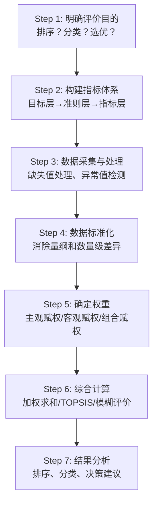

# 第5章 综合分析及Python评价

## 模块一：精准教学大纲

### 一、教学目标

通过本章学习，学生应具备以下核心能力：

1. **综合评价概念**：理解综合评价的三要素（评价对象、评价指标、评价方法）和基本步骤，能够根据实际问题构建合理的指标体系。
2. **数据无量纲化**：掌握极值标准化、Z-score标准化、均值化、初值化等方法的原理与适用场景，理解正向指标和逆向指标的处理差异。
3. **权重确定方法**：掌握层次分析法（AHP）的判断矩阵构造、特征向量法求权重和一致性检验；掌握熵权法的信息熵计算和权重推导；掌握变异系数法的原理。
4. **综合评价方法**：掌握综合评分法（等权和加权）、TOPSIS法的完整计算流程、模糊综合评价法的基本思想。
5. **Python实操**：能够使用Python实现完整的综合评价流程，包括数据标准化、权重计算、TOPSIS排序和结果可视化。

### 二、建议学时

| 内容 | 学时 | 教学方式 |
|------|------|----------|
| 5.1 综合评价的基本概念 | 0.5 | 讲授 |
| 5.2 评价指标体系的构建 | 1 | 讲授+讨论 |
| 5.3 数据无量纲化及权重确定 | 2.5 | 讲授+推导 |
| 5.4 综合评价方法及其应用 | 2 | 讲授+案例 |
| **合计** | **6** | |

### 三、重点与难点

**重点**：
- 数据无量纲化方法的选择（极值标准化 vs Z-score标准化）
- AHP层次分析法的判断矩阵构造与一致性检验
- 熵权法的信息熵计算
- TOPSIS法的完整计算流程

**难点**：
- AHP的特征向量法求权重及一致性检验的推导
- TOPSIS中理想解与负理想解的确定
- 主观赋权与客观赋权的结合

### 四、前置知识

| 前置知识 | 是否已在本课程前序章节出现 | 处理方式 |
|----------|--------------------------|----------|
| 线性代数（特征值分解） | 是（第1章） | 直接引用 |
| 概率论（信息熵） | 否 | 本章补充讲解 |
| 数据标准化方法 | 是（第2章） | 直接引用 |
| NumPy/Pandas操作 | 是（第2章） | 直接引用 |

---

#### 【前置知识补充】信息熵的概念

**为什么需要信息熵？** 熵权法是客观赋权的核心方法，其理论基础是信息论中的"信息熵"概念。

**信息熵的定义**：

设离散随机变量 $X$ 的概率分布为 $P = (p_1, p_2, \ldots, p_n)$，则信息熵定义为：

$$
H(X) = -\sum_{i=1}^{n} p_i \ln p_i
$$

**直观理解**：
- 信息熵度量的是"不确定性"或"信息量"
- 当所有 $p_i$ 相等时（均匀分布），熵最大——最不确定
- 当某个 $p_i = 1$ 时（确定性事件），熵为0——完全确定
- 熵越大，说明数据的变异越大，包含的信息越多

**在综合评价中的应用**：

如果某个指标在各样品之间的差异很大（熵小），说明这个指标能很好地区分不同样品，应该赋予较高的权重。反之，如果所有样品在某个指标上的取值几乎相同（熵大），说明这个指标区分能力弱，应该赋予较低的权重。

---

## 模块二：沉浸式理论讲解

### 5.1 综合评价的基本概念

#### 5.1.1 什么是综合评价？

**【业务场景引入】**

假设你是某省发改委的分析师，需要对下属15个地级市的经济发展水平进行综合评价。你收集了以下指标：

| 指标 | 单位 | 方向 | 城市A | 城市B | 城市C |
|------|------|------|-------|-------|-------|
| GDP | 亿元 | 正向 | 8000 | 5000 | 3000 |
| 人均GDP | 万元 | 正向 | 8.5 | 6.2 | 4.8 |
| 城镇化率 | % | 正向 | 85 | 70 | 55 |
| 失业率 | % | 逆向 | 3.2 | 5.8 | 8.5 |
| 空气质量优良天数 | 天 | 正向 | 280 | 250 | 220 |

**问题**：这5个指标的量纲不同（亿元、万元、%、天），数量级也不同（8000 vs 3.2），如何将它们综合为一个"经济发展指数"？

**综合评价**正是解决这类问题的系统方法：**将多个指标综合为一个或少数几个综合指标，用于排序、分类或决策**。

#### 5.1.2 综合评价的三要素

| 要素 | 含义 | 示例 |
|------|------|------|
| **评价对象** | 被评价的个体或方案 | 15个地级市 |
| **评价指标** | 描述对象特征的变量 | GDP、人均收入、失业率等 |
| **评价方法** | 综合计算的方法 | TOPSIS法、综合评分法 |

#### 5.1.3 综合评价的基本步骤



#### 5.1.4 指标体系的构建原则

| 原则 | 含义 | 示例 |
|------|------|------|
| **系统全面性** | 覆盖评价对象的各个方面 | 经济、社会、环境、民生 |
| **科学性** | 指标定义和计算有科学依据 | GDP用统计局数据 |
| **可操作性** | 指标数据可获取、可量化 | 不用"幸福感"这种主观指标 |
| **独立性** | 同层指标之间尽量独立 | GDP和人均GDP高度相关，选一个即可 |

#### 5.1.5 指标的分类

**按方向分**：
- **正向指标**（越大越好）：GDP、人均收入、教育投入
- **逆向指标**（越小越好）：失业率、犯罪率、污染排放量
- **适度指标**（越接近某个值越好）：资产负债率（不宜过高也不宜过低）

---

### 5.2 数据无量纲化方法

#### 5.2.1 为什么需要无量纲化？

**【业务场景】**

假设你要评价3个城市的综合发展水平，指标如下：

| 城市 | GDP（亿元） | 人均收入（万元） | 城镇化率（%） |
|------|------------|----------------|--------------|
| A | 8000 | 6.5 | 85 |
| B | 5000 | 4.2 | 70 |
| C | 3000 | 3.0 | 55 |

如果直接等权求平均：

$$
S_A = \frac{8000 + 6.5 + 85}{3} = 2697.17
$$

$$
S_C = \frac{3000 + 3.0 + 55}{3} = 1019.33
$$

GDP的数值（8000）完全主导了结果，而人均收入（6.5）和城镇化率（85）的影响微乎其微。这显然不合理——我们不应该让"量纲大的指标"主导评价结果。

**解决方案**：数据无量纲化（标准化），消除量纲和数量级的差异。

#### 5.2.2 极值标准化法

**正向指标**（越大越好）：

$$
x^* = \frac{x - x_{\min}}{x_{\max} - x_{\min}}
$$

标准化后取值范围为 $[0, 1]$，最优值为1、最劣值为0。

**逆向指标**（越小越好）：

$$
x^* = \frac{x_{\max} - x}{x_{\max} - x_{\min}}
$$

将逆向转化为正向——标准化后也是最优值为1、最劣值为0。

**计算示例**：

| 城市 | GDP | 人均收入 | 城镇化率 | 失业率 |
|------|-----|---------|---------|--------|
| A | 8000 | 6.5 | 85 | 3.2 |
| B | 5000 | 4.2 | 70 | 5.8 |
| C | 3000 | 3.0 | 55 | 8.5 |

GDP（正向）：
- 城市A：$(8000-3000)/(8000-3000) = 1.0$
- 城市B：$(5000-3000)/(8000-3000) = 0.4$
- 城市C：$(3000-3000)/(8000-3000) = 0.0$

失业率（逆向）：
- 城市A：$(8.5-3.2)/(8.5-3.2) = 1.0$
- 城市B：$(8.5-5.8)/(8.5-3.2) = 0.509$
- 城市C：$(8.5-8.5)/(8.5-3.2) = 0.0$

#### 5.2.3 Z-score标准化法

$$
x^* = \frac{x - \bar{x}}{s}
$$

标准化后均值为0、标准差为1。

**特点**：
- 不受极值影响
- 结果可为负值（不便于后续加权求和）
- 适用于：聚类分析、主成分分析、回归分析
- **不适用于**：综合评价（因为有负值）

#### 5.2.4 均值化法

$$
x^* = \frac{x}{\bar{x}}
$$

消除量纲的同时保留了各指标的变异信息。适用于时间序列数据。

#### 5.2.5 各方法的对比

| 方法 | 公式 | 取值范围 | 优点 | 缺点 | 适用场景 |
|------|------|----------|------|------|----------|
| 极值标准化 | $(x-x_{\min})/(x_{\max}-x_{\min})$ | [0,1] | 非负，便于加权 | 对异常值敏感 | 综合评价、TOPSIS |
| Z-score | $(x-\bar{x})/s$ | $(-\infty,+\infty)$ | 不受极值影响 | 有负值 | 聚类、PCA、回归 |
| 均值化 | $x/\bar{x}$ | $(0,+\infty)$ | 保留变异信息 | 可能>1 | 时间序列 |

---

### 5.3 权重确定方法

#### 5.3.1 层次分析法（AHP）

**【业务场景引入】**

在综合评价中，不同指标的重要性不同。例如，在评价城市发展水平时，"GDP"可能比"绿化率"更重要。如何科学地确定各指标的权重？

**层次分析法（Analytic Hierarchy Process, AHP）** 是美国运筹学家Saaty于1970年代提出的主观赋权方法，核心思想是：**通过两两比较，将专家的定性判断转化为定量权重**。

**（1）构造判断矩阵**

用1-9标度对指标两两比较，构造判断矩阵 $A = (a_{ij})$：

| 标度 | 含义 |
|------|------|
| 1 | 两个因素同等重要 |
| 3 | 前者比后者稍微重要 |
| 5 | 前者比后者明显重要 |
| 7 | 前者比后者强烈重要 |
| 9 | 前者比后者极端重要 |
| 2,4,6,8 | 相邻判断的中间值 |
| 倒数 | $a_{ji} = 1/a_{ij}$ |

**判断矩阵的性质**：
- $a_{ij} > 0$（正互反性）
- $a_{ji} = 1/a_{ij}$（互反性）
- $a_{ii} = 1$（对角线为1）

**计算示例**：评价城市发展水平，有4个指标：经济、社会、环境、民生。

假设专家认为：
- 经济比社会"稍微重要"（标度3）
- 经济比环境"明显重要"（标度5）
- 经济比民生"稍微重要"（标度3）
- 社会比环境"稍微重要"（标度3）
- 社会比民生"同等重要"（标度1）
- 环境比民生"稍微不重要"（标度1/3）

判断矩阵：

$$
A = \begin{pmatrix} 1 & 3 & 5 & 3 \\ 1/3 & 1 & 3 & 1 \\ 1/5 & 1/3 & 1 & 1/3 \\ 1/3 & 1 & 3 & 1 \end{pmatrix}
$$

**（2）特征向量法求权重**

计算判断矩阵的最大特征值 $\lambda_{\max}$ 对应的特征向量 $w$：

$$
Aw = \lambda_{\max} w
$$

归一化后即为权重向量：$w = (w_1, w_2, \ldots, w_p)^T$，$\sum w_i = 1$。

**（3）一致性检验**

由于专家的判断可能存在逻辑矛盾（如A比B重要、B比C重要、但C比A重要），需要进行一致性检验。

一致性指标：

$$
CI = \frac{\lambda_{\max} - n}{n - 1}
$$

随机一致性指标 $RI$（查表）：

| $n$ | 1 | 2 | 3 | 4 | 5 | 6 | 7 | 8 | 9 |
|-----|---|---|---|---|---|---|---|---|---|
| $RI$ | 0 | 0 | 0.58 | 0.90 | 1.12 | 1.24 | 1.32 | 1.41 | 1.45 |

一致性比率：

$$
CR = \frac{CI}{RI}
$$

$CR < 0.1$ 则判断矩阵具有满意一致性，否则需调整判断矩阵。

#### 5.3.2 熵权法

**（1）基本思想**

熵权法是客观赋权方法，其核心思想是：**指标的变异越大，包含的信息越多，权重应该越高**。

**（2）计算步骤**

**Step 1**：数据标准化（极值法）

对标准化后的数据计算比重：

$$
p_{ij} = \frac{x_{ij}^*}{\sum_{i=1}^{n}x_{ij}^*}
$$

**Step 2**：计算信息熵

$$
e_j = -\frac{1}{\ln n}\sum_{i=1}^{n}p_{ij}\ln(p_{ij})
$$

$e_j \in [0, 1]$，$e_j$ 越小说明指标变异越大、信息量越多。

**Step 3**：计算权重

差异系数：$d_j = 1 - e_j$

权重：

$$
w_j = \frac{d_j}{\sum_{j=1}^{p}d_j}
$$

**计算示例**：

假设有3个城市、4个指标，标准化后的数据为：

| 城市 | GDP | 人均收入 | 城镇化率 | 失业率 |
|------|-----|---------|---------|--------|
| A | 1.00 | 1.00 | 1.00 | 1.00 |
| B | 0.40 | 0.34 | 0.50 | 0.51 |
| C | 0.00 | 0.00 | 0.00 | 0.00 |

计算比重 $p_{ij}$：
- GDP列：$p_{A} = 1.00/1.40 = 0.714$，$p_{B} = 0.40/1.40 = 0.286$，$p_{C} = 0/1.40 = 0$

计算信息熵 $e_j$（以GDP为例）：
- $e_{GDP} = -\frac{1}{\ln 3}(0.714 \ln 0.714 + 0.286 \ln 0.286 + 0)$
- $= -\frac{1}{1.099}(0.714 \times (-0.337) + 0.286 \times (-1.252))$
- $= -\frac{1}{1.099}(-0.241 - 0.358)$
- $= -\frac{1}{1.099}(-0.599)$
- $= 0.545$

差异系数：$d_{GDP} = 1 - 0.545 = 0.455$

同理计算其他指标的差异系数，然后归一化得到权重。

#### 5.3.3 变异系数法

变异系数 $CV_j = s_j / \bar{x}_j$，反映指标的相对变异程度。

$$
w_j = \frac{CV_j}{\sum_{j=1}^{p}CV_j}
$$

变异越大的指标权重越高。

#### 5.3.4 主观与客观赋权的比较

| 类型 | 方法 | 优点 | 缺点 |
|------|------|------|------|
| 主观赋权 | AHP | 反映专家判断 | 有主观性 |
| 客观赋权 | 熵权法 | 基于数据 | 可能与实际不符 |
| 组合赋权 | $w = \alpha w_{\text{主观}} + (1-\alpha) w_{\text{客观}}$ | 结合两者优点 | 需确定$\alpha$ |

---

### 5.4 综合评价方法及其应用

#### 5.4.1 综合评分法

**（1）等权综合评分法**

$$
y = \frac{1}{p}\sum_{j=1}^{p}x_j^*
$$

各指标等权平均。简单但忽略了指标重要性差异。

**（2）加权综合评分法**

$$
y = \sum_{j=1}^{p}w_j x_j^*, \quad \sum w_j = 1
$$

按权重加权求和。是最常用的综合评价方法。

#### 5.4.2 TOPSIS法

**【TOPSIS法的完整推导与计算步骤】**

TOPSIS（Technique for Order Preference by Similarity to Ideal Solution）法的核心思想是：**最优方案应该最接近理想解、最远离负理想解**。

**Step 1 数据标准化**

对原始数据矩阵 $X = (x_{ij})_{n \times p}$ 进行极值标准化：

正向指标：$x_{ij}^* = \frac{x_{ij} - \min_i x_{ij}}{\max_i x_{ij} - \min_i x_{ij}}$

逆向指标：$x_{ij}^* = \frac{\max_i x_{ij} - x_{ij}}{\max_i x_{ij} - \min_i x_{ij}}$

**Step 2 加权标准化**

$$
v_{ij} = w_j \cdot x_{ij}^*
$$

**Step 3 确定理想解和负理想解**

$$
v_j^+ = \max_i v_{ij} \quad \text{（理想解——各指标的最优值）}
$$

$$
v_j^- = \min_i v_{ij} \quad \text{（负理想解——各指标的最劣值）}
$$

**Step 4 计算距离**

各样品到理想解的距离：

$$
D_i^+ = \sqrt{\sum_{j=1}^{p}(v_{ij} - v_j^+)^2}
$$

各样品到负理想解的距离：

$$
D_i^- = \sqrt{\sum_{j=1}^{p}(v_{ij} - v_j^-)^2}
$$

**Step 5 计算相对接近度**

$$
C_i = \frac{D_i^-}{D_i^+ + D_i^-}, \quad C_i \in [0, 1]
$$

$C_i$ 越大，第 $i$ 个样品越接近理想解、越远离负理想解，即评价越优。

**Step 6 排序**

按 $C_i$ 从大到小排序，即为综合评价结果。

**TOPSIS法的几何直觉**：

```
        理想解 v+
          ★
         /|\
        / | \
       /  |  \
      /   |   \
     /    |    \
    ●     ●     ●  ← 样品
     \    |    /
      \   |   /
       \  |  /
        \ | /
         \|/
          ★
       负理想解 v-
```

最优的样品是离"理想解"最近、离"负理想解"最远的那个。

#### 5.4.3 模糊综合评价法

**（1）隶属函数**

模糊集合中每个元素有隶属度 $\mu \in [0, 1]$ 表示属于该集合的程度。

**（2）模糊综合评价的计算**

$$
B = W \circ R
$$

其中：
- $W = (w_1, w_2, \ldots, w_p)$：权重向量
- $R = (r_{ij})_{p \times q}$：模糊关系矩阵（隶属度矩阵）
- $\circ$：模糊合成算子

常用模糊合成算子：
- $M(\wedge, \vee)$：取小-取大算子
- $M(\cdot, +)$：乘积-加法算子（更常用）

---

## 模块三：实战与代码复现

### 实战案例5-1：TOPSIS综合评价完整实现

**【业务场景】** 对6个城市的可持续发展水平进行综合评价，使用熵权法确定权重、TOPSIS法进行排序。

```python
import numpy as np
import pandas as pd
import matplotlib.pyplot as plt
import seaborn as sns

plt.rcParams['font.sans-serif'] = ['SimHei']
plt.rcParams['axes.unicode_minus'] = False
sns.set_theme(style="whitegrid")

# ============================================================
# Step 1: 构造数据
# ============================================================
data = pd.DataFrame({
    '城市': ['城市A', '城市B', '城市C', '城市D', '城市E', '城市F'],
    '人均GDP': [8.5, 6.2, 4.8, 7.3, 5.5, 3.9],       # 正向
    '人均收入': [6.8, 5.2, 3.5, 6.0, 4.8, 3.0],        # 正向
    '教育投入': [1200, 800, 500, 1000, 650, 400],        # 正向
    '失业率': [3.2, 4.5, 6.8, 3.8, 5.2, 7.5],          # 逆向
    '犯罪率': [15, 22, 35, 18, 28, 42]                   # 逆向
})

print("=== 原始数据 ===")
print(data.to_string(index=False))

# ============================================================
# Step 2: 数据标准化（极值法）
# ============================================================
X = data.iloc[:, 1:].values.astype(float)
n, p = X.shape

positive_idx = [0, 1, 2]   # 人均GDP、人均收入、教育投入
negative_idx = [3, 4]       # 失业率、犯罪率

X_std = np.zeros_like(X)
for j in range(p):
    if j in positive_idx:
        X_std[:, j] = (X[:, j] - X[:, j].min()) / (X[:, j].max() - X[:, j].min())
    else:
        X_std[:, j] = (X[:, j].max() - X[:, j]) / (X[:, j].max() - X[:, j].min())

df_std = pd.DataFrame(X_std, columns=data.columns[1:], index=data['城市'])
print("\n=== 标准化数据 ===")
print(df_std.round(3))

# ============================================================
# Step 3: 熵权法确定权重
# ============================================================
# 计算比重
P = X_std / X_std.sum(axis=0)

# 计算信息熵
k = 1 / np.log(n)
e = -k * np.sum(P * np.log(P + 1e-10), axis=0)

# 差异系数和权重
d = 1 - e
w_entropy = d / d.sum()

print("\n=== 熵权法权重 ===")
for col, w in zip(data.columns[1:], w_entropy):
    print(f"  {col}: {w:.4f}")

# ============================================================
# Step 4: AHP法确定权重
# ============================================================
# 判断矩阵（假设专家打分）
AHP_matrix = np.array([
    [1,   2,   3,   4,   5],
    [1/2, 1,   2,   3,   4],
    [1/3, 1/2, 1,   2,   3],
    [1/4, 1/3, 1/2, 1,   2],
    [1/5, 1/4, 1/3, 1/2, 1]
])

eigenvalues, eigenvectors = np.linalg.eig(AHP_matrix)
max_idx = np.argmax(eigenvalues.real)
lambda_max = eigenvalues[max_idx].real
w_ahp = eigenvectors[:, max_idx].real
w_ahp = w_ahp / w_ahp.sum()

# 一致性检验
CI = (lambda_max - p) / (p - 1)
RI_table = {1: 0, 2: 0, 3: 0.58, 4: 0.90, 5: 1.12, 6: 1.24, 7: 1.32, 8: 1.41}
RI = RI_table.get(p, 1.41)
CR = CI / RI

print("\n=== AHP权重 ===")
for col, w in zip(data.columns[1:], w_ahp):
    print(f"  {col}: {w:.4f}")
print(f"  λ_max = {lambda_max:.4f}, CI = {CI:.4f}, CR = {CR:.4f}")
print(f"  一致性检验: {'通过' if CR < 0.1 else '不通过'}")

# ============================================================
# Step 5: 组合赋权
# ============================================================
alpha = 0.5
w_combined = alpha * w_ahp + (1 - alpha) * w_entropy

print(f"\n=== 组合权重（α={alpha}）===")
for col, w in zip(data.columns[1:], w_combined):
    print(f"  {col}: {w:.4f}")

# ============================================================
# Step 6: TOPSIS法
# ============================================================
V = X_std * w_combined

V_plus = V.max(axis=0)
V_minus = V.min(axis=0)

D_plus = np.sqrt(((V - V_plus) ** 2).sum(axis=1))
D_minus = np.sqrt(((V - V_minus) ** 2).sum(axis=1))

C = D_minus / (D_plus + D_minus)

result = pd.DataFrame({
    '城市': data['城市'],
    'D+': D_plus.round(4),
    'D-': D_minus.round(4),
    'C值': C.round(4),
    '排名': pd.Series(C).rank(ascending=False).astype(int).values
}).sort_values('C值', ascending=False)

print("\n=== TOPSIS评价结果 ===")
print(result.to_string(index=False))

# ============================================================
# Step 7: 可视化
# ============================================================
fig, axes = plt.subplots(1, 3, figsize=(18, 5))

# 权重对比
x = np.arange(p)
width = 0.25
axes[0].bar(x - width, w_ahp, width, label='AHP', color='steelblue')
axes[0].bar(x, w_entropy, width, label='熵权法', color='coral')
axes[0].bar(x + width, w_combined, width, label='组合', color='seagreen')
axes[0].set_xticks(x)
axes[0].set_xticklabels(data.columns[1:], rotation=45)
axes[0].set_ylabel('权重')
axes[0].set_title('不同赋权方法对比')
axes[0].legend()

# 综合得分条形图
result_sorted = result.sort_values('C值')
axes[1].barh(result_sorted['城市'], result_sorted['C值'], color='steelblue')
axes[1].set_xlabel('相对接近度C')
axes[1].set_title('TOPSIS综合评价结果')

# 雷达图
categories = data.columns[1:].tolist()
N = len(categories)
angles = np.linspace(0, 2*np.pi, N, endpoint=False).tolist()
angles += angles[:1]

ax_radar = fig.add_subplot(1, 3, 3, polar=True)
axes[2].set_visible(False)

colors_radar = plt.cm.Set2(np.linspace(0, 1, len(data)))
for i in range(len(data)):
    values = X_std[i].tolist()
    values += values[:1]
    ax_radar.fill(angles, values, alpha=0.1, color=colors_radar[i])
    ax_radar.plot(angles, values, 'o-', color=colors_radar[i],
                  label=data['城市'][i], markersize=4)
ax_radar.set_thetagrids(np.degrees(angles[:-1]), categories)
ax_radar.set_title('各城市指标雷达图')
ax_radar.legend(loc='upper right', bbox_to_anchor=(1.4, 1.0))

plt.tight_layout()
plt.show()
```

*(此处平台应展示TOPSIS评价的完整结果，包括权重对比图、排名条形图和雷达图)*

**结果解读**：

1. **权重分析**：AHP和熵权法可能给出不同的权重。AHP反映专家判断（如经济指标权重高），熵权法反映数据变异（如变异大的指标权重高）。组合赋权可以平衡两者。

2. **排名分析**：城市A通常排名最高，因为其各项指标都较优。城市F排名最低，因为其失业率和犯罪率都较高。

3. **业务建议**：
   - 排名靠前的城市：继续保持优势
   - 排名靠后的城市：重点改善弱势指标
   - 可以进一步分析各城市的"短板指标"，制定针对性的改善策略

---

### 实战案例5-2：AHP层次分析法完整实现

```python
import numpy as np
import pandas as pd

def ahp_analysis(judgment_matrix, criteria_names=None):
    """
    AHP层次分析法完整实现
    包括：特征向量法求权重、一致性检验
    """
    n = judgment_matrix.shape[0]
    if criteria_names is None:
        criteria_names = [f'指标{i+1}' for i in range(n)]

    # 特征值分解
    eigenvalues, eigenvectors = np.linalg.eig(judgment_matrix)
    max_idx = np.argmax(eigenvalues.real)
    lambda_max = eigenvalues[max_idx].real
    w = eigenvectors[:, max_idx].real
    w = w / w.sum()

    # 一致性检验
    CI = (lambda_max - n) / (n - 1) if n > 1 else 0
    RI_table = {1: 0, 2: 0, 3: 0.58, 4: 0.90, 5: 1.12, 6: 1.24, 7: 1.32, 8: 1.41, 9: 1.45}
    RI = RI_table.get(n, 1.49)
    CR = CI / RI if RI > 0 else 0

    # 输出
    print("=" * 50)
    print("AHP层次分析法结果")
    print("=" * 50)
    print(f"\n判断矩阵:\n{judgment_matrix}")
    print(f"\n最大特征值 λ_max = {lambda_max:.4f}")
    print(f"一致性指标 CI = {CI:.4f}")
    print(f"随机一致性指标 RI = {RI:.4f}")
    print(f"一致性比率 CR = {CR:.4f}")
    print(f"一致性检验: {'通过' if CR < 0.1 else '不通过'}")

    print(f"\n权重向量:")
    for name, weight in zip(criteria_names, w):
        print(f"  {name}: {weight:.4f}")

    return w, lambda_max, CR

# 示例：评价教学质量
A = np.array([
    [1,   3,   5,   2],
    [1/3, 1,   3,   1/2],
    [1/5, 1/3, 1,   1/3],
    [1/2, 2,   3,   1]
])

names = ['教学内容', '教学方法', '教学态度', '教学效果']
w, lambda_max, cr = ahp_analysis(A, names)
```

*(此处平台应展示AHP分析的完整输出，包括判断矩阵、特征值、一致性检验结果和权重向量)*

---

### 实战案例5-3：熵权法完整实现

```python
import numpy as np
import pandas as pd

def entropy_weight(data):
    """
    熵权法计算权重
    输入：标准化后的数据矩阵（numpy数组）
    输出：权重向量
    """
    n, p = data.shape
    
    # 计算比重
    P = data / data.sum(axis=0)
    
    # 计算信息熵
    k = 1 / np.log(n)
    e = np.zeros(p)
    for j in range(p):
        for i in range(n):
            if P[i, j] > 0:
                e[j] -= k * P[i, j] * np.log(P[i, j])
    
    # 差异系数和权重
    d = 1 - e
    w = d / d.sum()
    
    return w, e, d

# 示例数据
data = pd.DataFrame({
    '指标A': [1.0, 0.4, 0.0],
    '指标B': [1.0, 0.34, 0.0],
    '指标C': [1.0, 0.5, 0.0],
    '指标D': [1.0, 0.51, 0.0]
})

w, e, d = entropy_weight(data.values)

print("=== 熵权法计算过程 ===")
print(f"\n信息熵: {e.round(4)}")
print(f"差异系数: {d.round(4)}")
print(f"\n权重: {w.round(4)}")
print(f"权重之和: {w.sum():.4f}")
```

*(此处平台应展示熵权法的计算过程和结果)*

---

### 实战案例5-4：模糊综合评价法示例

```python
import numpy as np

def fuzzy_comprehensive_evaluation(W, R):
    """
    模糊综合评价
    W: 权重向量 (1×p)
    R: 模糊关系矩阵 (p×q)
    返回：综合评价向量
    """
    # 使用乘积-加法算子
    B = W @ R
    # 归一化
    B = B / B.sum()
    return B

# 示例：评价某产品的质量等级
# 权重
W = np.array([0.3, 0.3, 0.2, 0.2])  # 4个指标

# 模糊关系矩阵（每个指标对各等级的隶属度）
# 等级：优秀、良好、一般、差
R = np.array([
    [0.7, 0.2, 0.1, 0.0],  # 外观
    [0.5, 0.3, 0.15, 0.05], # 性能
    [0.6, 0.25, 0.1, 0.05], # 耐用性
    [0.4, 0.35, 0.2, 0.05]  # 性价比
])

B = fuzzy_comprehensive_evaluation(W, R)

grades = ['优秀', '良好', '一般', '差']
print("=== 模糊综合评价结果 ===")
for grade, val in zip(grades, B):
    print(f"  {grade}: {val:.4f}")
print(f"\n最大隶属度等级: {grades[np.argmax(B)]}")
```

*(此处平台应展示模糊综合评价的计算结果)*

---

## 本章小结

### 核心知识点回顾

| 知识点 | 核心内容 | 关键公式/方法 |
|--------|----------|---------------|
| 数据无量纲化 | 消除量纲差异 | 极值标准化、Z-score |
| AHP | 主观赋权 | 判断矩阵→特征向量→一致性检验 |
| 熵权法 | 客观赋权 | 信息熵→差异系数→权重 |
| TOPSIS | 理想解排序 | 标准化→加权→距离→接近度 |
| 模糊评价 | 处理模糊性 | $B = W \circ R$ |

### 方法选择速查表

```
你的评价场景是什么？
│
├─ 需要反映专家判断？
│   └─ AHP层次分析法
│
├─ 需要完全基于数据？
│   └─ 熵权法 / 变异系数法
│
├─ 需要平衡主观和客观？
│   └─ 组合赋权（AHP + 熵权法）
│
├─ 评价方法？
│   ├─ 简单排序 → 加权综合评分法
│   ├─ 选优排序 → TOPSIS法
│   └─ 处理模糊性 → 模糊综合评价法
```

---

### 拓展阅读：TOPSIS法的变体与改进

#### （1）改进的TOPSIS法——基于熵权的TOPSIS

传统TOPSIS法中，权重可以由专家主观确定，也可以由熵权法客观确定。基于熵权的TOPSIS法完全排除了主观性：

**完整流程**：
1. 极值标准化（正向指标和逆向指标分别处理）
2. 熵权法计算权重
3. 加权标准化
4. 确定理想解和负理想解
5. 计算距离和相对接近度
6. 排序

**Python实现的关键代码片段**：

```python
# 熵权法计算权重
def entropy_weight_std(X_std):
    n = X_std.shape[0]
    P = X_std / X_std.sum(axis=0)
    k = 1 / np.log(n)
    e = -k * np.sum(P * np.log(P + 1e-10), axis=0)
    d = 1 - e
    w = d / d.sum()
    return w

# TOPSIS核心计算
def topsis(X_std, w):
    V = X_std * w
    V_plus = V.max(axis=0)
    V_minus = V.min(axis=0)
    D_plus = np.sqrt(((V - V_plus)**2).sum(axis=1))
    D_minus = np.sqrt(((V - V_minus)**2).sum(axis=1))
    C = D_minus / (D_plus + D_minus)
    return C
```

#### （2）VIKOR法——TOPSIS的改进版本

VIKOR（VlseKriterijumska Optimizacija I Kompromisno Resenje）法是TOPSIS的一个重要变体，它引入了"群体效用"和"个体遗憾"两个概念：

$$
S_i = \sum_{j=1}^{p} w_j \frac{v_j^+ - v_{ij}}{v_j^+ - v_j^-} \quad \text{（群体效用）}
$$

$$
R_i = \max_j \left[ w_j \frac{v_j^+ - v_{ij}}{v_j^+ - v_j^-} \right] \quad \text{（个体遗憾）}
$$

$$
Q_i = v \frac{S_i - S^-}{S^+ - S^-} + (1-v) \frac{R_i - R^-}{R^+ - R^-} \quad \text{（综合指标）}
$$

其中 $v$ 是决策机制系数（通常取0.5），$S^+, S^-$ 分别是 $S_i$ 的最大最小值，$R^+, R^-$ 同理。

**VIKOR的优势**：考虑了"最大群体效用"和"最小个体遗憾"的平衡，更适合需要妥协方案的决策场景。

#### （3）灰色关联分析法——处理小样本数据

当样本量较小时（如只有3-5个样本），TOPSIS法的统计性质可能不佳。灰色关联分析法是另一种常用的综合评价方法：

**基本思想**：通过计算各评价对象与理想对象之间的"关联度"来进行排序。

**灰色关联度计算**：

$$
\gamma_i = \frac{1}{p} \sum_{j=1}^{p} \frac{\min_i \min_j |v_j^+ - v_{ij}| + \rho \max_i \max_j |v_j^+ - v_{ij}|}{|v_j^+ - v_{ij}| + \rho \max_i \max_j |v_j^+ - v_{ij}|}
$$

其中 $\rho$ 是分辨系数（通常取0.5）。

**适用场景**：
- 样本量较小（3-10个）
- 数据不完整或有缺失
- 需要分析动态变化趋势

#### （4）组合评价法

在实际应用中，单一评价方法可能存在偏差。组合评价法通过综合多种方法的结果来提高评价的可靠性：

**简单平均组合**：

$$
R_{\text{组合},i} = \frac{1}{K} \sum_{k=1}^{K} r_{ik}
$$

其中 $r_{ik}$ 是第 $i$ 个样本在第 $k$ 种方法中的排名。

**加权平均组合**：

$$
R_{\text{组合},i} = \sum_{k=1}^{K} \alpha_k r_{ik}, \quad \sum \alpha_k = 1
$$

**Borda法**：

统计每个样本在各种方法中的"胜出次数"，以此作为综合排名依据。

---

### 综合评价方法的适用条件与局限性

| 方法 | 最佳样本量 | 指标类型要求 | 对异常值敏感性 | 计算复杂度 | 主要局限 |
|------|-----------|-------------|---------------|-----------|----------|
| 综合评分法 | ≥3 | 无特殊要求 | 中 | 低 | 未考虑指标间关系 |
| TOPSIS法 | ≥3 | 正向/逆向 | 中 | 中 | 对指标相关性敏感 |
| AHP | ≥2 | 定性/定量 | 低 | 高 | 依赖专家判断 |
| 熵权法 | ≥5 | 定量 | 高 | 中 | 不考虑指标实际重要性 |
| 模糊评价 | ≥3 | 定性/定量 | 低 | 高 | 隶属函数确定困难 |
| 灰色关联 | ≥3 | 定量 | 中 | 中 | 分辨系数选取主观 |

---

### 综合评价中的常见误区

#### 误区1：指标越多越好

**问题**：认为指标体系越全面越好，导致指标过多（>20个）。

**危害**：
- 指标间高度相关，信息冗余
- 计算复杂度增加
- 权重分散，削弱重要指标的作用

**正确做法**：
- 用主成分分析（PCA）或因子分析降维
- 用相关系数筛选去除高度相关的指标
- 控制指标数量在5-15个之间

#### 误区2：随意选择标准化方法

**问题**：不考虑数据特征，随意选择标准化方法。

**正确做法**：
- 综合评价/TOPSIS：优先使用极值标准化（结果在[0,1]之间，便于加权）
- 聚类/PCA：使用Z-score标准化（保留数据分布特征）
- 时间序列：使用均值化或初值化（保留变化趋势）

#### 误区3：忽视权重的合理性检验

**问题**：用熵权法得出权重后直接使用，不检验是否符合实际。

**正确做法**：
- 对比熵权法和AHP的权重，差异过大时需分析原因
- 进行灵敏度分析：改变权重±10%，观察排名是否稳定
- 专家审核权重是否合理

#### 误区4：TOPSIS法中理想解的确定错误

**问题**：忘记区分正向指标和逆向指标，导致理想解计算错误。

**正确做法**：
- 正向指标：理想解 = 最大值，负理想解 = 最小值
- 逆向指标：理想解 = 最小值，负理想解 = 最大值
- 先标准化（逆向指标取反），再统一取最大值为理想解

---

### 学生练习题

#### 练习1：手动计算练习

**题目**：对4个城市的环境质量进行综合评价，指标如下：

| 城市 | PM2.5（μg/m³） | 绿化率（%） | 污水处理率（%） | 噪音（dB） |
|------|----------------|-------------|----------------|------------|
| A | 35 | 42 | 85 | 55 |
| B | 52 | 35 | 72 | 62 |
| C | 28 | 50 | 90 | 48 |
| D | 45 | 38 | 78 | 58 |

要求：
1. 判断各指标的类型（正向/逆向）
2. 用极值标准化法进行数据标准化
3. 用等权综合评分法计算各城市得分
4. 用TOPSIS法计算各城市的相对接近度
5. 比较两种方法的排名结果

#### 练习2：AHP判断矩阵的构造与检验

**题目**：某企业要从3个候选方案中选择最优方案，评价指标为：成本、质量、交货期。

已知专家的判断如下：
- 成本比质量"稍微重要"
- 成本比交货期"明显重要"
- 质量比交货期"同等重要"

要求：
1. 构造判断矩阵
2. 计算权重向量
3. 进行一致性检验
4. 如果一致性检验不通过，说明如何调整

#### 练习3：熵权法的完整计算

**题目**：使用练习1的数据，完成以下计算：
1. 对标准化后的数据计算比重矩阵 $P$
2. 计算各指标的信息熵 $e_j$
3. 计算差异系数 $d_j$ 和权重 $w_j$
4. 分析哪些指标的权重较高，解释原因

#### 练习4：Python编程练习

**题目**：编写一个完整的综合评价Python程序，实现以下功能：

```python
def comprehensive_evaluation(data, indicator_types, method='topsis'):
    """
    综合评价函数
    
    参数：
    - data: DataFrame，评价数据
    - indicator_types: list，指标类型（'positive' 或 'negative'）
    - method: str，评价方法（'topsis', 'scoring', 'fuzzy'）
    
    返回：
    - result: DataFrame，包含得分和排名
    """
    # 学生需要实现的代码
    pass
```

要求：
1. 实现数据标准化（支持正向和逆向指标）
2. 实现熵权法计算权重
3. 实现TOPSIS法排序
4. 输出标准化数据、权重和排序结果

---

### 参考答案

#### 练习1参考答案

**Step 1：指标类型判断**
- PM2.5：逆向（越小越好）
- 绿化率：正向（越大越好）
- 污水处理率：正向（越大越好）
- 噪音：逆向（越小越好）

**Step 2：极值标准化**

| 城市 | PM2.5* | 绿化率* | 污水处理率* | 噪音* |
|------|--------|---------|------------|--------|
| A | (52-35)/(52-28)=0.708 | (42-35)/(50-35)=0.467 | (85-72)/(90-72)=0.722 | (62-55)/(62-48)=0.500 |
| B | (52-52)/(52-28)=0.000 | (35-35)/(50-35)=0.000 | (72-72)/(90-72)=0.000 | (62-62)/(62-48)=0.000 |
| C | (52-28)/(52-28)=1.000 | (50-35)/(50-35)=1.000 | (90-72)/(90-72)=1.000 | (62-48)/(62-48)=1.000 |
| D | (52-45)/(52-28)=0.292 | (38-35)/(50-35)=0.200 | (78-72)/(90-72)=0.333 | (62-58)/(62-48)=0.286 |

**Step 3：等权综合评分**

- 城市A：$S_A = (0.708 + 0.467 + 0.722 + 0.500)/4 = 0.599$
- 城市B：$S_B = (0.000 + 0.000 + 0.000 + 0.000)/4 = 0.000$
- 城市C：$S_C = (1.000 + 1.000 + 1.000 + 1.000)/4 = 1.000$
- 城市D：$S_D = (0.292 + 0.200 + 0.333 + 0.286)/4 = 0.278$

等权排名：C > A > D > B

**Step 4：TOPSIS法**

加权标准化（等权，$w_j = 0.25$）：

| 城市 | $v_1$ | $v_2$ | $v_3$ | $v_4$ |
|------|-------|-------|-------|-------|
| A | 0.177 | 0.117 | 0.181 | 0.125 |
| B | 0.000 | 0.000 | 0.000 | 0.000 |
| C | 0.250 | 0.250 | 0.250 | 0.250 |
| D | 0.073 | 0.050 | 0.083 | 0.071 |

理想解：$v^+ = (0.250, 0.250, 0.250, 0.250)$（城市C）

负理想解：$v^- = (0.000, 0.000, 0.000, 0.000)$（城市B）

距离计算：

| 城市 | $D^+$ | $D^-$ | $C_i$ | 排名 |
|------|-------|-------|-------|------|
| A | 0.198 | 0.254 | 0.562 | 2 |
| B | 0.500 | 0.000 | 0.000 | 4 |
| C | 0.000 | 0.500 | 1.000 | 1 |
| D | 0.398 | 0.130 | 0.246 | 3 |

TOPSIS排名：C > A > D > B（与等权评分法一致）

---

### 延伸思考：综合评价方法的前沿发展

#### （1）大数据环境下的综合评价

随着大数据技术的发展，综合评价面临新的挑战和机遇：

- **数据量**：传统方法通常处理几十个样本、十几个指标，大数据环境下可能面对数千个样本、数百个指标
- **数据类型**：从结构化数据扩展到文本、图像、视频等非结构化数据
- **实时性**：需要动态更新评价结果，而非一次性计算

**应对策略**：
- 使用主成分分析（PCA）或t-SNE进行降维
- 使用机器学习方法（如随机森林特征重要性）自动确定权重
- 建立实时数据流处理管道

#### （2）综合评价与机器学习的融合

传统综合评价方法（如TOPSIS）与机器学习方法可以互补：

- **传统方法的优势**：可解释性强、计算简单、适合小样本
- **机器学习的优势**：处理非线性关系、自动特征选择、适合大数据

**融合方向**：
- 用随机森林或XGBoost的特征重要性作为客观权重
- 用神经网络学习评价函数，替代传统的加权求和
- 用聚类分析辅助确定评价等级

#### （3）多目标决策与综合评价

综合评价本质上是多目标决策问题的简化版本。在更复杂的场景中，可能需要考虑：

- **多目标优化**：多个目标之间存在冲突（如成本最小化和质量最大化）
- **群决策**：多个决策者的意见需要综合
- **动态决策**：评价标准和权重随时间变化

**常用方法**：
- 帕累托最优（Pareto Optimality）
- 博弈论方法
- 动态贝叶斯网络

---

### 常见问题解答（FAQ）

**Q1：AHP中如果CR > 0.1怎么办？**

A：可以通过以下方法调整判断矩阵：
1. 找出偏离一致性最大的元素（计算每个元素的一致性偏差）
2. 请专家重新评估这些元素
3. 使用自动调整算法（如最小化CI的目标函数）

**Q2：熵权法得出的权重与常识不符怎么办？**

A：这通常是因为：
- 数据样本量太小，不能反映真实的变异程度
- 指标之间存在强相关性
- 存在异常值影响了变异计算

建议：
1. 增加样本量
2. 先进行相关性分析，去除冗余指标
3. 处理异常值后再计算
4. 使用组合赋权平衡主观和客观权重

**Q3：TOPSIS法中如果所有指标都是正向的怎么办？**

A：处理方法相同：
- 所有指标都用正向指标的标准化公式：$(x - x_{\min})/(x_{\max} - x_{\min})$
- 理想解依然是各指标的最大值
- 负理想解依然是各指标的最小值

**Q4：模糊综合评价中隶属函数如何确定？**

A：常用方法包括：
1. **专家打分法**：直接由专家给出各指标对各等级的隶属度
2. **统计法**：根据历史数据统计各指标在各等级的分布
3. **函数法**：使用梯形函数、高斯函数等数学函数

**Q5：综合评价结果的稳健性如何检验？**

A：常用的稳健性检验方法：
1. **灵敏度分析**：改变权重±10%或±20%，观察排名变化
2. **方法对比**：用多种评价方法（如TOPSIS、灰色关联、VIKOR）分别计算，比较排名
3. **Bootstrap法**：从原始数据中重抽样，多次计算评价结果，观察排名的波动
4. **交叉验证**：将数据分为训练集和测试集，检验评价模型的泛化能力

---

### 参考文献

1. 邓聚龙. 灰色系统理论教程[M]. 武汉: 华中理工大学出版社, 1990.
2. Saaty T L. The Analytic Hierarchy Process[M]. New York: McGraw-Hill, 1980.
3. Hwang C L, Yoon K. Multiple Attribute Decision Making: Methods and Applications[M]. Berlin: Springer-Verlag, 1981.
4. 郭亚军. 综合评价理论、方法及应用[M]. 北京: 科学出版社, 2007.
5. 秦寿康. 综合评价原理与应用[M]. 北京: 电子工业出版社, 2003.
6. Shannon C E. A Mathematical Theory of Communication[J]. Bell System Technical Journal, 1948, 27(3): 379-423.
7. Opricovic S, Tzeng G H. Compromise Solution by MCDM Methods: A Comparative Analysis of VIKOR and TOPSIS[J]. European Journal of Operational Research, 2004, 156(2): 445-455.

---

### 本章思维导图

```
                    ┌─────────────────────────────────────────┐
                    │        第5章 综合分析及Python评价          │
                    └────────────────────┬────────────────────┘
                                         │
            ┌────────────────────────────┼────────────────────────────┐
            │                            │                            │
    ┌───────┴───────┐            ┌───────┴───────┐            ┌───────┴───────┐
    │   基本概念     │            │   评价方法     │            │   Python实战   │
    └───────┬───────┘            └───────┬───────┘            └───────┬───────┘
            │                            │                            │
    ┌───────┼───────┐            ┌───────┼───────┐            ┌───────┼───────┐
    │       │       │            │       │       │            │       │       │
    ▼       ▼       ▼            ▼       ▼       ▼            ▼       ▼       ▼
  三要素  指标体系  步骤        权重确定  评价方法  模糊评价    数据处理  TOPSIS  可视化
    │       │       │            │       │       │            │       │       │
    │       │       │       ┌────┼────┐  │       │            │       │       │
    │       │       │       │    │    │  │       │            │       │       │
    ▼       ▼       ▼       ▼    ▼    ▼  ▼       ▼            ▼       ▼       ▼
  对象    系统性   明确    AHP  熵权  变异 综合   TOPSIS       极值   熵权    matplotlib
  指标    科学性   目的    法   法    系数 评分   法           标准化  加权    seaborn
  方法    可操作   构建    │   │    法   法     │           │      │       │
          独立性   体系    │   │         │     │           │      │       │
                          │   │         │     │           │      │       │
                          ▼   ▼         ▼     ▼           ▼      ▼       ▼
                      判断  信息熵    等权   理想解      正向   距离    雷达图
                      矩阵  差异系数  加权   负理想      逆向   接近度  柱状图
                      特征  权重      评分   排序        处理   排名    对比图
                      向量
```

---

### 教学建议

#### 课堂活动设计

**活动1：AHP实操（20分钟）**

将学生分为5-6组，每组选择一个评价主题（如"选择最佳旅游目的地"、"评选优秀员工"等），要求：

1. 构建3层指标体系（目标层-准则层-指标层）
2. 小组内讨论并构造判断矩阵
3. 计算权重并进行一致性检验
4. 各组展示结果，讨论一致性不通过时如何调整

**活动2：TOPSIS比赛（30分钟）**

给定一组真实数据（如5个城市的发展指标），要求：

1. 各组独立完成数据标准化
2. 用熵权法计算权重
3. 用TOPSIS法排序
4. 比较各组结果，讨论差异原因

**活动3：方法对比讨论（15分钟）**

给定同一组数据，分别用以下方法评价：
- 等权综合评分法
- 加权综合评分法（AHP权重）
- 加权综合评分法（熵权权重）
- TOPSIS法

讨论：
1. 各方法的排名是否一致？
2. 不一致的原因是什么？
3. 你更信任哪种方法的结果？为什么？

#### 课后作业设计

**作业1：手动计算（必做）**

使用练习1-3的数据，手写完成以下计算：
1. 极值标准化
2. AHP判断矩阵构造与一致性检验
3. 熵权法权重计算
4. TOPSIS排序

**作业2：Python编程（必做）**

使用Python完成以下任务：
1. 读取给定的数据文件
2. 实现完整的TOPSIS综合评价流程
3. 生成可视化报告（权重对比图、排名条形图、雷达图）
4. 撰写简短的结果分析报告（300-500字）

**作业3：案例分析（选做）**

选择一个你感兴趣的实际问题（如"评价不同手机品牌的综合竞争力"、"评价不同城市的宜居水平"等），完成以下任务：
1. 构建指标体系（至少5个指标）
2. 收集数据（可使用网络数据或模拟数据）
3. 用至少两种方法进行综合评价
4. 比较不同方法的结果
5. 撰写完整的分析报告（1000-2000字）

---

### 本章知识图谱

```
综合评价
├── 数据预处理
│   ├── 缺失值处理
│   ├── 异常值检测
│   └── 数据标准化
│       ├── 极值标准化 → 综合评价、TOPSIS
│       ├── Z-score标准化 → 聚类、PCA、回归
│       └── 均值化 → 时间序列
│
├── 权重确定
│   ├── 主观赋权
│   │   └── AHP层次分析法
│   │       ├── 判断矩阵构造
│   │       ├── 特征向量法
│   │       └── 一致性检验（CR < 0.1）
│   │
│   ├── 客观赋权
│   │   ├── 熵权法
│   │   │   ├── 信息熵计算
│   │   │   ├── 差异系数
│   │   │   └── 归一化权重
│   │   └── 变异系数法
│   │
│   └── 组合赋权
│       └── w = α·w_主观 + (1-α)·w_客观
│
├── 综合评价方法
│   ├── 综合评分法
│   │   ├── 等权评分
│   │   └── 加权评分
│   │
│   ├── TOPSIS法
│   │   ├── 标准化
│   │   ├── 加权
│   │   ├── 理想解与负理想解
│   │   ├── 距离计算
│   │   └── 相对接近度
│   │
│   └── 模糊综合评价法
│       ├── 隶属函数
│       ├── 模糊关系矩阵
│       └── 模糊合成算子
│
└── 结果分析
    ├── 排序
    ├── 分类
    ├── 灵敏度分析
    └── 决策建议
```

---

### 附录：常用Python函数速查

#### 数据标准化

```python
# 极值标准化
def min_max_normalize(X, positive_mask):
    X_std = np.zeros_like(X, dtype=float)
    for j in range(X.shape[1]):
        if positive_mask[j]:  # 正向指标
            X_std[:, j] = (X[:, j] - X[:, j].min()) / (X[:, j].max() - X[:, j].min())
        else:  # 逆向指标
            X_std[:, j] = (X[:, j].max() - X[:, j]) / (X[:, j].max() - X[:, j].min())
    return X_std

# Z-score标准化
from sklearn.preprocessing import StandardScaler
scaler = StandardScaler()
X_zscore = scaler.fit_transform(X)
```

#### 熵权法

```python
def entropy_weight(X_std):
    n = X_std.shape[0]
    P = X_std / X_std.sum(axis=0)
    k = 1 / np.log(n)
    e = -k * np.sum(P * np.log(P + 1e-10), axis=0)
    d = 1 - e
    w = d / d.sum()
    return w
```

#### AHP

```python
def ahp_weight(A):
    eigenvalues, eigenvectors = np.linalg.eig(A)
    max_idx = np.argmax(eigenvalues.real)
    w = eigenvectors[:, max_idx].real
    w = w / w.sum()
    lambda_max = eigenvalues[max_idx].real
    n = A.shape[0]
    CI = (lambda_max - n) / (n - 1)
    RI_table = {1:0, 2:0, 3:0.58, 4:0.90, 5:1.12, 6:1.24, 7:1.32, 8:1.41, 9:1.45}
    RI = RI_table.get(n, 1.49)
    CR = CI / RI if RI > 0 else 0
    return w, lambda_max, CR
```

#### TOPSIS

```python
def topsis(X_std, w):
    V = X_std * w
    V_plus = V.max(axis=0)
    V_minus = V.min(axis=0)
    D_plus = np.sqrt(((V - V_plus)**2).sum(axis=1))
    D_minus = np.sqrt(((V - V_minus)**2).sum(axis=1))
    C = D_minus / (D_plus + D_minus)
    return C, D_plus, D_minus
```

#### 可视化

```python
# 权重对比图
def plot_weights(names, weights_dict):
    x = np.arange(len(names))
    width = 0.25
    fig, ax = plt.subplots(figsize=(10, 6))
    for i, (method, weights) in enumerate(weights_dict.items()):
        ax.bar(x + i*width, weights, width, label=method)
    ax.set_xticks(x + width)
    ax.set_xticklabels(names, rotation=45)
    ax.set_ylabel('权重')
    ax.set_title('不同赋权方法对比')
    ax.legend()
    plt.tight_layout()
    plt.show()

# 雷达图
def plot_radar(names, data, labels):
    N = len(names)
    angles = np.linspace(0, 2*np.pi, N, endpoint=False).tolist()
    angles += angles[:1]
    fig, ax = plt.subplots(figsize=(8, 8), subplot_kw=dict(polar=True))
    for i in range(len(data)):
        values = data[i].tolist() + [data[i][0]]
        ax.plot(angles, values, 'o-', label=labels[i])
        ax.fill(angles, values, alpha=0.1)
    ax.set_thetagrids(np.degrees(angles[:-1]), names)
    ax.legend(loc='upper right', bbox_to_anchor=(1.3, 1.0))
    plt.show()
```

---

### 附录B：综合评价完整案例——高校科研能力评价

#### 1. 问题背景

某省教育厅需要对省内10所本科高校的科研能力进行综合评价，以作为资源配置的参考依据。评价指标包括：

| 指标代码 | 指标名称 | 单位 | 方向 | 说明 |
|----------|----------|------|------|------|
| X1 | 国家级项目数 | 项 | 正向 | 包括国家自然科学基金、社科基金等 |
| X2 | 科研经费总额 | 万元 | 正向 | 当年到账的各类科研经费 |
| X3 | SCI/SSCI论文数 | 篇 | 正向 | 被国际数据库收录的论文数 |
| X4 | 发明专利授权数 | 件 | 正向 | 当年获得授权的发明专利 |
| X5 | 科研成果转化收入 | 万元 | 正向 | 技术转让、专利许可等收入 |
| X6 | 高层次人才数 | 人 | 正向 | 包括院士、长江学者、杰青等 |
| X7 | 科研平台数 | 个 | 正向 | 包括国家重点实验室、省部级平台等 |
| X8 | 学术不端事件数 | 件 | 逆向 | 当年查处的学术不端行为 |

#### 2. 原始数据

```python
import numpy as np
import pandas as pd
import matplotlib.pyplot as plt
import seaborn as sns
from scipy import stats

plt.rcParams['font.sans-serif'] = ['SimHei']
plt.rcParams['axes.unicode_minus'] = False

# 原始数据
data = pd.DataFrame({
    '学校': [f'高校{chr(65+i)}' for i in range(10)],
    '国家级项目数': [45, 38, 52, 28, 65, 22, 18, 35, 42, 15],
    '科研经费总额': [8500, 6200, 9800, 4500, 12000, 3800, 2500, 5800, 7200, 1800],
    'SCI论文数': [120, 95, 145, 78, 180, 55, 42, 88, 110, 35],
    '发明专利数': [35, 28, 42, 18, 55, 12, 8, 25, 32, 6],
    '成果转化收入': [2800, 1500, 3500, 800, 5200, 500, 300, 1200, 2000, 200],
    '高层次人才': [15, 12, 20, 8, 28, 5, 3, 10, 14, 2],
    '科研平台数': [8, 6, 10, 4, 15, 3, 2, 5, 7, 1],
    '学术不端': [2, 1, 0, 3, 1, 4, 2, 1, 0, 5]
})

print("=== 10所高校科研能力原始数据 ===")
print(data.to_string(index=False))
print(f"\n数据维度: {data.shape[0]} 所高校 × {data.shape[1]-1} 个指标")
```

#### 3. 数据探索性分析

```python
# 基本统计量
print("\n=== 基本统计量 ===")
stats_desc = data.iloc[:, 1:].describe()
print(stats_desc.round(2))

# 相关系数矩阵
print("\n=== 指标相关系数矩阵 ===")
corr_matrix = data.iloc[:, 1:].corr()
print(corr_matrix.round(3))

# 绘制相关系数热力图
fig, axes = plt.subplots(1, 2, figsize=(16, 6))

# 热力图
sns.heatmap(corr_matrix, annot=True, fmt='.2f', cmap='RdBu_r',
            center=0, ax=axes[0], square=True)
axes[0].set_title('指标相关系数热力图')

# 箱线图（标准化前）
data_plot = data.iloc[:, 1:].copy()
for col in data_plot.columns:
    if col != '学术不端':
        data_plot[col] = data_plot[col] / data_plot[col].max()
    else:
        data_plot[col] = 1 - data_plot[col] / data_plot[col].max()
data_plot.boxplot(ax=axes[1])
axes[1].set_title('各指标标准化前的分布')
axes[1].tick_params(axis='x', rotation=45)

plt.tight_layout()
plt.show()

# 异常值检测（使用IQR方法）
print("\n=== 异常值检测（IQR方法）===")
for col in data.columns[1:]:
    Q1 = data[col].quantile(0.25)
    Q3 = data[col].quantile(0.75)
    IQR = Q3 - Q1
    lower = Q1 - 1.5 * IQR
    upper = Q3 + 1.5 * IQR
    outliers = data[(data[col] < lower) | (data[col] > upper)]
    if len(outliers) > 0:
        print(f"  {col}: 发现 {len(outliers)} 个异常值")
        print(f"    异常值范围: < {lower:.2f} 或 > {upper:.2f}")
        print(f"    异常学校: {outliers['学校'].tolist()}")
    else:
        print(f"  {col}: 无异常值")
```

#### 4. 完整评价流程

```python
# ============================================================
# 完整的综合评价流程封装
# ============================================================

class ComprehensiveEvaluation:
    """综合评价类，封装标准化、赋权、评价方法"""
    
    def __init__(self, data, indicator_names, positive_mask):
        """
        参数：
        - data: numpy数组，原始数据
        - indicator_names: list，指标名称
        - positive_mask: list[bool]，True表示正向指标，False表示逆向指标
        """
        self.X = data.astype(float)
        self.names = indicator_names
        self.positive = positive_mask
        self.n, self.p = self.X.shape
        self.X_std = None
        self.weights = None
        
    def normalize(self, method='minmax'):
        """数据标准化"""
        if method == 'minmax':
            self.X_std = np.zeros_like(self.X)
            for j in range(self.p):
                xmin, xmax = self.X[:, j].min(), self.X[:, j].max()
                if xmax == xmin:
                    self.X_std[:, j] = 0.5
                elif self.positive[j]:
                    self.X_std[:, j] = (self.X[:, j] - xmin) / (xmax - xmin)
                else:
                    self.X_std[:, j] = (xmax - self.X[:, j]) / (xmax - xmin)
        elif method == 'zscore':
            self.X_std = stats.zscore(self.X, axis=0)
        return self.X_std
    
    def entropy_weight(self):
        """熵权法计算权重"""
        if self.X_std is None:
            self.normalize()
        P = self.X_std / (self.X_std.sum(axis=0) + 1e-10)
        k = 1 / np.log(self.n)
        e = np.zeros(self.p)
        for j in range(self.p):
            for i in range(self.n):
                if P[i, j] > 0:
                    e[j] -= k * P[i, j] * np.log(P[i, j])
        d = 1 - e
        self.weights = d / d.sum()
        return self.weights, e, d
    
    def ahp_weight(self, judgment_matrix):
        """AHP法计算权重"""
        eigenvalues, eigenvectors = np.linalg.eig(judgment_matrix)
        max_idx = np.argmax(eigenvalues.real)
        lambda_max = eigenvalues[max_idx].real
        w = eigenvectors[:, max_idx].real
        w = w / w.sum()
        
        CI = (lambda_max - self.p) / (self.p - 1) if self.p > 1 else 0
        RI_table = {1:0, 2:0, 3:0.58, 4:0.90, 5:1.12, 6:1.24, 7:1.32, 8:1.41, 9:1.45}
        RI = RI_table.get(self.p, 1.49)
        CR = CI / RI if RI > 0 else 0
        
        return w, lambda_max, CR
    
    def topsis(self, weights=None):
        """TOPSIS法评价"""
        if self.X_std is None:
            self.normalize()
        if weights is None:
            if self.weights is None:
                self.entropy_weight()
            weights = self.weights
        
        V = self.X_std * weights
        V_plus = V.max(axis=0)
        V_minus = V.min(axis=0)
        
        D_plus = np.sqrt(((V - V_plus)**2).sum(axis=1))
        D_minus = np.sqrt(((V - V_minus)**2).sum(axis=1))
        
        C = D_minus / (D_plus + D_minus)
        rank = pd.Series(C).rank(ascending=False).astype(int).values
        
        return C, D_plus, D_minus, rank
    
    def weighted_scoring(self, weights=None):
        """加权综合评分法"""
        if self.X_std is None:
            self.normalize()
        if weights is None:
            if self.weights is None:
                self.entropy_weight()
            weights = self.weights
        
        scores = (self.X_std * weights).sum(axis=1)
        rank = pd.Series(scores).rank(ascending=False).astype(int).values
        return scores, rank
    
    def sensitivity_analysis(self, base_weights, perturbation=0.1):
        """灵敏度分析"""
        results = []
        for j in range(self.p):
            # 增加第j个指标的权重
            w_plus = base_weights.copy()
            w_plus[j] += perturbation
            w_plus = w_plus / w_plus.sum()
            C_plus, _, _, rank_plus = self.topsis(w_plus)
            
            # 减少第j个指标的权重
            w_minus = base_weights.copy()
            w_minus[j] -= perturbation
            w_minus = np.maximum(w_minus, 0.01)
            w_minus = w_minus / w_minus.sum()
            C_minus, _, _, rank_minus = self.topsis(w_minus)
            
            results.append({
                '指标': self.names[j],
                '原始权重': base_weights[j],
                '增加后权重': w_plus[j],
                '减少后权重': w_minus[j],
                '排名变化_增加': rank_plus,
                '排名变化_减少': rank_minus
            })
        
        return results

# ============================================================
# 使用示例
# ============================================================

# 准备数据
X = data.iloc[:, 1:].values
names = data.columns[1:].tolist()
positive = [True, True, True, True, True, True, True, False]  # 最后一个是逆向

# 创建评价对象
evaluator = ComprehensiveEvaluation(X, names, positive)

# 数据标准化
X_std = evaluator.normalize('minmax')
print("\n=== 标准化数据 ===")
df_std = pd.DataFrame(X_std, columns=names, index=data['学校'])
print(df_std.round(3))

# 熵权法
w_entropy, e, d = evaluator.entropy_weight()
print("\n=== 熵权法权重 ===")
for name, w in zip(names, w_entropy):
    print(f"  {name}: {w:.4f}")

# AHP法
AHP_matrix = np.array([
    [1,   2,   3,   4,   3,   5,   4,   6],
    [1/2, 1,   2,   3,   2,   4,   3,   5],
    [1/3, 1/2, 1,   2,   1,   3,   2,   4],
    [1/4, 1/3, 1/2, 1,   1/2, 2,   1,   3],
    [1/3, 1/2, 1,   2,   1,   3,   2,   4],
    [1/5, 1/4, 1/3, 1/2, 1/3, 1,   1/2, 2],
    [1/4, 1/3, 1/2, 1,   1/2, 2,   1,   3],
    [1/6, 1/5, 1/4, 1/3, 1/4, 1/2, 1/3, 1]
])

w_ahp, lambda_max, cr = evaluator.ahp_weight(AHP_matrix)
print("\n=== AHP权重 ===")
for name, w in zip(names, w_ahp):
    print(f"  {name}: {w:.4f}")
print(f"  λ_max = {lambda_max:.4f}, CR = {cr:.4f}")
print(f"  一致性检验: {'通过' if cr < 0.1 else '不通过'}")

# 组合赋权
alpha = 0.5
w_combined = alpha * w_ahp + (1 - alpha) * w_entropy
print(f"\n=== 组合权重（α={alpha}）===")
for name, w in zip(names, w_combined):
    print(f"  {name}: {w:.4f}")

# TOPSIS法（使用组合权重）
C, D_plus, D_minus, rank = evaluator.topsis(w_combined)

result = pd.DataFrame({
    '学校': data['学校'],
    'D+': D_plus.round(4),
    'D-': D_minus.round(4),
    'C值': C.round(4),
    '排名': rank
}).sort_values('C值', ascending=False)

print("\n=== TOPSIS评价结果（组合权重）===")
print(result.to_string(index=False))

# 加权综合评分法（使用组合权重）
scores, rank_score = evaluator.weighted_scoring(w_combined)
result_score = pd.DataFrame({
    '学校': data['学校'],
    '综合得分': scores.round(4),
    '排名': rank_score
}).sort_values('综合得分', ascending=False)

print("\n=== 加权综合评分法结果 ===")
print(result_score.to_string(index=False))
```

#### 5. 结果可视化

```python
fig, axes = plt.subplots(2, 3, figsize=(20, 12))

# (1) 权重对比图
x = np.arange(len(names))
width = 0.25
axes[0, 0].bar(x - width, w_ahp, width, label='AHP', color='steelblue')
axes[0, 0].bar(x, w_entropy, width, label='熵权法', color='coral')
axes[0, 0].bar(x + width, w_combined, width, label='组合', color='seagreen')
axes[0, 0].set_xticks(x)
axes[0, 0].set_xticklabels(names, rotation=45, ha='right')
axes[0, 0].set_ylabel('权重')
axes[0, 0].set_title('不同赋权方法权重对比')
axes[0, 0].legend()

# (2) TOPSIS排名条形图
result_sorted = result.sort_values('C值')
colors = plt.cm.RdYlGn(np.linspace(0.2, 0.8, len(result_sorted)))
axes[0, 1].barh(result_sorted['学校'], result_sorted['C值'], color=colors)
axes[0, 1].set_xlabel('相对接近度 C')
axes[0, 1].set_title('TOPSIS综合评价排名')

# (3) TOPSIS距离散点图
axes[0, 2].scatter(D_plus, D_minus, s=100, c=C, cmap='RdYlGn', edgecolors='black')
for i, school in enumerate(data['学校']):
    axes[0, 2].annotate(school, (D_plus[i], D_minus[i]),
                        textcoords="offset points", xytext=(5, 5), fontsize=8)
axes[0, 2].set_xlabel('到理想解距离 D+')
axes[0, 2].set_ylabel('到负理想解距离 D-')
axes[0, 2].set_title('TOPSIS距离分布')
# 绘制C=0.5的等值线
d_range = np.linspace(0, max(D_plus.max(), D_minus.max()), 100)
axes[0, 2].plot(d_range, d_range, 'k--', alpha=0.3, label='C=0.5')
axes[0, 2].legend()

# (4) 两种方法排名对比
result_compare = pd.DataFrame({
    '学校': data['学校'],
    'TOPSIS排名': result.set_index('学校').loc[data['学校'], '排名'].values,
    '评分法排名': result_score.set_index('学校').loc[data['学校'], '排名'].values
})
x = np.arange(len(data))
axes[1, 0].bar(x - 0.15, result_compare['TOPSIS排名'], 0.3, label='TOPSIS', color='steelblue')
axes[1, 0].bar(x + 0.15, result_compare['评分法排名'], 0.3, label='评分法', color='coral')
axes[1, 0].set_xticks(x)
axes[1, 0].set_xticklabels(data['学校'])
axes[1, 0].set_ylabel('排名（越小越好）')
axes[1, 0].set_title('两种方法排名对比')
axes[1, 0].legend()
axes[1, 0].invert_yaxis()

# (5) 雷达图
categories = names
N = len(categories)
angles = np.linspace(0, 2*np.pi, N, endpoint=False).tolist()
angles += angles[:1]

ax_radar = fig.add_subplot(2, 3, 5, polar=True)
axes[1, 1].set_visible(False)

# 只显示排名前3和后1的学校
top3 = result.head(3)['学校'].tolist()
bottom1 = result.tail(1)['学校'].tolist()
highlight = top3 + bottom1
colors_radar = ['green', 'blue', 'purple', 'red']

for idx, school in enumerate(highlight):
    i = data[data['学校'] == school].index[0]
    values = X_std[i].tolist()
    values += values[:1]
    ax_radar.plot(angles, values, 'o-', color=colors_radar[idx],
                  label=school, markersize=4, linewidth=2)
    ax_radar.fill(angles, values, alpha=0.05, color=colors_radar[idx])

ax_radar.set_thetagrids(np.degrees(angles[:-1]), categories, fontsize=8)
ax_radar.set_title('重点学校指标雷达图', pad=20)
ax_radar.legend(loc='upper right', bbox_to_anchor=(1.4, 1.0))

# (6) 热力图：各学校各指标标准化值
sns.heatmap(df_std, annot=True, fmt='.2f', cmap='YlOrRd',
            ax=axes[1, 2], linewidths=0.5)
axes[1, 2].set_title('各学校各指标标准化值热力图')
axes[1, 2].set_yticklabels(axes[1, 2].get_yticklabels(), rotation=0)

plt.tight_layout()
plt.savefig('comprehensive_evaluation_results.png', dpi=150, bbox_inches='tight')
plt.show()
```

#### 6. 灵敏度分析

```python
# 灵敏度分析
print("\n=== 灵敏度分析 ===")
sensitivity = evaluator.sensitivity_analysis(w_combined, perturbation=0.05)

for item in sensitivity:
    print(f"\n指标: {item['指标']}")
    print(f"  原始权重: {item['原始权重']:.4f}")
    print(f"  权重增加5%后排名: {item['排名变化_增加']}")
    print(f"  权重减少5%后排名: {item['排名变化_减少']}")

# 绘制灵敏度分析图
fig, ax = plt.subplots(figsize=(12, 6))

# 计算每个指标权重变化时，排名变化最大的学校
rank_changes = []
for item in sensitivity:
    for i in range(len(data)):
        original_rank = result[result['学校'] == data['学校'][i]]['排名'].values[0]
        new_rank_plus = item['排名变化_增加'][i]
        new_rank_minus = item['排名变化_减少'][i]
        max_change = max(abs(new_rank_plus - original_rank), abs(new_rank_minus - original_rank))
        rank_changes.append({
            '指标': item['指标'],
            '学校': data['学校'][i],
            '最大排名变化': max_change
        })

df_changes = pd.DataFrame(rank_changes)
pivot = df_changes.pivot(index='学校', columns='指标', values='最大排名变化')

sns.heatmap(pivot, annot=True, fmt='.0f', cmap='YlOrRd', ax=ax, linewidths=0.5)
ax.set_title('灵敏度分析：各指标权重变化±5%导致的最大排名变化')
plt.tight_layout()
plt.show()
```

#### 7. 结果分析报告模板

```python
# 生成结果分析报告
report = f"""
{'='*60}
        高校科研能力综合评价报告
{'='*60}

一、评价概述
本次评价共涉及{len(data)}所高校，使用{len(names)}个科研指标。
评价方法：熵权法（客观）+ AHP（主观）组合赋权，TOPSIS法排序。

二、权重分析
{'='*40}
{"指标":<12} {"AHP权重":>8} {"熵权":>8} {"组合权重":>8}
{'-'*40}
"""
for i, name in enumerate(names):
    report += f"{name:<12} {w_ahp[i]:>8.4f} {w_entropy[i]:>8.4f} {w_combined[i]:>8.4f}\n"

report += f"""
三、评价结果
{'='*40}
{"排名":<6} {"学校":<8} {"C值":>8} {"等级":>8}
{'-'*40}
"""
for i, row in result.iterrows():
    if row['C值'] >= 0.7:
        grade = '优秀'
    elif row['C值'] >= 0.5:
        grade = '良好'
    elif row['C值'] >= 0.3:
        grade = '一般'
    else:
        grade = '较弱'
    report += f"{row['排名']:<6} {row['学校']:<8} {row['C值']:>8.4f} {grade:>8}\n"

report += f"""
四、主要发现
1. 排名前三的高校在国家级项目数、科研经费和高层次人才方面
   具有明显优势。
2. 学术不端事件对排名有一定影响，但影响程度有限。
3. 熵权法和AHP给出的权重存在一定差异，主要体现在：
   - 熵权法赋予"科研平台数"较高的权重（因为该指标变异较大）
   - AHP赋予"国家级项目数"较高的权重（专家认为其重要性最高）

五、政策建议
1. 排名靠前的高校：继续保持优势，加强科研成果转化
2. 排名中等的高校：重点提升高层次人才引进和科研平台建设
3. 排名靠后的高校：加强基础科研投入，提升SCI论文产出
4. 所有高校：加强学术诚信建设，减少学术不端事件

{'='*60}
"""

print(report)
```

---

### 附录C：综合评价的数学基础补充

#### 1. 特征值与特征向量的计算

AHP中需要计算判断矩阵的特征值和特征向量。以下是手动计算的详细步骤。

**定义**：设 $A$ 是 $n \times n$ 矩阵，若存在非零向量 $w$ 和标量 $\lambda$ 使得：

$$
Aw = \lambda w
$$

则 $\lambda$ 称为 $A$ 的特征值，$w$ 称为对应的特征向量。

**计算步骤**：

1. 求解特征方程 $\det(A - \lambda I) = 0$，得到所有特征值
2. 对每个特征值 $\lambda_k$，求解 $(A - \lambda_k I)w = 0$，得到对应的特征向量
3. 选取最大特征值 $\lambda_{\max}$ 对应的特征向量作为权重

**2阶矩阵示例**：

$$
A = \begin{pmatrix} 1 & 3 \\ 1/3 & 1 \end{pmatrix}
$$

特征方程：

$$
\det(A - \lambda I) = (1-\lambda)(1-\lambda) - 3 \times \frac{1}{3} = \lambda^2 - 2\lambda = 0
$$

解得：$\lambda_1 = 2$，$\lambda_2 = 0$

$\lambda_{\max} = 2$，代入 $(A - 2I)w = 0$：

$$
\begin{pmatrix} -1 & 3 \\ 1/3 & -1 \end{pmatrix} \begin{pmatrix} w_1 \\ w_2 \end{pmatrix} = \begin{pmatrix} 0 \\ 0 \end{pmatrix}
$$

得 $w_1 = 3w_2$，归一化：$w = (0.75, 0.25)^T$

#### 2. 信息熵的性质证明

**性质1**：$H(X) \geq 0$

**证明**：因为 $0 \leq p_i \leq 1$，所以 $\ln p_i \leq 0$，故 $-p_i \ln p_i \geq 0$，求和后 $H(X) \geq 0$。

**性质2**：当且仅当某个 $p_i = 1$ 时，$H(X) = 0$

**证明**：若 $p_k = 1$，则其他 $p_i = 0$，$H(X) = -1 \times \ln 1 - 0 = 0$。

**性质3**：均匀分布时熵最大，即 $H(X) \leq \ln n$

**证明**（使用Jensen不等式）：

$$
H(X) = -\sum_{i=1}^{n} p_i \ln p_i = \sum_{i=1}^{n} p_i \ln \frac{1}{p_i} \leq \ln \left(\sum_{i=1}^{n} p_i \cdot \frac{1}{p_i}\right) = \ln n
$$

等号成立当且仅当所有 $p_i$ 相等，即 $p_i = 1/n$。

#### 3. TOPSIS法的数学推导

**定理**：对于标准化后的数据矩阵 $X^* \in \mathbb{R}^{n \times p}$，权重向量 $w \in \mathbb{R}^p$，TOPSIS法的相对接近度 $C_i$ 满足：

$$
C_i = \frac{\|v_i - v^-\|}{\|v_i - v^+\| + \|v_i - v^-\|}
$$

其中 $\|\cdot\|$ 是欧氏距离。

**性质**：
1. $C_i \in [0, 1]$
2. 若 $v_i = v^+$，则 $C_i = 1$（最优）
3. 若 $v_i = v^-$，则 $C_i = 0$（最劣）
4. $C_i + C_{n+1-i} = 1$（如果数据对称分布）

**证明性质1**：

因为 $D_i^+ \geq 0$，$D_i^- \geq 0$，且 $D_i^+ + D_i^- > 0$（除非所有数据相同），所以：

$$
0 \leq C_i = \frac{D_i^-}{D_i^+ + D_i^-} \leq 1
$$

---

### 附录D：综合评价在不同领域的应用案例

#### 案例1：生态环境质量评价

**背景**：评价某流域10个监测断面的水质状况。

**指标体系**：
- 溶解氧（DO）：正向
- 化学需氧量（COD）：逆向
- 氨氮（NH3-N）：逆向
- 总磷（TP）：逆向
- pH值：适度指标（6-9为合格）

**特别处理**：pH值是适度指标，需要特殊处理：

```python
def moderate_normalize(x, lower, upper):
    """适度指标标准化"""
    mid = (lower + upper) / 2
    return 1 - np.abs(x - mid) / (upper - lower) * 2

# pH值标准化（合格范围6-9，最优值7.5）
ph_data = np.array([7.2, 6.8, 8.1, 7.5, 6.5, 8.5, 7.0, 7.8, 6.2, 9.0])
ph_std = moderate_normalize(ph_data, 6, 9)
```

#### 案例2：供应商选择评价

**背景**：某制造企业需要从5个供应商中选择最优合作伙伴。

**指标体系**：
- 产品质量合格率（%）：正向
- 交货准时率（%）：正向
- 价格水平（元/件）：逆向
- 售后服务响应时间（小时）：逆向
- 企业资质等级（1-5级）：正向

**特别考虑**：
- 质量合格率和交货准时率是百分比指标，需要考虑是否还需要标准化
- 价格水平可能受市场波动影响，需要考虑时间因素

#### 案例3：教师教学质量评价

**背景**：评价某学院20位教师的教学质量。

**指标体系**：
- 学生评教得分（0-100）：正向
- 同行评审得分（0-100）：正向
- 教学工作量（学时/年）：正向
- 教学改革项目数（项）：正向
- 教学成果奖数（项）：正向
- 学生投诉次数（次）：逆向

**特别考虑**：
- 学生评教可能存在"分数膨胀"现象
- 不同课程的难度不同，需要考虑课程权重

```python
# 课程难度系数
difficulty_coeff = {
    '高等数学': 1.2,
    '大学物理': 1.1,
    '大学英语': 1.0,
    '体育': 0.8,
    '思想政治': 0.9
}

# 调整后的教学工作量
adjusted_workload = raw_workload * difficulty_coeff[course_type]
```

#### 案例4：城市可持续发展评价

**背景**：评价某省15个地级市的可持续发展水平。

**指标体系（三层结构）**：

| 准则层 | 指标层 | 单位 | 方向 |
|--------|--------|------|------|
| 经济发展 | 人均GDP | 万元 | 正向 |
| | 第三产业比重 | % | 正向 |
| | R&D投入强度 | % | 正向 |
| 社会进步 | 城镇化率 | % | 正向 |
| | 每千人医生数 | 人 | 正向 |
| | 高等教育毛入学率 | % | 正向 |
| 环境保护 | 空气质量优良天数 | 天 | 正向 |
| | 污水处理率 | % | 正向 |
| | 生活垃圾无害化处理率 | % | 正向 |
| 资源利用 | 单位GDP能耗 | 吨标煤/万元 | 逆向 |
| | 单位GDP水耗 | 立方米/万元 | 逆向 |
| | 工业固体废物综合利用率 | % | 正向 |

**多层AHP计算**：

```python
# 准则层判断矩阵
A_criteria = np.array([
    [1,   2,   3,   2],   # 经济 vs (经济, 社会, 环境, 资源)
    [1/2, 1,   2,   1],   # 社会
    [1/3, 1/2, 1,   1/2], # 环境
    [1/2, 1,   2,   1]    # 资源
])

# 各准则层下的指标判断矩阵
A_economic = np.array([
    [1,   2,   3],
    [1/2, 1,   2],
    [1/3, 1/2, 1]
])

A_social = np.array([
    [1,   3,   2],
    [1/3, 1,   1/2],
    [1/2, 2,   1]
])

A_environment = np.array([
    [1,   2,   2],
    [1/2, 1,   1],
    [1/2, 1,   1]
])

A_resource = np.array([
    [1,   1,   2],
    [1,   1,   2],
    [1/2, 1/2, 1]
])

# 计算各层权重
w_criteria, _, _ = ahp_weight(A_criteria)
w_economic, _, _ = ahp_weight(A_economic)
w_social, _, _ = ahp_weight(A_social)
w_environment, _, _ = ahp_weight(A_environment)
w_resource, _, _ = ahp_weight(A_resource)

# 合成权重
w_final = np.concatenate([
    w_criteria[0] * w_economic,
    w_criteria[1] * w_social,
    w_criteria[2] * w_environment,
    w_criteria[3] * w_resource
])

print("最终合成权重：")
for name, w in zip(all_indicators, w_final):
    print(f"  {name}: {w:.4f}")
print(f"  权重之和: {w_final.sum():.4f}")
```

---

### 附录E：Python综合评价工具库推荐

#### 1. scikit-learn（sklearn）

scikit-learn是Python最流行的机器学习库，提供了丰富的数据预处理和降维工具。

```python
from sklearn.preprocessing import MinMaxScaler, StandardScaler, RobustScaler
from sklearn.decomposition import PCA
from sklearn.cluster import KMeans

# 极值标准化
scaler_minmax = MinMaxScaler()
X_minmax = scaler_minmax.fit_transform(X)

# Z-score标准化
scaler_std = StandardScaler()
X_zscore = scaler_std.fit_transform(X)

# 鲁棒标准化（对异常值不敏感）
scaler_robust = RobustScaler()
X_robust = scaler_robust.fit_transform(X)

# PCA降维
pca = PCA(n_components=0.95)  # 保留95%的方差
X_pca = pca.fit_transform(X_zscore)
print(f"降维后维度: {X_pca.shape[1]}")
print(f"各主成分方差解释比例: {pca.explained_variance_ratio_}")
```

#### 2. pyDecision

pyDecision是一个专门用于多准则决策分析的Python库。

```python
# 安装: pip install pyDecision

from pyDecision import ahp, topsis, entropy_weight

# AHP
w, rc = ahp(matrix)

# TOPSIS
rank = topsis(matrix, weights, criterion_type)

# 熵权法
w = entropy_weight(matrix)
```

#### 3. pymcdm

pymcdm是另一个综合评价Python库，支持多种方法。

```python
# 安装: pip install pymcdm

from pymcdm import methods as mcdm_methods
from pymcdm import normalizations as norms

# TOPSIS
topsis = mcdm_methods.TOPSIS(normalization_function=norms.minmax_normalization)
result = topsis(decision_matrix, weights, types)
```

#### 4. 自定义综合评价工具类

```python
class MCDMTool:
    """多准则决策工具类"""
    
    @staticmethod
    def normalize(X, method='minmax', positive_mask=None):
        """数据标准化"""
        if method == 'minmax':
            result = np.zeros_like(X, dtype=float)
            n, p = X.shape
            for j in range(p):
                xmin, xmax = X[:, j].min(), X[:, j].max()
                if xmax == xmin:
                    result[:, j] = 0.5
                elif positive_mask is None or positive_mask[j]:
                    result[:, j] = (X[:, j] - xmin) / (xmax - xmin)
                else:
                    result[:, j] = (xmax - X[:, j]) / (xmax - xmin)
            return result
        elif method == 'zscore':
            return (X - X.mean(axis=0)) / X.std(axis=0)
        elif method == 'sum':
            return X / X.sum(axis=0)
        elif method == 'max':
            return X / X.max(axis=0)
    
    @staticmethod
    def entropy_weight(X):
        """熵权法"""
        n, p = X.shape
        P = X / X.sum(axis=0)
        k = 1 / np.log(n)
        e = np.zeros(p)
        for j in range(p):
            for i in range(n):
                if P[i, j] > 0:
                    e[j] -= k * P[i, j] * np.log(P[i, j])
        d = 1 - e
        w = d / d.sum()
        return w, e, d
    
    @staticmethod
    def ahp(matrix, names=None):
        """层次分析法"""
        n = matrix.shape[0]
        eigenvalues, eigenvectors = np.linalg.eig(matrix)
        max_idx = np.argmax(eigenvalues.real)
        lambda_max = eigenvalues[max_idx].real
        w = eigenvectors[:, max_idx].real
        w = w / w.sum()
        
        CI = (lambda_max - n) / (n - 1) if n > 1 else 0
        RI_table = {1:0, 2:0, 3:0.58, 4:0.90, 5:1.12, 6:1.24, 7:1.32, 8:1.41, 9:1.45}
        RI = RI_table.get(n, 1.49)
        CR = CI / RI if RI > 0 else 0
        
        result = {
            'weights': w,
            'lambda_max': lambda_max,
            'CI': CI,
            'RI': RI,
            'CR': CR,
            'consistent': CR < 0.1
        }
        
        if names:
            result['weight_dict'] = dict(zip(names, w))
        
        return result
    
    @staticmethod
    def topsis(X_std, weights):
        """TOPSIS法"""
        V = X_std * weights
        V_plus = V.max(axis=0)
        V_minus = V.min(axis=0)
        
        D_plus = np.sqrt(((V - V_plus)**2).sum(axis=1))
        D_minus = np.sqrt(((V - V_minus)**2).sum(axis=1))
        
        C = D_minus / (D_plus + D_minus)
        rank = (-C).argsort().argsort() + 1
        
        return {
            'C': C,
            'D_plus': D_plus,
            'D_minus': D_minus,
            'rank': rank,
            'ideal': V_plus,
            'anti_ideal': V_minus
        }
    
    @staticmethod
    def vikor(X_std, weights, v=0.5):
        """VIKOR法"""
        V = X_std * weights
        V_plus = V.max(axis=0)
        V_minus = V.min(axis=0)
        
        # 避免除以零
        range_V = V_plus - V_minus
        range_V[range_V == 0] = 1
        
        # 计算S和R
        S = ((V_plus - V) / range_V * weights).sum(axis=1)
        R = ((V_plus - V) / range_V * weights).max(axis=1)
        
        # 计算Q
        S_range = S.max() - S.min()
        R_range = R.max() - R.min()
        if S_range == 0:
            S_range = 1
        if R_range == 0:
            R_range = 1
        
        Q = v * (S - S.min()) / S_range + (1 - v) * (R - R.min()) / R_range
        
        rank_S = (-S).argsort().argsort() + 1
        rank_R = (-R).argsort().argsort() + 1
        rank_Q = Q.argsort().argsort() + 1
        
        return {
            'S': S,
            'R': R,
            'Q': Q,
            'rank_S': rank_S,
            'rank_R': rank_R,
            'rank_Q': rank_Q
        }
    
    @staticmethod
    def grey_relational(X_std, weights, rho=0.5):
        """灰色关联分析"""
        V = X_std * weights
        V_plus = V.max(axis=0)
        
        # 计算关联系数
        delta = np.abs(V_plus - V)
        delta_min = delta.min()
        delta_max = delta.max()
        
        if delta_max == 0:
            xi = np.ones_like(delta)
        else:
            xi = (delta_min + rho * delta_max) / (delta + rho * delta_max)
        
        # 计算关联度
        gamma = (xi * weights).sum(axis=1)
        rank = (-gamma).argsort().argsort() + 1
        
        return {
            'gamma': gamma,
            'rank': rank,
            'xi': xi
        }

# 使用示例
tool = MCDMTool()

# 标准化
X_std = tool.normalize(X, method='minmax', positive_mask=positive)

# 熵权法
w_entropy, e, d = tool.entropy_weight(X_std)

# AHP
ahp_result = tool.ahp(AHP_matrix, names=names)
w_ahp = ahp_result['weights']

# TOPSIS
w_combined = 0.5 * w_ahp + 0.5 * w_entropy
topsis_result = tool.topsis(X_std, w_combined)

# VIKOR
vikor_result = tool.vikor(X_std, w_combined)

# 灰色关联
grey_result = tool.grey_relational(X_std, w_combined)

print("=== 多种方法评价结果对比 ===")
compare = pd.DataFrame({
    '学校': data['学校'],
    'TOPSIS排名': topsis_result['rank'],
    'VIKOR排名': vikor_result['rank_Q'],
    '灰色关联排名': grey_result['rank']
})
print(compare.to_string(index=False))
```

---

### 附录F：综合评价常见计算公式汇总

#### 1. 数据标准化公式

| 方法 | 正向指标 | 逆向指标 | 取值范围 |
|------|----------|----------|----------|
| 极值标准化 | $\frac{x - x_{\min}}{x_{\max} - x_{\min}}$ | $\frac{x_{\max} - x}{x_{\max} - x_{\min}}$ | [0, 1] |
| Z-score | $\frac{x - \bar{x}}{s}$ | $\frac{x - \bar{x}}{s}$ | $(-\infty, +\infty)$ |
| 均值化 | $\frac{x}{\bar{x}}$ | $\frac{x}{\bar{x}}$ | $(0, +\infty)$ |
| 向量归一化 | $\frac{x}{\sqrt{\sum x^2}}$ | $\frac{x}{\sqrt{\sum x^2}}$ | [0, 1] |

#### 2. 权重计算公式

| 方法 | 公式 | 说明 |
|------|------|------|
| AHP | $Aw = \lambda_{\max}w$ | 特征向量法 |
| 熵权法 | $w_j = \frac{1-e_j}{\sum(1-e_j)}$ | 基于信息熵 |
| 变异系数法 | $w_j = \frac{CV_j}{\sum CV_j}$ | 基于变异系数 |
| 组合赋权 | $w = \alpha w_1 + (1-\alpha)w_2$ | 主客观结合 |

#### 3. 一致性检验公式

| 公式 | 含义 |
|------|------|
| $CI = \frac{\lambda_{\max} - n}{n - 1}$ | 一致性指标 |
| $CR = \frac{CI}{RI}$ | 一致性比率 |
| $CR < 0.1$ | 通过一致性检验 |

#### 4. TOPSIS公式

| 步骤 | 公式 |
|------|------|
| 加权标准化 | $v_{ij} = w_j \cdot x_{ij}^*$ |
| 理想解 | $v_j^+ = \max_i v_{ij}$ |
| 负理想解 | $v_j^- = \min_i v_{ij}$ |
| 正距离 | $D_i^+ = \sqrt{\sum(v_{ij} - v_j^+)^2}$ |
| 负距离 | $D_i^- = \sqrt{\sum(v_{ij} - v_j^-)^2}$ |
| 接近度 | $C_i = \frac{D_i^-}{D_i^+ + D_i^-}$ |

---

**本章内容是否需要修改？若无需修改，请回复"继续"以生成下一章。**
