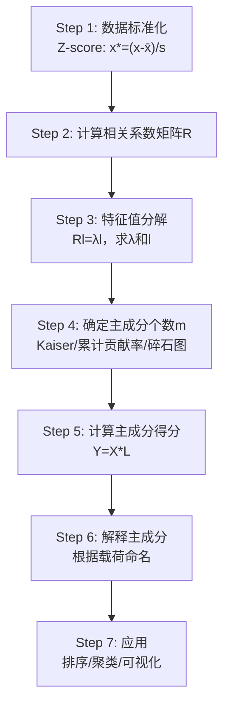

# 第6章 主成分分析及Python计算

## 模块一：精准教学大纲

### 一、教学目标

通过本章学习，学生应具备以下核心能力：

1. **PCA基本思想**：理解主成分分析的核心思想（方差最大化降维）、几何解释（数据椭球的主轴方向）和信息保留原则。
2. **数学推导**：掌握从协方差矩阵出发的主成分推导过程，理解特征值分解与主成分的关系，掌握方差贡献率和累计贡献率的计算。
3. **主成分载荷**：掌握载荷的定义、计算和解释方法，能够根据载荷命名主成分。
4. **主成分个数确定**：掌握Kaiser准则、累计贡献率准则、碎石图法三种确定主成分个数的方法。
5. **适用性检验**：了解KMO检验和Bartlett球形检验的原理与Python实现。
6. **Python实操**：能够使用sklearn.decomposition.PCA和手动实现完整的主成分分析流程。
7. **综合应用**：能够将主成分分析的结果应用于排序、聚类、回归等后续分析，并能对结果进行合理的业务解读。
8. **方法对比**：理解PCA与因子分析的异同，了解PCA的局限性和适用条件。

### 二、建议学时

| 内容 | 学时 | 教学方式 |
|------|------|----------|
| 6.1 主成分分析的概念 | 1 | 讲授+图示 |
| 6.2 主成分分析的性质 | 2 | 讲授+推导 |
| 6.3 主成分分析步骤 | 2 | 讲授+案例 |
| 6.4 主成分分析注意事项 | 1 | 讨论+练习 |
| **合计** | **6** | |

### 三、重点与难点

**重点**：
- 特征值分解与主成分的关系
- 方差贡献率与累计贡献率的计算与解读
- 主成分载荷的计算与解释
- 主成分得分的含义与应用场景

**难点**：
- 从协方差矩阵出发的数学推导
- KMO检验的原理
- 主成分的实际含义解释
- 主成分个数确定方法的综合运用

### 四、前置知识

| 前置知识 | 是否已在本课程前序章节出现 | 处理方式 |
|----------|--------------------------|----------|
| 线性代数（特征值分解） | 是（第1章） | 直接引用 |
| 协方差矩阵与相关系数矩阵 | 是（第2章） | 直接引用 |
| 数据标准化方法 | 是（第2章） | 直接引用 |
| 正交变换 | 是（第1章） | 直接引用 |
| 矩阵的迹与行列式 | 是（第1章） | 直接引用 |

### 五、思政融入点

主成分分析中蕴含的"抓主要矛盾、忽略次要矛盾"思想，体现了唯物辩证法的核心观点。在信息爆炸的时代，如何从海量数据中提取核心信息、去粗取精，是每个数据分析师的必备素养。这种能力不仅适用于数据分析，也适用于我们日常的学习和生活——学会在纷繁复杂的信息中抓住本质，是一种重要的思维能力。

---

## 模块二：沉浸式理论讲解

### 6.1 主成分分析的概念

#### 6.1.1 为什么需要主成分分析？

**【业务场景引入】**

假设你是某大宗商品基金的量化分析师，手头有50只商品期货的日收益率数据。你需要回答以下问题：

1. 这50只期货的价格波动主要受哪些共同因素驱动？
2. 能否用少数几个"综合因子"来描述这50只期货的大部分信息？
3. 能否在二维平面上可视化这50只期货的收益特征？

**问题的本质**：将50个相关变量降维为2-3个不相关的综合变量，同时保留尽可能多的信息。

**主成分分析（Principal Component Analysis, PCA）** 正是解决这类问题的核心工具。

**【更多应用场景】**

- **金融风险管理**：在投资组合中，资产之间存在复杂的关联关系。PCA可以将这些资产分解为少数几个不相关的"风险因子"，帮助投资者理解风险的来源和结构。
- **图像压缩**：一张 $1000 \times 1000$ 的灰度图像有100万个像素，但相邻像素之间高度相关。PCA可以将其压缩为几百个主成分，仍能保持图像的主要特征。
- **基因组学**：在基因表达数据中，通常有数万个基因，但它们的行为可能由少数几个生物通路（如免疫、代谢、细胞周期）驱动。PCA可以帮助识别这些潜在的生物机制。
- **社会科学研究**：在问卷调查中，通常有数十个问题，但这些问题可能测量的是少数几个潜在构念（如幸福感、社会信任等）。PCA可以将这些问题汇总为几个综合得分。

**【高维数据的挑战】**

高维数据（变量数多的数据）面临以下挑战：

1. **维度灾难（Curse of Dimensionality）**：随着维度增加，数据在空间中的分布变得越来越稀疏，需要指数级增长的样本量才能维持相同的统计功效。
2. **多重共线性**：高维数据中变量之间往往存在较强的相关性，导致回归系数不稳定。
3. **可视化困难**：人类只能直观理解三维以下的空间，超过三维的数据无法直接可视化。
4. **计算成本**：许多机器学习算法的计算复杂度随维度增加而急剧增长。

PCA通过降维来缓解这些问题，同时尽可能保留数据中的信息。

#### 6.1.2 PCA的核心思想

PCA的核心思想可以用一句话概括：**找到一组新的正交坐标轴，使得数据在这些轴上的投影方差依次最大**。

**几何直觉**：

想象一个二维数据点云，它大致呈椭圆形分布。PCA就是要找到这个椭圆的**长轴方向**和**短轴方向**：
- **第一主成分**：沿椭圆长轴方向（数据散布最大的方向）
- **第二主成分**：沿椭圆短轴方向（与第一主成分正交，且散布次大的方向）

推广到高维情况：
- **第三主成分**：与前两个主成分正交，且沿数据散布第三大方向
- 以此类推，直到第 $p$ 个主成分

**关键洞察**：主成分方向实际上就是数据椭球的主轴方向。椭球的形状由数据的协方差矩阵决定，主轴方向就是协方差矩阵的特征向量方向。

```python
import numpy as np
import matplotlib.pyplot as plt
from matplotlib.patches import Ellipse

plt.rcParams['font.sans-serif'] = ['SimHei']
plt.rcParams['axes.unicode_minus'] = False
np.random.seed(42)

# 生成二维数据（椭圆分布）
cov = np.array([[2.0, 1.2], [1.2, 0.8]])
data = np.random.multivariate_normal([0, 0], cov, 200)

# 计算主成分
from sklearn.decomposition import PCA
pca = PCA(n_components=2)
pca.fit(data)

# 绘图
fig, ax = plt.subplots(figsize=(8, 8))
ax.scatter(data[:, 0], data[:, 1], s=15, alpha=0.5, color='steelblue')

# 绘制主成分方向
for i, (comp, var) in enumerate(zip(pca.components_, pca.explained_variance_)):
    comp = comp * np.sqrt(var) * 3
    ax.plot([0, comp[0]], [0, comp[1]], 'r-', linewidth=3, label=f'PC{i+1} ({pca.explained_variance_ratio_[i]:.1%})')
    ax.annotate('', xy=comp, xytext=[0, 0],
                arrowprops=dict(arrowstyle='->', color='red', lw=3))

# 绘制椭圆
angle = np.degrees(np.arctan2(pca.components_[0, 1], pca.components_[0, 0]))
for scale in [1, 2, 3]:
    width = 2 * scale * np.sqrt(pca.explained_variance_[0])
    height = 2 * scale * np.sqrt(pca.explained_variance_[1])
    ellipse = Ellipse(xy=[0, 0], width=width, height=height, angle=angle,
                      fill=False, color='red', linewidth=1, linestyle='--' if scale != 2 else '-', alpha=0.5)
    ax.add_patch(ellipse)

ax.set_xlim(-5, 5)
ax.set_ylim(-5, 5)
ax.set_aspect('equal')
ax.set_xlabel('X1')
ax.set_ylabel('X2')
ax.set_title('PCA的几何直觉：椭圆的主轴方向就是主成分方向', fontsize=14)
ax.legend(fontsize=11)
ax.grid(True, alpha=0.3)
plt.tight_layout()
plt.show()
```

*(此处平台应展示PCA几何直觉图：数据点云、主成分方向箭头、协方差椭圆)*

**投影的数学解释**：

设数据点 $\mathbf{x} = (x_1, x_2)^T$，第一主成分方向为单位向量 $\mathbf{u}_1$，则 $\mathbf{x}$ 在 $\mathbf{u}_1$ 上的投影为：

$$
y_1 = \mathbf{u}_1^T \mathbf{x} = u_{11}x_1 + u_{12}x_2
$$

PCA的目标是使投影后的 $y_1$ 的方差最大：

$$
\text{Var}(y_1) = \mathbf{u}_1^T \boldsymbol{\Sigma} \mathbf{u}_1
$$

其中 $\boldsymbol{\Sigma}$ 是数据的协方差矩阵。

#### 6.1.3 信息保留的原则

PCA以**方差**度量信息量：
- 方差越大，说明该方向数据变化越大、信息越多
- 第一主成分沿方差最大方向
- 后续主成分依次递减

**直观理解**：如果所有数据点在某个方向上完全一样（方差为0），那么这个方向就不包含任何信息——我们可以安全地忽略它。

**举例说明**：

假设我们有一组学生的身高和体重数据，这两个变量之间有很强的正相关。PCA可能会发现：
- 第一主成分（PC1）大致沿着"身高-体重"的正方向，反映学生的"体型大小"（方差大，信息多）
- 第二主成分（PC2）大致垂直于PC1，可能反映"高瘦vs矮胖"的差异（方差小，信息少）

在极端情况下，如果身高和体重完全相关（$r=1$），那么PC2的方差为0，所有信息都集中在PC1上，我们可以用一个主成分完全替代两个原始变量。

**信息保留的量化**：

保留信息的比例可以用累计贡献率来衡量：

$$
\text{信息保留比例} = \frac{\lambda_1 + \lambda_2 + \cdots + \lambda_m}{\lambda_1 + \lambda_2 + \cdots + \lambda_p}
$$

一般来说，累计贡献率达到 $80\%$ 以上即可认为信息保留充分。

#### 6.1.4 PCA与其他降维方法的比较

PCA是线性降维方法，还有许多其他降维方法，各有优缺点：

| 方法 | 类型 | 优点 | 缺点 | 适用场景 |
|------|------|------|------|----------|
| PCA | 线性 | 简单高效，理论完善 | 只能捕捉线性关系 | 变量间线性相关 |
| 核PCA | 非线性 | 能捕捉非线性关系 | 核函数选择困难 | 变量间非线性相关 |
| t-SNE | 非线性 | 可视化效果好 | 计算慢，不适合新数据 | 数据可视化 |
| UMAP | 非线性 | 速度快，保持全局结构 | 参数敏感 | 数据可视化 |
| LDA | 有监督 | 利用标签信息 | 需要类别标签 | 分类任务降维 |

PCA的优势在于：理论完善、计算高效、结果可解释，是实际应用中最常用的降维方法。

---

### 6.2 主成分分析的性质

#### 6.2.1 主成分的数学表达

**（1）从协方差矩阵出发的推导**

设 $X = (X_1, X_2, \ldots, X_p)^T$ 为 $p$ 维随机向量，均值为 $\boldsymbol{\mu}$，协方差矩阵为 $\boldsymbol{\Sigma}$。

第 $i$ 个主成分定义为原始变量的线性组合：

$$
Y_i = l_i^T X = l_{i1}X_1 + l_{i2}X_2 + \cdots + l_{ip}X_p
$$

其中 $l_i$ 为单位向量（$l_i^T l_i = 1$）。

**目标**：找到 $l_1$ 使 $\text{Var}(Y_1) = l_1^T \boldsymbol{\Sigma} l_1$ 最大。

**使用拉格朗日乘数法**：

$$
L = l_1^T \boldsymbol{\Sigma} l_1 - \lambda(l_1^T l_1 - 1)
$$

对 $l_1$ 求导令其为零：

$$
\frac{\partial L}{\partial l_1} = 2\boldsymbol{\Sigma} l_1 - 2\lambda l_1 = 0
$$

得到：

$$
\boldsymbol{\Sigma} l_1 = \lambda l_1
$$

**结论**：
- $l_1$ 是 $\boldsymbol{\Sigma}$ 的特征向量
- $\lambda_1$ 是对应的特征值，即第一主成分的方差：$\text{Var}(Y_1) = \lambda_1$
- 特征值按降序排列：$\lambda_1 \geq \lambda_2 \geq \cdots \geq \lambda_p \geq 0$

**（2）第二主成分的推导**

在确定第一主成分后，第二主成分需要满足两个条件：
1. 与第一主成分正交：$l_2^T l_1 = 0$
2. 方差最大：$\text{Var}(Y_2) = l_2^T \boldsymbol{\Sigma} l_2$ 最大

使用拉格朗日乘数法（带两个约束）：

$$
L = l_2^T \boldsymbol{\Sigma} l_2 - \lambda(l_2^T l_2 - 1) - \mu(l_2^T l_1)
$$

求导并化简，同样得到 $\boldsymbol{\Sigma} l_2 = \lambda l_2$，即 $l_2$ 也是 $\boldsymbol{\Sigma}$ 的特征向量，对应的特征值为第二大的 $\lambda_2$。

**（3）主成分的性质**

- 各主成分互不相关：$\text{Cov}(Y_i, Y_j) = 0$（$i \neq j$）
- 总方差不变：$\sum \lambda_i = \text{tr}(\boldsymbol{\Sigma}) = \sum \text{Var}(X_i)$
- 第 $i$ 主成分的方差贡献率：$\lambda_i / \sum \lambda_j$
- 前 $m$ 主成分的累计贡献率：$(\lambda_1 + \cdots + \lambda_m) / \sum \lambda_j$
- 主成分对原始数据的重构误差为：$\sum_{i=m+1}^{p} \lambda_i$

**（4）正交性的证明**

设 $l_i$ 和 $l_j$ 分别是 $\lambda_i$ 和 $\lambda_j$ 对应的特征向量（$\lambda_i \neq \lambda_j$），则：

$$
\boldsymbol{\Sigma} l_i = \lambda_i l_i
$$

左乘 $l_j^T$：

$$
l_j^T \boldsymbol{\Sigma} l_i = \lambda_i l_j^T l_i
$$

类似地：

$$
l_i^T \boldsymbol{\Sigma} l_j = \lambda_j l_i^T l_j
$$

由于 $\boldsymbol{\Sigma}$ 是对称矩阵，$l_j^T \boldsymbol{\Sigma} l_i = (l_i^T \boldsymbol{\Sigma} l_j)^T = l_i^T \boldsymbol{\Sigma} l_j$，因此：

$$
\lambda_i l_j^T l_i = \lambda_j l_i^T l_j
$$

即 $(\lambda_i - \lambda_j) l_j^T l_i = 0$。由于 $\lambda_i \neq \lambda_j$，所以 $l_j^T l_i = 0$，即特征向量正交。

#### 6.2.2 方差贡献率与累计贡献率

**方差贡献率**：

$$
\text{贡献率}_i = \frac{\lambda_i}{\sum_{j=1}^{p}\lambda_j}
$$

反映第 $i$ 个主成分携带的信息占总信息的比例。

**累计贡献率**：

$$
\text{累计贡献率}_m = \frac{\sum_{i=1}^{m}\lambda_i}{\sum_{j=1}^{p}\lambda_j}
$$

反映前 $m$ 个主成分共携带的信息比例。

**计算示例**：

假设有5个变量，协方差矩阵的特征值为：$\lambda = (3.2, 1.1, 0.5, 0.15, 0.05)$

| 主成分 | 特征值 | 方差贡献率 | 累计贡献率 |
|--------|--------|-----------|-----------|
| PC1 | 3.20 | 64.0% | 64.0% |
| PC2 | 1.10 | 22.0% | 86.0% |
| PC3 | 0.50 | 10.0% | 96.0% |
| PC4 | 0.15 | 3.0% | 99.0% |
| PC5 | 0.05 | 1.0% | 100.0% |

**解读**：前2个主成分解释了86%的总方差，说明可以用2个综合变量替代原来的5个变量，信息损失仅14%。

**Python实现方差贡献率的计算**：

```python
import numpy as np

# 假设协方差矩阵的特征值
eigenvalues = np.array([3.2, 1.1, 0.5, 0.15, 0.05])

# 方差贡献率
var_ratio = eigenvalues / eigenvalues.sum()
print("方差贡献率:", np.round(var_ratio, 4))

# 累计贡献率
cum_ratio = np.cumsum(var_ratio)
print("累计贡献率:", np.round(cum_ratio, 4))

# Kaiser准则
n_kaiser = np.sum(eigenvalues > 1)
print(f"Kaiser准则建议保留 {n_kaiser} 个主成分")

# 80%累计贡献率准则
n_80 = np.argmax(cum_ratio >= 0.80) + 1
print(f"80%累计贡献率准则建议保留 {n_80} 个主成分")
```

输出：
```
方差贡献率: [0.64 0.22 0.1  0.03 0.01]
累计贡献率: [0.64 0.86 0.96 0.99 1.  ]
Kaiser准则建议保留 2 个主成分
80%累计贡献率准则建议保留 2 个主成分
```

#### 6.2.3 主成分载荷

**（1）载荷的定义**

主成分载荷是主成分与原始变量之间的相关系数：

$$
l_{ij}^* = \text{Corr}(Y_j, X_i) = l_{ji} \cdot \frac{\sqrt{\lambda_j}}{s_i}
$$

其中 $s_i$ 为第 $i$ 个变量的标准差。

**载荷的推导**：

设 $Y_j = l_j^T X$，则：

$$
\text{Cov}(Y_j, X_i) = \text{Cov}(l_j^T X, X_i) = l_j^T \text{Cov}(X, X_i) = l_j^T \sigma_i
$$

其中 $\sigma_i$ 是 $\boldsymbol{\Sigma}$ 的第 $i$ 列。由于 $\boldsymbol{\Sigma} l_j = \lambda_j l_j$，所以 $l_j^T \boldsymbol{\Sigma} = \lambda_j l_j^T$。

$$
\text{Cov}(Y_j, X_i) = \lambda_j l_{ji}
$$

$$
\text{Corr}(Y_j, X_i) = \frac{\text{Cov}(Y_j, X_i)}{\sqrt{\text{Var}(Y_j)} \cdot \sqrt{\text{Var}(X_i)}} = \frac{\lambda_j l_{ji}}{\sqrt{\lambda_j} \cdot s_i} = l_{ji} \cdot \frac{\sqrt{\lambda_j}}{s_i}
$$

**（2）载荷的解读**

- $|l_{ij}^*|$ 越大，说明第 $i$ 个变量对第 $j$ 个主成分的贡献越大
- 正载荷表示正向贡献，负载荷表示反向贡献
- 根据载荷绝对值大的变量来命名主成分
- 载荷的平方和等于特征值：$\sum_i (l_{ij}^*)^2 = \lambda_j / s_i^2$（标准化数据下等于 $\lambda_j$）

**示例**：

| 变量 | PC1载荷 | PC2载荷 |
|------|---------|---------|
| GDP | 0.92 | -0.15 |
| 人均收入 | 0.88 | -0.20 |
| 城镇化率 | 0.85 | -0.25 |
| 绿化率 | -0.10 | 0.90 |
| 空气质量 | -0.05 | 0.88 |

**命名**：
- PC1在GDP、人均收入、城镇化率上有高正载荷 → "经济发展因子"
- PC2在绿化率、空气质量上有高正载荷 → "环境质量因子"

**Python实现载荷计算**：

```python
import numpy as np
import pandas as pd
from sklearn.decomposition import PCA
from sklearn.preprocessing import StandardScaler

# 假设有标准化数据
np.random.seed(42)
n_samples = 200
# 模拟5个变量的数据
X = np.random.randn(n_samples, 5)

# 标准化
scaler = StandardScaler()
X_std = scaler.fit_transform(X)

# PCA
pca = PCA()
pca.fit(X_std)

# 计算载荷
# 载荷 = 特征向量 * sqrt(特征值)
loadings = pca.components_.T * np.sqrt(pca.explained_variance_)

# 转换为DataFrame
loading_df = pd.DataFrame(
    loadings,
    columns=[f'PC{i+1}' for i in range(loadings.shape[1])],
    index=[f'Var{i+1}' for i in range(loadings.shape[0])]
)

print("主成分载荷矩阵:")
print(loading_df.round(3))
```

#### 6.2.4 主成分个数的确定

**（1）Kaiser准则（特征值大于1准则）**

保留特征值 $\lambda_i > 1$ 的主成分（标准化数据）。因为特征值 < 1 的主成分其方差小于一个标准化原始变量的方差（= 1），解释力不足。

**Kaiser准则的原理**：

标准化后，每个原始变量的方差为1。如果某个主成分的特征值小于1，说明这个主成分的方差还不如一个原始变量大，那么用这个主成分来替代原始变量就没有意义——我们还不如直接保留那个原始变量。

**Kaiser准则的局限**：
- 只适用于标准化数据
- 对变量数敏感：变量数较多时，可能保留过多主成分
- 是一个"硬性"准则，不够灵活

**（2）累计贡献率准则**

取前 $m$ 个主成分使累计贡献率 $\geq 80\%$（或 85%），即保留了原始数据 80% 以上的信息。

**80%准则的经验依据**：
- 在许多实际应用中，80%是一个合理的阈值
- 过高（如95%）可能导致保留过多主成分，降维效果不明显
- 过低（如70%）可能导致信息损失过大

**不同领域的阈值参考**：

| 领域 | 常用阈值 | 说明 |
|------|----------|------|
| 社会科学 | 70%-80% | 变量间相关性通常较弱 |
| 自然科学 | 85%-90% | 变量间相关性通常较强 |
| 图像处理 | 95%-99% | 需要保持较高的视觉质量 |
| 金融风控 | 80%-90% | 需要捕捉足够的风险信息 |

**（3）碎石图法**

绘制特征值从大到小的折线图（碎石图），拐点（elbow）处特征值下降变缓，拐点前的主成分应保留。

**碎石图的解读**：
- 特征值下降很快的部分：包含重要的信号
- 特征值下降变缓的部分：主要是噪声
- 拐点就是信号与噪声的分界线

```python
import numpy as np
import matplotlib.pyplot as plt

plt.rcParams['font.sans-serif'] = ['SimHei']
plt.rcParams['axes.unicode_minus'] = False

# 模拟特征值
eigenvalues = np.array([3.2, 1.1, 0.5, 0.15, 0.05])
cumulative = np.cumsum(eigenvalues) / eigenvalues.sum()
n_components = len(eigenvalues)

fig, ax1 = plt.subplots(figsize=(8, 5))

# 特征值折线图
ax1.plot(range(1, n_components+1), eigenvalues, 'bo-', linewidth=2, markersize=8, label='特征值')
ax1.axhline(y=1, color='red', linestyle='--', alpha=0.5, label='Kaiser准则(λ=1)')
ax1.set_xlabel('主成分序号', fontsize=12)
ax1.set_ylabel('特征值', fontsize=12, color='blue')
ax1.tick_params(axis='y', labelcolor='blue')

# 累计贡献率
ax2 = ax1.twinx()
ax2.plot(range(1, n_components+1), cumulative, 'rs-', linewidth=2, markersize=8, label='累计贡献率')
ax2.axhline(y=0.8, color='green', linestyle='--', alpha=0.5, label='80%阈值')
ax2.set_ylabel('累计贡献率', fontsize=12, color='red')
ax2.tick_params(axis='y', labelcolor='red')
ax2.set_ylim(0, 1.05)

# 合并图例
lines1, labels1 = ax1.get_legend_handles_labels()
lines2, labels2 = ax2.get_legend_handles_labels()
ax1.legend(lines1 + lines2, labels1 + labels2, loc='center right', fontsize=10)

plt.title('碎石图与累计贡献率', fontsize=14)
plt.tight_layout()
plt.show()
```

*(此处平台应展示碎石图：特征值折线、Kaiser准则线、累计贡献率曲线)*

**（4）综合判断**

在实际应用中，建议综合使用三种方法：

1. 首先看Kaiser准则，确定主成分个数的下限
2. 再看累计贡献率，确保信息保留充分
3. 最后看碎石图，观察拐点位置
4. 结合业务背景，选择合理的主成分个数

```python
def determine_n_components(eigenvalues, var_names=None):
    """
    综合三种方法确定主成分个数

    参数:
        eigenvalues: 特征值数组
        var_names: 变量名列表（可选）

    返回:
        建议的主成分个数
    """
    total_var = eigenvalues.sum()
    var_ratio = eigenvalues / total_var
    cum_ratio = np.cumsum(var_ratio)

    # Kaiser准则
    n_kaiser = np.sum(eigenvalues > 1)

    # 80%累计贡献率准则
    n_80 = np.argmax(cum_ratio >= 0.80) + 1

    # 85%累计贡献率准则
    n_85 = np.argmax(cum_ratio >= 0.85) + 1

    print("=" * 50)
    print("主成分个数确定结果")
    print("=" * 50)
    print(f"\n特征值: {np.round(eigenvalues, 4)}")
    print(f"方差贡献率: {np.round(var_ratio, 4)}")
    print(f"累计贡献率: {np.round(cum_ratio, 4)}")
    print(f"\n1. Kaiser准则 (特征值>1): {n_kaiser} 个主成分")
    print(f"2. 80%累计贡献率准则: {n_80} 个主成分")
    print(f"3. 85%累计贡献率准则: {n_85} 个主成分")

    # 综合建议
    n_suggested = max(n_kaiser, n_80)
    print(f"\n综合建议: 保留 {n_suggested} 个主成分")
    print(f"  信息保留比例: {cum_ratio[n_suggested-1]:.1%}")

    return n_suggested

# 使用示例
eigenvalues = np.array([3.2, 1.1, 0.5, 0.15, 0.05])
n = determine_n_components(eigenvalues)
```

#### 6.2.5 主成分的唯一性与符号问题

**唯一性**：主成分的方向（特征向量）在特征值不重复的情况下是唯一的（不考虑符号）。

**符号问题**：特征向量的方向可以是正方向也可以是负方向，即如果 $l$ 是特征向量，那么 $-l$ 也是。这意味着主成分的符号可能因实现而异。

**实际影响**：
- 载荷的符号可能翻转
- 得分的符号可能翻转
- 但主成分的解释不变（只是正负方向互换）

**处理建议**：
- 关注载荷的相对大小和符号，而不是绝对值
- 如果需要特定符号，可以手动调整

```python
# 演示符号问题
import numpy as np
from sklearn.decomposition import PCA

np.random.seed(42)
X = np.random.randn(100, 3)

# 两次PCA的结果
pca1 = PCA().fit(X)
pca2 = PCA().fit(X)

print("第一次PCA的特征向量:")
print(pca1.components_)
print("\n第二次PCA的特征向量:")
print(pca2.components_)
print("\n两次结果完全相同（因为数据相同）")

# 但如果数据顺序不同，符号可能变化
X_shuffled = X[np.random.permutation(len(X))]
pca3 = PCA().fit(X_shuffled)
print("\n打乱顺序后的特征向量:")
print(pca3.components_)
```

---

### 6.3 主成分分析步骤

#### 6.3.1 完整的PCA分析流程



#### 6.3.2 数据标准化

对原始数据做Z-score标准化，消除量纲和数量级差异：

$$
x^* = \frac{x - \bar{x}}{s}
$$

标准化后协方差矩阵即为相关系数矩阵。

**为什么需要标准化？**

如果不标准化，量纲大的变量（如GDP，单位亿元）会主导主成分的方向，而量纲小的变量（如人均收入，单位万元）几乎不起作用。标准化后各变量对主成分的贡献是平等的。

**标准化的两种情况**：

1. **基于协方差矩阵的PCA**：当各变量的量纲相同且我们希望保留原始方差信息时，可以直接使用协方差矩阵。
2. **基于相关系数矩阵的PCA**：当各变量的量纲不同或我们希望各变量平等贡献时，应先标准化再使用相关系数矩阵。

**Python实现标准化**：

```python
import numpy as np
from sklearn.preprocessing import StandardScaler

# 原始数据
X = np.array([[1, 200, 0.001],
              [2, 300, 0.002],
              [3, 400, 0.003],
              [4, 500, 0.004],
              [5, 600, 0.005]])

print("原始数据:")
print(X)
print(f"\n原始数据标准差: {np.std(X, axis=0)}")
print(f"原始数据方差: {np.var(X, axis=0)}")

# 标准化
scaler = StandardScaler()
X_std = scaler.fit_transform(X)

print("\n标准化后数据:")
print(X_std)
print(f"\n标准化后标准差: {np.std(X_std, axis=0)}")
print(f"标准化后方差: {np.var(X_std, axis=0)}")
```

#### 6.3.3 计算相关系数矩阵

计算所有变量两两之间的Pearson相关系数，构成 $p \times p$ 的对称相关系数矩阵 $R$：

$$
R = \begin{pmatrix} 1 & r_{12} & \cdots & r_{1p} \\ r_{21} & 1 & \cdots & r_{2p} \\ \vdots & \vdots & \ddots & \vdots \\ r_{p1} & r_{p2} & \cdots & 1 \end{pmatrix}
$$

**相关系数矩阵的性质**：
1. 对称矩阵：$r_{ij} = r_{ji}$
2. 对角线元素为1：$r_{ii} = 1$
3. 非负定矩阵：所有特征值非负
4. 特征值之和等于变量个数：$\sum \lambda_i = p$

**Python计算相关系数矩阵**：

```python
import numpy as np
import pandas as pd
import seaborn as sns
import matplotlib.pyplot as plt

plt.rcParams['font.sans-serif'] = ['SimHei']
plt.rcParams['axes.unicode_minus'] = False

# 生成示例数据
np.random.seed(42)
n = 100
x1 = np.random.randn(n)
x2 = 0.8 * x1 + np.random.randn(n) * 0.6
x3 = 0.5 * x1 + 0.3 * x2 + np.random.randn(n) * 0.5
x4 = np.random.randn(n)
x5 = 0.7 * x3 + np.random.randn(n) * 0.5

data = pd.DataFrame({'X1': x1, 'X2': x2, 'X3': x3, 'X4': x4, 'X5': x5})

# 计算相关系数矩阵
corr_matrix = data.corr()
print("相关系数矩阵:")
print(corr_matrix.round(3))

# 可视化
fig, ax = plt.subplots(figsize=(8, 6))
sns.heatmap(corr_matrix, annot=True, fmt='.2f', cmap='RdBu_r', center=0,
            square=True, ax=ax, linewidths=0.5)
ax.set_title('相关系数矩阵热力图')
plt.tight_layout()
plt.show()
```

#### 6.3.4 特征值分解

对相关系数矩阵 $R$ 做特征值分解：

$$
Rl = \lambda l
$$

求得 $p$ 个特征值 $\lambda_1 \geq \lambda_2 \geq \cdots \geq \lambda_p \geq 0$ 和对应的特征向量 $l_1, l_2, \ldots, l_p$。

**特征值分解的Python实现**：

```python
import numpy as np
from numpy.linalg import eig

# 相关系数矩阵
R = np.array([[1.0, 0.8, 0.5, 0.1, 0.3],
              [0.8, 1.0, 0.4, 0.2, 0.2],
              [0.5, 0.4, 1.0, 0.1, 0.7],
              [0.1, 0.2, 0.1, 1.0, 0.0],
              [0.3, 0.2, 0.7, 0.0, 1.0]])

# 特征值分解
eigenvalues, eigenvectors = eig(R)

# 按特征值降序排列
idx = np.argsort(eigenvalues)[::-1]
eigenvalues = eigenvalues[idx]
eigenvectors = eigenvectors[:, idx]

print("特征值:")
print(np.round(eigenvalues, 4))
print("\n特征向量（按列）:")
print(np.round(eigenvectors, 4))

# 验证
print("\n验证: R @ v - lambda * v = 0?")
for i in range(len(eigenvalues)):
    residual = R @ eigenvectors[:, i] - eigenvalues[i] * eigenvectors[:, i]
    print(f"  PC{i+1} 残差范数: {np.linalg.norm(residual):.10f}")
```

#### 6.3.5 主成分得分计算

第 $i$ 个主成分得分：

$$
Y_i = X^* \cdot l_i
$$

其中 $X^*$ 为标准化后的数据矩阵，$l_i$ 为第 $i$ 个特征向量。

得分矩阵：

$$
Y = X^* \cdot L
$$

其中 $L = [l_1, l_2, \ldots, l_m]$ 为前 $m$ 个特征向量组成的矩阵。

**得分的性质**：
1. 均值为0：$\bar{Y}_i = 0$
2. 方差为特征值：$\text{Var}(Y_i) = \lambda_i$
3. 互不相关：$\text{Cov}(Y_i, Y_j) = 0$（$i \neq j$）

**Python计算得分**：

```python
import numpy as np
from sklearn.decomposition import PCA
from sklearn.preprocessing import StandardScaler

# 生成数据
np.random.seed(42)
X = np.random.randn(100, 5)

# 标准化
scaler = StandardScaler()
X_std = scaler.fit_transform(X)

# PCA
pca = PCA(n_components=3)
scores = pca.fit_transform(X_std)

print(f"原始数据形状: {X_std.shape}")
print(f"得分矩阵形状: {scores.shape}")

print(f"\n得分的均值（应接近0）: {np.round(scores.mean(axis=0), 10)}")
print(f"得分的方差（应等于特征值）: {np.round(scores.var(axis=0), 4)}")
print(f"PCA特征值: {np.round(pca.explained_variance_, 4)}")

# 得分之间的相关系数（应接近0）
print(f"\n得分之间的相关系数:")
print(np.round(np.corrcoef(scores.T), 4))
```

#### 6.3.6 手动实现PCA

为了深入理解PCA的原理，我们可以手动实现完整的PCA流程：

```python
import numpy as np
import pandas as pd

class ManualPCA:
    """
    手动实现主成分分析
    """

    def __init__(self, n_components=None):
        self.n_components = n_components
        self.eigenvalues_ = None
        self.eigenvectors_ = None
        self.explained_variance_ratio_ = None
        self.mean_ = None
        self.std_ = None

    def fit(self, X):
        """
        拟合PCA模型

        参数:
            X: 输入数据，形状为 (n_samples, n_features)
        """
        X = np.array(X)
        n_samples, n_features = X.shape

        # Step 1: 数据标准化
        self.mean_ = X.mean(axis=0)
        self.std_ = X.std(axis=0)
        X_std = (X - self.mean_) / self.std_

        # Step 2: 计算相关系数矩阵
        corr_matrix = np.corrcoef(X_std.T)

        # Step 3: 特征值分解
        eigenvalues, eigenvectors = np.linalg.eigh(corr_matrix)

        # 按特征值降序排列
        idx = np.argsort(eigenvalues)[::-1]
        self.eigenvalues_ = eigenvalues[idx]
        self.eigenvectors_ = eigenvectors[:, idx]

        # 计算方差贡献率
        self.explained_variance_ratio_ = self.eigenvalues_ / self.eigenvalues_.sum()

        return self

    def transform(self, X, n_components=None):
        """
        将数据转换到主成分空间

        参数:
            X: 输入数据
            n_components: 保留的主成分个数

        返回:
            主成分得分
        """
        if n_components is None:
            n_components = self.n_components

        if n_components is None:
            n_components = len(self.eigenvalues_)

        X = np.array(X)
        X_std = (X - self.mean_) / self.std_

        # 选择前n_components个特征向量
        L = self.eigenvectors_[:, :n_components]

        # 计算得分
        scores = X_std @ L

        return scores

    def fit_transform(self, X, n_components=None):
        """
        拟合并转换数据
        """
        self.fit(X)
        return self.transform(X, n_components)

    def get_loadings(self, n_components=None):
        """
        计算载荷矩阵

        返回:
            载荷矩阵
        """
        if n_components is None:
            n_components = self.n_components

        if n_components is None:
            n_components = len(self.eigenvalues_)

        # 载荷 = 特征向量 * sqrt(特征值)
        loadings = self.eigenvectors_[:, :n_components] * np.sqrt(self.eigenvalues_[:n_components])

        return loadings

    def summary(self):
        """
        输出PCA摘要信息
        """
        print("=" * 60)
        print("主成分分析结果摘要")
        print("=" * 60)

        print(f"\n特征值: {np.round(self.eigenvalues_, 4)}")
        print(f"方差贡献率: {np.round(self.explained_variance_ratio_, 4)}")
        print(f"累计贡献率: {np.round(np.cumsum(self.explained_variance_ratio_), 4)}")

        # Kaiser准则
        n_kaiser = np.sum(self.eigenvalues_ > 1)
        print(f"\nKaiser准则: 保留 {n_kaiser} 个主成分")

        # 80%准则
        cum_ratio = np.cumsum(self.explained_variance_ratio_)
        n_80 = np.argmax(cum_ratio >= 0.80) + 1
        print(f"80%累计贡献率准则: 保留 {n_80} 个主成分")


# 使用示例
if __name__ == "__main__":
    # 生成示例数据
    np.random.seed(42)
    n = 200
    f1 = np.random.randn(n)
    f2 = np.random.randn(n)
    X = np.column_stack([
        0.7*f1 + 0.2*f2 + np.random.randn(n)*0.3,
        0.6*f1 + 0.1*f2 + np.random.randn(n)*0.3,
        0.5*f1 + 0.15*f2 + np.random.randn(n)*0.3,
        0.1*f1 + 0.8*f2 + np.random.randn(n)*0.3,
        0.2*f1 + 0.6*f2 + np.random.randn(n)*0.3
    ])

    # 手动PCA
    pca_manual = ManualPCA(n_components=2)
    scores_manual = pca_manual.fit_transform(X)
    pca_manual.summary()

    # sklearn PCA
    from sklearn.decomposition import PCA
    from sklearn.preprocessing import StandardScaler

    scaler = StandardScaler()
    X_std = scaler.fit_transform(X)
    pca_sklearn = PCA(n_components=2)
    scores_sklearn = pca_sklearn.fit_transform(X_std)

    print("\n\n与sklearn结果对比:")
    print(f"手动实现特征值: {np.round(pca_manual.eigenvalues_[:2], 4)}")
    print(f"sklearn特征值: {np.round(pca_sklearn.explained_variance_, 4)}")
    print(f"\n手动实现方差贡献率: {np.round(pca_manual.explained_variance_ratio_[:2], 4)}")
    print(f"sklearn方差贡献率: {np.round(pca_sklearn.explained_variance_ratio_, 4)}")
```

---

### 6.4 主成分分析注意事项

#### 6.4.1 KMO检验与Bartlett球形检验

在进行PCA之前，需要检验数据是否适合做主成分分析。常用的检验方法有KMO检验和Bartlett球形检验。

**（1）KMO检验**

KMO（Kaiser-Meyer-Olkin）统计量衡量变量间偏相关程度：

$$
KMO = \frac{\sum\sum_{i \neq j} r_{ij}^2}{\sum\sum_{i \neq j} r_{ij}^2 + \sum\sum_{i \neq j} p_{ij}^2}
$$

其中 $r_{ij}$ 为相关系数，$p_{ij}$ 为偏相关系数。

KMO取值范围为 $(0, 1)$：

| KMO值 | 含义 |
|-------|------|
| > 0.9 | 很好 |
| 0.8-0.9 | 好 |
| 0.7-0.8 | 一般 |
| 0.6-0.7 | 较差 |
| 0.5-0.6 | 很差 |
| < 0.5 | 不适合做PCA |

**KMO的直观理解**：

- 如果变量之间的相关主要是直接相关（$r_{ij}$ 大），偏相关较小（$p_{ij}$ 小），则KMO值高，说明变量间有共同的信息来源，适合做PCA。
- 如果变量之间的相关主要是间接相关（通过其他变量传递），偏相关较大（$p_{ij}$ 大），则KMO值低，说明变量间缺乏共同的信息来源，不适合做PCA。

**Python实现KMO检验**：

```python
import numpy as np
from scipy import stats

def compute_kmo(data):
    """
    计算KMO统计量

    参数:
        data: 数据矩阵，形状为 (n_samples, n_features)

    返回:
        KMO值
    """
    # 计算相关系数矩阵
    corr = np.corrcoef(data.T)

    # 计算偏相关系数矩阵
    # 偏相关 = -inv(corr) / sqrt(diag(-inv(corr)) * diag(-inv(corr)).T)
    inv_corr = np.linalg.inv(corr)
    pcorr = -inv_corr / np.sqrt(np.outer(np.diag(-inv_corr), np.diag(-inv_corr)))
    np.fill_diagonal(pcorr, 1)

    # 计算KMO
    r2_sum = 0
    p2_sum = 0
    n = corr.shape[0]
    for i in range(n):
        for j in range(i+1, n):
            r2_sum += corr[i, j] ** 2
            p2_sum += pcorr[i, j] ** 2

    kmo = r2_sum / (r2_sum + p2_sum)
    return kmo


# 使用示例
np.random.seed(42)
n = 200
f = np.random.randn(n)
X = np.column_stack([
    0.7*f + np.random.randn(n)*0.3,
    0.6*f + np.random.randn(n)*0.3,
    0.5*f + np.random.randn(n)*0.3,
    0.1*np.random.randn(n),
    0.2*f + np.random.randn(n)*0.3
])

kmo = compute_kmo(X)
print(f"KMO统计量: {kmo:.4f}")

if kmo >= 0.9:
    print("KMO值 >= 0.9，非常适合做PCA")
elif kmo >= 0.8:
    print("KMO值 0.8-0.9，适合做PCA")
elif kmo >= 0.7:
    print("KMO值 0.7-0.8，一般")
elif kmo >= 0.6:
    print("KMO值 0.6-0.7，不太适合做PCA")
elif kmo >= 0.5:
    print("KMO值 0.5-0.6，很不适合做PCA")
else:
    print("KMO值 < 0.5，不适合做PCA")
```

**（2）Bartlett球形检验**

H0：相关矩阵为单位阵（变量不相关）

检验统计量：

$$
\chi^2 = -\left((n-1) - \frac{2p+5}{6}\right) \ln |R|
$$

$p < 0.05$ 拒绝H0，说明变量间存在足够相关性，适合做PCA。

**Bartlett检验的直观理解**：

- H0假设所有变量都不相关（相关矩阵为单位阵）
- 如果不能拒绝H0，说明变量间没有足够的相关性，PCA无法有效降维
- 如果拒绝H0，说明变量间存在显著的相关性，PCA可以有效降维

**Python实现Bartlett检验**：

```python
import numpy as np
from scipy import stats

def bartlett_test(data):
    """
    Bartlett球形检验

    参数:
        data: 数据矩阵，形状为 (n_samples, n_features)

    返回:
        chi2: 检验统计量
        p_value: p值
    """
    n, p = data.shape

    # 计算相关系数矩阵
    corr = np.corrcoef(data.T)

    # 计算检验统计量
    chi2 = -((n - 1) - (2 * p + 5) / 6) * np.log(np.linalg.det(corr))

    # 自由度
    df = p * (p - 1) / 2

    # p值
    p_value = 1 - stats.chi2.cdf(chi2, df)

    return chi2, p_value, df


# 使用示例
np.random.seed(42)
n = 200
f = np.random.randn(n)
X = np.column_stack([
    0.7*f + np.random.randn(n)*0.3,
    0.6*f + np.random.randn(n)*0.3,
    0.5*f + np.random.randn(n)*0.3,
    0.4*f + np.random.randn(n)*0.3,
    0.3*f + np.random.randn(n)*0.3
])

chi2, p_value, df = bartlett_test(X)
print(f"Bartlett球形检验结果:")
print(f"  卡方统计量: {chi2:.4f}")
print(f"  自由度: {df:.0f}")
print(f"  p值: {p_value:.6f}")

if p_value < 0.05:
    print("  结论: 拒绝H0，变量间存在显著相关性，适合做PCA")
else:
    print("  结论: 不能拒绝H0，变量间相关性不显著，不适合做PCA")
```

#### 6.4.2 PCA的假设与局限

**PCA的假设**：
1. 线性假设：主成分是原始变量的线性组合
2. 方差度量信息：方差大的方向包含更多信息
3. 大方差成分更重要：前几个主成分比后面的更重要

**PCA的局限**：
1. 只能捕捉线性关系，无法捕捉非线性关系
2. 对异常值敏感
3. 主成分的实际含义可能难以解释
4. 降维后会损失部分信息

**何时不适合使用PCA**：
1. 变量之间没有明显的相关性
2. 需要保留变量的实际含义
3. 数据存在非线性关系
4. 有类别变量参与

#### 6.4.3 PCA与因子分析的区别

PCA和因子分析（Factor Analysis）都是降维方法，但有本质区别：

| 方面 | PCA | 因子分析 |
|------|-----|---------|
| 目标 | 用少数主成分解释总方差 | 用少数因子解释变量间的相关性 |
| 模型 | $Y = LX$（确定性变换） | $X = LF + \epsilon$（统计模型） |
| 误差 | 无误差项 | 有特殊因子（误差项） |
| 唯一性 | 结果唯一 | 因子可以旋转 |
| 解释 | 主成分是原始变量的线性组合 | 因子是潜在变量 |
| 适用 | 降维、数据压缩 | 探索潜在结构 |

#### 6.4.4 异常值的影响

PCA对异常值敏感，因为方差受异常值影响较大。

```python
import numpy as np
import matplotlib.pyplot as plt
from sklearn.decomposition import PCA

plt.rcParams['font.sans-serif'] = ['SimHei']
plt.rcParams['axes.unicode_minus'] = False

np.random.seed(42)

# 生成正常数据
X_normal = np.random.randn(100, 2) @ np.array([[2, 1], [1, 0.5]])

# 添加异常值
X_outlier = np.vstack([X_normal, [[10, 10], [-8, -8]]])

# 对比PCA结果
pca_normal = PCA(n_components=2).fit(X_normal)
pca_outlier = PCA(n_components=2).fit(X_outlier)

fig, axes = plt.subplots(1, 2, figsize=(14, 6))

# 正常数据的PCA
ax = axes[0]
ax.scatter(X_normal[:, 0], X_normal[:, 1], s=20, alpha=0.5, color='steelblue')
for i, (comp, var) in enumerate(zip(pca_normal.components_, pca_normal.explained_variance_)):
    comp = comp * np.sqrt(var) * 3
    ax.annotate('', xy=comp, xytext=[0, 0],
                arrowprops=dict(arrowstyle='->', color='red', lw=2))
ax.set_title(f'正常数据 PCA\nPC1方差贡献率: {pca_normal.explained_variance_ratio_[0]:.1%}')
ax.set_aspect('equal')
ax.grid(True, alpha=0.3)

# 带异常值的PCA
ax = axes[1]
ax.scatter(X_outlier[:, 0], X_outlier[:, 1], s=20, alpha=0.5, color='steelblue')
ax.scatter([10, -8], [10, -8], s=100, c='red', marker='x', linewidths=3, label='异常值')
for i, (comp, var) in enumerate(zip(pca_outlier.components_, pca_outlier.explained_variance_)):
    comp = comp * np.sqrt(var) * 3
    ax.annotate('', xy=comp, xytext=[0, 0],
                arrowprops=dict(arrowstyle='->', color='red', lw=2))
ax.set_title(f'带异常值的PCA\nPC1方差贡献率: {pca_outlier.explained_variance_ratio_[0]:.1%}')
ax.set_aspect('equal')
ax.grid(True, alpha=0.3)
ax.legend()

plt.tight_layout()
plt.show()

print(f"正常数据主成分方向: {pca_normal.components_[0]}")
print(f"带异常值主成分方向: {pca_outlier.components_[0]}")
print(f"\n方向变化角度: {np.degrees(np.arccos(np.abs(np.dot(pca_normal.components_[0], pca_outlier.components_[0])))):.1f}度")
```

#### 6.4.5 主成分命名的技巧

主成分命名是PCA中最具挑战性的环节之一。以下是一些实用技巧：

1. **看载荷绝对值**：绝对值大的变量对主成分贡献大
2. **看载荷符号**：同号的变量正相关，异号的变量负相关
3. **看载荷大小的相对关系**：哪个变量载荷最大，哪个变量对主成分影响最大
4. **结合业务背景**：根据变量的实际含义来命名

**命名示例**：

假设我们对城市经济数据做PCA，得到以下载荷：

| 变量 | PC1载荷 | PC2载荷 |
|------|---------|---------|
| GDP | 0.92 | -0.15 |
| 工业产值 | 0.88 | -0.20 |
| 固定资产投资 | 0.85 | -0.25 |
| 绿化覆盖率 | -0.10 | 0.90 |
| 空气质量指数 | -0.05 | 0.88 |
| 人均公园面积 | -0.08 | 0.85 |

**命名过程**：
1. PC1：GDP、工业产值、固定资产投资的载荷都很高（>0.8），且符号相同 → 这些变量都反映经济活动水平 → 命名为"经济发展水平因子"
2. PC2：绿化覆盖率、空气质量指数、人均公园面积的载荷都很高（>0.8），且符号相同 → 这些变量都反映城市环境质量 → 命名为"环境质量因子"

**命名的注意事项**：
- 如果一个变量在多个主成分上都有较高载荷，说明这个变量的信息被分散到多个主成分中
- 如果一个主成分上没有明显的高载荷变量，可能是"混合因子"，难以命名
- 命名应尽量简洁明了，便于理解和交流

---

## 模块三：实战与代码复现

### 实战案例6-1：大宗商品ETF的主成分分析

**【业务场景】** 对10只商品ETF的收益率数据进行主成分分析，提取商品市场的共同因子。

```python
import numpy as np
import pandas as pd
import matplotlib.pyplot as plt
import seaborn as sns
from sklearn.decomposition import PCA
from sklearn.preprocessing import StandardScaler
from scipy import stats

plt.rcParams['font.sans-serif'] = ['SimHei']
plt.rcParams['axes.unicode_minus'] = False
sns.set_theme(style="whitegrid")
np.random.seed(42)

# ============================================================
# 数据准备：10只商品ETF的收益率
# ============================================================
n = 250
F1 = np.random.randn(n)  # 工业需求因子
F2 = np.random.randn(n)  # 避险情绪因子
F3 = np.random.randn(n)  # 能源因子

etf_data = {
    '铜': 0.7*F1 + 0.2*F2 + np.random.randn(n)*0.3,
    '铝': 0.6*F1 + 0.1*F2 + np.random.randn(n)*0.3,
    '锌': 0.5*F1 + 0.15*F2 + np.random.randn(n)*0.3,
    '铅': 0.4*F1 + 0.1*F2 + np.random.randn(n)*0.3,
    '镍': 0.65*F1 + 0.05*F2 + np.random.randn(n)*0.3,
    '原油': 0.5*F1 + 0.1*F2 + 0.6*F3 + np.random.randn(n)*0.3,
    '天然气': 0.3*F1 + 0.0*F2 + 0.8*F3 + np.random.randn(n)*0.3,
    '黄金': -0.2*F1 + 0.8*F2 + 0.1*F3 + np.random.randn(n)*0.2,
    '白银': -0.1*F1 + 0.6*F2 + 0.2*F3 + np.random.randn(n)*0.3,
    '农产品': 0.2*F1 + 0.1*F2 + 0.3*F3 + np.random.randn(n)*0.3
}

returns = pd.DataFrame(etf_data) / 100

print("=== 数据概览 ===")
print(returns.describe().round(6))

# ============================================================
# Step 1: 数据标准化
# ============================================================
scaler = StandardScaler()
X_std = scaler.fit_transform(returns)

# ============================================================
# Step 2: 相关系数矩阵
# ============================================================
corr = returns.corr()

fig, ax = plt.subplots(figsize=(10, 8))
sns.heatmap(corr, annot=True, fmt='.2f', cmap='RdBu_r', center=0,
            square=True, ax=ax, linewidths=0.5, annot_kws={'size': 10})
ax.set_title('商品ETF收益率相关系数矩阵', fontsize=14)
plt.tight_layout()
plt.show()

# ============================================================
# Step 3: PCA
# ============================================================
pca = PCA()
scores = pca.fit_transform(X_std)

eigenvalues = pca.explained_variance_
var_ratio = pca.explained_variance_ratio_
cum_ratio = np.cumsum(var_ratio)

print("\n=== 特征值与方差贡献率 ===")
for i, (ev, vr, cr) in enumerate(zip(eigenvalues, var_ratio, cum_ratio)):
    print(f"  PC{i+1}: 特征值={ev:.4f}, 贡献率={vr:.4f}, 累计={cr:.4f}")

# ============================================================
# Step 4: 确定主成分个数
# ============================================================
n_kaiser = np.sum(eigenvalues > 1)
n_80 = np.argmax(cum_ratio >= 0.80) + 1

print(f"\nKaiser准则: 保留{n_kaiser}个主成分")
print(f"80%贡献率准则: 保留{n_80}个主成分")

# ============================================================
# Step 5: 碎石图
# ============================================================
fig, ax1 = plt.subplots(figsize=(8, 5))

ax1.plot(range(1, len(eigenvalues)+1), eigenvalues, 'bo-', linewidth=2, markersize=8)
ax1.axhline(y=1, color='red', linestyle='--', alpha=0.5, label='Kaiser准则')
ax1.set_xlabel('主成分序号', fontsize=12)
ax1.set_ylabel('特征值', fontsize=12)

ax2 = ax1.twinx()
ax2.plot(range(1, len(eigenvalues)+1), cum_ratio, 'rs-', linewidth=2, markersize=8)
ax2.axhline(y=0.8, color='green', linestyle='--', alpha=0.5, label='80%阈值')
ax2.set_ylabel('累计贡献率', fontsize=12)
ax2.set_ylim(0, 1.05)

lines1, labels1 = ax1.get_legend_handles_labels()
lines2, labels2 = ax2.get_legend_handles_labels()
ax1.legend(lines1 + lines2, labels1 + labels2, loc='center right')
plt.title('碎石图与累计贡献率', fontsize=14)
plt.tight_layout()
plt.show()

# ============================================================
# Step 6: 主成分载荷
# ============================================================
n_components = n_80
loadings = pd.DataFrame(
    pca.components_[:n_components].T * np.sqrt(eigenvalues[:n_components]),
    columns=[f'PC{i+1}' for i in range(n_components)],
    index=returns.columns
)

print("\n=== 主成分载荷矩阵 ===")
print(loadings.round(3))

fig, ax = plt.subplots(figsize=(10, 8))
sns.heatmap(loadings, annot=True, fmt='.3f', cmap='RdBu_r', center=0,
            square=True, ax=ax, linewidths=0.5, annot_kws={'size': 10})
ax.set_title('主成分载荷矩阵', fontsize=14)
plt.tight_layout()
plt.show()

# ============================================================
# Step 7: 载荷散点图
# ============================================================
fig, ax = plt.subplots(figsize=(8, 8))
ax.scatter(loadings['PC1'], loadings['PC2'], s=80, c='steelblue', edgecolors='black')

for i, name in enumerate(loadings.index):
    ax.annotate(name, (loadings.iloc[i, 0], loadings.iloc[i, 1]),
                fontsize=11, ha='center', va='bottom')

ax.axhline(y=0, color='gray', linestyle='--', alpha=0.5)
ax.axvline(x=0, color='gray', linestyle='--', alpha=0.5)
ax.set_xlabel('PC1', fontsize=12)
ax.set_ylabel('PC2', fontsize=12)
ax.set_title('主成分载荷散点图', fontsize=14)
plt.tight_layout()
plt.show()

# ============================================================
# Step 8: 主成分得分图
# ============================================================
fig, ax = plt.subplots(figsize=(10, 8))
ax.scatter(scores[:, 0], scores[:, 1], c='steelblue', s=20, alpha=0.5)
ax.axhline(y=0, color='gray', linestyle='--', alpha=0.5)
ax.axvline(x=0, color='gray', linestyle='--', alpha=0.5)
ax.set_xlabel(f'PC1 ({var_ratio[0]:.1%})', fontsize=12)
ax.set_ylabel(f'PC2 ({var_ratio[1]:.1%})', fontsize=12)
ax.set_title('主成分得分图', fontsize=14)
plt.tight_layout()
plt.show()
```

*(此处平台应展示PCA的完整分析结果：相关系数热力图、碎石图、载荷矩阵热力图、载荷散点图、得分图)*

**结果解读**：

1. **碎石图**：前2-3个主成分的特征值大于1，且累计贡献率超过80%，建议保留2-3个主成分。

2. **载荷矩阵解读**：
   - **PC1**：在铜、铝、锌等工业金属上有高正载荷，在黄金上有负载荷 → "工业需求 vs 避险情绪因子"
   - **PC2**：在原油、天然气上有高正载荷 → "能源因子"

3. **载荷散点图**：工业金属聚在右上角，贵金属聚在左下角，能源品在上方，直观展示了各ETF在主成分空间中的位置。

4. **投资启示**：
   - PC1代表"风险偏好"：经济扩张时工业金属上涨，避险资产下跌
   - PC2代表"能源冲击"：油价上涨时能源品联动上涨

---

### 实战案例6-2：PCA降维后的后续分析

```python
import numpy as np
import pandas as pd
from sklearn.decomposition import PCA
from sklearn.preprocessing import StandardScaler
from sklearn.cluster import KMeans
from sklearn.metrics import silhouette_score

# 使用前面的ETF数据
# ...（数据准备代码同上）

# 用PCA降维到3个主成分
pca = PCA(n_components=3)
scores_pca = pca.fit_transform(X_std)

print(f"原始维度: {X_std.shape[1]}")
print(f"降维后维度: {scores_pca.shape[1]}")
print(f"保留信息比例: {pca.explained_variance_ratio_.sum():.1%}")

# 用降维后的数据做聚类
K_range = range(2, 6)
sil_original = []
sil_pca = []

for k in K_range:
    # 原始数据聚类
    km1 = KMeans(n_clusters=k, n_init=10, random_state=42)
    labels1 = km1.fit_predict(X_std)
    sil_original.append(silhouette_score(X_std, labels1))

    # PCA降维后聚类
    km2 = KMeans(n_clusters=k, n_init=10, random_state=42)
    labels2 = km2.fit_predict(scores_pca)
    sil_pca.append(silhouette_score(scores_pca, labels2))

print("\n=== 聚类效果对比 ===")
for k, s1, s2 in zip(K_range, sil_original, sil_pca):
    print(f"  K={k}: 原始数据轮廓系数={s1:.4f}, PCA降维后={s2:.4f}")
```

*(此处平台应展示原始数据与PCA降维后聚类效果的对比)*

---

### 实战案例6-3：PCA在回归中的应用（主成分回归）

当自变量存在多重共线性时，可以用PCA降维后再做回归，即主成分回归（PCR）。

```python
import numpy as np
import pandas as pd
from sklearn.decomposition import PCA
from sklearn.preprocessing import StandardScaler
from sklearn.linear_model import LinearRegression
from sklearn.model_selection import cross_val_score
from sklearn.metrics import mean_squared_error, r2_score

np.random.seed(42)

# 生成带多重共线性的数据
n = 200
X1 = np.random.randn(n)
X2 = 0.9 * X1 + np.random.randn(n) * 0.3
X3 = 0.8 * X1 + np.random.randn(n) * 0.4
X4 = np.random.randn(n)
X5 = 0.7 * X2 + np.random.randn(n) * 0.3

y = 2 * X1 + 3 * X2 + 1.5 * X3 + 0.5 * X4 + 2 * X5 + np.random.randn(n) * 2

X = np.column_stack([X1, X2, X3, X4, X5])
feature_names = ['X1', 'X2', 'X3', 'X4', 'X5']

# 标准化
scaler = StandardScaler()
X_std = scaler.fit_transform(X)

# 检查多重共线性
corr = np.corrcoef(X_std.T)
print("相关系数矩阵:")
print(pd.DataFrame(corr, index=feature_names, columns=feature_names).round(3))

# 方法1: 直接用原始变量做回归
lr = LinearRegression()
scores_cv = cross_val_score(lr, X_std, y, cv=5, scoring='neg_mean_squared_error')
rmse_original = np.sqrt(-scores_cv.mean())
print(f"\n原始变量回归 - 交叉验证RMSE: {rmse_original:.4f}")

# 方法2: PCA降维后做回归
pca = PCA()
pca.fit(X_std)

print("\nPCA结果:")
cum_ratio = np.cumsum(pca.explained_variance_ratio_)
for i, (vr, cr) in enumerate(zip(pca.explained_variance_ratio_, cum_ratio)):
    print(f"  PC{i+1}: 贡献率={vr:.4f}, 累计={cr:.4f}")

# 尝试不同的主成分个数
print("\n主成分回归结果:")
for n_comp in range(1, 6):
    pca_temp = PCA(n_components=n_comp)
    X_pca = pca_temp.fit_transform(X_std)

    scores_cv = cross_val_score(lr, X_pca, y, cv=5, scoring='neg_mean_squared_error')
    rmse_pca = np.sqrt(-scores_cv.mean())
    print(f"  {n_comp}个主成分 - 交叉验证RMSE: {rmse_pca:.4f}")

# 可视化对比
import matplotlib.pyplot as plt

plt.rcParams['font.sans-serif'] = ['SimHei']
plt.rcParams['axes.unicode_minus'] = False

n_components_list = list(range(1, 6))
rmse_list = []
for n_comp in n_components_list:
    pca_temp = PCA(n_components=n_comp)
    X_pca = pca_temp.fit_transform(X_std)
    scores_cv = cross_val_score(lr, X_pca, y, cv=5, scoring='neg_mean_squared_error')
    rmse_list.append(np.sqrt(-scores_cv.mean()))

fig, ax = plt.subplots(figsize=(8, 5))
ax.plot(n_components_list, rmse_list, 'bo-', linewidth=2, markersize=8)
ax.axhline(y=rmse_original, color='red', linestyle='--', alpha=0.5, label='原始变量回归')
ax.set_xlabel('主成分个数', fontsize=12)
ax.set_ylabel('交叉验证RMSE', fontsize=12)
ax.set_title('主成分回归：主成分个数 vs 预测误差', fontsize=14)
ax.legend()
ax.grid(True, alpha=0.3)
plt.tight_layout()
plt.show()
```

---

### 实战案例6-4：PCA用于数据可视化

```python
import numpy as np
import pandas as pd
import matplotlib.pyplot as plt
from sklearn.decomposition import PCA
from sklearn.preprocessing import StandardScaler
from sklearn.datasets import load_iris

plt.rcParams['font.sans-serif'] = ['SimHei']
plt.rcParams['axes.unicode_minus'] = False

# 加载鸢尾花数据集
iris = load_iris()
X = iris.data
y = iris.target
target_names = iris.target_names

# 标准化
scaler = StandardScaler()
X_std = scaler.fit_transform(X)

# PCA降到2维
pca = PCA(n_components=2)
X_pca = pca.fit_transform(X_std)

# 可视化
fig, axes = plt.subplots(1, 2, figsize=(14, 6))

# 原始数据的前两个特征
ax = axes[0]
for i, name in enumerate(target_names):
    mask = y == i
    ax.scatter(X[mask, 0], X[mask, 1], label=name, s=50, alpha=0.7)
ax.set_xlabel('花萼长度', fontsize=12)
ax.set_ylabel('花萼宽度', fontsize=12)
ax.set_title('原始数据（前两个特征）', fontsize=14)
ax.legend()
ax.grid(True, alpha=0.3)

# PCA降维后的数据
ax = axes[1]
for i, name in enumerate(target_names):
    mask = y == i
    ax.scatter(X_pca[mask, 0], X_pca[mask, 1], label=name, s=50, alpha=0.7)
ax.set_xlabel(f'PC1 ({pca.explained_variance_ratio_[0]:.1%})', fontsize=12)
ax.set_ylabel(f'PC2 ({pca.explained_variance_ratio_[1]:.1%})', fontsize=12)
ax.set_title('PCA降维后的数据', fontsize=14)
ax.legend()
ax.grid(True, alpha=0.3)

plt.tight_layout()
plt.show()

print(f"PCA保留的信息比例: {pca.explained_variance_ratio_.sum():.1%}")

# 载荷分析
loadings = pd.DataFrame(
    pca.components_.T,
    columns=['PC1', 'PC2'],
    index=iris.feature_names
)
print("\n主成分载荷:")
print(loadings.round(3))
```

---

### 实战案例6-5：PCA用于图像压缩

```python
import numpy as np
import matplotlib.pyplot as plt
from sklearn.decomposition import PCA

plt.rcParams['font.sans-serif'] = ['SimHei']
plt.rcParams['axes.unicode_minus'] = False

# 生成示例图像（模拟）
np.random.seed(42)
height, width = 100, 100

# 创建一个有结构的图像
x = np.linspace(-3, 3, width)
y = np.linspace(-3, 3, height)
X, Y = np.meshgrid(x, y)
image = np.exp(-(X**2 + Y**2)/2) + 0.5*np.exp(-((X-1)**2 + (Y-1)**2)/2)
image = image + np.random.randn(height, width) * 0.1

# 将图像展平为行向量
n_rows = image.shape[0]
X_flat = image  # 每行是一个样本

# PCA压缩
n_components_list = [1, 5, 10, 20, 50]

fig, axes = plt.subplots(1, len(n_components_list)+1, figsize=(20, 4))

# 原始图像
axes[0].imshow(image, cmap='gray')
axes[0].set_title('原始图像')
axes[0].axis('off')

for i, n_comp in enumerate(n_components_list):
    pca = PCA(n_components=n_comp)
    X_compressed = pca.fit_transform(X_flat)
    X_reconstructed = pca.inverse_transform(X_compressed)

    axes[i+1].imshow(X_reconstructed, cmap='gray')
    axes[i+1].set_title(f'{n_comp}个主成分\n({pca.explained_variance_ratio_.sum():.1%})')
    axes[i+1].axis('off')

plt.tight_layout()
plt.show()

# 压缩率分析
print("压缩率分析:")
print(f"原始数据: {n_rows * width} 个数值")
for n_comp in n_components_list:
    pca = PCA(n_components=n_comp)
    pca.fit(X_flat)
    compressed_size = n_rows * n_comp + n_comp * width  # 得分 + 特征向量
    ratio = compressed_size / (n_rows * width)
    print(f"  {n_comp}个主成分: {compressed_size} 个数值, 压缩率: {ratio:.1%}")
```

---

## 模块四：练习题与思考题

### 练习题

**练习1：基础计算**

给定数据矩阵：

$$
X = \begin{pmatrix} 1 & 2 \\ 3 & 4 \\ 5 & 6 \\ 7 & 8 \end{pmatrix}
$$

1. 计算相关系数矩阵
2. 手动计算特征值和特征向量
3. 计算方差贡献率和累计贡献率
4. 如果保留1个主成分，信息保留率是多少？

**练习2：载荷解释**

某城市的经济数据PCA结果如下：

| 变量 | PC1载荷 | PC2载荷 | PC3载荷 |
|------|---------|---------|---------|
| GDP | 0.95 | -0.10 | 0.05 |
| 人口 | 0.88 | -0.15 | 0.10 |
| 面积 | 0.30 | 0.85 | -0.20 |
| 绿化率 | -0.05 | 0.90 | 0.15 |
| 人均收入 | 0.92 | -0.08 | -0.10 |

请：
1. 为每个主成分命名
2. 解释PC1和PC2的含义
3. 哪个变量对PC1贡献最大？

**练习3：Python实操**

使用sklearn的PCA对以下数据进行分析：

```python
import numpy as np
from sklearn.decomposition import PCA
from sklearn.preprocessing import StandardScaler

# 生成数据
np.random.seed(42)
n = 100
f = np.random.randn(n)
X = np.column_stack([
    0.8*f + np.random.randn(n)*0.2,
    0.6*f + np.random.randn(n)*0.3,
    0.4*f + np.random.randn(n)*0.4,
    np.random.randn(n)*0.5,
    np.random.randn(n)*0.5
])

# 请完成以下任务：
# 1. 数据标准化
# 2. 计算相关系数矩阵
# 3. 执行PCA
# 4. 确定主成分个数
# 5. 计算并解释载荷
# 6. 绘制碎石图
```

### 思考题

1. **为什么PCA以方差度量信息量？** 这个假设在什么情况下可能不成立？

2. **PCA降维后如何评估信息损失？** 除了累计贡献率，还有哪些方法？

3. **PCA与自编码器（Autoencoder）的关系是什么？** 它们在什么情况下等价？

4. **如果数据中存在类别变量，应该如何处理？** 有哪些替代方法？

5. **PCA的结果如何用于投资组合构建？** 主成分与风险因子有什么关系？

---

## 模块五：扩展阅读

### 扩展1：核PCA（Kernel PCA）

当数据存在非线性关系时，标准PCA可能无法有效降维。核PCA通过核函数将数据映射到高维空间，然后在高维空间中做PCA。

```python
from sklearn.decomposition import KernelPCA
from sklearn.datasets import make_moons

# 生成非线性数据
X, y = make_moons(n_samples=200, noise=0.1, random_state=42)

# 标准PCA
pca = PCA(n_components=1)
X_pca = pca.fit_transform(X)

# 核PCA
kpca = KernelPCA(n_components=1, kernel='rbf', gamma=15)
X_kpca = kpca.fit_transform(X)

fig, axes = plt.subplots(1, 3, figsize=(15, 4))

axes[0].scatter(X[:, 0], X[:, 1], c=y, cmap='viridis', s=30)
axes[0].set_title('原始数据')

axes[1].scatter(X_pca, np.zeros_like(X_pca), c=y, cmap='viridis', s=30)
axes[1].set_title('标准PCA（1维）')

axes[2].scatter(X_kpca, np.zeros_like(X_kpca), c=y, cmap='viridis', s=30)
axes[2].set_title('核PCA（1维）')

plt.tight_layout()
plt.show()
```

### 扩展2：稀疏PCA（Sparse PCA）

标准PCA的载荷通常不为零，这使得主成分难以解释。稀疏PCA通过L1正则化使载荷变稀疏（很多为零），从而提高可解释性。

```python
from sklearn.decomposition import SparsePCA

# 生成数据
np.random.seed(42)
n = 200
X = np.random.randn(n, 10)

# 标准PCA
pca = PCA(n_components=3)
pca.fit(X)

# 稀疏PCA
spca = SparsePCA(n_components=3, alpha=1, random_state=42)
spca.fit(X)

print("标准PCA载荷:")
print(np.round(pca.components_, 3))
print("\n稀疏PCA载荷:")
print(np.round(spca.components_, 3))
```

### 扩展3：增量PCA（Incremental PCA）

当数据量太大，无法一次性加载到内存时，可以使用增量PCA分批处理。

```python
from sklearn.decomposition import IncrementalPCA

# 模拟大数据
n_samples = 10000
n_features = 50
X = np.random.randn(n_samples, n_features)

# 增量PCA
batch_size = 1000
ipca = IncrementalPCA(n_components=10, batch_size=batch_size)
X_ipca = ipca.fit_transform(X)

print(f"增量PCA结果:")
print(f"  特征值: {np.round(ipca.explained_variance_, 4)}")
print(f"  方差贡献率: {np.round(ipca.explained_variance_ratio_, 4)}")
```

---

## 本章小结

| 知识点 | 核心内容 | 关键公式 |
|--------|----------|----------|
| PCA核心思想 | 方差最大化降维 | $\Sigma l = \lambda l$ |
| 特征值 | 主成分的方差 | $\lambda_i = \text{Var}(Y_i)$ |
| 方差贡献率 | 各主成分的信息比例 | $\lambda_i / \sum\lambda_j$ |
| 载荷 | 主成分与原变量的相关系数 | $l_{ij}^* = l_{ji}\sqrt{\lambda_j}/s_i$ |
| 主成分得分 | 样品在主成分上的取值 | $Y = X^* L$ |
| Kaiser准则 | 保留$\lambda > 1$的主成分 | — |
| KMO检验 | 变量间偏相关程度 | KMO > 0.6适合 |
| Bartlett检验 | 变量是否相关 | $\chi^2$ 检验 |

**关键公式汇总**：

1. 主成分定义：$Y_i = l_i^T X$
2. 特征方程：$\boldsymbol{\Sigma} l_i = \lambda_i l_i$
3. 方差贡献率：$\lambda_i / \sum_{j=1}^{p}\lambda_j$
4. 累计贡献率：$\sum_{i=1}^{m}\lambda_i / \sum_{j=1}^{p}\lambda_j$
5. 主成分载荷：$l_{ij}^* = l_{ji} \sqrt{\lambda_j} / s_i$
6. 主成分得分：$Y = X^* L$
7. KMO统计量：$KMO = \frac{\sum\sum_{i \neq j} r_{ij}^2}{\sum\sum_{i \neq j} r_{ij}^2 + \sum\sum_{i \neq j} p_{ij}^2}$
8. Bartlett统计量：$\chi^2 = -((n-1) - (2p+5)/6) \ln|R|$

---

**本章内容是否需要修改？若无需修改，请回复"继续"以生成下一章。**
