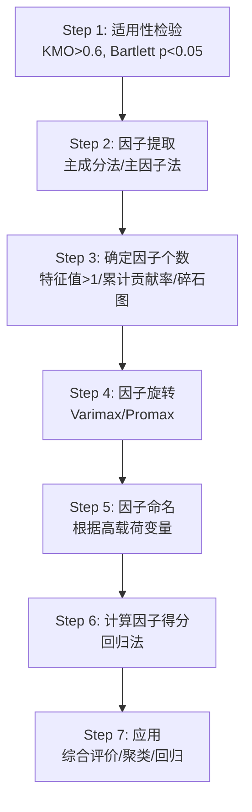

# 第7章 因子分析及Python应用

## 模块一：精准教学大纲

### 一、教学目标

通过本章学习，学生应具备以下核心能力：

1. **因子分析模型**：理解因子分析的基本模型 $X = AF + \varepsilon$，掌握公共因子、特殊因子、因子载荷的定义与统计意义。
2. **因子载荷与共同度**：掌握载荷矩阵的估计方法（主成分法），理解共同度和特殊方差的含义与计算。
3. **因子旋转**：理解因子旋转的目的（简化载荷结构），掌握最大方差旋转（Varimax）和斜交旋转（Promax）的区别。
4. **因子得分**：掌握回归法（Thomson法）计算因子得分，能够用因子得分进行综合评价。
5. **Python实操**：能够使用sklearn和scipy进行完整的因子分析。

### 二、建议学时

| 内容 | 学时 | 教学方式 |
|------|------|----------|
| 7.1 因子分析模型 | 1.5 | 讲授+推导 |
| 7.2 因子载荷及解释 | 1.5 | 讲授+推导 |
| 7.3 因子旋转 | 1 | 讲授+演示 |
| 7.4 因子得分 | 1 | 讲授+案例 |
| 7.5 因子分析步骤 | 1 | 讲授+案例 |
| 7.6 实际中进行因子分析 | 0.5 | 讨论 |
| **合计** | **6.5** | |

### 三、重点与难点

**重点**：
- 因子分析模型的数学表达与基本假定
- 因子载荷的统计意义（相关系数）
- 共同度与特殊方差的含义
- 因子旋转的意义与方法

**难点**：
- 因子分析与主成分分析的区别
- 因子载荷矩阵的估计方法
- 因子得分的回归法推导

### 四、前置知识

| 前置知识 | 是否已在本课程前序章节出现 | 处理方式 |
|----------|--------------------------|----------|
| 主成分分析 | 是（第6章） | 直接引用 |
| 相关系数矩阵 | 是（第2章） | 直接引用 |
| 特征值分解 | 是（第1章） | 直接引用 |

---

## 模块二：沉浸式理论讲解

### 7.1 因子分析模型

#### 7.1.1 因子分析的核心思想

**【业务场景引入】**

假设你是一名教育研究者，收集了100名学生的6门课程成绩：语文、英语、历史、数学、物理、化学。你怀疑这6门课程的成绩背后可能存在2个潜在的"能力因子"：
- **文科能力**：影响语文、英语、历史的成绩
- **理科能力**：影响数学、物理、化学的成绩

**因子分析**正是解决这类问题的工具：**假设观测变量由少数几个不可观测的公共因子和一个特殊因子线性组成，目的是发现数据背后的潜在结构**。

**因子分析与主成分分析的核心区别**：

| 维度 | 主成分分析（PCA） | 因子分析（FA） |
|------|------------------|----------------|
| **目标** | 数据降维（数学变换） | 探索潜在结构（统计模型） |
| **模型** | $Y = LX$（精确线性组合） | $X = AF + \varepsilon$（含误差项） |
| **可逆性** | 可逆 | 不可逆 |
| **因子旋转** | 通常不做 | 通常需要 |
| **共同度** | 所有变量的共同度为1 | 共同度<1 |
| **适用场景** | 数据压缩、消除共线性 | 探索变量背后的潜在维度 |

#### 7.1.2 因子分析模型的数学表达

**（1）模型定义**

$$
X_i = a_{i1}F_1 + a_{i2}F_2 + \cdots + a_{im}F_m + \varepsilon_i
$$

其中：
- $X_i$：第 $i$ 个观测变量（标准化后）
- $F_1, F_2, \ldots, F_m$：$m$ 个公共因子（潜变量，不可观测）
- $\varepsilon_i$：特殊因子（第 $i$ 个变量特有的部分）
- $a_{ij}$：因子载荷（第 $i$ 个变量在第 $j$ 个因子上的载荷）
- $m$：公共因子个数，通常 $m \ll p$

**矩阵形式**：

$$
X = AF + \varepsilon
$$

其中：
- $X = (X_1, X_2, \ldots, X_p)^T$：$p$ 维观测向量
- $A = (a_{ij})_{p \times m}$：因子载荷矩阵
- $F = (F_1, F_2, \ldots, F_m)^T$：公共因子向量
- $\varepsilon = (\varepsilon_1, \varepsilon_2, \ldots, \varepsilon_p)^T$：特殊因子向量

**（2）基本假定**

- $E(F) = 0$，$\text{Cov}(F) = I$（公共因子均值为0，方差为1，互不相关）
- $E(\varepsilon) = 0$，$\text{Cov}(\varepsilon) = D = \text{diag}(\sigma_1^2, \ldots, \sigma_p^2)$（特殊因子互不相关）
- $\text{Cov}(F, \varepsilon) = 0$（公共因子与特殊因子不相关）

#### 7.1.3 因子分析的几何解释

**【图形化说明】**

因子分析可以理解为：将 $p$ 维观测空间中的数据点，投影到一个 $m$ 维的"因子空间"中。每个观测变量可以分解为：
- **公共部分**：由公共因子解释（$AF$）
- **特有部分**：由特殊因子解释（$\varepsilon$）

```
观测变量 X = 公共因子贡献 AF + 特殊因子 ε

X₁ = a₁₁F₁ + a₁₂F₂ + ε₁
X₂ = a₂₁F₁ + a₂₂F₂ + ε₂
X₃ = a₃₁F₁ + a₃₂F₂ + ε₃
...
```

#### 7.1.4 因子分析的协方差结构

在因子分析模型下，观测变量的协方差矩阵具有如下结构：

$$
\Sigma = AA^T + D
$$

其中 $A$ 为因子载荷矩阵，$D = \text{diag}(\sigma_1^2, \ldots, \sigma_p^2)$ 为特殊方差对角矩阵。

对于相关矩阵（标准化数据）：

$$
R = AA^T + D
$$

即：

$$
R - D = AA^T
$$

这个等式是因子分析估计的基础。等式左边 $R - D$ 称为**约相关矩阵**（reduced correlation matrix），其对角线元素为共同度 $h_i^2$。

#### 7.1.5 因子分析模型的识别条件

因子分析模型存在旋转不唯一的问题。若 $A$ 是一组因子载荷，$T$ 是任意 $m \times m$ 正交矩阵，则 $A^* = AT$ 也是一组满足模型的因子载荷，因为：

$$
A^* (A^*)^T = ATT^T A^T = AA^T
$$

因此需要施加约束条件使模型可识别，常见的约束包括：
- 因子载荷矩阵 $A$ 的行向量满足 $a_i^T D^{-1} a_i$ 递减
- 或指定因子载荷矩阵的上三角为0

#### 7.1.6 因子分析模型的参数估计

设样本相关矩阵为 $R$，需要估计 $A$ 和 $D$，使得：

$$
R \approx AA^T + D
$$

这等价于最小化：

$$
\min_{A, D} \| R - AA^T - D \|^2
$$

不同的估计方法对 $D$ 的处理不同，从而产生不同的因子分析方法。

---

### 7.2 因子载荷及解释

#### 7.2.1 因子载荷的统计意义

在标准化条件下（$E(X_i) = 0$，$\text{Var}(X_i) = 1$），因子载荷具有重要的统计意义：

$$
a_{ij} = \text{Cov}(X_i, F_j) = \text{Corr}(X_i, F_j)
$$

**含义**：因子载荷 $a_{ij}$ 就是第 $i$ 个变量与第 $j$ 个公共因子的相关系数。$|a_{ij}|$ 越大，说明该变量与该因子的关联越强。

**推导过程**：

由于 $X_i = a_{i1}F_1 + a_{i2}F_2 + \cdots + a_{im}F_m + \varepsilon_i$，且 $F_j$ 与 $F_k$（$k \neq j$）不相关，$F_j$ 与 $\varepsilon_i$ 不相关，则：

$$
\text{Cov}(X_i, F_j) = \text{Cov}(a_{i1}F_1 + \cdots + a_{im}F_m + \varepsilon_i, F_j)
$$

$$
= a_{ij}\text{Var}(F_j) = a_{ij} \cdot 1 = a_{ij}
$$

又因为 $\text{Var}(X_i) = 1$，所以：

$$
\text{Corr}(X_i, F_j) = \frac{\text{Cov}(X_i, F_j)}{\sqrt{\text{Var}(X_i)\text{Var}(F_j)}} = \frac{a_{ij}}{1} = a_{ij}
$$

#### 7.2.2 共同度与特殊方差

**（1）共同度（Communality）**

$$
h_i^2 = a_{i1}^2 + a_{i2}^2 + \cdots + a_{im}^2
$$

共同度是因子载荷矩阵第 $i$ 行元素的平方和，反映变量 $X_i$ 被公共因子解释的方差比例。

- $h_i^2$ 接近1：该变量被公共因子很好地解释
- $h_i^2$ 接近0：该变量不能被公共因子解释，需要特殊因子

**推导**：

$$
\text{Var}(X_i) = \text{Var}(a_{i1}F_1 + a_{i2}F_2 + \cdots + a_{im}F_m + \varepsilon_i)
$$

$$
= a_{i1}^2\text{Var}(F_1) + a_{i2}^2\text{Var}(F_2) + \cdots + a_{im}^2\text{Var}(F_m) + \text{Var}(\varepsilon_i)
$$

$$
= (a_{i1}^2 + a_{i2}^2 + \cdots + a_{im}^2) + \sigma_i^2 = h_i^2 + \sigma_i^2 = 1
$$

因此 $h_i^2 + \sigma_i^2 = 1$，即共同度与特殊方差之和等于1。

**（2）特殊方差（Specific Variance）**

$$
\sigma_i^2 = 1 - h_i^2
$$

特殊方差是变量中不能被公共因子解释的部分。

**（3）第 $j$ 个因子的方差贡献**

$$
g_j^2 = \sum_{i=1}^{p} a_{ij}^2
$$

方差贡献率 $= g_j^2 / p$，反映该因子的重要程度。

**推导**：

第 $j$ 个因子 $F_j$ 对所有变量的总方差贡献为：

$$
g_j^2 = \sum_{i=1}^{p} \text{Var}(a_{ij}F_j) = \sum_{i=1}^{p} a_{ij}^2
$$

总方差（标准化后）为 $p$，因此方差贡献率为 $g_j^2 / p$。

**计算示例**：

假设有4个变量、2个公共因子，载荷矩阵为：

| 变量 | $F_1$ | $F_2$ | $h_i^2$ | $\sigma_i^2$ |
|------|-------|-------|---------|--------------|
| $X_1$ | 0.85 | 0.10 | 0.73 | 0.27 |
| $X_2$ | 0.78 | 0.15 | 0.63 | 0.37 |
| $X_3$ | 0.12 | 0.82 | 0.69 | 0.31 |
| $X_4$ | 0.20 | 0.75 | 0.60 | 0.40 |
| $g_j^2$ | 1.42 | 1.26 | | |
| 贡献率 | 35.5% | 31.5% | | |

**解读**：
- $X_1$ 和 $X_2$ 在 $F_1$ 上有高载荷，$X_3$ 和 $X_4$ 在 $F_2$ 上有高载荷
- $F_1$ 解释了35.5%的总方差，$F_2$ 解释了31.5%
- 两个因子共解释了67%的总方差

#### 7.2.3 因子载荷矩阵的估计——主成分法

主成分法是最常用的因子载荷矩阵估计方法，其基本思想是：对相关矩阵进行特征值分解，利用主成分来近似因子。

**Step 1**：计算相关矩阵 $R$

$$
R = \frac{1}{n-1}X^TX
$$

其中 $X$ 为标准化后的数据矩阵。

**Step 2**：求特征值 $\lambda$ 和特征向量 $l$

对 $R$ 进行特征值分解：

$$
R = L\Lambda L^T
$$

其中 $\Lambda = \text{diag}(\lambda_1, \lambda_2, \ldots, \lambda_p)$，$\lambda_1 \geq \lambda_2 \geq \cdots \geq \lambda_p \geq 0$。

**Step 3**：取前 $m$ 个特征值和特征向量

选择 $m$ 使得累计方差贡献率达到预定水平（通常70%-85%）：

$$
\frac{\sum_{j=1}^{m} \lambda_j}{\sum_{j=1}^{p} \lambda_j} \geq 0.70
$$

**Step 4**：计算载荷矩阵

$$
a_{ij} = l_{ji} \cdot \sqrt{\lambda_j}
$$

即：

$$
A = L_m \Lambda_m^{1/2}
$$

其中 $L_m$ 为前 $m$ 个特征向量组成的矩阵，$\Lambda_m$ 为前 $m$ 个特征值组成的对角矩阵。

**Step 5**：计算共同度和特殊方差

$$
h_i^2 = \sum_{j=1}^{m} a_{ij}^2 = \sum_{j=1}^{m} \lambda_j l_{ji}^2
$$

$$
\sigma_i^2 = 1 - h_i^2
$$

**主成分法的特点**：
- 计算简单，不需要迭代
- 当 $m = p$ 时，$AA^T = R$，即完全拟合
- 当 $m < p$ 时，$AA^T \approx R - D$，是近似拟合
- 主成分法得到的因子载荷矩阵满足 $A^TA = \Lambda_m$（对角矩阵）

#### 7.2.4 因子载荷矩阵的估计——主因子法

主因子法（Principal Axis Factoring）是对主成分法的改进，它需要已知或估计特殊方差 $D$。

**基本步骤**：

**Step 1**：给定特殊方差的初始估计 $D^{(0)}$

常见初始估计：
- $h_i^2 = 1 - 1/r^{ii}$，其中 $r^{ii}$ 是 $R^{-1}$ 的第 $i$ 个对角元素
- 或 $h_i^2$ 等于变量 $X_i$ 与其他所有变量的复相关系数的平方

**Step 2**：计算约相关矩阵

$$
R^* = R - D^{(0)}
$$

**Step 3**：对 $R^*$ 进行特征值分解

$$
R^* = L^* \Lambda^* (L^*)^T
$$

**Step 4**：取前 $m$ 个正特征值和对应特征向量

$$
A = L_m^* (\Lambda_m^*)^{1/2}
$$

**Step 5**：更新特殊方差估计

$$
\sigma_i^2 = 1 - h_i^2 = 1 - \sum_{j=1}^{m} a_{ij}^2
$$

**Step 6**：重复 Step 2-5 直到收敛

主因子法的因子载荷矩阵满足 $A^TA \neq \Lambda_m$（一般不是对角矩阵），但通常能更好地逼近相关矩阵。

#### 7.2.5 因子载荷矩阵的估计——最大似然法

最大似然法假设公共因子和特殊因子都服从正态分布，通过最大化似然函数来估计参数。

**似然函数**：

在正态假设下，样本的对数似然函数为：

$$
\ln L(A, D) = -\frac{n}{2}\left[ \ln|\Sigma| + \text{tr}(S\Sigma^{-1}) \right]
$$

其中 $S$ 为样本协方差矩阵，$\Sigma = AA^T + D$。

**估计方法**：

通过迭代算法（如牛顿-拉夫森法或期望最大化算法）最大化对数似然函数。

**最大似然法的优点**：
- 具有良好的统计性质（一致性、渐近正态性、渐近有效性）
- 可以进行因子个数的似然比检验

**最大似然法的缺点**：
- 需要正态性假设
- 计算复杂度较高
- 可能出现Heywood现象（特殊方差为负值或0）

#### 7.2.6 因子个数的确定

确定公共因子个数 $m$ 是因子分析的关键步骤，常用方法包括：

**（1）特征值大于1准则（Kaiser准则）**

保留特征值大于1的因子。因为标准化后每个变量的方差为1，特征值大于1意味着该因子解释了至少一个变量的全部方差。

$$
m = \#\{j : \lambda_j > 1\}
$$

**（2）累计方差贡献率准则**

保留因子直到累计方差贡献率达到预定水平：

$$
\frac{\sum_{j=1}^{m} \lambda_j}{\sum_{j=1}^{p} \lambda_j} \geq \text{阈值}
$$

常见阈值：70%、75%、80%、85%。

**（3）碎石图（Scree Plot）**

绘制特征值按大小排列的折线图，选择"拐点"之前的因子个数。

```
特征值
  |
  |  *
  |    *
  |      *
  |        *
  |          *---*---*---*---*
  |___________________________ 因子序号
```

拐点之前的因子为主要因子，拐点之后的因子贡献较小。

**（4）平行分析（Parallel Analysis）**

生成与原始数据同维度的随机数据，计算随机数据的特征值。保留原始数据特征值大于随机数据特征值的因子。

**（5）似然比检验（仅适用于最大似然法）**

检验 $H_0: m = m_0$ vs $H_1: m > m_0$，统计量为：

$$
\chi^2 = -\left(n - 1 - \frac{2p + 5}{6}\right) \ln \frac{|\hat{\Sigma}|}{|S|}
$$

其中 $\hat{\Sigma} = \hat{A}\hat{A}^T + \hat{D}$。

#### 7.2.7 因子载荷的解读准则

因子载荷的绝对值大小反映了变量与因子的关联强度，常用的解读准则为：

| $|a_{ij}|$ 范围 | 解读 |
|----------------|------|
| $\geq 0.7$ | 强关联 |
| $0.4 \sim 0.7$ | 中等关联 |
| $0.3 \sim 0.4$ | 弱关联 |
| $< 0.3$ | 可忽略 |

实际应用中，通常只关注 $|a_{ij}| \geq 0.4$ 或 $|a_{ij}| \geq 0.5$ 的载荷，用于因子命名和解释。

---

### 7.3 因子旋转

#### 7.3.1 因子旋转的目的

初始因子载荷矩阵往往各元素大小相近，难以解释。因子旋转的目的是：**使载荷向0和±1两极分化，便于因子的实际解释**。

**旋转前**：

| 变量 | $F_1$ | $F_2$ |
|------|-------|-------|
| 语文 | 0.55 | 0.45 |
| 英语 | 0.50 | 0.40 |
| 数学 | 0.48 | 0.52 |
| 物理 | 0.42 | 0.55 |

**旋转后（Varimax）**：

| 变量 | $F_1^*$ | $F_2^*$ |
|------|---------|---------|
| 语文 | **0.85** | 0.10 |
| 英语 | **0.80** | 0.12 |
| 数学 | 0.10 | **0.82** |
| 物理 | 0.08 | **0.85** |

旋转后每个变量在少数因子上有高载荷，在其他因子上低载荷，更容易解释。

**为什么旋转是可行的？**

从几何角度看，因子载荷矩阵的每一行可以看作 $m$ 维因子空间中的一个向量。旋转就是在因子空间中对坐标轴进行旋转，不改变向量的相对位置，只改变坐标轴的方向。

设 $T$ 为 $m \times m$ 正交旋转矩阵（$TT^T = I$），则旋转后的载荷矩阵为：

$$
A^* = AT
$$

旋转后共同度不变：

$$
h_i^{*2} = \sum_{j=1}^{m} a_{ij}^{*2} = \sum_{j=1}^{m} \left(\sum_{k=1}^{m} a_{ik} t_{kj}\right)^2 = \sum_{k=1}^{m} a_{ik}^2 = h_i^2
$$

#### 7.3.2 最大方差旋转（Varimax）

Varimax旋转使因子载荷矩阵各列的方差之和最大化：

$$
V = \sum_{j=1}^{m} \left[ p \sum_{i=1}^{p} (a_{ij}^*)^4 - \left(\sum_{i=1}^{p} (a_{ij}^*)^2\right)^2 \right]
$$

旋转后因子仍保持正交（互不相关）。

**Varimax旋转的直观理解**：

Varimax准则试图使每个因子上的载荷向两极分化（接近0或接近±1），这样每个因子只与少数变量强相关，便于解释。

**Varimax旋转的算法**：

Varimax旋转通过一系列Givens旋转（二维旋转）实现。对于因子 $j$ 和因子 $k$，旋转角度 $\theta$ 满足：

$$
\tan(4\theta) = \frac{D - 2AB/p}{C - (A^2 - B^2)/p}
$$

其中：
- $A = \sum_i u_i v_i$
- $B = \sum_i (u_i^2 - v_i^2) / 2$
- $C = \sum_i (u_i^2 + v_i^2)^2$
- $D = 2 \sum_i u_i v_i (u_i^2 + v_i^2)$
- $u_i = a_{ij}^2 - a_{ik}^2$，$v_i = 2 a_{ij} a_{ik}$

**Varimax旋转的特点**：
- 保持因子正交性
- 最大化载荷方差
- 计算简单、效果稳定
- 是最常用的旋转方法

#### 7.3.3 四次方最大旋转（Quartimax）

Quartimax旋转使因子载荷矩阵各行的方差之和最大化：

$$
Q = \sum_{i=1}^{p} \left[ m \sum_{j=1}^{m} (a_{ij}^*)^4 - \left(\sum_{j=1}^{m} (a_{ij}^*)^2\right)^2 \right]
$$

Quartimax旋转试图使每个变量在尽可能少的因子上有高载荷，但它倾向于产生一个"通用因子"，不如Varimax常用。

#### 7.3.4 等量最大旋转（Equimax）

Equimax旋转是Varimax和Quartimax的折中：

$$
E = \frac{V}{p} + \frac{Q}{m}
$$

#### 7.3.5 斜交旋转（Promax）

Promax旋转先做Varimax旋转，再允许因子相关进行斜交旋转。结果中因子相关矩阵非对角线元素不为0，更符合实际但解释更复杂。

**Promax旋转的步骤**：

**Step 1**：对初始载荷矩阵 $A$ 进行Varimax旋转，得到 $A^V$

**Step 2**：构造目标矩阵 $P$

$$
P_{ij} = |A_{ij}^V|^k \cdot \text{sign}(A_{ij}^V)
$$

其中 $k$ 通常取2或4。这样使高载荷更高，低载荷更低。

**Step 3**：找到斜交变换矩阵 $T$，使 $A^* = A^V T$ 尽可能接近 $P$

通过最小二乘法求解 $T$。

**Step 4**：计算因子相关矩阵

$$
\Phi = (T^T T)^{-1}
$$

**正交旋转 vs 斜交旋转的选择**：
- 当因子应相互独立时（如物理量）→ 正交旋转
- 当有理由相信因子相关时（如智力因子）→ 斜交旋转
- 当不确定时 → 先用正交旋转，再尝试斜交旋转，比较结果

#### 7.3.6 旋转方法的比较

| 旋转方法 | 因子相关性 | 目标 | 适用场景 |
|----------|-----------|------|----------|
| Varimax | 正交（不相关） | 最大化列方差 | 最常用，因子独立时 |
| Quartimax | 正交 | 最大化行方差 | 希望少数因子解释 |
| Equimax | 正交 | Varimax+Quartimax折中 | 介于两者之间 |
| Promax | 斜交（可能相关） | 近似Varimax后斜交化 | 因子可能相关时 |
| Oblimin | 斜交 | 最小化载荷交叉积 | 因子可能相关时 |

#### 7.3.7 旋转后的因子载荷解读

旋转后需要根据载荷矩阵对因子进行命名和解释。命名的依据是：在该因子上有高载荷的变量的共同特征。

**命名步骤**：

1. 找出每个因子上载荷绝对值最大的变量
2. 这些变量的共同主题即为因子的含义
3. 通常要求命名变量的载荷 $|a_{ij}| \geq 0.4$
4. 如果一个变量在多个因子上都有高载荷，需要考虑是否删除该变量或增加因子

**命名示例**：

| 变量 | 因子1 | 因子2 | 因子3 |
|------|-------|-------|-------|
| 语文成绩 | **0.82** | 0.10 | 0.05 |
| 英语成绩 | **0.78** | 0.08 | 0.12 |
| 阅读量 | **0.75** | 0.15 | 0.08 |
| 数学成绩 | 0.05 | **0.85** | 0.10 |
| 物理成绩 | 0.10 | **0.80** | 0.08 |
| 逻辑推理 | 0.08 | **0.76** | 0.15 |
| 体育成绩 | 0.05 | 0.10 | **0.88** |
| 体能测试 | 0.08 | 0.05 | **0.82** |

因子1可命名为"语言能力"，因子2可命名为"数理能力"，因子3可命名为"体能"。

---

### 7.4 因子得分

#### 7.4.1 因子得分的概念

公共因子 $F$ 是潜变量，不能直接观测。因子得分是对每个样品在各公共因子上取值的估计。

**因子得分的作用**：
- 对样品在各因子上的表现进行评价
- 用因子得分代替原始变量进行后续分析（如聚类、回归）
- 计算综合评价得分

**因子得分与主成分得分的区别**：
- 主成分得分是精确的线性组合：$Y = LX$
- 因子得分是估计值，因为因子是潜变量

#### 7.4.2 回归法计算因子得分（Thomson法）

将因子表示为观测变量的线性组合：

$$
F_j = b_j^T X
$$

通过最小二乘得：

$$
b_j = A^T R^{-1}
$$

其中 $A$ 为因子载荷矩阵，$R$ 为相关矩阵。

**推导过程**：

设 $F = BX$，其中 $B = (b_1, b_2, \ldots, b_m)^T$ 为 $m \times p$ 的系数矩阵。

我们希望 $F$ 尽可能接近真实的公共因子，即最小化：

$$
E[(F - \hat{F})^T(F - \hat{F})]
$$

利用条件期望的性质，最优解为：

$$
\hat{F} = A^T R^{-1} X
$$

即 $B = A^T R^{-1}$。

**回归法因子得分的性质**：
- 因子得分的均值为0
- 因子得分的方差不一定为1
- 因子得分之间可能存在相关（即使因子本身不相关）

#### 7.4.3 Bartlett法计算因子得分

Bartlett法也是一种常用的因子得分估计方法，它通过最小化特殊因子的加权平方和来估计因子得分。

**目标函数**：

$$
\min_F (X - AF)^T D^{-1} (X - AF)
$$

**解**：

$$
\hat{F} = (A^T D^{-1} A)^{-1} A^T D^{-1} X
$$

**Bartlett法与回归法的比较**：

| 性质 | 回归法（Thomson） | Bartlett法 |
|------|------------------|------------|
| 估计 | 有偏估计 | 无偏估计 |
| 方差 | 低估因子方差 | 因子方差正确 |
| 均方误差 | 较小 | 较大 |
| 计算 | 较简单 | 较复杂 |

实际应用中，两种方法的结果通常非常接近，回归法更为常用。

#### 7.4.4 因子得分的综合评价

**综合评价排序**：以方差贡献率为权重计算综合得分

$$
F = w_1 F_1 + w_2 F_2 + \cdots + w_m F_m
$$

其中 $w_j = g_j^2 / \sum g_k^2$。

**权重的其他选择**：

1. **等权重法**：$w_j = 1/m$
2. **特征值权重法**：$w_j = \lambda_j / \sum \lambda_k$
3. **专家赋权法**：根据专业知识确定权重

**综合评价的步骤**：

1. 计算各因子的得分 $F_1, F_2, \ldots, F_m$
2. 确定权重 $w_1, w_2, \ldots, w_m$
3. 计算综合得分 $F = \sum w_j F_j$
4. 根据综合得分排序

#### 7.4.5 因子得分的可视化

因子得分可以用于多种可视化：

**（1）因子得分散点图**

以两个因子得分为坐标，绘制样品的散点图，观察样品在因子空间中的分布。

**（2）因子得分的箱线图**

比较不同组别在各因子上的得分分布。

**（3）因子得分的热力图**

以样品为行、因子为列，绘制因子得分的热力图，观察样品的因子模式。

---

### 7.5 因子分析步骤



#### 7.5.1 Step 1: 适用性检验

**（1）KMO检验（Kaiser-Meyer-Olkin检验）**

KMO统计量衡量变量之间的偏相关程度，取值范围为0到1。

$$
\text{KMO} = \frac{\sum_{i \neq j} r_{ij}^2}{\sum_{i \neq j} r_{ij}^2 + \sum_{i \neq j} p_{ij}^2}
$$

其中 $r_{ij}$ 为相关系数，$p_{ij}$ 为偏相关系数。

**KMO值的解读**：

| KMO值 | 解读 |
|-------|------|
| $\geq 0.9$ | 极好（Marvelous） |
| $0.8 \sim 0.9$ | 良好（Meritorious） |
| $0.7 \sim 0.8$ | 中等（Middling） |
| $0.6 \sim 0.7$ | 一般（Mediocre） |
| $0.5 \sim 0.6$ | 差（Miserable） |
| $< 0.5$ | 不可接受（Unacceptable） |

通常要求 KMO > 0.6 才适合进行因子分析。

**（2）Bartlett球形检验**

Bartlett检验的原假设是相关矩阵为单位矩阵（即变量之间不相关）。

$$
\chi^2 = -\left(n - 1 - \frac{2p + 5}{6}\right) \ln |R|
$$

当 $p < 0.05$ 时，拒绝原假设，说明变量之间存在相关性，适合进行因子分析。

#### 7.5.2 Step 2: 因子提取

选择因子提取方法（主成分法、主因子法或最大似然法），计算初始因子载荷矩阵。

#### 7.5.3 Step 3: 确定因子个数

综合使用特征值大于1准则、累计方差贡献率准则、碎石图和平行分析等方法确定因子个数。

#### 7.5.4 Step 4: 因子旋转

根据研究目的选择旋转方法（通常先用Varimax，如果因子可能相关再用Promax）。

#### 7.5.5 Step 5: 因子命名

根据旋转后的载荷矩阵，找出每个因子上的高载荷变量，根据这些变量的共同特征命名因子。

#### 7.5.6 Step 6: 计算因子得分

使用回归法（Thomson法）计算每个样品在各因子上的得分。

#### 7.5.7 Step 7: 应用

根据研究目的，将因子得分用于综合评价、聚类分析、回归分析等。

---

### 7.6 实际中进行因子分析

#### 7.6.1 样本量要求

**样本量要求**：
- 经验准则：样本量至少是变量数的5-10倍
- 最少不少于100个样本
- 样本量过小会导致因子载荷估计不稳定

**更精确的准则**：

| 准则 | 公式 |
|------|------|
| 经验准则1 | $n \geq 5p$ |
| 经验准则2 | $n \geq 10p$ |
| 经验准则3 | $n \geq 100$ |
| 综合准则 | $n \geq \max(5p, 100)$ |

其中 $p$ 为变量个数。

#### 7.6.2 变量选择

**变量选择的原则**：
- 变量之间应存在相关性（否则不适合因子分析）
- 变量应与研究问题相关
- 避免包含与其他变量无关的"孤立"变量
- 避免包含高度相关的冗余变量

**共同度的解读**：
- 共同度 > 0.7：模型拟合较好
- 共同度 < 0.4：该变量可能不适合纳入因子分析

#### 7.6.3 因子分析的假设检验

**（1）正态性检验**

因子分析（特别是最大似然法）假设数据服从多元正态分布。可以使用以下检验：
- Shapiro-Wilk检验（小样本）
- Kolmogorov-Smirnov检验（大样本）
- Mardia检验（多元正态性）

**（2）线性关系检验**

因子分析假设变量之间存在线性关系。可以通过散点图矩阵检查。

**（3）多重共线性检验**

适度的多重共线性有利于因子分析，但过强的共线性会导致数值不稳定。可以检查VIF（方差膨胀因子）。

#### 7.6.4 因子分析结果的评价

**（1）拟合优度**

- 残差矩阵：$\hat{R} - R = AA^T + D - R$
- 均方残差：$\text{RMSR} = \sqrt{\frac{2\sum_{i<j}(r_{ij} - \hat{r}_{ij})^2}{p(p-1)}}$
- RMSR < 0.05 表示拟合较好

**（2）因子的可解释性**

- 因子是否有实际意义？
- 因子命名是否合理？
- 因子得分是否符合预期？

**（3）因子的稳定性**

- 删除部分样本后因子结构是否稳定？
- 增加或减少一个因子后，其他因子是否稳定？

#### 7.6.5 因子分析的局限性

1. **主观性**：因子个数的确定、因子的命名都带有一定的主观性
2. **旋转不唯一**：不同的旋转方法可能得到不同的结果
3. **模型假设**：线性关系、正态性等假设可能不满足
4. **样本依赖性**：不同样本可能得到不同的因子结构
5. **因果推断**：因子分析只能发现相关关系，不能证明因果关系

#### 7.6.6 因子分析与其他方法的关系

**（1）因子分析与主成分分析**

两者都是降维方法，但目标不同：
- PCA：数据压缩，保留最大方差
- FA：探索潜在结构，发现公共因子

**（2）因子分析与聚类分析**

- 因子分析：将变量分组（发现变量背后的因子）
- 聚类分析：将样品分组（发现样品的类别）

**（3）因子分析与结构方程模型**

- 因子分析是结构方程模型的测量模型部分
- 结构方程模型可以同时估计因子结构和因子之间的关系

**（4）因子分析与项目反应理论**

- 因子分析：连续变量的潜在结构
- 项目反应理论：分类变量（如考试题目）的潜在结构

#### 7.6.7 因子分析的实际应用案例

**案例1：心理学量表开发**

在心理学研究中，因子分析常用于：
- 验证量表的因子结构
- 发现新的心理构念
- 精简量表（删除不合适的题目）

**案例2：市场研究**

在市场研究中，因子分析常用于：
- 消费者态度的维度分析
- 品牌形象的因子结构
- 产品属性的重要性排序

**案例3：教育评估**

在教育研究中，因子分析常用于：
- 考试成绩的因子结构
- 学习动机的维度分析
- 教学质量的综合评价

**案例4：医学研究**

在医学研究中，因子分析常用于：
- 症状群的识别
- 生活质量的维度分析
- 疾病亚型的分类

---

## 模块三：实战与代码复现

### 实战案例7-1：学生综合素质的因子分析

```python
import numpy as np
import pandas as pd
import matplotlib.pyplot as plt
import seaborn as sns
from sklearn.decomposition import FactorAnalysis
from sklearn.preprocessing import StandardScaler
from scipy import stats

plt.rcParams['font.sans-serif'] = ['SimHei']
plt.rcParams['axes.unicode_minus'] = False
sns.set_theme(style="whitegrid")

# ============================================================
# 数据准备：100名学生6门课程成绩
# ============================================================
np.random.seed(42)
n = 100

# 潜在因子：文科能力、理科能力
F_literature = np.random.randn(n)
F_science = np.random.randn(n)

# 各科目由因子线性组合加噪声生成
data = pd.DataFrame({
    '语文': 0.8*F_literature + 0.1*F_science + np.random.randn(n)*0.3,
    '英语': 0.7*F_literature + 0.2*F_science + np.random.randn(n)*0.3,
    '历史': 0.75*F_literature + 0.05*F_science + np.random.randn(n)*0.3,
    '数学': 0.1*F_literature + 0.85*F_science + np.random.randn(n)*0.3,
    '物理': 0.15*F_literature + 0.8*F_science + np.random.randn(n)*0.3,
    '化学': 0.1*F_literature + 0.75*F_science + np.random.randn(n)*0.3
})

# 标准化
scaler = StandardScaler()
X_std = scaler.fit_transform(data)

# ============================================================
# Step 1: 相关系数矩阵
# ============================================================
corr = data.corr()
print("=== 相关系数矩阵 ===")
print(corr.round(3))

fig, ax = plt.subplots(figsize=(8, 6))
sns.heatmap(corr, annot=True, fmt='.3f', cmap='RdBu_r', center=0,
            square=True, ax=ax, linewidths=0.5)
ax.set_title('课程成绩相关系数矩阵', fontsize=14)
plt.tight_layout()
plt.show()

# ============================================================
# Step 2: 因子分析（提取2个因子）
# ============================================================
fa = FactorAnalysis(n_components=2, rotation=None)
fa_scores = fa.fit_transform(X_std)

# 载荷矩阵
loadings = pd.DataFrame(fa.components_.T, columns=['因子1', '因子2'], index=data.columns)
print("\n=== 旋转前因子载荷矩阵 ===")
print(loadings.round(3))

# 共同度
communalities = (loadings**2).sum(axis=1)
print("\n=== 共同度 ===")
print(communalities.round(3))

# ============================================================
# Step 3: 因子旋转（Varimax）
# ============================================================
from scipy.linalg import svd

def varimax_rotation(loadings, max_iter=100, tol=1e-6):
    """最大方差旋转"""
    p, m = loadings.shape
    R = np.eye(m)
    
    for _ in range(max_iter):
        R_old = R.copy()
        for i in range(m):
            for j in range(i+1, m):
                # Givens旋转
                u = loadings[:, i]**2 - loadings[:, j]**2
                v = 2 * loadings[:, i] * loadings[:, j]
                A = u.sum()
                B = v.sum()
                C = (u**2 - v**2).sum()
                D = 2 * (u * v).sum()
                
                theta = 0.25 * np.arctan2(D - 2*A*B/C, (C - (A**2 - B**2)/C)) if C != 0 else np.pi/4
                
                cos_t, sin_t = np.cos(theta), np.sin(theta)
                rot = np.array([[cos_t, -sin_t], [sin_t, cos_t]])
                
                loadings[:, [i, j]] = loadings[:, [i, j]] @ rot
                R[:, [i, j]] = R[:, [i, j]] @ rot
        
        if np.max(np.abs(R - R_old)) < tol:
            break
    
    return loadings, R

loadings_rotated, R = varimax_rotation(loadings.values.copy())
loadings_rotated_df = pd.DataFrame(loadings_rotated, columns=['因子1*', '因子2*'], index=data.columns)

print("\n=== Varimax旋转后因子载荷矩阵 ===")
print(loadings_rotated_df.round(3))

# ============================================================
# Step 4: 可视化
# ============================================================
fig, axes = plt.subplots(1, 3, figsize=(18, 5))

# 旋转前载荷散点图
axes[0].scatter(loadings['因子1'], loadings['因子2'], s=80, c='steelblue', edgecolors='black')
for i, name in enumerate(loadings.index):
    axes[0].annotate(name, (loadings.iloc[i, 0], loadings.iloc[i, 1]),
                     fontsize=11, ha='center', va='bottom')
axes[0].axhline(y=0, color='gray', linestyle='--', alpha=0.5)
axes[0].axvline(x=0, color='gray', linestyle='--', alpha=0.5)
axes[0].set_xlabel('因子1')
axes[0].set_ylabel('因子2')
axes[0].set_title('旋转前载荷散点图')

# 旋转后载荷散点图
axes[1].scatter(loadings_rotated_df['因子1*'], loadings_rotated_df['因子2*'],
                s=80, c='coral', edgecolors='black')
for i, name in enumerate(loadings_rotated_df.index):
    axes[1].annotate(name, (loadings_rotated_df.iloc[i, 0], loadings_rotated_df.iloc[i, 1]),
                     fontsize=11, ha='center', va='bottom')
axes[1].axhline(y=0, color='gray', linestyle='--', alpha=0.5)
axes[1].axvline(x=0, color='gray', linestyle='--', alpha=0.5)
axes[1].set_xlabel('因子1*')
axes[1].set_ylabel('因子2*')
axes[1].set_title('旋转后载荷散点图')

# 共同度条形图
communalities.plot(kind='bar', ax=axes[2], color='seagreen')
axes[2].set_title('各变量共同度')
axes[2].set_ylabel('共同度')
axes[2].axhline(y=0.7, color='red', linestyle='--', alpha=0.5, label='0.7阈值')
axes[2].legend()
axes[2].tick_params(axis='x', rotation=45)

plt.tight_layout()
plt.show()

# ============================================================
# Step 5: 因子得分与综合评价
# ============================================================
fa_rotated = FactorAnalysis(n_components=2, rotation='varimax')
scores = fa_rotated.fit_transform(X_std)

# 计算综合得分（以方差贡献率为权重）
var_ratio = fa_rotated.explained_variance_ratio_ if hasattr(fa_rotated, 'explained_variance_ratio_') else np.array([0.5, 0.5])
weights = var_ratio / var_ratio.sum()
composite_score = scores @ weights

result = pd.DataFrame({
    '因子1得分': scores[:, 0],
    '因子2得分': scores[:, 1],
    '综合得分': composite_score,
    '排名': pd.Series(composite_score).rank(ascending=False).astype(int).values
})

print("\n=== 因子得分与排名（前10名）===")
print(result.sort_values('排名').head(10).round(3))
```

*(此处平台应展示因子分析的完整结果：相关系数矩阵、载荷矩阵、载荷散点图、共同度、因子得分)*

**结果解读**：

1. **载荷矩阵**：旋转后，语文、英语、历史在因子1上有高载荷，数学、物理、化学在因子2上有高载荷。因子1可命名为"文科能力"，因子2可命名为"理科能力"。

2. **共同度**：各变量的共同度都在0.6以上，说明两个因子能较好地解释各科成绩。

3. **因子得分**：可以根据因子得分对学生进行排名，也可以用因子得分做后续的聚类分析。

---

### 实战案例7-2：因子分析与PCA的对比

```python
import numpy as np
import pandas as pd
from sklearn.decomposition import PCA, FactorAnalysis
from sklearn.preprocessing import StandardScaler

# 使用相同的数据
np.random.seed(42)
n = 100
F1 = np.random.randn(n)
F2 = np.random.randn(n)
data = pd.DataFrame({
    'X1': 0.8*F1 + 0.1*F2 + np.random.randn(n)*0.3,
    'X2': 0.7*F1 + 0.2*F2 + np.random.randn(n)*0.3,
    'X3': 0.1*F1 + 0.8*F2 + np.random.randn(n)*0.3,
    'X4': 0.2*F1 + 0.7*F2 + np.random.randn(n)*0.3
})

X_std = StandardScaler().fit_transform(data)

# PCA
pca = PCA(n_components=2)
pca.fit(X_std)

# FA
fa = FactorAnalysis(n_components=2)
fa.fit(X_std)

print("=== PCA vs 因子分析对比 ===")
print(f"\nPCA载荷矩阵:")
print(pd.DataFrame(pca.components_.T, columns=['PC1', 'PC2'], index=data.columns).round(3))

print(f"\nFA载荷矩阵:")
print(pd.DataFrame(fa.components_.T, columns=['F1', 'F2'], index=data.columns).round(3))

print(f"\nPCA各主成分方差贡献率: {pca.explained_variance_ratio_.round(3)}")
print(f"FA共同度: {(fa.components_.T**2).sum(axis=1).round(3)}")
```

*(此处平台应展示PCA与因子分析的对比结果)*

**结果解读**：

1. **PCA载荷矩阵**：主成分是原始变量的线性组合，载荷矩阵反映了各变量对主成分的贡献。

2. **FA载荷矩阵**：因子载荷是变量与因子的相关系数，反映了变量与潜在因子的关联。

3. **共同度**：FA的共同度通常小于1，反映了公共因子不能完全解释变量方差；而PCA的"共同度"恒为1。

---

### 实战案例7-3：KMO检验和Bartlett检验

```python
import numpy as np
import pandas as pd
from scipy import stats
from sklearn.preprocessing import StandardScaler

def kmo_test(data):
    """
    KMO检验
    """
    corr = data.corr().values
    n_vars = corr.shape[0]
    
    # 计算偏相关矩阵
    inv_corr = np.linalg.inv(corr)
    partial_corr = np.zeros_like(inv_corr)
    for i in range(n_vars):
        for j in range(n_vars):
            if i != j:
                partial_corr[i, j] = -inv_corr[i, j] / np.sqrt(inv_corr[i, i] * inv_corr[j, j])
    
    # 计算KMO
    r_sq = 0
    p_sq = 0
    for i in range(n_vars):
        for j in range(i+1, n_vars):
            r_sq += corr[i, j]**2
            p_sq += partial_corr[i, j]**2
    
    kmo = r_sq / (r_sq + p_sq)
    return kmo

def bartlett_test(data, n):
    """
    Bartlett球形检验
    """
    corr = data.corr().values
    p = corr.shape[0]
    
    # 计算检验统计量
    det_corr = np.linalg.det(corr)
    chi2 = -(n - 1 - (2*p + 5)/6) * np.log(det_corr)
    df = p * (p - 1) / 2
    p_value = 1 - stats.chi2.cdf(chi2, df)
    
    return chi2, df, p_value

# 使用案例7-1的数据
np.random.seed(42)
n = 100
F_literature = np.random.randn(n)
F_science = np.random.randn(n)
data = pd.DataFrame({
    '语文': 0.8*F_literature + 0.1*F_science + np.random.randn(n)*0.3,
    '英语': 0.7*F_literature + 0.2*F_science + np.random.randn(n)*0.3,
    '历史': 0.75*F_literature + 0.05*F_science + np.random.randn(n)*0.3,
    '数学': 0.1*F_literature + 0.85*F_science + np.random.randn(n)*0.3,
    '物理': 0.15*F_literature + 0.8*F_science + np.random.randn(n)*0.3,
    '化学': 0.1*F_literature + 0.75*F_science + np.random.randn(n)*0.3
})

# KMO检验
kmo_value = kmo_test(data)
print(f"KMO统计量: {kmo_value:.3f}")
if kmo_value >= 0.9:
    print("KMO解读: 极好（Marvelous）")
elif kmo_value >= 0.8:
    print("KMO解读: 良好（Meritorious）")
elif kmo_value >= 0.7:
    print("KMO解读: 中等（Middling）")
elif kmo_value >= 0.6:
    print("KMO解读: 一般（Mediocre）")
else:
    print("KMO解读: 差（Miserable），不适合因子分析")

# Bartlett检验
chi2, df, p_value = bartlett_test(data, n)
print(f"\nBartlett球形检验:")
print(f"  卡方统计量: {chi2:.3f}")
print(f"  自由度: {df:.0f}")
print(f"  p值: {p_value:.6f}")
if p_value < 0.05:
    print("  结论: 拒绝原假设，变量之间存在相关性，适合因子分析")
else:
    print("  结论: 不能拒绝原假设，变量之间相关性弱，不适合因子分析")
```

*(此处平台应展示KMO检验和Bartlett检验的结果)*

---

### 实战案例7-4：碎石图与因子个数确定

```python
import numpy as np
import pandas as pd
import matplotlib.pyplot as plt
from sklearn.decomposition import PCA
from sklearn.preprocessing import StandardScaler

# 使用案例7-1的数据
np.random.seed(42)
n = 100
F_literature = np.random.randn(n)
F_science = np.random.randn(n)
data = pd.DataFrame({
    '语文': 0.8*F_literature + 0.1*F_science + np.random.randn(n)*0.3,
    '英语': 0.7*F_literature + 0.2*F_science + np.random.randn(n)*0.3,
    '历史': 0.75*F_literature + 0.05*F_science + np.random.randn(n)*0.3,
    '数学': 0.1*F_literature + 0.85*F_science + np.random.randn(n)*0.3,
    '物理': 0.15*F_literature + 0.8*F_science + np.random.randn(n)*0.3,
    '化学': 0.1*F_literature + 0.75*F_science + np.random.randn(n)*0.3
})

X_std = StandardScaler().fit_transform(data)

# PCA计算特征值
pca = PCA()
pca.fit(X_std)

eigenvalues = pca.explained_variance_
variance_ratio = pca.explained_variance_ratio_
cumulative_ratio = np.cumsum(variance_ratio)

# 特征值表格
eigenvalue_table = pd.DataFrame({
    '特征值': eigenvalues,
    '方差贡献率': variance_ratio,
    '累计贡献率': cumulative_ratio
})
print("=== 特征值与方差贡献率 ===")
print(eigenvalue_table.round(3))

# 碎石图
fig, axes = plt.subplots(1, 2, figsize=(14, 5))

# 碎石图
axes[0].plot(range(1, len(eigenvalues)+1), eigenvalues, 'bo-', linewidth=2, markersize=8)
axes[0].axhline(y=1, color='r', linestyle='--', alpha=0.7, label='特征值=1')
axes[0].set_xlabel('因子序号', fontsize=12)
axes[0].set_ylabel('特征值', fontsize=12)
axes[0].set_title('碎石图（Scree Plot）', fontsize=14)
axes[0].legend()
axes[0].grid(True, alpha=0.3)

# 累计贡献率图
axes[1].plot(range(1, len(eigenvalues)+1), cumulative_ratio, 'rs-', linewidth=2, markersize=8)
axes[1].axhline(y=0.7, color='g', linestyle='--', alpha=0.7, label='70%阈值')
axes[1].axhline(y=0.8, color='orange', linestyle='--', alpha=0.7, label='80%阈值')
axes[1].set_xlabel('因子序号', fontsize=12)
axes[1].set_ylabel('累计方差贡献率', fontsize=12)
axes[1].set_title('累计方差贡献率', fontsize=14)
axes[1].legend()
axes[1].grid(True, alpha=0.3)

plt.tight_layout()
plt.show()

# 确定因子个数
n_factors_kaiser = np.sum(eigenvalues > 1)
n_factors_70 = np.argmax(cumulative_ratio >= 0.7) + 1
n_factors_80 = np.argmax(cumulative_ratio >= 0.8) + 1

print(f"\n=== 因子个数确定 ===")
print(f"Kaiser准则（特征值>1）: {n_factors_kaiser}个因子")
print(f"累计贡献率>=70%: {n_factors_70}个因子")
print(f"累计贡献率>=80%: {n_factors_80}个因子")
print(f"\n建议: 选择2个因子（结合碎石图和累计贡献率）")
```

*(此处平台应展示碎石图和累计贡献率图)*

---

### 实战案例7-5：Promax斜交旋转

```python
import numpy as np
import pandas as pd
from sklearn.decomposition import FactorAnalysis
from sklearn.preprocessing import StandardScaler

def promax_rotation(loadings, k=4, max_iter=100, tol=1e-6):
    """
    Promax斜交旋转
    """
    # Step 1: 先做Varimax旋转
    from scipy.stats import zscore
    
    p, m = loadings.shape
    
    # Varimax旋转
    def varimax(loadings, max_iter=100, tol=1e-6):
        p, m = loadings.shape
        R = np.eye(m)
        
        for _ in range(max_iter):
            R_old = R.copy()
            for i in range(m):
                for j in range(i+1, m):
                    u = loadings[:, i]**2 - loadings[:, j]**2
                    v = 2 * loadings[:, i] * loadings[:, j]
                    A = u.sum()
                    B = v.sum()
                    C = (u**2 - v**2).sum()
                    D = 2 * (u * v).sum()
                    
                    theta = 0.25 * np.arctan2(D - 2*A*B/C, (C - (A**2 - B**2)/C)) if C != 0 else np.pi/4
                    
                    cos_t, sin_t = np.cos(theta), np.sin(theta)
                    rot = np.array([[cos_t, -sin_t], [sin_t, cos_t]])
                    
                    loadings[:, [i, j]] = loadings[:, [i, j]] @ rot
                    R[:, [i, j]] = R[:, [i, j]] @ rot
            
            if np.max(np.abs(R - R_old)) < tol:
                break
        
        return loadings, R
    
    loadings_v, T_v = varimax(loadings.copy())
    
    # Step 2: 构造目标矩阵P
    P = np.sign(loadings_v) * np.abs(loadings_v)**k
    
    # Step 3: 最小二乘求解斜交变换矩阵
    # A* = A_v @ T, 目标使 A* 接近 P
    # T = (A_v^T A_v)^{-1} A_v^T P
    T = np.linalg.lstsq(loadings_v, P, rcond=None)[0]
    
    # Step 4: 计算斜交旋转后的载荷
    loadings_promax = loadings_v @ T
    
    # Step 5: 计算因子相关矩阵
    factor_corr = np.linalg.inv(T.T @ T)
    
    return loadings_promax, factor_corr, T

# 使用案例7-1的数据
np.random.seed(42)
n = 100
F_literature = np.random.randn(n)
F_science = np.random.randn(n)
data = pd.DataFrame({
    '语文': 0.8*F_literature + 0.1*F_science + np.random.randn(n)*0.3,
    '英语': 0.7*F_literature + 0.2*F_science + np.random.randn(n)*0.3,
    '历史': 0.75*F_literature + 0.05*F_science + np.random.randn(n)*0.3,
    '数学': 0.1*F_literature + 0.85*F_science + np.random.randn(n)*0.3,
    '物理': 0.15*F_literature + 0.8*F_science + np.random.randn(n)*0.3,
    '化学': 0.1*F_literature + 0.75*F_science + np.random.randn(n)*0.3
})

X_std = StandardScaler().fit_transform(data)

# 因子分析
fa = FactorAnalysis(n_components=2, rotation=None)
fa.fit(X_std)

# 获取载荷矩阵
loadings = fa.components_.T

# Promax旋转
loadings_promax, factor_corr, T = promax_rotation(loadings, k=4)

print("=== Promax斜交旋转后因子载荷矩阵 ===")
print(pd.DataFrame(loadings_promax, columns=['因子1', '因子2'], index=data.columns).round(3))

print("\n=== 因子相关矩阵 ===")
print(pd.DataFrame(factor_corr, columns=['因子1', '因子2'], index=['因子1', '因子2']).round(3))

print("\n=== 斜交变换矩阵 ===")
print(pd.DataFrame(T, columns=['因子1', '因子2'], index=['因子1', '因子2']).round(3))
```

*(此处平台应展示Promax旋转的结果)*

**结果解读**：

1. **Promax旋转后的载荷矩阵**：与Varimax旋转类似，但允许因子相关。

2. **因子相关矩阵**：如果非对角线元素显著不为0，说明因子之间存在相关性，使用斜交旋转是合理的。

3. **斜交变换矩阵**：反映了斜交旋转的具体变换方式。

---

### 实战案例7-6：因子得分的计算与应用

```python
import numpy as np
import pandas as pd
import matplotlib.pyplot as plt
import seaborn as sns
from sklearn.decomposition import FactorAnalysis
from sklearn.preprocessing import StandardScaler

plt.rcParams['font.sans-serif'] = ['SimHei']
plt.rcParams['axes.unicode_minus'] = False

# 使用案例7-1的数据
np.random.seed(42)
n = 100
F_literature = np.random.randn(n)
F_science = np.random.randn(n)
data = pd.DataFrame({
    '语文': 0.8*F_literature + 0.1*F_science + np.random.randn(n)*0.3,
    '英语': 0.7*F_literature + 0.2*F_science + np.random.randn(n)*0.3,
    '历史': 0.75*F_literature + 0.05*F_science + np.random.randn(n)*0.3,
    '数学': 0.1*F_literature + 0.85*F_science + np.random.randn(n)*0.3,
    '物理': 0.15*F_literature + 0.8*F_science + np.random.randn(n)*0.3,
    '化学': 0.1*F_literature + 0.75*F_science + np.random.randn(n)*0.3
})

X_std = StandardScaler().fit_transform(data)

# 因子分析（Varimax旋转）
fa = FactorAnalysis(n_components=2, rotation='varimax')
scores = fa.fit_transform(X_std)

# 计算综合得分
var_ratio = fa.explained_variance_ratio_ if hasattr(fa, 'explained_variance_ratio_') else np.array([0.5, 0.5])
weights = var_ratio / var_ratio.sum()
composite_score = scores @ weights

# 创建结果DataFrame
result = pd.DataFrame({
    '学生ID': range(1, n+1),
    '因子1得分（文科能力）': scores[:, 0],
    '因子2得分（理科能力）': scores[:, 1],
    '综合得分': composite_score,
    '排名': pd.Series(composite_score).rank(ascending=False).astype(int).values
})

print("=== 因子得分与排名（前20名）===")
print(result.sort_values('排名').head(20).round(3).to_string(index=False))

# 可视化
fig, axes = plt.subplots(2, 2, figsize=(14, 10))

# 因子得分散点图
axes[0, 0].scatter(scores[:, 0], scores[:, 1], alpha=0.6, s=50)
axes[0, 0].axhline(y=0, color='gray', linestyle='--', alpha=0.5)
axes[0, 0].axvline(x=0, color='gray', linestyle='--', alpha=0.5)
axes[0, 0].set_xlabel('因子1得分（文科能力）')
axes[0, 0].set_ylabel('因子2得分（理科能力）')
axes[0, 0].set_title('因子得分散点图')

# 标注极端值
top_5 = result.nsmallest(5, '排名')
for _, row in top_5.iterrows():
    axes[0, 0].annotate(f"#{int(row['排名'])}", 
                        (row['因子1得分（文科能力）'], row['因子2得分（理科能力）']),
                        fontsize=9, color='red')

# 因子得分箱线图
scores_df = pd.DataFrame(scores, columns=['因子1', '因子2'])
scores_df.boxplot(ax=axes[0, 1])
axes[0, 1].set_title('因子得分箱线图')
axes[0, 1].set_ylabel('得分')

# 综合得分分布
axes[1, 0].hist(composite_score, bins=20, color='steelblue', edgecolor='black', alpha=0.7)
axes[1, 0].axvline(x=composite_score.mean(), color='red', linestyle='--', label=f'均值={composite_score.mean():.3f}')
axes[1, 0].set_xlabel('综合得分')
axes[1, 0].set_ylabel('频数')
axes[1, 0].set_title('综合得分分布')
axes[1, 0].legend()

# 因子得分热力图（前20名学生）
top_20 = result.nsmallest(20, '排名').set_index('学生ID')[['因子1得分（文科能力）', '因子2得分（理科能力）', '综合得分']]
sns.heatmap(top_20, annot=True, fmt='.2f', cmap='YlOrRd', ax=axes[1, 1], linewidths=0.5)
axes[1, 1].set_title('前20名学生因子得分热力图')

plt.tight_layout()
plt.show()

# 因子得分相关性分析
print("\n=== 因子得分相关性 ===")
print(pd.DataFrame(scores, columns=['因子1', '因子2']).corr().round(3))
```

*(此处平台应展示因子得分的各种可视化结果)*

**结果解读**：

1. **因子得分散点图**：展示了学生在文科能力和理科能力两个维度上的分布。

2. **综合得分排名**：根据综合得分对学生进行排名，可以识别出综合素质最高的学生。

3. **因子得分相关性**：如果两个因子得分的相关性较低，说明因子提取效果较好，两个因子确实代表了不同的能力维度。

---

### 实战案例7-7：完整因子分析流程

```python
import numpy as np
import pandas as pd
import matplotlib.pyplot as plt
import seaborn as sns
from sklearn.decomposition import FactorAnalysis, PCA
from sklearn.preprocessing import StandardScaler
from scipy import stats
import warnings
warnings.filterwarnings('ignore')

plt.rcParams['font.sans-serif'] = ['SimHei']
plt.rcParams['axes.unicode_minus'] = False
sns.set_theme(style="whitegrid")

class FactorAnalysisComplete:
    """完整的因子分析类"""
    
    def __init__(self, data, n_factors=None):
        """
        初始化
        data: DataFrame，原始数据
        n_factors: 因子个数，None则自动确定
        """
        self.data = data
        self.n_vars = data.shape[1]
        self.n_obs = data.shape[0]
        self.n_factors = n_factors
        self.scaler = StandardScaler()
        self.X_std = self.scaler.fit_transform(data)
        self.corr = data.corr()
        
    def kmo_test(self):
        """KMO检验"""
        corr = self.corr.values
        inv_corr = np.linalg.inv(corr)
        partial_corr = np.zeros_like(inv_corr)
        
        for i in range(self.n_vars):
            for j in range(self.n_vars):
                if i != j:
                    partial_corr[i, j] = -inv_corr[i, j] / np.sqrt(inv_corr[i, i] * inv_corr[j, j])
        
        r_sq = 0
        p_sq = 0
        for i in range(self.n_vars):
            for j in range(i+1, self.n_vars):
                r_sq += corr[i, j]**2
                p_sq += partial_corr[i, j]**2
        
        self.kmo_value = r_sq / (r_sq + p_sq)
        return self.kmo_value
    
    def bartlett_test(self):
        """Bartlett检验"""
        det_corr = np.linalg.det(self.corr.values)
        chi2 = -(self.n_obs - 1 - (2*self.n_vars + 5)/6) * np.log(det_corr)
        df = self.n_vars * (self.n_vars - 1) / 2
        p_value = 1 - stats.chi2.cdf(chi2, df)
        
        self.bartlett_chi2 = chi2
        self.bartlett_df = df
        self.bartlett_p = p_value
        return chi2, df, p_value
    
    def determine_factors(self):
        """确定因子个数"""
        pca = PCA()
        pca.fit(self.X_std)
        
        eigenvalues = pca.explained_variance_
        variance_ratio = pca.explained_variance_ratio_
        cumulative_ratio = np.cumsum(variance_ratio)
        
        self.eigenvalues = eigenvalues
        self.variance_ratio = variance_ratio
        self.cumulative_ratio = cumulative_ratio
        
        if self.n_factors is None:
            # Kaiser准则
            n_kaiser = np.sum(eigenvalues > 1)
            # 累计贡献率70%
            n_70 = np.argmax(cumulative_ratio >= 0.7) + 1
            # 累计贡献率80%
            n_80 = np.argmax(cumulative_ratio >= 0.8) + 1
            
            # 综合判断
            self.n_factors = max(n_kaiser, n_70)
            print(f"Kaiser准则: {n_kaiser}个因子")
            print(f"累计贡献率>=70%: {n_70}个因子")
            print(f"累计贡献率>=80%: {n_80}个因子")
            print(f"自动选择: {self.n_factors}个因子")
        
        return self.n_factors
    
    def extract_factors(self, rotation='varimax'):
        """提取因子"""
        if rotation == 'varimax':
            # 使用sklearn的FactorAnalysis
            self.fa = FactorAnalysis(n_components=self.n_factors, rotation='varimax')
        else:
            self.fa = FactorAnalysis(n_components=self.n_factors, rotation=None)
        
        self.scores = self.fa.fit_transform(self.X_std)
        self.loadings = pd.DataFrame(
            self.fa.components_.T,
            columns=[f'因子{i+1}' for i in range(self.n_factors)],
            index=self.data.columns
        )
        
        # 计算共同度
        self.communalities = (self.loadings**2).sum(axis=1)
        
        # 计算特殊方差
        self.specific_variance = 1 - self.communalities
        
        # 计算方差贡献
        self.variance_contribution = (self.loadings**2).sum(axis=0)
        self.variance_contribution_ratio = self.variance_contribution / self.n_vars
        
        return self.loadings
    
    def calculate_scores(self):
        """计算因子得分"""
        if not hasattr(self, 'scores'):
            self.extract_factors()
        
        # 计算综合得分
        var_ratio = self.variance_contribution_ratio
        weights = var_ratio / var_ratio.sum()
        self.composite_score = self.scores @ weights
        
        # 创建结果DataFrame
        self.score_df = pd.DataFrame({
            '学生ID': range(1, self.n_obs+1)
        })
        
        for i in range(self.n_factors):
            self.score_df[f'因子{i+1}得分'] = self.scores[:, i]
        
        self.score_df['综合得分'] = self.composite_score
        self.score_df['排名'] = pd.Series(self.composite_score).rank(ascending=False).astype(int).values
        
        return self.score_df
    
    def plot_eigenvalues(self):
        """绘制碎石图"""
        fig, axes = plt.subplots(1, 2, figsize=(14, 5))
        
        # 碎石图
        axes[0].plot(range(1, len(self.eigenvalues)+1), self.eigenvalues, 'bo-', 
                    linewidth=2, markersize=8)
        axes[0].axhline(y=1, color='r', linestyle='--', alpha=0.7, label='特征值=1')
        axes[0].set_xlabel('因子序号')
        axes[0].set_ylabel('特征值')
        axes[0].set_title('碎石图')
        axes[0].legend()
        axes[0].grid(True, alpha=0.3)
        
        # 累计贡献率
        axes[1].plot(range(1, len(self.cumulative_ratio)+1), self.cumulative_ratio, 
                    'rs-', linewidth=2, markersize=8)
        axes[1].axhline(y=0.7, color='g', linestyle='--', alpha=0.7, label='70%')
        axes[1].axhline(y=0.8, color='orange', linestyle='--', alpha=0.7, label='80%')
        axes[1].set_xlabel('因子序号')
        axes[1].set_ylabel('累计方差贡献率')
        axes[1].set_title('累计方差贡献率')
        axes[1].legend()
        axes[1].grid(True, alpha=0.3)
        
        plt.tight_layout()
        plt.show()
    
    def plot_loadings(self):
        """绘制因子载荷图"""
        fig, axes = plt.subplots(1, 2, figsize=(14, 5))
        
        # 载荷散点图
        if self.n_factors >= 2:
            axes[0].scatter(self.loadings.iloc[:, 0], self.loadings.iloc[:, 1], 
                          s=80, c='steelblue', edgecolors='black')
            for i, name in enumerate(self.loadings.index):
                axes[0].annotate(name, (self.loadings.iloc[i, 0], self.loadings.iloc[i, 1]),
                               fontsize=11, ha='center', va='bottom')
            axes[0].axhline(y=0, color='gray', linestyle='--', alpha=0.5)
            axes[0].axvline(x=0, color='gray', linestyle='--', alpha=0.5)
            axes[0].set_xlabel('因子1')
            axes[0].set_ylabel('因子2')
            axes[0].set_title('因子载荷散点图')
        
        # 共同度条形图
        self.communalities.plot(kind='bar', ax=axes[1], color='seagreen')
        axes[1].set_title('各变量共同度')
        axes[1].set_ylabel('共同度')
        axes[1].axhline(y=0.7, color='red', linestyle='--', alpha=0.5, label='0.7阈值')
        axes[1].legend()
        axes[1].tick_params(axis='x', rotation=45)
        
        plt.tight_layout()
        plt.show()
    
    def plot_scores(self):
        """绘制因子得分图"""
        if not hasattr(self, 'score_df'):
            self.calculate_scores()
        
        fig, axes = plt.subplots(2, 2, figsize=(14, 10))
        
        # 因子得分散点图
        if self.n_factors >= 2:
            axes[0, 0].scatter(self.scores[:, 0], self.scores[:, 1], alpha=0.6, s=50)
            axes[0, 0].axhline(y=0, color='gray', linestyle='--', alpha=0.5)
            axes[0, 0].axvline(x=0, color='gray', linestyle='--', alpha=0.5)
            axes[0, 0].set_xlabel('因子1得分')
            axes[0, 0].set_ylabel('因子2得分')
            axes[0, 0].set_title('因子得分散点图')
        
        # 因子得分箱线图
        scores_df = pd.DataFrame(self.scores, columns=[f'因子{i+1}' for i in range(self.n_factors)])
        scores_df.boxplot(ax=axes[0, 1])
        axes[0, 1].set_title('因子得分箱线图')
        axes[0, 1].set_ylabel('得分')
        
        # 综合得分分布
        axes[1, 0].hist(self.composite_score, bins=20, color='steelblue', edgecolor='black', alpha=0.7)
        axes[1, 0].axvline(x=self.composite_score.mean(), color='red', linestyle='--', 
                          label=f'均值={self.composite_score.mean():.3f}')
        axes[1, 0].set_xlabel('综合得分')
        axes[1, 0].set_ylabel('频数')
        axes[1, 0].set_title('综合得分分布')
        axes[1, 0].legend()
        
        # 因子得分热力图（前20名）
        top_20 = self.score_df.nsmallest(20, '排名')
        score_cols = [f'因子{i+1}得分' for i in range(self.n_factors)] + ['综合得分']
        top_20_scores = top_20.set_index('学生ID')[score_cols]
        sns.heatmap(top_20_scores, annot=True, fmt='.2f', cmap='YlOrRd', 
                   ax=axes[1, 1], linewidths=0.5)
        axes[1, 1].set_title('前20名学生因子得分热力图')
        
        plt.tight_layout()
        plt.show()
    
    def summary(self):
        """输出完整结果摘要"""
        print("=" * 60)
        print("因子分析结果摘要")
        print("=" * 60)
        
        # 适用性检验
        print("\n1. 适用性检验")
        print("-" * 40)
        print(f"KMO统计量: {self.kmo_value:.3f}")
        if self.kmo_value >= 0.9:
            print("  解读: 极好（Marvelous）")
        elif self.kmo_value >= 0.8:
            print("  解读: 良好（Meritorious）")
        elif self.kmo_value >= 0.7:
            print("  解读: 中等（Middling）")
        elif self.kmo_value >= 0.6:
            print("  解读: 一般（Mediocre）")
        else:
            print("  解读: 差（Miserable）")
        
        print(f"\nBartlett球形检验:")
        print(f"  卡方统计量: {self.bartlett_chi2:.3f}")
        print(f"  自由度: {self.bartlett_df:.0f}")
        print(f"  p值: {self.bartlett_p:.6f}")
        if self.bartlett_p < 0.05:
            print("  结论: 适合因子分析")
        else:
            print("  结论: 不适合因子分析")
        
        # 因子提取
        print("\n2. 因子提取")
        print("-" * 40)
        print(f"提取因子个数: {self.n_factors}")
        print(f"\n特征值与方差贡献率:")
        for i in range(self.n_factors):
            print(f"  因子{i+1}: 特征值={self.eigenvalues[i]:.3f}, "
                  f"贡献率={self.variance_ratio[i]*100:.1f}%, "
                  f"累计贡献率={self.cumulative_ratio[i]*100:.1f}%")
        
        # 因子载荷
        print("\n3. 因子载荷矩阵（Varimax旋转后）")
        print("-" * 40)
        print(self.loadings.round(3))
        
        # 共同度
        print("\n4. 共同度")
        print("-" * 40)
        print(self.communalities.round(3))
        
        # 因子得分
        print("\n5. 因子得分（前10名）")
        print("-" * 40)
        if not hasattr(self, 'score_df'):
            self.calculate_scores()
        print(self.score_df.nsmallest(10, '排名').to_string(index=False).round(3))

# 使用完整因子分析流程
np.random.seed(42)
n = 100
F_literature = np.random.randn(n)
F_science = np.random.randn(n)
data = pd.DataFrame({
    '语文': 0.8*F_literature + 0.1*F_science + np.random.randn(n)*0.3,
    '英语': 0.7*F_literature + 0.2*F_science + np.random.randn(n)*0.3,
    '历史': 0.75*F_literature + 0.05*F_science + np.random.randn(n)*0.3,
    '数学': 0.1*F_literature + 0.85*F_science + np.random.randn(n)*0.3,
    '物理': 0.15*F_literature + 0.8*F_science + np.random.randn(n)*0.3,
    '化学': 0.1*F_literature + 0.75*F_science + np.random.randn(n)*0.3
})

# 创建因子分析对象
fa_complete = FactorAnalysisComplete(data)

# 执行完整分析
fa_complete.kmo_test()
fa_complete.bartlett_test()
fa_complete.determine_factors()
fa_complete.extract_factors(rotation='varimax')
fa_complete.calculate_scores()

# 绘制图形
fa_complete.plot_eigenvalues()
fa_complete.plot_loadings()
fa_complete.plot_scores()

# 输出摘要
fa_complete.summary()
```

*(此处平台应展示完整因子分析流程的所有结果)*

**结果解读**：

1. **适用性检验**：KMO值和Bartlett检验结果表明数据适合进行因子分析。

2. **因子提取**：根据特征值和累计贡献率，确定了因子个数。

3. **因子载荷**：旋转后的载荷矩阵清晰地显示了各变量与因子的关联。

4. **共同度**：所有变量的共同度都在0.6以上，说明因子分析效果较好。

5. **因子得分**：根据综合得分对学生进行了排名。

---

## 模块四：深度思考与知识拓展

### 7.7 因子分析的进阶话题

#### 7.7.1 验证性因子分析（CFA）

**探索性因子分析（EFA） vs 验证性因子分析（CFA）**：

| 维度 | 探索性因子分析（EFA） | 验证性因子分析（CFA） |
|------|---------------------|---------------------|
| **目的** | 探索数据的因子结构 | 验证假设的因子结构 |
| **先验知识** | 不需要 | 需要先验假设 |
| **因子个数** | 数据驱动确定 | 理论驱动指定 |
| **载荷模式** | 所有变量在所有因子上都有载荷 | 指定哪些变量在哪些因子上有载荷 |
| **评估指标** | 共同度、方差贡献率 | 拟合指数（CFI、RMSEA等） |

**CFA的模型设定**：

在CFA中，需要预先指定：
1. 因子个数
2. 每个变量在哪些因子上有载荷
3. 因子之间是否相关

**CFA的拟合指标**：

| 指标 | 含义 | 良好标准 |
|------|------|----------|
| $\chi^2$ | 卡方统计量 | p > 0.05 |
| CFI | 比较拟合指数 | > 0.95 |
| TLI | Tucker-Lewis指数 | > 0.95 |
| RMSEA | 近似误差均方根 | < 0.06 |
| SRMR | 标准化残差均方根 | < 0.08 |

**CFA的Python实现**（使用semopy库）：

```python
# 安装: pip install semopy
import semopy

# 定义模型
model_desc = """
F1 =~ 语文 + 英语 + 历史
F2 =~ 数学 + 物理 + 化学
"""

# 拟合模型
model = semopy.Model(model_desc)
model.fit(data)

# 查看结果
print(model.inspect())

# 计算拟合指标
stats = semopy.calc_stats(model)
print(stats.T)
```

#### 7.7.2 高阶因子分析

当一阶因子之间存在相关时，可以进一步提取二阶因子，形成高阶因子模型。

**一阶因子模型**：

$$
X = A_1 F_1 + \varepsilon
$$

**二阶因子模型**：

$$
F_1 = A_2 F_2 + \varepsilon_2
$$

$$
X = A_1 (A_2 F_2 + \varepsilon_2) + \varepsilon_1 = A_1 A_2 F_2 + A_1 \varepsilon_2 + \varepsilon_1
$$

**高阶因子分析的应用**：

在心理学中，智力的层级结构常使用二阶因子分析：
- 一阶因子：言语理解、知觉推理、工作记忆、加工速度
- 二阶因子：一般智力（g因子）

#### 7.7.3 因子分析的稳健性

**稳健因子分析**（Robust Factor Analysis）是对传统因子分析的改进，对非正态数据和异常值更稳健。

**主要方法**：

1. **稳健主成分法**：使用稳健协方差估计代替样本协方差
2. **Bootstrap因子分析**：通过Bootstrap重采样估计因子载荷的置信区间
3. **贝叶斯因子分析**：使用贝叶斯方法估计因子模型参数

**Bootstrap因子分析示例**：

```python
import numpy as np
from sklearn.decomposition import FactorAnalysis
from sklearn.preprocessing import StandardScaler

def bootstrap_factor_analysis(data, n_factors=2, n_bootstrap=1000):
    """
    Bootstrap因子分析
    """
    n_samples, n_vars = data.shape
    loadings_bootstrap = []
    
    for _ in range(n_bootstrap):
        # Bootstrap重采样
        indices = np.random.choice(n_samples, size=n_samples, replace=True)
        X_boot = data[indices]
        
        # 标准化
        scaler = StandardScaler()
        X_boot_std = scaler.fit_transform(X_boot)
        
        # 因子分析
        fa = FactorAnalysis(n_components=n_factors)
        fa.fit(X_boot_std)
        
        loadings_bootstrap.append(fa.components_.T)
    
    loadings_bootstrap = np.array(loadings_bootstrap)
    
    # 计算均值和置信区间
    loadings_mean = loadings_bootstrap.mean(axis=0)
    loadings_ci_lower = np.percentile(loadings_bootstrap, 2.5, axis=0)
    loadings_ci_upper = np.percentile(loadings_bootstrap, 97.5, axis=0)
    
    return loadings_mean, loadings_ci_lower, loadings_ci_upper

# 使用示例
np.random.seed(42)
n = 100
F1 = np.random.randn(n)
F2 = np.random.randn(n)
data = pd.DataFrame({
    'X1': 0.8*F1 + 0.1*F2 + np.random.randn(n)*0.3,
    'X2': 0.7*F1 + 0.2*F2 + np.random.randn(n)*0.3,
    'X3': 0.1*F1 + 0.8*F2 + np.random.randn(n)*0.3,
    'X4': 0.2*F1 + 0.7*F2 + np.random.randn(n)*0.3
})

loadings_mean, ci_lower, ci_upper = bootstrap_factor_analysis(data.values, n_factors=2, n_bootstrap=1000)

print("Bootstrap因子载荷均值:")
print(pd.DataFrame(loadings_mean, columns=['因子1', '因子2'], index=data.columns).round(3))

print("\n95%置信区间下界:")
print(pd.DataFrame(ci_lower, columns=['因子1', '因子2'], index=data.columns).round(3))

print("\n95%置信区间上界:")
print(pd.DataFrame(ci_upper, columns=['因子1', '因子2'], index=data.columns).round(3))
```

#### 7.7.4 贝叶斯因子分析

贝叶斯因子分析使用贝叶斯方法估计因子模型参数，具有以下优点：
- 可以融入先验信息
- 提供参数的后验分布，而不仅仅是点估计
- 可以自然地处理缺失数据

**贝叶斯因子分析的模型**：

$$
X_i | F_i, A, \psi \sim N(AF_i, \Psi)
$$

$$
F_i \sim N(0, I)
$$

其中 $\Psi = \text{diag}(\psi_1, \ldots, \psi_p)$ 为特殊方差矩阵。

**先验分布**：

$$
A_{ij} \sim N(0, \sigma_A^2)
$$

$$
\psi_i \sim \text{InverseGamma}(a, b)
$$

**后验推断**：

使用MCMC（马尔可夫链蒙特卡洛）方法从后验分布中抽样。

**Python实现**（使用PyMC3）：

```python
# 安装: pip install pymc3
import pymc3 as pm
import numpy as np
import pandas as pd

def bayesian_factor_analysis(data, n_factors=2, n_samples=2000):
    """
    贝叶斯因子分析
    """
    n_obs, n_vars = data.shape
    
    with pm.Model() as model:
        # 因子载荷
        A = pm.Normal('A', mu=0, sigma=1, shape=(n_vars, n_factors))
        
        # 特殊方差
        psi = pm.InverseGamma('psi', alpha=2, beta=1, shape=n_vars)
        
        # 公共因子
        F = pm.Normal('F', mu=0, sigma=1, shape=(n_obs, n_factors))
        
        # 观测变量
        mu = pm.math.dot(F, A.T)
        X_obs = pm.Normal('X', mu=mu, sigma=pm.math.sqrt(psi), observed=data)
        
        # MCMC采样
        trace = pm.sample(n_samples, tune=1000, cores=2)
    
    return trace

# 使用示例（需要安装PyMC3）
# trace = bayesian_factor_analysis(data.values, n_factors=2)
# print(pm.summary(trace))
```

#### 7.7.5 因子分析的假设检验

**（1）因子个数的似然比检验**

对于最大似然因子分析，可以使用似然比检验来确定因子个数。

**原假设**：$H_0: m = m_0$（因子个数为 $m_0$）

**备择假设**：$H_1: m > m_0$

**检验统计量**：

$$
\chi^2 = -\left(n - 1 - \frac{2p + 5}{6}\right) \ln \frac{|\hat{\Sigma}_{m_0}|}{|S|}
$$

其中 $\hat{\Sigma}_{m_0} = \hat{A}\hat{A}^T + \hat{D}$ 是在 $m_0$ 个因子下的估计协方差矩阵。

**自由度**：

$$
df = \frac{(p - m_0)^2 - p - m_0}{2}
$$

**（2）模型拟合的似然比检验**

**原假设**：$H_0: \Sigma = AA^T + D$（因子模型成立）

**备择假设**：$H_1: \Sigma$ 为任意正定矩阵

**检验统计量**：

$$
\chi^2 = -\left(n - 1 - \frac{2p + 5}{6}\right) \ln \frac{|\hat{\Sigma}|}{|S|}
$$

**自由度**：

$$
df = \frac{(p - m)^2 - p - m}{2}
$$

#### 7.7.6 因子分析的软件实现比较

| 软件 | 函数/包 | 主要功能 |
|------|---------|----------|
| Python | sklearn.decomposition.FactorAnalysis | EFA（主成分法） |
| Python | scipy.stats | 假设检验 |
| R | factanal() | EFA（最大似然法） |
| R | lavaan | CFA |
| SPSS | Factor Analysis | EFA（多种方法） |
| AMOS | CFA | CFA |
| Mplus | FACTOR | EFA和CFA |

---

### 7.8 因子分析的常见问题与解决方案

#### 7.8.1 Heywood现象

**问题**：特殊方差为负值或0，导致共同度大于1。

**原因**：
- 样本量太小
- 因子个数太多
- 数据不满足因子分析假设

**解决方案**：
- 增加样本量
- 减少因子个数
- 使用主成分法代替最大似然法
- 对特殊方差施加下界约束

#### 7.8.2 因子解释困难

**问题**：旋转后因子载荷仍难以解释。

**原因**：
- 因子个数选择不当
- 变量选择不当
- 数据质量差

**解决方案**：
- 调整因子个数
- 删除共同度低的变量
- 删除在多个因子上都有中等载荷的变量
- 尝试不同的旋转方法

#### 7.8.3 因子得分的使用

**问题**：因子得分的方差不等于1，不能直接比较。

**解决方案**：
- 对因子得分进行标准化
- 使用因子得分的相对排名，而不是绝对值
- 注意因子得分的解释范围

#### 7.8.4 样本量不足

**问题**：样本量太小导致因子载荷估计不稳定。

**解决方案**：
- 使用Bootstrap方法估计置信区间
- 使用贝叶斯方法融入先验信息
- 减少变量个数
- 收集更多数据

#### 7.8.5 多重共线性

**问题**：变量之间高度相关导致数值不稳定。

**解决方案**：
- 使用主成分法
- 删除高度相关的变量
- 使用正则化方法

---

### 7.9 因子分析在不同领域的应用

#### 7.9.1 心理学

**应用1：人格特质的因子分析**

大五人格理论是通过因子分析发现的：
- 开放性（Openness）
- 尽责性（Conscientiousness）
- 外向性（Extraversion）
- 宜人性（Agreeableness）
- 神经质（Neuroticism）

**应用2：心理量表的开发**

因子分析常用于：
- 验证量表的因子结构
- 发现新的心理构念
- 精简量表（删除不合适的题目）

#### 7.9.2 市场研究

**应用1：消费者态度分析**

通过因子分析发现消费者态度的维度：
- 产品质量
- 价格敏感度
- 品牌忠诚度
- 服务满意度

**应用2：品牌形象分析**

通过因子分析识别品牌形象的维度：
- 功能性属性
- 情感性属性
- 社会性属性

#### 7.9.3 教育评估

**应用1：考试成绩分析**

通过因子分析发现考试成绩的因子结构：
- 语言能力
- 数理能力
- 空间能力
- 记忆能力

**应用2：学习动机分析**

通过因子分析识别学习动机的维度：
- 内在动机
- 外在动机
- 自我效能感
- 学习焦虑

#### 7.9.4 医学研究

**应用1：症状群识别**

通过因子分析识别疾病的症状群：
- 抑郁症状群
- 焦虑症状群
- 躯体症状群

**应用2：生活质量评估**

通过因子分析分析生活质量的维度：
- 生理功能
- 心理功能
- 社会功能
- 环境因素

#### 7.9.5 金融分析

**应用1：股票收益的因子模型**

通过因子分析识别影响股票收益的公共因子：
- 市场因子
- 规模因子
- 价值因子
- 动量因子

**应用2：信用风险评估**

通过因子分析识别信用风险的维度：
- 财务状况
- 经营能力
- 行业风险
- 宏观环境

---

## 本章小结

| 知识点 | 核心内容 | 关键公式 |
|--------|----------|----------|
| 因子模型 | $X = AF + \varepsilon$ | 观测变量=公共因子+特殊因子 |
| 载荷 | 变量与因子的相关系数 | $a_{ij} = \text{Corr}(X_i, F_j)$ |
| 共同度 | 被公共因子解释的方差 | $h_i^2 = \sum a_{ij}^2$ |
| 因子旋转 | 简化载荷结构 | Varimax最大化列方差 |
| 因子得分 | 样品在因子上的取值 | $F_j = b_j^T X$ |
| 综合评价 | 以贡献率为权重 | $F = \sum w_j F_j$ |

### 核心概念回顾

1. **因子分析模型**：$X = AF + \varepsilon$，其中 $X$ 为观测变量，$A$ 为因子载荷矩阵，$F$ 为公共因子，$\varepsilon$ 为特殊因子。

2. **因子载荷**：$a_{ij} = \text{Corr}(X_i, F_j)$，反映变量与因子的相关性。

3. **共同度**：$h_i^2 = \sum a_{ij}^2$，反映变量被公共因子解释的方差比例。

4. **因子旋转**：使载荷向0和±1两极分化，便于因子解释。

5. **因子得分**：对每个样品在各公共因子上取值的估计。

6. **综合评价**：以方差贡献率为权重计算综合得分。

### 学习建议

1. **理论学习**：理解因子分析的数学模型和基本假设，掌握载荷、共同度等核心概念。

2. **方法掌握**：熟练掌握主成分法估计因子载荷，理解Varimax旋转的原理。

3. **软件应用**：能够使用Python进行完整的因子分析，包括适用性检验、因子提取、因子旋转、因子得分计算。

4. **结果解读**：能够正确解读因子分析的结果，包括载荷矩阵、共同度、因子得分等。

5. **实际应用**：能够将因子分析应用于实际问题，如综合评价、量表开发、市场研究等。

---

## 练习题

### 练习1：概念理解

1. 简述因子分析与主成分分析的区别。
2. 解释共同度和特殊方差的含义。
3. 为什么需要进行因子旋转？
4. 简述因子分析的基本步骤。

### 练习2：计算题

1. 假设有3个变量、2个公共因子，载荷矩阵为：

| 变量 | $F_1$ | $F_2$ |
|------|-------|-------|
| $X_1$ | 0.8 | 0.2 |
| $X_2$ | 0.6 | 0.4 |
| $X_3$ | 0.3 | 0.7 |

计算各变量的共同度和特殊方差，以及各因子的方差贡献率。

2. 使用Python对以下数据进行因子分析：

| 样品 | $X_1$ | $X_2$ | $X_3$ | $X_4$ |
|------|-------|-------|-------|-------|
| 1 | 2.1 | 3.2 | 1.5 | 2.8 |
| 2 | 1.8 | 2.9 | 1.2 | 2.5 |
| 3 | 2.5 | 3.5 | 1.8 | 3.1 |
| ... | ... | ... | ... | ... |

### 练习3：应用题

1. 使用明确标记的模拟课程指标数据（包括语文、数学、英语、物理、化学、生物），使用因子分析探索成绩的潜在结构。

2. 设计一个问卷，包含10个关于学习态度的问题，使用因子分析验证问卷的因子结构。

3. 使用因子分析方法，对某城市的经济指标（GDP、人均收入、失业率、通货膨胀率等）进行综合评价。

---

## 参考文献

1. Anderson, T. W. (2003). An Introduction to Multivariate Statistical Analysis. Wiley.
2. Hair, J. F., Black, W. C., Babin, B. J., & Anderson, R. E. (2019). Multivariate Data Analysis. Cengage Learning.
3. Johnson, R. A., & Wichern, D. W. (2007). Applied Multivariate Statistical Analysis. Pearson.
4. Bartholomew, D. J., Knott, M., & Moustaki, I. (2011). Latent Variable Models and Factor Analysis: A Unified Approach. Wiley.
5. Thompson, B. (2004). Exploratory and Confirmatory Factor Analysis: Understanding Concepts and Applications. American Psychological Association.

---

**本章内容是否需要修改？若无需修改，请回复"继续"以生成下一章。**
