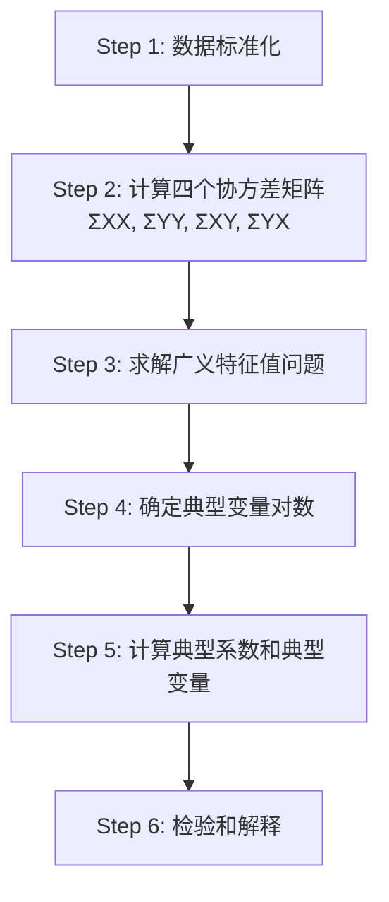

# 第10章 典型相关分析及Python应用

## 模块一：精准教学大纲

### 一、教学目标

1. **CCA概念**：理解典型相关分析是研究两组变量之间整体相关关系的方法，是简单相关和多元相关的推广。
2. **典型变量**：掌握典型变量 $U = a^TX$ 和 $V = b^TY$ 的定义，理解最大化相关系数的约束优化问题。
3. **求解方法**：掌握广义特征值问题的求解过程，理解典型相关系数 $\rho_i = \sqrt{\lambda_i}$ 的含义。
4. **检验**：了解Wilks' Lambda统计量的检验方法。
5. **Python实操**：能够使用sklearn.cross_decomposition.CCA进行典型相关分析。

### 二、建议学时

| 内容 | 学时 | 教学方式 |
|------|------|----------|
| 10.1 引言 | 0.5 | 讲授 |
| 10.2 相关分析基本架构 | 0.5 | 讲授 |
| 10.3 典型相关分析原理 | 2 | 讲授+推导 |
| 10.4 典型相关分析步骤 | 1.5 | 讲授+案例 |
| **合计** | **4.5** | |

### 三、重点与难点

**重点**：典型变量的定义与求解；典型相关系数的性质

**难点**：广义特征值问题的求解；Wilks' Lambda检验

### 四、前置知识

| 前置知识 | 是否已出现 | 处理方式 |
|----------|-----------|----------|
| 多元回归 | 是（第9章） | 直接引用 |
| 特征值分解 | 是（第1章） | 直接引用 |
| 相关系数矩阵 | 是（第2章） | 直接引用 |

### 五、学习成果指标

完成本章学习后，学生应能够：

1. 准确描述典型相关分析的适用场景和基本思想
2. 手动推导典型变量的求解过程（小规模问题）
3. 利用Python对实际数据进行典型相关分析
4. 正确解读典型相关系数、典型系数和典型载荷
5. 使用Wilks' Lambda检验判断典型相关的显著性
6. 将典型相关分析的结果转化为可操作的业务建议

### 六、教学方法与策略

本章采用"理论推导-直观理解-编程实现"三位一体的教学方法：

- **理论推导**：从约束优化问题出发，严格推导广义特征值问题的数学形式
- **直观理解**：通过几何投影的角度理解典型变量的含义
- **编程实现**：通过Python代码加深对算法各步骤的理解

### 七、考核方式建议

| 考核内容 | 考核方式 | 权重建议 |
|----------|----------|----------|
| 概念理解 | 选择题/简答题 | 20% |
| 数学推导 | 计算题 | 30% |
| 编程实现 | 上机实验 | 30% |
| 结果解释 | 案例分析报告 | 20% |

---

## 模块二：沉浸式理论讲解

### 10.1 引言

#### 10.1.1 典型相关分析的概念

**【业务场景引入】**

某大宗商品研究机构希望研究以下问题：
- **X组变量**（宏观经济指标）：GDP增长率、CPI、M2增速、PMI
- **Y组变量**（商品价格）：铜价变化率、油价变化率、金价变化率

问题：宏观经济指标组与商品价格组之间是否存在整体相关关系？哪些宏观指标的线性组合与哪些商品价格的线性组合相关性最强？

**典型相关分析（Canonical Correlation Analysis, CCA）** 正是解决这类问题的工具：**研究两组多维变量之间的整体相关关系，通过寻找各组的线性组合使相关系数最大化**。

**【历史背景】**

典型相关分析由Harold Hotelling于1936年首次提出，发表在《Journal of Educational Psychology》上。Hotelling的核心思想是：将两组变量各自压缩为一个综合变量（典型变量），然后研究这两个综合变量之间的相关关系。这一思想可以看作是主成分分析（PCA）在两组变量情况下的推广。

**【与其他方法的关系】**

| 方法 | 研究内容 | 变量角色 |
|------|----------|----------|
| 简单相关 | 两个变量的线性关系 | 无区分 |
| 多元回归 | Y与多个X的线性关系 | Y是因变量，X是自变量 |
| 主成分分析 | 一组变量的降维 | 只有一组变量 |
| 典型相关 | 两组变量的整体关系 | 两组变量地位平等 |

#### 10.1.2 相关分析的三个层次

| 层次 | 研究对象 | 度量指标 | 公式 |
|------|----------|----------|------|
| 简单相关 | 两个变量 | Pearson相关系数r | $r = S_{xy}/(S_xS_y)$ |
| 多元相关 | 一个因变量 vs 多个自变量 | 复相关系数R | $R = \sqrt{SSR/SST}$ |
| 典型相关 | 一组变量 vs 另一组变量 | 典型相关系数ρ | $\rho = \max \text{Corr}(a^TX, b^TY)$ |

典型相关分析是最高层次的相关分析。

**【直观理解】**

我们可以用一个比喻来理解三个层次的关系：

- **简单相关**：就像比较两个人的身高，一次只能比较两个人
- **多元相关**：就像比较一个人的身高与一个家庭所有成员身高的关系
- **典型相关**：就像比较两个家庭的整体特征之间的关系

#### 10.1.3 典型相关分析的应用领域

典型相关分析在众多领域有着广泛的应用：

**1. 经济金融领域**
- 研究宏观经济指标与金融市场表现的关系
- 分析公司财务指标与股票收益率的关联
- 研究货币政策变量与实体经济变量的关系

**2. 心理学与教育学**
- 研究学生的学习动机与学习成绩之间的关系
- 分析心理特质与行为表现之间的关联
- 研究教学方法与学生综合素质的关系

**3. 生物医学领域**
- 研究基因表达数据与疾病表型的关系
- 分析药物剂量与多种疗效指标的关联
- 研究环境因素与健康指标的关系

**4. 市场营销领域**
- 研究产品属性与消费者偏好的关系
- 分析广告投入与品牌指标的关联
- 研究客户特征与购买行为的关系

**5. 地理与环境科学**
- 研究气候变量与生态系统指标的关系
- 分析土壤成分与作物产量的关联

---

### 10.2 相关分析基本架构

#### 10.2.1 简单相关分析

两个变量之间的相关：

$$
r = \frac{Cov(X,Y)}{\sigma_X \sigma_Y} = \frac{\sum_{i=1}^{n}(x_i - \bar{x})(y_i - \bar{y})}{\sqrt{\sum_{i=1}^{n}(x_i - \bar{x})^2 \cdot \sum_{i=1}^{n}(y_i - \bar{y})^2}}
$$

**性质**：
- $-1 \leq r \leq 1$
- $r = 1$ 表示完全正相关
- $r = -1$ 表示完全负相关
- $r = 0$ 表示无线性相关

**局限性**：只能度量两个变量之间的线性关系，无法处理多维变量之间的整体关系。

#### 10.2.2 多元相关分析

一个因变量Y与多个自变量 $X_1, X_2, \ldots, X_p$ 的整体相关：

$$
R = \sqrt{\frac{SSR}{SST}} = \sqrt{R^2}
$$

其中：
- $SSR = \sum_{i=1}^{n}(\hat{y}_i - \bar{y})^2$ 是回归平方和
- $SST = \sum_{i=1}^{n}(y_i - \bar{y})^2$ 是总平方和
- $R^2$ 是决定系数

**性质**：
- $0 \leq R \leq 1$
- R越大，因变量与自变量组的线性关系越强
- $R^2$ 表示因变量的变异中可由自变量组解释的比例

**局限性**：只能研究一个因变量与多个自变量的关系，且因变量和自变量的角色不对等。

#### 10.2.3 典型相关分析

两组变量X和Y之间的整体相关：

- X组：$X = (X_1, X_2, \ldots, X_p)^T$
- Y组：$Y = (Y_1, Y_2, \ldots, Y_q)^T$

找到各组的线性组合：

$$
U = a^T X = a_1 X_1 + a_2 X_2 + \cdots + a_p X_p
$$

$$
V = b^T Y = b_1 Y_1 + b_2 Y_2 + \cdots + b_q Y_q
$$

使 $\text{Corr}(U, V)$ 最大。

**与多元相关的区别**：
- 典型相关中两组变量地位平等，没有因变量和自变量之分
- 典型相关可以得到多对典型变量，每对都有不同的典型相关系数
- 典型相关是多元相关的推广和一般化

#### 10.2.4 从矩阵角度看相关分析

设 $Z = (X^T, Y^T)^T$ 是一个 $(p+q) \times 1$ 的随机向量，其协方差矩阵为：

$$
\Sigma = \begin{pmatrix} \Sigma_{XX} & \Sigma_{XY} \\ \Sigma_{YX} & \Sigma_{YY} \end{pmatrix}
$$

其中：
- $\Sigma_{XX}$ 是X组变量的 $p \times p$ 协方差矩阵
- $\Sigma_{YY}$ 是Y组变量的 $q \times q$ 协方差矩阵
- $\Sigma_{XY} = \Sigma_{YX}^T$ 是X组与Y组之间的 $p \times q$ 互协方差矩阵

典型相关分析的核心就是利用这四个矩阵来寻找使相关系数最大化的线性组合。

---

### 10.3 典型相关分析原理

#### 10.3.1 最大化相关系数的目标

在约束条件 $\text{Var}(U) = a^T \Sigma_{XX} a = 1$ 和 $\text{Var}(V) = b^T \Sigma_{YY} b = 1$ 下，最大化：

$$
\rho = \text{Corr}(U, V) = \frac{a^T \Sigma_{XY} b}{\sqrt{a^T \Sigma_{XX} a \cdot b^T \Sigma_{YY} b}}
$$

在单位方差约束下，目标简化为：

$$
\rho = \text{Cov}(U, V) = a^T \Sigma_{XY} b
$$

**约束优化问题的完整表述**：

$$
\max_{a, b} \quad a^T \Sigma_{XY} b
$$

$$
\text{s.t.} \quad a^T \Sigma_{XX} a = 1, \quad b^T \Sigma_{YY} b = 1
$$

**【为什么需要约束？】**

如果没有约束条件，我们可以任意放缩 $a$ 和 $b$ 使得相关系数趋于无穷大。单位方差约束确保了典型变量的方差为1，使得相关系数有界且可比较。

**【几何直观】**

典型相关分析可以理解为在两个子空间中分别寻找最优投影方向：
- 在X的列空间中寻找方向 $a$，使得投影 $U = a^TX$ 具有单位方差
- 在Y的列空间中寻找方向 $b$，使得投影 $V = b^TY$ 具有单位方差
- 同时最大化两个投影之间的相关系数

#### 10.3.2 拉格朗日乘数法推导

引入拉格朗日乘数 $\lambda$ 和 $\mu$，构造拉格朗日函数：

$$
L(a, b, \lambda, \mu) = a^T \Sigma_{XY} b - \frac{\lambda}{2}(a^T \Sigma_{XX} a - 1) - \frac{\mu}{2}(b^T \Sigma_{YY} b - 1)
$$

对 $a$ 求偏导并令其为零：

$$
\frac{\partial L}{\partial a} = \Sigma_{XY} b - \lambda \Sigma_{XX} a = 0
$$

得到：

$$
\Sigma_{XY} b = \lambda \Sigma_{XX} a \quad \text{(方程1)}
$$

对 $b$ 求偏导并令其为零：

$$
\frac{\partial L}{\partial b} = \Sigma_{YX} a - \mu \Sigma_{YY} b = 0
$$

得到：

$$
\Sigma_{YX} a = \mu \Sigma_{YY} b \quad \text{(方程2)}
$$

**进一步推导**：

由方程1可得：

$$
a = \lambda^{-1} \Sigma_{XX}^{-1} \Sigma_{XY} b \quad \text{(方程3)}
$$

将方程3代入方程2：

$$
\Sigma_{YX} (\lambda^{-1} \Sigma_{XX}^{-1} \Sigma_{XY} b) = \mu \Sigma_{YY} b
$$

$$
\frac{1}{\lambda} \Sigma_{YX} \Sigma_{XX}^{-1} \Sigma_{XY} b = \mu \Sigma_{YY} b
$$

两边左乘 $\Sigma_{YY}^{-1}$：

$$
\frac{1}{\lambda} \Sigma_{YY}^{-1} \Sigma_{YX} \Sigma_{XX}^{-1} \Sigma_{XY} b = \mu b \quad \text{(方程4)}
$$

**证明 $\lambda = \mu$**：

由方程1：$a^T \Sigma_{XY} b = \lambda a^T \Sigma_{XX} a = \lambda$
由方程2：$a^T \Sigma_{XY} b = b^T \Sigma_{YX} a = \mu b^T \Sigma_{YY} b = \mu$

因此 $\lambda = \mu = \rho$（即拉格朗日乘数等于典型相关系数）。

#### 10.3.3 广义特征值问题

将 $\lambda = \mu$ 代入方程4，得到：

$$
\Sigma_{YY}^{-1} \Sigma_{YX} \Sigma_{XX}^{-1} \Sigma_{XY} b = \lambda^2 b
$$

令 $\lambda^2 = \lambda^*$，则：

$$
\Sigma_{YY}^{-1} \Sigma_{YX} \Sigma_{XX}^{-1} \Sigma_{XY} b = \lambda^* b
$$

这是一个标准的特征值问题。类似地，可以得到关于 $a$ 的特征值问题：

$$
\Sigma_{XX}^{-1} \Sigma_{XY} \Sigma_{YY}^{-1} \Sigma_{YX} a = \lambda^* a
$$

求得特征值 $\lambda_1^* \geq \lambda_2^* \geq \cdots \geq \lambda_m^* \geq 0$，其中 $m = \min(p, q)$。

典型相关系数为：

$$
\rho_i = \sqrt{\lambda_i^*}
$$

**【矩阵的性质】**

矩阵 $M_a = \Sigma_{XX}^{-1} \Sigma_{XY} \Sigma_{YY}^{-1} \Sigma_{YX}$ 和 $M_b = \Sigma_{YY}^{-1} \Sigma_{YX} \Sigma_{XX}^{-1} \Sigma_{XY}$ 具有以下重要性质：

1. 两个矩阵具有相同的非零特征值
2. 特征值都是非负实数
3. 特征值不超过1（因为相关系数不超过1）
4. 矩阵可能不是对称的，但可以对称化

#### 10.3.4 典型变量的性质

**性质1：不相关性**

不同对典型变量之间互不相关：

$$
\text{Corr}(U_i, U_j) = 0, \quad i \neq j
$$

$$
\text{Corr}(V_i, V_j) = 0, \quad i \neq j
$$

$$
\text{Corr}(U_i, V_j) = 0, \quad i \neq j
$$

**证明**：设 $(a_i, b_i)$ 和 $(a_j, b_j)$ 是对应于不同特征值的特征向量。由于特征向量关于 $\Sigma_{XX}$ 和 $\Sigma_{YY}$ 正交，可以证明上述不相关性质。

**性质2：有序性**

典型相关系数按降序排列：

$$
\rho_1 \geq \rho_2 \geq \cdots \geq \rho_m \geq 0
$$

**性质3：对数限制**

典型变量对数不超过 $\min(p, q)$，即：

$$
m = \min(p, q)
$$

这是因为最多只能提取 $\min(p, q)$ 个非零特征值。

**性质4：尺度不变性**

典型相关系数对变量的线性变换不变。如果对X组和Y组分别进行可逆线性变换，典型相关系数不变。

**性质5：与回归的关系**

当 $q = 1$ 时（Y只有一个变量），典型相关分析退化为多元回归分析，第一对典型变量的典型相关系数等于复相关系数 $R$。

#### 10.3.5 典型载荷与典型交叉载荷

**典型载荷（Canonical Loading）**：原始变量与本组典型变量之间的相关系数

$$
\text{Corr}(X_j, U_i), \quad j = 1, \ldots, p; \quad i = 1, \ldots, m
$$

$$
\text{Corr}(Y_k, V_i), \quad k = 1, \ldots, q; \quad i = 1, \ldots, m
$$

**典型交叉载荷（Cross Loading）**：原始变量与另一组典型变量之间的相关系数

$$
\text{Corr}(X_j, V_i), \quad j = 1, \ldots, p; \quad i = 1, \ldots, m
$$

$$
\text{Corr}(Y_k, U_i), \quad k = 1, \ldots, q; \quad i = 1, \ldots, m
$$

**解释力指标**：

典型载荷的平方表示典型变量对原始变量的解释比例。通过比较典型载荷的大小，可以判断哪些原始变量对典型变量的贡献最大。

#### 10.3.6 典型冗余分析

**典型冗余（Canonical Redundancy）** 衡量一组典型变量对另一组原始变量的解释能力。

**组内方差解释比例**：

$$
R^2(X \text{ by } U_i) = \frac{1}{p} \sum_{j=1}^{p} [\text{Corr}(X_j, U_i)]^2
$$

$$
R^2(Y \text{ by } V_i) = \frac{1}{q} \sum_{k=1}^{q} [\text{Corr}(Y_k, V_i)]^2
$$

**交叉方差解释比例（冗余指数）**：

$$
R^2(X \text{ by } V_i) = \frac{1}{p} \sum_{j=1}^{p} [\text{Corr}(X_j, V_i)]^2 = \rho_i^2 \cdot R^2(X \text{ by } U_i)
$$

$$
R^2(Y \text{ by } U_i) = \frac{1}{q} \sum_{k=1}^{q} [\text{Corr}(Y_k, U_i)]^2 = \rho_i^2 \cdot R^2(Y \text{ by } V_i)
$$

**总冗余指数**：

$$
\text{TRD}(Y|U) = \sum_{i=1}^{m} R^2(Y \text{ by } U_i)
$$

$$
\text{TRD}(X|V) = \sum_{i=1}^{m} R^2(X \text{ by } V_i)
$$

#### 10.3.7 典型相关的检验

**Wilks' Lambda统计量**：

$$
\Lambda = \prod_{i=1}^{m}(1 - \rho_i^2)
$$

检验H0：所有典型相关系数为0。近似服从卡方分布，$p < 0.05$ 拒绝H0。

**Wilks' Lambda的逐步检验**：

在实际应用中，我们通常需要检验"从第 $k+1$ 对开始，所有典型相关系数是否为0"：

$$
\Lambda_k = \prod_{i=k+1}^{m}(1 - \rho_i^2)
$$

这允许我们逐步确定需要保留多少对典型变量。

**Bartlett的卡方近似**：

$$
\chi^2 = -\left[n - 1 - \frac{1}{2}(p + q + 1)\right] \ln \Lambda
$$

自由度：$df = p \times q$

**其他检验方法**：

| 检验方法 | 统计量 | 适用场景 |
|----------|--------|----------|
| Wilks' Lambda | $\Lambda$ | 最常用，适用于多数情况 |
| Pillai's Trace | $V = \sum \rho_i^2$ | 对违背假设较稳健 |
| Hotelling-Lawley Trace | $T = \sum \rho_i^2/(1-\rho_i^2)$ | 大样本下功效较高 |
| Roy's Largest Root | $\rho_1^2/(1-\rho_1^2)$ | 只检验第一对 |

#### 10.3.8 典型系数的标准化问题

在实际计算中，使用标准化数据和原始数据会得到不同的典型系数。

**原始典型系数**：基于原始协方差矩阵 $\Sigma$ 计算

$$
a^{(raw)}, \quad b^{(raw)}
$$

**标准化典型系数**：基于相关系数矩阵 $R$ 计算

$$
a^{(std)} = D_X^{1/2} a^{(raw)}, \quad b^{(std)} = D_Y^{1/2} b^{(raw)}
$$

其中 $D_X = \text{diag}(\Sigma_{XX})$，$D_Y = \text{diag}(\Sigma_{YY})$。

标准化典型系数消除了量纲的影响，便于在不同变量之间进行比较。在大多数实际应用中，我们使用标准化典型系数。

---

### 10.4 典型相关分析步骤



#### 10.4.1 Step 1：数据标准化

对X组和Y组变量分别进行标准化：

$$
X_{std} = \frac{X - \bar{X}}{S_X}, \quad Y_{std} = \frac{Y - \bar{Y}}{S_Y}
$$

标准化后的协方差矩阵等于相关系数矩阵。

**标准化的目的**：
1. 消除量纲的影响
2. 使不同变量的方差具有可比性
3. 标准化典型系数具有明确的比较意义

#### 10.4.2 Step 2：计算协方差矩阵

计算标准化数据的协方差矩阵（即相关系数矩阵）：

$$
\hat{\Sigma}_{XX} = \frac{1}{n-1} X_{std}^T X_{std}
$$

$$
\hat{\Sigma}_{YY} = \frac{1}{n-1} Y_{std}^T Y_{std}
$$

$$
\hat{\Sigma}_{XY} = \frac{1}{n-1} X_{std}^T Y_{std}
$$

$$
\hat{\Sigma}_{YX} = \hat{\Sigma}_{XY}^T
$$

#### 10.4.3 Step 3：求解广义特征值问题

求解特征值问题：

$$
|\Sigma_{XX}^{-1} \Sigma_{XY} \Sigma_{YY}^{-1} \Sigma_{YX} - \lambda I| = 0
$$

得到特征值 $\lambda_1 \geq \lambda_2 \geq \cdots \geq \lambda_m$ 和对应的特征向量。

#### 10.4.4 Step 4：确定典型变量对数

通过Wilks' Lambda检验，确定需要保留多少对典型变量。通常保留典型相关系数显著不为0的那些对。

**确定对数的准则**：
1. 统计显著性：Wilks' Lambda检验 $p < 0.05$
2. 典型相关系数大小：$\rho_i > 0.3$（经验准则）
3. 实际意义：典型变量能够给出合理的业务解释

#### 10.4.5 Step 5：计算典型系数和典型变量

对每一对典型变量，计算：
- 典型系数（权重向量）$a_i$ 和 $b_i$
- 典型变量得分 $U_i = X_{std} a_i$ 和 $V_i = Y_{std} b_i$
- 典型载荷 $\text{Corr}(X, U_i)$ 和 $\text{Corr}(Y, V_i)$

#### 10.4.6 Step 6：检验和解释

1. 使用Wilks' Lambda检验典型相关的显著性
2. 计算典型冗余指数
3. 根据典型载荷解释典型变量的含义
4. 绘制典型变量的散点图
5. 给出业务结论和建议

---

### 10.5 典型相关分析的数学推导详解

#### 10.5.1 约束优化问题的完整推导

**问题重述**：

$$
\max_{a, b} \quad \rho = \frac{a^T \Sigma_{XY} b}{\sqrt{(a^T \Sigma_{XX} a)(b^T \Sigma_{YY} b)}}
$$

**标准化约束**：

令 $a^T \Sigma_{XX} a = 1$ 和 $b^T \Sigma_{YY} b = 1$，则：

$$
\rho = a^T \Sigma_{XY} b
$$

**拉格朗日函数**：

$$
L = a^T \Sigma_{XY} b - \frac{\lambda_1}{2}(a^T \Sigma_{XX} a - 1) - \frac{\lambda_2}{2}(b^T \Sigma_{YY} b - 1)
$$

**一阶条件**：

$$
\frac{\partial L}{\partial a} = \Sigma_{XY} b - \lambda_1 \Sigma_{XX} a = 0
$$

$$
\frac{\partial L}{\partial b} = \Sigma_{YX} a - \lambda_2 \Sigma_{YY} b = 0
$$

**从一阶条件推导 $\lambda_1 = \lambda_2$**：

左乘 $a^T$ 到第一个方程：

$$
a^T \Sigma_{XY} b = \lambda_1 a^T \Sigma_{XX} a = \lambda_1
$$

左乘 $b^T$ 到第二个方程：

$$
b^T \Sigma_{YX} a = \lambda_2 b^T \Sigma_{YY} b = \lambda_2
$$

注意到 $a^T \Sigma_{XY} b = (b^T \Sigma_{YX} a)^T = b^T \Sigma_{YX} a$（标量的转置等于自身），因此 $\lambda_1 = \lambda_2 = \rho$。

#### 10.5.2 特征值问题的等价形式

**形式一（关于a的特征值问题）**：

从 $\Sigma_{XY} b = \rho \Sigma_{XX} a$ 可得 $a = \frac{1}{\rho} \Sigma_{XX}^{-1} \Sigma_{XY} b$

代入 $\Sigma_{YX} a = \rho \Sigma_{YY} b$：

$$
\Sigma_{YX} \cdot \frac{1}{\rho} \Sigma_{XX}^{-1} \Sigma_{XY} b = \rho \Sigma_{YY} b
$$

$$
\Sigma_{YX} \Sigma_{XX}^{-1} \Sigma_{XY} b = \rho^2 \Sigma_{YY} b
$$

$$
\Sigma_{YY}^{-1} \Sigma_{YX} \Sigma_{XX}^{-1} \Sigma_{XY} b = \rho^2 b
$$

令 $\lambda = \rho^2$，得到：

$$
\Sigma_{YY}^{-1} \Sigma_{YX} \Sigma_{XX}^{-1} \Sigma_{XY} b = \lambda b
$$

**形式二（关于a的特征值问题）**：

类似地，从 $\Sigma_{YX} a = \rho \Sigma_{YY} b$ 可得 $b = \frac{1}{\rho} \Sigma_{YY}^{-1} \Sigma_{YX} a$

代入 $\Sigma_{XY} b = \rho \Sigma_{XX} a$：

$$
\Sigma_{XY} \cdot \frac{1}{\rho} \Sigma_{YY}^{-1} \Sigma_{YX} a = \rho \Sigma_{XX} a
$$

$$
\Sigma_{XX}^{-1} \Sigma_{XY} \Sigma_{YY}^{-1} \Sigma_{YX} a = \rho^2 a
$$

$$
\Sigma_{XX}^{-1} \Sigma_{XY} \Sigma_{YY}^{-1} \Sigma_{YX} a = \lambda a
$$

**形式三（对称形式）**：

令 $A = \Sigma_{XX}^{-1/2} \Sigma_{XY} \Sigma_{YY}^{-1/2}$，则原始问题等价于求解矩阵 $A$ 的奇异值分解。

$A$ 的奇异值 $\sigma_i$ 等于典型相关系数 $\rho_i$，即：

$$
\rho_i = \sigma_i(A)
$$

#### 10.5.3 通过SVD求解CCA

**算法步骤**：

1. 计算 $\Sigma_{XX}^{-1/2}$ 和 $\Sigma_{YY}^{-1/2}$（通过对角化或Cholesky分解）

2. 构造矩阵：

$$
K = \Sigma_{XX}^{-1/2} \Sigma_{XY} \Sigma_{YY}^{-1/2}
$$

3. 对 $K$ 进行奇异值分解：

$$
K = U \Sigma V^T
$$

其中 $\Sigma = \text{diag}(\sigma_1, \sigma_2, \ldots, \sigma_m)$，$\sigma_i$ 为奇异值。

4. 典型相关系数：

$$
\rho_i = \sigma_i
$$

5. 典型系数：

$$
a_i = \Sigma_{XX}^{-1/2} u_i, \quad b_i = \Sigma_{YY}^{-1/2} v_i
$$

其中 $u_i$ 和 $v_i$ 分别是 $U$ 和 $V$ 的第 $i$ 列。

**SVD方法的优点**：
1. 数值稳定性好
2. 可以直接得到所有典型变量对
3. 计算效率高
4. 可以利用现有的SVD算法库

---

### 10.6 典型相关分析的几何解释

#### 10.6.1 投影角度理解

典型相关分析可以理解为在两个向量空间中寻找最优投影方向的过程。

设 $\mathcal{X} = \text{span}\{X_1, X_2, \ldots, X_p\}$ 和 $\mathcal{Y} = \text{span}\{Y_1, Y_2, \ldots, Y_q\}$ 分别是X组和Y组变量张成的随机变量空间。

典型变量 $U = a^T X$ 是 $\mathcal{X}$ 中的一个方向，$V = b^T Y$ 是 $\mathcal{Y}$ 中的一个方向。典型相关分析寻找使 $\text{Corr}(U, V)$ 最大的方向对。

#### 10.6.2 与主成分分析的对比

| 特征 | 主成分分析（PCA） | 典型相关分析（CCA） |
|------|-------------------|---------------------|
| 输入 | 一组变量 | 两组变量 |
| 目标 | 最大化方差 | 最大化相关系数 |
| 约束 | 正交性 | 正交性 |
| 输出 | 主成分 | 典型变量对 |
| 降维 | 是 | 是（双侧） |

#### 10.6.3 角度解释

在标准化条件下，典型相关系数可以理解为两个子空间之间"角度"的余弦值。

设 $\theta$ 是两个子空间 $\mathcal{X}$ 和 $\mathcal{Y}$ 之间的最大角度，则：

$$
\rho_1 = \cos \theta_1
$$

其中 $\theta_1$ 是最小的主角度（canonical angle）。

第 $i$ 对典型变量对应第 $i$ 个主角度：

$$
\rho_i = \cos \theta_i
$$

典型相关系数序列对应于一系列主角度的余弦值。

---

### 10.7 典型相关分析与其他方法的关系

#### 10.7.1 与多元回归的关系

当 $q = 1$ 时（Y只有一个变量），CCA退化为多元回归：

- 典型相关系数 $\rho_1$ 等于复相关系数 $R$
- $\rho_1^2 = R^2$ 等于决定系数
- 典型系数与回归系数成比例

#### 10.7.2 与判别分析的关系

当Y组是哑变量矩阵时，CCA等价于Fisher判别分析。

设Y组包含 $g$ 个类别对应的哑变量，则：
- 典型变量 $V$ 表示类别信息
- 典型变量 $U$ 是判别函数
- 典型相关系数与判别能力相关

#### 10.7.3 与主成分分析的关系

CCA可以看作是在两个数据集上同时进行PCA的推广：
- PCA寻找一组变量的最大方差方向
- CCA寻找两组变量之间的最大相关方向

在数学上，CCA可以理解为"白化后的PCA"：
1. 首先将X和Y分别白化（使得协方差矩阵为单位阵）
2. 然后对白化后的数据进行联合PCA

#### 10.7.4 与偏最小二乘（PLS）的关系

PLS和CCA都是研究两组变量关系的方法，但目标不同：

| 特征 | CCA | PLS |
|------|-----|-----|
| 目标 | 最大化相关系数 | 最大化协方差 |
| 约束 | 单位方差 | 单位长度 |
| 适用场景 | 理论研究 | 预测建模 |
| 多重共线性 | 敏感 | 稳健 |

---

### 10.8 正则化典型相关分析

#### 10.8.1 正则化的动机

当X组或Y组变量之间存在多重共线性时，协方差矩阵 $\Sigma_{XX}$ 或 $\Sigma_{YY}$ 接近奇异，导致：
1. 特征值估计不稳定
2. 典型系数对数据微小变化敏感
3. 过拟合风险增加

#### 10.8.2 正则化CCA的目标函数

引入正则化参数 $\alpha$ 和 $\beta$，修改目标函数：

$$
\max_{a, b} \quad \frac{a^T \Sigma_{XY} b}{\sqrt{(a^T (\Sigma_{XX} + \alpha I) a)(b^T (\Sigma_{YY} + \beta I) b)}}
$$

等价于将 $\Sigma_{XX}$ 替换为 $\Sigma_{XX} + \alpha I$，将 $\Sigma_{YY}$ 替换为 $\Sigma_{YY} + \beta I$。

#### 10.8.3 正则化参数的选择

正则化参数 $\alpha$ 和 $\beta$ 可以通过交叉验证选择：

1. 将数据分为训练集和验证集
2. 对不同的 $(\alpha, \beta)$ 组合，在训练集上拟合CCA
3. 在验证集上评估典型相关系数的稳定性
4. 选择使验证集表现最优的参数组合

**Python实现（使用正则化CCA）**：

```python
from sklearn.cross_decomposition import CCA

# CCA内部使用了正则化参数
cca = CCA(n_components=2, max_iter=500)
```

---

### 10.9 核典型相关分析

#### 10.9.1 非线性扩展

当两组变量之间存在非线性关系时，线性CCA可能无法捕捉到有效的关联模式。核CCA通过核技巧将数据映射到高维特征空间，实现非线性典型相关分析。

#### 10.9.2 核CCA的原理

设 $\phi_X: \mathcal{X} \rightarrow \mathcal{H}_X$ 和 $\phi_Y: \mathcal{Y} \rightarrow \mathcal{H}_Y$ 是两个特征映射。

核CCA在特征空间中寻找：

$$
\max_{f \in \mathcal{H}_X, g \in \mathcal{H}_Y} \quad \text{Corr}(f(\phi_X(X)), g(\phi_Y(Y)))
$$

通过核函数 $K_X(x_i, x_j) = \langle \phi_X(x_i), \phi_X(x_j) \rangle$ 和 $K_Y(y_i, y_j) = \langle \phi_Y(y_i), \phi_Y(y_j) \rangle$，无需显式计算特征映射。

#### 10.9.3 常用核函数

| 核函数 | 表达式 | 适用场景 |
|--------|--------|----------|
| 线性核 | $K(x,y) = x^T y$ | 等价于线性CCA |
| 多项式核 | $K(x,y) = (x^T y + c)^d$ | 多项式关系 |
| RBF核 | $K(x,y) = \exp(-\|x-y\|^2/2\sigma^2)$ | 非线性关系 |
| sigmoid核 | $K(x,y) = \tanh(\alpha x^T y + c)$ | 神经网络相关 |

#### 10.9.4 核CCA的Python实现

```python
from sklearn.metrics.pairwise import rbf_kernel
import numpy as np

def kernel_cca(X, Y, n_components=2, gamma_X=1.0, gamma_Y=1.0, reg=1e-3):
    """
    核典型相关分析的简单实现
    """
    # 计算核矩阵
    K_X = rbf_kernel(X, gamma=gamma_X)
    K_Y = rbf_kernel(Y, gamma=gamma_Y)
    
    n = K_X.shape[0]
    
    # 中心化核矩阵
    H = np.eye(n) - np.ones((n, n)) / n
    K_X_c = H @ K_X @ H
    K_Y_c = H @ K_Y @ H
    
    # 正则化
    K_X_c += reg * np.eye(n)
    K_Y_c += reg * np.eye(n)
    
    # 求解广义特征值问题
    M = np.linalg.solve(K_X_c, K_Y_c)
    eigenvalues, eigenvectors = np.linalg.eig(M)
    
    # 取实部并排序
    idx = np.argsort(-np.real(eigenvalues))[:n_components]
    canonical_corrs = np.sqrt(np.real(eigenvalues[idx]))
    alpha = np.real(eigenvectors[:, idx])
    
    # 计算典型变量
    X_c = K_X @ alpha
    Y_c = K_Y @ np.linalg.solve(K_Y_c, K_X_c @ alpha)
    
    return canonical_corrs, X_c, Y_c
```

---

## 模块三：实战与代码复现

### 实战案例10-1：宏观经济与商品价格的典型相关分析

```python
import numpy as np
import pandas as pd
import matplotlib.pyplot as plt
from sklearn.cross_decomposition import CCA
from sklearn.preprocessing import StandardScaler

plt.rcParams['font.sans-serif'] = ['SimHei']
plt.rcParams['axes.unicode_minus'] = False
np.random.seed(42)

# ============================================================
# 数据准备
# ============================================================
n = 100

# 潜在因子
F1 = np.random.randn(n)  # 经济增长因子
F2 = np.random.randn(n)  # 通胀因子

# X组：宏观经济指标
X = np.column_stack([
    0.8*F1 + 0.2*F2 + np.random.randn(n)*0.3,  # GDP增长率
    0.3*F1 + 0.7*F2 + np.random.randn(n)*0.3,  # CPI
    0.6*F1 + 0.4*F2 + np.random.randn(n)*0.3,  # M2增速
    0.7*F1 + 0.1*F2 + np.random.randn(n)*0.3   # PMI
])

# Y组：商品价格变化率
Y = np.column_stack([
    0.7*F1 + 0.2*F2 + np.random.randn(n)*0.3,  # 铜价
    0.5*F1 + 0.4*F2 + np.random.randn(n)*0.3,  # 油价
    -0.2*F1 + 0.8*F2 + np.random.randn(n)*0.2  # 金价
])

X_names = ['GDP增长率', 'CPI', 'M2增速', 'PMI']
Y_names = ['铜价变化率', '油价变化率', '金价变化率']

# ============================================================
# 标准化
# ============================================================
X_std = StandardScaler().fit_transform(X)
Y_std = StandardScaler().fit_transform(Y)

# ============================================================
# 典型相关分析
# ============================================================
n_components = min(X.shape[1], Y.shape[1])
cca = CCA(n_components=n_components)
X_c, Y_c = cca.fit_transform(X_std, Y_std)

# 典型相关系数
canonical_corrs = [np.corrcoef(X_c[:, i], Y_c[:, i])[0, 1] for i in range(n_components)]

print("=== 典型相关系数 ===")
for i, r in enumerate(canonical_corrs):
    print(f"  第{i+1}对: ρ = {r:.4f}, ρ² = {r**2:.4f}")

# 典型系数
x_weights = pd.DataFrame(cca.x_weights_, index=X_names,
                          columns=[f'U{i+1}' for i in range(n_components)])
y_weights = pd.DataFrame(cca.y_weights_, index=Y_names,
                          columns=[f'V{i+1}' for i in range(n_components)])

print("\n=== X组典型系数 ===")
print(x_weights.round(3))

print("\n=== Y组典型系数 ===")
print(y_weights.round(3))

# ============================================================
# 可视化
# ============================================================
fig, axes = plt.subplots(1, 3, figsize=(18, 5))

# 第一对典型变量散点图
axes[0].scatter(X_c[:, 0], Y_c[:, 0], c='steelblue', alpha=0.6, edgecolors='black')
z = np.polyfit(X_c[:, 0], Y_c[:, 0], 1)
p_line = np.poly1d(z)
x_line = np.linspace(X_c[:, 0].min(), X_c[:, 0].max(), 100)
axes[0].plot(x_line, p_line(x_line), 'r--', linewidth=2)
axes[0].set_xlabel('U1（宏观因子）')
axes[0].set_ylabel('V1（商品因子）')
axes[0].set_title(f'第1对典型变量 (ρ={canonical_corrs[0]:.4f})')

# 典型相关系数条形图
axes[1].bar(range(1, n_components+1), canonical_corrs, color='coral')
axes[1].set_xlabel('典型变量对')
axes[1].set_ylabel('典型相关系数')
axes[1].set_title('典型相关系数')

# X组典型系数热力图
import seaborn as sns
sns.heatmap(x_weights, annot=True, fmt='.3f', cmap='RdBu_r', center=0, ax=axes[2])
axes[2].set_title('X组典型系数')

plt.tight_layout()
plt.show()
```

**结果解读**：

1. **典型相关系数**：第1对典型变量的相关系数通常最高（>0.7），说明宏观经济指标组与商品价格组之间存在强相关。

2. **X组典型系数**：GDP增长率和PMI在U1上的系数较大，说明U1主要反映"经济增长"维度。

3. **Y组典型系数**：铜价和油价在V1上的系数较大，说明V1主要反映"工业品价格"维度。

4. **业务含义**：经济增长指标（GDP、PMI）与工业品价格（铜、油）高度联动，而与避险资产（黄金）的关系较弱。

---

### 实战案例10-2：学生能力与成绩的典型相关分析

```python
import numpy as np
import pandas as pd
import matplotlib.pyplot as plt
import seaborn as sns
from sklearn.cross_decomposition import CCA
from sklearn.preprocessing import StandardScaler
from scipy import stats

plt.rcParams['font.sans-serif'] = ['SimHei']
plt.rcParams['axes.unicode_minus'] = False
np.random.seed(123)

# ============================================================
# 数据准备：学生能力与成绩
# ============================================================
n = 150

# 潜在能力因子
A1 = np.random.randn(n)  # 逻辑推理能力
A2 = np.random.randn(n)  # 语言表达能力
A3 = np.random.randn(n)  # 动手实践能力

# X组：能力测试得分
X = np.column_stack([
    0.8*A1 + 0.1*A2 + 0.1*A3 + np.random.randn(n)*0.3,  # 数学推理
    0.1*A1 + 0.8*A2 + 0.1*A3 + np.random.randn(n)*0.3,  # 语文阅读
    0.7*A1 + 0.2*A2 + 0.1*A3 + np.random.randn(n)*0.3,  # 逻辑分析
    0.1*A1 + 0.7*A2 + 0.2*A3 + np.random.randn(n)*0.3,  # 英语能力
    0.2*A1 + 0.1*A2 + 0.7*A3 + np.random.randn(n)*0.3   # 实验操作
])

# Y组：课程成绩
Y = np.column_stack([
    0.7*A1 + 0.2*A2 + 0.1*A3 + np.random.randn(n)*0.4,  # 数学成绩
    0.1*A1 + 0.7*A2 + 0.2*A3 + np.random.randn(n)*0.4,  # 语文成绩
    0.3*A1 + 0.3*A2 + 0.4*A3 + np.random.randn(n)*0.4,  # 物理成绩
    0.2*A1 + 0.6*A2 + 0.2*A3 + np.random.randn(n)*0.4   # 英语成绩
])

X_names = ['数学推理', '语文阅读', '逻辑分析', '英语能力', '实验操作']
Y_names = ['数学成绩', '语文成绩', '物理成绩', '英语成绩']

print("=" * 60)
print("学生能力与成绩的典型相关分析")
print("=" * 60)

# ============================================================
# 标准化
# ============================================================
scaler_X = StandardScaler()
scaler_Y = StandardScaler()
X_std = scaler_X.fit_transform(X)
Y_std = scaler_Y.fit_transform(Y)

# ============================================================
# 相关系数矩阵
# ============================================================
print("\n=== 组间相关系数矩阵 ===")
XY_corr = pd.DataFrame(np.corrcoef(X_std, Y_std, rowvar=False),
                        index=X_names + Y_names,
                        columns=X_names + Y_names)
print(XY_corr.loc[X_names, Y_names].round(3))

# ============================================================
# 典型相关分析
# ============================================================
n_components = min(X.shape[1], Y.shape[1])
cca = CCA(n_components=n_components, max_iter=1000)
X_c, Y_c = cca.fit_transform(X_std, Y_std)

# 典型相关系数
canonical_corrs = []
for i in range(n_components):
    corr = np.corrcoef(X_c[:, i], Y_c[:, i])[0, 1]
    canonical_corrs.append(abs(corr))

print("\n=== 典型相关系数 ===")
for i, r in enumerate(canonical_corrs):
    print(f"  第{i+1}对: ρ = {r:.4f}, ρ² = {r**2:.4f}")

# ============================================================
# Wilks' Lambda检验
# ============================================================
print("\n=== Wilks' Lambda检验 ===")
for k in range(n_components):
    Lambda = np.prod([1 - canonical_corrs[j]**2 for j in range(k, n_components)])
    df = (X.shape[1] - k) * (Y.shape[1] - k)
    chi2 = -(n - 1 - (X.shape[1] + Y.shape[1] + 1)/2) * np.log(Lambda)
    p_value = 1 - stats.chi2.cdf(chi2, df)
    print(f"  从第{k+1}对开始: Λ = {Lambda:.4f}, χ² = {chi2:.2f}, df = {df}, p = {p_value:.4f}")

# ============================================================
# 典型系数
# ============================================================
x_weights = pd.DataFrame(cca.x_weights_, index=X_names,
                          columns=[f'U{i+1}' for i in range(n_components)])
y_weights = pd.DataFrame(cca.y_weights_, index=Y_names,
                          columns=[f'V{i+1}' for i in range(n_components)])

print("\n=== X组标准化典型系数 ===")
print(x_weights.round(3))

print("\n=== Y组标准化典型系数 ===")
print(y_weights.round(3))

# ============================================================
# 典型载荷
# ============================================================
x_loadings = np.corrcoef(X_std, X_c, rowvar=False)[:X.shape[1], X.shape[1]:]
y_loadings = np.corrcoef(Y_std, Y_c, rowvar=False)[:Y.shape[1], Y.shape[1]:]

x_load_df = pd.DataFrame(x_loadings, index=X_names,
                          columns=[f'U{i+1}' for i in range(n_components)])
y_load_df = pd.DataFrame(y_loadings, index=Y_names,
                          columns=[f'V{i+1}' for i in range(n_components)])

print("\n=== X组典型载荷（相关系数）===")
print(x_load_df.round(3))

print("\n=== Y组典型载荷（相关系数）===")
print(y_load_df.round(3))

# ============================================================
# 典型交叉载荷
# ============================================================
x_cross_loadings = np.corrcoef(X_std, Y_c, rowvar=False)[:X.shape[1], X.shape[1]:]
y_cross_loadings = np.corrcoef(Y_std, X_c, rowvar=False)[:Y.shape[1], Y.shape[1]:]

x_cross_df = pd.DataFrame(x_cross_loadings, index=X_names,
                           columns=[f'V{i+1}' for i in range(n_components)])
y_cross_df = pd.DataFrame(y_cross_loadings, index=Y_names,
                           columns=[f'U{i+1}' for i in range(n_components)])

print("\n=== X组典型交叉载荷 ===")
print(x_cross_df.round(3))

print("\n=== Y组典型交叉载荷 ===")
print(y_cross_df.round(3))

# ============================================================
# 冗余分析
# ============================================================
print("\n=== 冗余分析 ===")
for i in range(n_components):
    r2_x = np.mean(x_loadings[:, i]**2)
    r2_y = np.mean(y_loadings[:, i]**2)
    red_x = canonical_corrs[i]**2 * r2_x
    red_y = canonical_corrs[i]**2 * r2_y
    print(f"  第{i+1}对:")
    print(f"    X组方差解释比例: {r2_x:.4f}")
    print(f"    Y组方差解释比例: {r2_y:.4f}")
    print(f"    X组冗余指数: {red_x:.4f}")
    print(f"    Y组冗余指数: {red_y:.4f}")

# ============================================================
# 可视化
# ============================================================
fig, axes = plt.subplots(2, 3, figsize=(18, 12))

# 1. 典型相关系数
axes[0, 0].bar(range(1, n_components+1), canonical_corrs, color='steelblue', edgecolor='black')
axes[0, 0].set_xlabel('典型变量对')
axes[0, 0].set_ylabel('典型相关系数')
axes[0, 0].set_title('典型相关系数')
axes[0, 0].set_ylim(0, 1)

# 2. 第一对典型变量散点图
axes[0, 1].scatter(X_c[:, 0], Y_c[:, 0], c='coral', alpha=0.5, edgecolors='black', s=30)
z = np.polyfit(X_c[:, 0], Y_c[:, 0], 1)
p_line = np.poly1d(z)
x_range = np.linspace(X_c[:, 0].min(), X_c[:, 0].max(), 100)
axes[0, 1].plot(x_range, p_line(x_range), 'r--', linewidth=2)
axes[0, 1].set_xlabel('U1')
axes[0, 1].set_ylabel('V1')
axes[0, 1].set_title(f'第1对典型变量 (ρ={canonical_corrs[0]:.4f})')

# 3. 第二对典型变量散点图
if n_components > 1:
    axes[0, 2].scatter(X_c[:, 1], Y_c[:, 1], c='green', alpha=0.5, edgecolors='black', s=30)
    z2 = np.polyfit(X_c[:, 1], Y_c[:, 1], 1)
    p_line2 = np.poly1d(z2)
    x_range2 = np.linspace(X_c[:, 1].min(), X_c[:, 1].max(), 100)
    axes[0, 2].plot(x_range2, p_line2(x_range2), 'r--', linewidth=2)
    axes[0, 2].set_xlabel('U2')
    axes[0, 2].set_ylabel('V2')
    axes[0, 2].set_title(f'第2对典型变量 (ρ={canonical_corrs[1]:.4f})')

# 4. X组典型系数热力图
sns.heatmap(x_weights, annot=True, fmt='.3f', cmap='RdBu_r', center=0, ax=axes[1, 0])
axes[1, 0].set_title('X组典型系数')

# 5. Y组典型系数热力图
sns.heatmap(y_weights, annot=True, fmt='.3f', cmap='RdBu_r', center=0, ax=axes[1, 1])
axes[1, 1].set_title('Y组典型系数')

# 6. 典型载荷热力图
loadings_combined = pd.concat([x_load_df, y_load_df], axis=0)
sns.heatmap(loadings_combined, annot=True, fmt='.3f', cmap='RdBu_r', center=0, ax=axes[1, 2])
axes[1, 2].set_title('典型载荷')

plt.tight_layout()
plt.savefig('cca_student_results.png', dpi=150, bbox_inches='tight')
plt.show()

print("\n分析完成！")
```

---

### 实战案例10-3：手工计算CCA（教学演示）

```python
import numpy as np
import pandas as pd

print("=" * 60)
print("典型相关分析手工计算演示")
print("=" * 60)

# ============================================================
# 构造小规模数据
# ============================================================
np.random.seed(42)
n = 20

F = np.random.randn(n)

X = np.column_stack([
    0.8*F + np.random.randn(n)*0.3,
    0.6*F + np.random.randn(n)*0.4
])

Y = np.column_stack([
    0.7*F + np.random.randn(n)*0.3,
    0.5*F + np.random.randn(n)*0.4,
    0.4*F + np.random.randn(n)*0.5
])

# ============================================================
# Step 1: 标准化
# ============================================================
print("\n--- Step 1: 标准化 ---")
X_std = (X - X.mean(axis=0)) / X.std(axis=0)
Y_std = (Y - Y.mean(axis=0)) / Y.std(axis=0)

print(f"X标准化后均值: {X_std.mean(axis=0).round(4)}")
print(f"Y标准化后均值: {Y_std.mean(axis=0).round(4)}")

# ============================================================
# Step 2: 计算协方差矩阵
# ============================================================
print("\n--- Step 2: 计算协方差矩阵 ---")
S_XX = X_std.T @ X_std / (n - 1)
S_YY = Y_std.T @ Y_std / (n - 1)
S_XY = X_std.T @ Y_std / (n - 1)
S_YX = S_XY.T

print("S_XX:")
print(pd.DataFrame(S_XX).round(3))
print("\nS_YY:")
print(pd.DataFrame(S_YY).round(3))
print("\nS_XY:")
print(pd.DataFrame(S_XY).round(3))

# ============================================================
# Step 3: 求解广义特征值问题
# ============================================================
print("\n--- Step 3: 求解广义特征值问题 ---")
S_XX_inv = np.linalg.inv(S_XX)
S_YY_inv = np.linalg.inv(S_YY)

M_a = S_XX_inv @ S_XY @ S_YY_inv @ S_YX
M_b = S_YY_inv @ S_YX @ S_XX_inv @ S_XY

print("M_a = ΣXX^(-1) ΣXY ΣYY^(-1) ΣYX:")
print(pd.DataFrame(M_a).round(4))

# 求解特征值
eigenvalues_a, eigenvectors_a = np.linalg.eig(M_a)
eigenvalues_b, eigenvectors_b = np.linalg.eig(M_b)

print("\nM_a的特征值:", np.sort(eigenvalues_a)[::-1].round(4))
print("M_b的特征值:", np.sort(eigenvalues_b)[::-1].round(4))

# ============================================================
# Step 4: 典型相关系数
# ============================================================
print("\n--- Step 4: 典型相关系数 ---")
idx_a = np.argsort(-np.abs(eigenvalues_a.real))
canonical_corrs = np.sqrt(np.abs(eigenvalues_a[idx_a].real))

for i, rho in enumerate(canonical_corrs):
    if i < min(X.shape[1], Y.shape[1]):
        print(f"  第{i+1}对: λ = {eigenvalues_a[idx_a[i]].real:.4f}, ρ = {rho:.4f}")

# ============================================================
# Step 5: 典型系数
# ============================================================
print("\n--- Step 5: 典型系数 ---")
a_vectors = eigenvectors_a[:, idx_a[:min(X.shape[1], Y.shape[1])]].real
b_vectors = eigenvectors_b[:, np.argsort(-np.abs(eigenvalues_b.real))[:min(X.shape[1], Y.shape[1])]].real

print("X组典型系数 (a向量):")
print(pd.DataFrame(a_vectors, columns=[f'U{i+1}' for i in range(a_vectors.shape[1])]).round(4))

print("\nY组典型系数 (b向量):")
print(pd.DataFrame(b_vectors, columns=[f'V{i+1}' for i in range(b_vectors.shape[1])]).round(4))

# ============================================================
# Step 6: 计算典型变量
# ============================================================
print("\n--- Step 6: 典型变量 ---")
U = X_std @ a_vectors
V = Y_std @ b_vectors

for i in range(min(X.shape[1], Y.shape[1])):
    corr = np.corrcoef(U[:, i], V[:, i])[0, 1]
    print(f"  Corr(U{i+1}, V{i+1}) = {corr:.4f}")

# ============================================================
# 与sklearn对比
# ============================================================
print("\n--- 与sklearn结果对比 ---")
from sklearn.cross_decomposition import CCA

cca = CCA(n_components=min(X.shape[1], Y.shape[1]))
X_c, Y_c = cca.fit_transform(X_std, Y_std)

sklearn_corrs = [np.corrcoef(X_c[:, i], Y_c[:, i])[0, 1] 
                 for i in range(min(X.shape[1], Y.shape[1]))]

for i, (manual, sklearn_r) in enumerate(zip(canonical_corrs[:min(X.shape[1], Y.shape[1])], sklearn_corrs)):
    print(f"  第{i+1}对: 手工={manual:.4f}, sklearn={abs(sklearn_r):.4f}")

print("\n手工计算完成！")
```

---

### 实战案例10-4：Wilks' Lambda检验详解

```python
import numpy as np
from scipy import stats

def wilks_lambda_test(canonical_corrs, n, p, q):
    """
    逐步Wilks' Lambda检验
    
    参数:
    canonical_corrs: 典型相关系数列表
    n: 样本量
    p: X组变量数
    q: Y组变量数
    """
    m = min(p, q)
    
    print("=" * 70)
    print("Wilks' Lambda逐步检验")
    print("=" * 70)
    print(f"样本量 n = {n}, X组变量数 p = {p}, Y组变量数 q = {q}")
    print(f"最大典型变量对数 m = {m}")
    print()
    
    results = []
    
    for k in range(m):
        # 计算从第k+1对开始的Wilks' Lambda
        Lambda_k = np.prod([1 - canonical_corrs[j]**2 for j in range(k, m)])
        
        # 自由度
        s = p - k
        t = q - k
        df = s * t
        
        # Bartlett近似
        g = n - 1 - (p + q + 1) / 2
        chi2_stat = -g * np.log(Lambda_k)
        
        # p值
        p_value = 1 - stats.chi2.cdf(chi2_stat, df)
        
        # 结论
        significant = p_value < 0.05
        
        results.append({
            'k': k + 1,
            'Lambda': Lambda_k,
            'chi2': chi2_stat,
            'df': df,
            'p_value': p_value,
            'significant': significant
        })
        
        print(f"检验 H0: ρ_{k+1} = ρ_{k+2} = ... = ρ_{m} = 0")
        print(f"  Λ_{k} = {Lambda_k:.4f}")
        print(f"  χ² = {chi2_stat:.2f}, df = {df}")
        print(f"  p值 = {p_value:.4f}")
        print(f"  结论: {'拒绝H0' if significant else '不拒绝H0'}")
        print()
    
    return results

# ============================================================
# 演示数据
# ============================================================
np.random.seed(42)
n = 100
p = 4
q = 3

# 模拟典型相关系数
canonical_corrs = [0.85, 0.45, 0.15]

print("模拟的典型相关系数:")
for i, rho in enumerate(canonical_corrs):
    print(f"  ρ_{i+1} = {rho:.2f}")
print()

# 执行检验
results = wilks_lambda_test(canonical_corrs, n, p, q)

# ============================================================
# 结果汇总表
# ============================================================
print("=" * 70)
print("结果汇总")
print("=" * 70)
print(f"{'检验':^10} {'Λ':^10} {'χ²':^10} {'df':^8} {'p值':^10} {'结论':^10}")
print("-" * 70)
for r in results:
    conclusion = "显著" if r['significant'] else "不显著"
    print(f"{'H0_'+str(r['k']):^10} {r['Lambda']:^10.4f} {r['chi2']:^10.2f} {r['df']:^8d} {r['p_value']:^10.4f} {conclusion:^10}")

print()
print("结论解读:")
for r in results:
    if r['significant']:
        print(f"  第{r['k']}对及之后的典型变量显著不全为0")
    else:
        print(f"  第{r['k']}对及之后的典型变量不显著，可只保留前{r['k']-1}对")
        break
```

---

### 实战案例10-5：CCA结果的综合可视化

```python
import numpy as np
import pandas as pd
import matplotlib.pyplot as plt
import seaborn as sns
from sklearn.cross_decomposition import CCA
from sklearn.preprocessing import StandardScaler

plt.rcParams['font.sans-serif'] = ['SimHei']
plt.rcParams['axes.unicode_minus'] = False
np.random.seed(42)

# ============================================================
# 数据生成
# ============================================================
n = 120
F1 = np.random.randn(n)
F2 = np.random.randn(n)
F3 = np.random.randn(n)

X = np.column_stack([
    0.8*F1 + 0.2*F2 + np.random.randn(n)*0.3,
    0.3*F1 + 0.7*F2 + np.random.randn(n)*0.3,
    0.6*F1 + 0.4*F3 + np.random.randn(n)*0.3,
    0.5*F2 + 0.5*F3 + np.random.randn(n)*0.3
])

Y = np.column_stack([
    0.7*F1 + 0.2*F3 + np.random.randn(n)*0.3,
    0.5*F2 + 0.4*F3 + np.random.randn(n)*0.3,
    0.3*F1 + 0.6*F2 + np.random.randn(n)*0.3
])

X_names = ['X1', 'X2', 'X3', 'X4']
Y_names = ['Y1', 'Y2', 'Y3']

# ============================================================
# 标准化和CCA
# ============================================================
X_std = StandardScaler().fit_transform(X)
Y_std = StandardScaler().fit_transform(Y)

n_comp = min(X.shape[1], Y.shape[1])
cca = CCA(n_components=n_comp)
X_c, Y_c = cca.fit_transform(X_std, Y_std)

canonical_corrs = [abs(np.corrcoef(X_c[:, i], Y_c[:, i])[0, 1]) for i in range(n_comp)]

# ============================================================
# 综合可视化
# ============================================================
fig = plt.figure(figsize=(20, 16))

# 1. 典型相关系数
ax1 = fig.add_subplot(2, 3, 1)
bars = ax1.bar(range(1, n_comp+1), canonical_corrs, 
               color=['#2196F3', '#4CAF50', '#FF9800'][:n_comp],
               edgecolor='black', linewidth=1.5)
for bar, rho in zip(bars, canonical_corrs):
    ax1.text(bar.get_x() + bar.get_width()/2, bar.get_height() + 0.02,
             f'{rho:.3f}', ha='center', fontsize=12, fontweight='bold')
ax1.set_xlabel('典型变量对', fontsize=12)
ax1.set_ylabel('典型相关系数', fontsize=12)
ax1.set_title('典型相关系数', fontsize=14, fontweight='bold')
ax1.set_ylim(0, 1.1)
ax1.grid(axis='y', alpha=0.3)

# 2. 第一对典型变量散点图
ax2 = fig.add_subplot(2, 3, 2)
ax2.scatter(X_c[:, 0], Y_c[:, 0], c='steelblue', alpha=0.5, 
            edgecolors='black', s=40)
z = np.polyfit(X_c[:, 0], Y_c[:, 0], 1)
x_line = np.linspace(X_c[:, 0].min(), X_c[:, 0].max(), 100)
ax2.plot(x_line, np.poly1d(z)(x_line), 'r--', linewidth=2)
ax2.set_xlabel('U1', fontsize=12)
ax2.set_ylabel('V1', fontsize=12)
ax2.set_title(f'第1对典型变量 (ρ={canonical_corrs[0]:.3f})', fontsize=14, fontweight='bold')
ax2.grid(alpha=0.3)

# 3. X组典型系数热力图
ax3 = fig.add_subplot(2, 3, 3)
x_w = pd.DataFrame(cca.x_weights_, index=X_names,
                    columns=[f'U{i+1}' for i in range(n_comp)])
sns.heatmap(x_w, annot=True, fmt='.3f', cmap='RdBu_r', center=0, ax=ax3,
            annot_kws={'fontsize': 11})
ax3.set_title('X组典型系数', fontsize=14, fontweight='bold')

# 4. Y组典型系数热力图
ax4 = fig.add_subplot(2, 3, 4)
y_w = pd.DataFrame(cca.y_weights_, index=Y_names,
                    columns=[f'V{i+1}' for i in range(n_comp)])
sns.heatmap(y_w, annot=True, fmt='.3f', cmap='RdBu_r', center=0, ax=ax4,
            annot_kws={'fontsize': 11})
ax4.set_title('Y组典型系数', fontsize=14, fontweight='bold')

# 5. 典型载荷
ax5 = fig.add_subplot(2, 3, 5)
x_load = np.corrcoef(X_std, X_c, rowvar=False)[:X.shape[1], X.shape[1]:]
y_load = np.corrcoef(Y_std, Y_c, rowvar=False)[:Y.shape[1], Y.shape[1]:]

load_df = pd.DataFrame(
    np.vstack([x_load, y_load]),
    index=X_names + Y_names,
    columns=[f'{comp}' for comp in ['U1/V1', 'U2/V2', 'U3/V3'][:n_comp]]
)
sns.heatmap(load_df, annot=True, fmt='.3f', cmap='RdBu_r', center=0, ax=ax5,
            annot_kws={'fontsize': 11})
ax5.set_title('典型载荷矩阵', fontsize=14, fontweight='bold')

# 6. 解释方差比例
ax6 = fig.add_subplot(2, 3, 6)
x_var_explained = np.mean(x_load**2, axis=0)
y_var_explained = np.mean(y_load**2, axis=0)

x_pos = np.arange(n_comp)
width = 0.35
ax6.bar(x_pos - width/2, x_var_explained, width, label='X组', color='steelblue')
ax6.bar(x_pos + width/2, y_var_explained, width, label='Y组', color='coral')
ax6.set_xlabel('典型变量对', fontsize=12)
ax6.set_ylabel('方差解释比例', fontsize=12)
ax6.set_title('各对典型变量的方差解释', fontsize=14, fontweight='bold')
ax6.set_xticks(x_pos)
ax6.set_xticklabels([f'第{i+1}对' for i in range(n_comp)])
ax6.legend()
ax6.grid(axis='y', alpha=0.3)

plt.tight_layout()
plt.savefig('cca_comprehensive_visualization.png', dpi=150, bbox_inches='tight')
plt.show()

print("综合可视化完成！")
```

---

### 实战案例10-6：正则化CCA对比分析

```python
import numpy as np
import matplotlib.pyplot as plt
from sklearn.cross_decomposition import CCA
from sklearn.preprocessing import StandardScaler

plt.rcParams['font.sans-serif'] = ['SimHei']
plt.rcParams['axes.unicode_minus'] = False
np.random.seed(42)

# ============================================================
# 生成多重共线性数据
# ============================================================
n = 50
p = 8
q = 6

# 潜在因子
F1 = np.random.randn(n)
F2 = np.random.randn(n)

# X组变量（存在多重共线性）
X = np.column_stack([
    F1 + np.random.randn(n)*0.1,
    F1 + np.random.randn(n)*0.1,  # 与X1高度相关
    F1 + np.random.randn(n)*0.1,  # 与X1高度相关
    F2 + np.random.randn(n)*0.1,
    F2 + np.random.randn(n)*0.1,  # 与X4高度相关
    F2 + np.random.randn(n)*0.1,  # 与X4高度相关
    F1 + F2 + np.random.randn(n)*0.1,
    F1 - F2 + np.random.randn(n)*0.1
])

# Y组变量
Y = np.column_stack([
    F1 + np.random.randn(n)*0.2,
    F2 + np.random.randn(n)*0.2,
    F1 + F2 + np.random.randn(n)*0.2,
    F1 - F2 + np.random.randn(n)*0.2,
    0.5*F1 + 0.5*F2 + np.random.randn(n)*0.2,
    0.3*F1 - 0.7*F2 + np.random.randn(n)*0.2
])

# ============================================================
# 标准化
# ============================================================
X_std = StandardScaler().fit_transform(X)
Y_std = StandardScaler().fit_transform(Y)

# ============================================================
# 不同样本量下的CCA稳定性分析
# ============================================================
sample_sizes = [30, 50, 100, 200, 500]
n_trials = 50
n_comp = min(p, q)

results = {s: [] for s in sample_sizes}

print("稳定性分析...")
for size in sample_sizes:
    for trial in range(n_trials):
        # 随机抽样
        idx = np.random.choice(n, size=min(size, n), replace=False)
        X_sample = X_std[idx]
        Y_sample = Y_std[idx]
        
        cca = CCA(n_components=n_comp)
        try:
            X_c, Y_c = cca.fit_transform(X_sample, Y_sample)
            corrs = [abs(np.corrcoef(X_c[:, i], Y_c[:, i])[0, 1]) 
                     for i in range(n_comp)]
            results[size].append(corrs)
        except:
            pass

# ============================================================
# 可视化
# ============================================================
fig, axes = plt.subplots(1, 2, figsize=(14, 6))

# 1. 不同样本量下第1对典型相关系数的分布
data_for_box = [np.array([r[0] for r in results[s] if len(r) > 0]) 
                for s in sample_sizes]
axes[0].boxplot(data_for_box, labels=[str(s) for s in sample_sizes])
axes[0].set_xlabel('样本量', fontsize=12)
axes[0].set_ylabel('第1对典型相关系数', fontsize=12)
axes[0].set_title('不同样本量下典型相关系数的稳定性', fontsize=14)
axes[0].grid(axis='y', alpha=0.3)

# 2. 典型相关系数均值随样本量的变化
means = [np.mean([r[0] for r in results[s] if len(r) > 0]) for s in sample_sizes]
stds = [np.std([r[0] for r in results[s] if len(r) > 0]) for s in sample_sizes]

axes[1].errorbar(sample_sizes, means, yerr=stds, fmt='o-', 
                 capsize=5, capthick=2, markersize=8)
axes[1].set_xlabel('样本量', fontsize=12)
axes[1].set_ylabel('ρ1 均值 ± 标准差', fontsize=12)
axes[1].set_title('典型相关系数估计的收敛性', fontsize=14)
axes[1].grid(alpha=0.3)

plt.tight_layout()
plt.savefig('cca_stability_analysis.png', dpi=150, bbox_inches='tight')
plt.show()

print("稳定性分析完成！")
```

---

### 实战案例10-7：缺失数据下的CCA处理

```python
import numpy as np
import pandas as pd
from sklearn.cross_decomposition import CCA
from sklearn.preprocessing import StandardScaler
from sklearn.impute import SimpleImputer

np.random.seed(42)

# ============================================================
# 生成带缺失值的数据
# ============================================================
n = 100
F1 = np.random.randn(n)
F2 = np.random.randn(n)

X = np.column_stack([
    0.8*F1 + 0.2*F2 + np.random.randn(n)*0.3,
    0.3*F1 + 0.7*F2 + np.random.randn(n)*0.3,
    0.6*F1 + 0.4*F2 + np.random.randn(n)*0.3
])

Y = np.column_stack([
    0.7*F1 + 0.2*F2 + np.random.randn(n)*0.3,
    0.5*F1 + 0.4*F2 + np.random.randn(n)*0.3
])

# 随机引入缺失值
missing_rate = 0.1
X_missing = X.copy()
Y_missing = Y.copy()

mask_X = np.random.random(X.shape) < missing_rate
mask_Y = np.random.random(Y.shape) < missing_rate

X_missing[mask_X] = np.nan
Y_missing[mask_Y] = np.nan

print(f"X组缺失率: {np.mean(mask_X):.2%}")
print(f"Y组缺失率: {np.mean(mask_Y):.2%}")

# ============================================================
# 方法1: 删除缺失行
# ============================================================
print("\n--- 方法1: 删除缺失行 ---")
complete_mask = ~(np.any(np.isnan(X_missing), axis=1) | 
                  np.any(np.isnan(Y_missing), axis=1))
X_complete = X_missing[complete_mask]
Y_complete = Y_missing[complete_mask]

print(f"完整样本数: {X_complete.shape[0]} / {n}")

X_std1 = StandardScaler().fit_transform(X_complete)
Y_std1 = StandardScaler().fit_transform(Y_complete)

cca1 = CCA(n_components=2)
X_c1, Y_c1 = cca1.fit_transform(X_std1, Y_std1)
corrs1 = [abs(np.corrcoef(X_c1[:, i], Y_c1[:, i])[0, 1]) for i in range(2)]
print(f"典型相关系数: {corrs1}")

# ============================================================
# 方法2: 均值插补
# ============================================================
print("\n--- 方法2: 均值插补 ---")
imp_X = SimpleImputer(strategy='mean')
imp_Y = SimpleImputer(strategy='mean')

X_imputed = imp_X.fit_transform(X_missing)
Y_imputed = imp_Y.fit_transform(Y_missing)

X_std2 = StandardScaler().fit_transform(X_imputed)
Y_std2 = StandardScaler().fit_transform(Y_imputed)

cca2 = CCA(n_components=2)
X_c2, Y_c2 = cca2.fit_transform(X_std2, Y_std2)
corrs2 = [abs(np.corrcoef(X_c2[:, i], Y_c2[:, i])[0, 1]) for i in range(2)]
print(f"典型相关系数: {corrs2}")

# ============================================================
# 方法3: 回归插补
# ============================================================
print("\n--- 方法3: 回归插补 ---")
from sklearn.experimental import enable_iterative_imputer
from sklearn.impute import IterativeImputer

imp_iter = IterativeImputer(max_iter=10, random_state=42)
XY_combined = np.hstack([X_missing, Y_missing])
XY_imputed = imp_iter.fit_transform(XY_combined)

X_imputed3 = XY_imputed[:, :X.shape[1]]
Y_imputed3 = XY_imputed[:, X.shape[1]:]

X_std3 = StandardScaler().fit_transform(X_imputed3)
Y_std3 = StandardScaler().fit_transform(Y_imputed3)

cca3 = CCA(n_components=2)
X_c3, Y_c3 = cca3.fit_transform(X_std3, Y_std3)
corrs3 = [abs(np.corrcoef(X_c3[:, i], Y_c3[:, i])[0, 1]) for i in range(2)]
print(f"典型相关系数: {corrs3}")

# ============================================================
# 基准：无缺失数据
# ============================================================
print("\n--- 基准: 无缺失数据 ---")
X_std0 = StandardScaler().fit_transform(X)
Y_std0 = StandardScaler().fit_transform(Y)

cca0 = CCA(n_components=2)
X_c0, Y_c0 = cca0.fit_transform(X_std0, Y_std0)
corrs0 = [abs(np.corrcoef(X_c0[:, i], Y_c0[:, i])[0, 1]) for i in range(2)]
print(f"典型相关系数: {corrs0}")

# ============================================================
# 结果汇总
# ============================================================
print("\n" + "=" * 60)
print("结果汇总")
print("=" * 60)
methods = ['基准(无缺失)', '删除缺失行', '均值插补', '回归插补']
all_corrs = [corrs0, corrs1, corrs2, corrs3]

for method, corrs in zip(methods, all_corrs):
    print(f"{method:15s}: ρ1={corrs[0]:.4f}, ρ2={corrs[1]:.4f}")
```

---

## 模块四：习题与思考

### 习题10-1：概念理解题

**题目**：简述典型相关分析与以下方法的联系与区别：

1. 简单相关分析
2. 多元回归分析
3. 主成分分析

**参考答案**：

1. **与简单相关的区别**：
   - 简单相关研究两个变量之间的线性关系
   - 典型相关研究两组变量之间的整体关系
   - 典型相关是简单相关的推广，当两组变量各只有一个时，CCA退化为简单相关

2. **与多元回归的区别**：
   - 多元回归中因变量和自变量角色不对等
   - CCA中两组变量地位平等
   - 当Y只有一个变量时，CCA退化为多元回归

3. **与PCA的联系**：
   - 都是寻找线性组合的方法
   - PCA最大化方差，CCA最大化相关系数
   - CCA可以看作是对两组变量分别白化后的PCA

### 习题10-2：计算题

**题目**：给定以下协方差矩阵，求典型相关系数和典型系数。

$$
\Sigma_{XX} = \begin{pmatrix} 1 & 0.5 \\ 0.5 & 1 \end{pmatrix}, \quad
\Sigma_{YY} = \begin{pmatrix} 1 & 0.3 \\ 0.3 & 1 \end{pmatrix}, \quad
\Sigma_{XY} = \begin{pmatrix} 0.6 & 0.4 \\ 0.4 & 0.5 \end{pmatrix}
$$

**解题步骤**：

1. 计算 $\Sigma_{XX}^{-1}$ 和 $\Sigma_{YY}^{-1}$
2. 计算 $M = \Sigma_{XX}^{-1} \Sigma_{XY} \Sigma_{YY}^{-1} \Sigma_{YX}$
3. 求解 $M$ 的特征值
4. 典型相关系数 $\rho_i = \sqrt{\lambda_i}$
5. 求解特征向量得到典型系数

### 习题10-3：编程题

**题目**：使用Python对以下数据进行典型相关分析，并解释结果。

数据描述：
- X组：学生的学习时间（数学、语文、英语）
- Y组：学生的考试成绩（数学、语文、英语）

**参考代码框架**：

```python
import numpy as np
from sklearn.cross_decomposition import CCA
from sklearn.preprocessing import StandardScaler

# 生成模拟数据
np.random.seed(42)
n = 100

# ... 数据生成代码 ...

# 标准化
# ... 标准化代码 ...

# CCA
# ... CCA代码 ...

# 结果解释
# ... 解释代码 ...
```

### 习题10-4：分析题

**题目**：某研究收集了50名学生的以下数据：
- X组（能力测试）：空间推理、数理逻辑、语言理解、记忆能力
- Y组（课程成绩）：数学、物理、语文、英语

典型相关分析结果如下：
- 第1对：ρ = 0.85，X组系数：(0.4, 0.5, 0.3, 0.2)，Y组系数：(0.5, 0.4, 0.2, 0.3)
- 第2对：ρ = 0.52，X组系数：(-0.2, 0.3, 0.6, 0.4)，Y组系数：(0.1, 0.2, 0.6, 0.5)

请解释：
1. 第1对典型变量的含义
2. 典型相关系数的大小说明什么
3. 如何根据结果给出教学建议

### 习题10-5：综合应用题

**题目**：某公司希望研究广告投入（电视、网络、报纸、户外）与销售指标（销售额、客户数、品牌知名度、复购率）之间的关系。请设计一个典型相关分析方案，包括：

1. 数据收集方案
2. 预处理步骤
3. CCA实施步骤
4. 结果解释框架
5. 业务建议模板

---

## 模块五：知识拓展

### 10.10 多组典型相关分析

#### 10.10.1 问题背景

当需要研究三组或更多组变量之间的关系时，标准的两组CCA不再适用。多组CCA扩展了CCA的框架。

#### 10.10.2 多组CCA的方法

**方法一：两两CCA**

对每两组变量分别进行CCA，得到多组典型相关系数。

优点：实现简单
缺点：忽略组间交互效应

**方法二：广义CCA**

同时考虑所有组变量，最大化所有组之间的整体相关性。

目标函数：

$$
\max \sum_{i<j} w_i^T \Sigma_{ij} w_j
$$

约束：$w_i^T \Sigma_{ii} w_i = 1, \forall i$

### 10.11 时间序列的典型相关分析

#### 10.11.1 问题背景

当X组和Y组变量都是时间序列时，需要考虑时间依赖性。

#### 10.11.2 时间CCA

时间CCA考虑不同时间滞后的相关性：

$$
\max \text{Corr}(a^T X_t, b^T Y_{t+k})
$$

其中 $k$ 是时间滞后。

### 10.12 稀疏典型相关分析

#### 10.12.1 稀疏化的动机

在高维数据中（$p >> n$），标准CCA容易过拟合。稀疏CCA通过惩罚项使典型系数稀疏化，提高可解释性。

#### 10.12.2 稀疏CCA的目标函数

$$
\max_{a, b} \quad a^T \Sigma_{XY} b - \lambda_1 \|a\|_1 - \lambda_2 \|b\|_1
$$

$$
\text{s.t.} \quad a^T \Sigma_{XX} a \leq 1, \quad b^T \Sigma_{YY} b \leq 1
$$

$L_1$ 惩罚项使得部分典型系数为0，实现变量选择。

---

## 模块六：常见问题与解答

### Q1: CCA对样本量有什么要求？

**A**: 一般建议：
- 样本量 $n$ 应远大于变量总数 $p + q$
- 经验法则：$n \geq 5(p + q)$ 或 $n \geq 10 \times \min(p, q)$
- 样本量太小会导致协方差矩阵估计不稳定

### Q2: CCA对变量的分布有什么假设？

**A**: CCA的理论基础假设变量服从多元正态分布，但在实际应用中：
- 对非正态数据也较稳健
- 极端偏态数据建议先进行变换
- 检验统计量（如Wilks' Lambda）在大样本下近似有效

### Q3: 如何处理多重共线性问题？

**A**: 多重共线性会导致协方差矩阵接近奇异，解决方法：
1. 使用正则化CCA
2. 先进行主成分分析降维，再做CCA
3. 删除高度相关的变量
4. 使用岭估计代替逆矩阵

### Q4: 典型相关系数等于0意味着什么？

**A**: 典型相关系数等于0意味着两组变量在该方向上没有线性相关关系。但这不排除存在非线性相关，可以考虑使用核CCA。

### Q5: 如何确定保留多少对典型变量？

**A**: 综合考虑以下因素：
1. 统计显著性（Wilks' Lambda检验）
2. 典型相关系数的大小（通常 > 0.3）
3. 典型变量的可解释性
4. 冗余指数的大小

### Q6: CCA结果的稳定性如何评估？

**A**: 可以使用以下方法：
1. Bootstrap方法：多次重抽样后计算典型相关系数的置信区间
2. 交叉验证：将数据分折后计算典型相关系数的变异
3. 样本量敏感性分析：观察不同样本量下结果的变化

### Q7: CCA能否用于分类问题？

**A**: CCA本身是无监督方法，但可以用于分类：
1. 将类别变量编码为哑变量作为Y组
2. 等价于Fisher判别分析
3. 典型变量可以作为分类器的输入特征

### Q8: 如何解释典型系数和典型载荷？

**A**:
- **典型系数**：类似于回归系数，表示原始变量对典型变量的贡献权重
- **典型载荷**：原始变量与典型变量的相关系数，更稳定、更易解释
- 建议主要依据典型载荷进行解释

---

## 模块七：章节总结与回顾

### 核心知识点总结

| 知识点 | 核心内容 | 关键公式 |
|--------|----------|----------|
| 典型变量 | 两组变量的线性组合 | $U=a^TX$, $V=b^TY$ |
| 典型相关系数 | 最大化Corr(U,V) | $\rho_i = \sqrt{\lambda_i}$ |
| 广义特征值 | 求解典型系数 | $\|\Sigma_{XX}^{-1}\Sigma_{XY}\Sigma_{YY}^{-1}\Sigma_{YX}-\lambda I\|=0$ |
| Wilks' Lambda | 检验典型相关 | $\Lambda = \prod(1-\rho_i^2)$ |
| 正交性 | 不同对典型变量不相关 | $\text{Corr}(U_i,U_j)=0$ |
| 典型载荷 | 原始变量与典型变量的相关 | $\text{Corr}(X_j, U_i)$ |
| 冗余分析 | 典型变量的解释力 | $\text{TRD} = \sum \rho_i^2 \cdot R^2$ |

### 学习路径建议


### 关键公式速查

1. **典型相关系数**：
$$\rho_i = \sqrt{\lambda_i}$$

2. **广义特征值问题**：
$$\Sigma_{XX}^{-1} \Sigma_{XY} \Sigma_{YY}^{-1} \Sigma_{YX} a = \lambda a$$

3. **Wilks' Lambda**：
$$\Lambda = \prod_{i=1}^{m}(1 - \rho_i^2)$$

4. **卡方近似**：
$$\chi^2 = -\left[n - 1 - \frac{1}{2}(p + q + 1)\right] \ln \Lambda$$

5. **冗余指数**：
$$\text{TRD}(Y|U) = \sum_{i=1}^{m} \rho_i^2 \cdot R^2(Y|U_i)$$

### 典型错误提醒

1. **错误**：直接比较不同对的典型系数大小
   **正确**：典型系数的符号和大小取决于标准化方式，应结合典型载荷解释

2. **错误**：忽略Wilks' Lambda检验
   **正确**：必须检验典型相关的统计显著性

3. **错误**：样本量不足时进行CCA
   **正确**：确保 $n >> p + q$

4. **错误**：将CCA用于预测
   **正确**：CCA主要用于探索性分析，预测应使用PLS回归

---

## 附录A：数学符号表

| 符号 | 含义 |
|------|------|
| $X$ | X组变量向量，$p \times 1$ |
| $Y$ | Y组变量向量，$q \times 1$ |
| $\Sigma_{XX}$ | X组协方差矩阵，$p \times p$ |
| $\Sigma_{YY}$ | Y组协方差矩阵，$q \times q$ |
| $\Sigma_{XY}$ | X与Y互协方差矩阵，$p \times q$ |
| $U$ | X组典型变量 |
| $V$ | Y组典型变量 |
| $a$ | X组典型系数向量 |
| $b$ | Y组典型系数向量 |
| $\rho_i$ | 第 $i$ 个典型相关系数 |
| $\lambda_i$ | 第 $i$ 个特征值 |
| $\Lambda$ | Wilks' Lambda统计量 |
| $m$ | 典型变量对数，$m = \min(p, q)$ |

## 附录B：Python函数速查

| 函数 | 用途 | 来源 |
|------|------|------|
| `CCA(n_components)` | 创建CCA模型 | sklearn |
| `fit_transform(X, Y)` | 拟合并转换数据 | sklearn |
| `x_weights_` | X组典型系数 | sklearn |
| `y_weights_` | Y组典型系数 | sklearn |
| `np.corrcoef()` | 计算相关系数 | numpy |
| `StandardScaler()` | 数据标准化 | sklearn |
| `SimpleImputer()` | 缺失值插补 | sklearn |

## 附录C：推荐阅读

1. **Hotelling, H. (1936)**. Relations Between Two Sets of Variates. *Biometrika*, 28(3/4), 321-377.
   - 典型相关分析的奠基性论文

2. **Anderson, T. W. (2003)**. *An Introduction to Multivariate Statistical Analysis* (3rd ed.). Wiley.
   - 多元统计分析的经典教材

3. **Rencher, A. C. (2002)**. *Methods of Multivariate Analysis* (2nd ed.). Wiley.
   - 典型相关分析的详细推导

4. **González, I., et al. (2012)**. Visualizing associations between paired 'omics' data sets. *BioData Mining*, 5(1), 19.
   - CCA在组学数据中的应用

---

**本章内容是否需要修改？若无需修改，请回复"继续"以生成下一章。**
