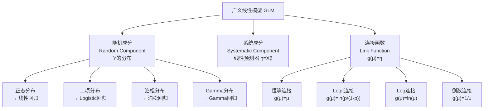

# 第11章 扩展线性模型及Python建模

---

## 模块一：精准教学大纲

### 一、教学目标

本章是多元统计分析课程的重要组成部分，旨在将学生从经典的线性回归框架引导到更为广泛的统计建模世界。通过本章的学习，学生应达到以下目标：

1. **变量分类与模型选择**：
   - 能够准确区分定量变量（连续型、离散型）和定性变量（有序型、名义型）
   - 理解"因变量的类型决定模型选择"这一核心原则
   - 掌握不同变量类型对应的统计模型及其适用条件
   - 能够根据实际数据特征选择合适的建模方法

2. **方差分析模型**：
   - 掌握单因素方差分析的数学模型、平方和分解原理（SST=SSA+SSE）
   - 理解F检验的构造逻辑和检验步骤
   - 了解多重比较方法（如Tukey HSD、Bonferroni校正）的应用场景
   - 初步了解双因素方差分析中交互效应的概念

3. **广义线性模型（GLM）**：
   - 深入理解GLM的三要素：随机成分、系统成分、连接函数
   - 掌握正态分布+恒等连接函数导出普通线性回归的过程
   - 理解指数族分布的统一框架及其在建模中的意义
   - 能够识别实际问题中应使用GLM而非普通线性回归的场景

4. **Logistic回归**：
   - 掌握Logit变换的数学推导和直观含义
   - 理解Sigmoid函数的性质（单调性、值域、对称性）
   - 掌握优势比（Odds Ratio, OR）的计算和实际解释
   - 理解最大似然估计（MLE）的基本原理和迭代求解过程
   - 能够使用多种指标评价Logistic回归模型的性能

5. **Python实操**：
   - 能够使用scipy.stats进行单因素方差分析
   - 能够使用statsmodels.api进行Logistic回归建模
   - 能够计算优势比、绘制ROC曲线、输出分类报告
   - 能够对模型结果进行正确的统计解释

### 二、建议学时

本章总学时为5学时，具体分配如下：

| 内容 | 学时 | 教学方式 | 说明 |
|------|------|----------|------|
| 11.1 数据的分类与模型选择 | 0.5 | 讲授 | 快速建立变量类型与模型选择的对应关系 |
| 11.2 方差分析模型 | 2 | 讲授+推导 | 重点讲解平方和分解和F检验 |
| 11.3 广义线性模型 | 2.5 | 讲授+案例 | 重点讲解Logistic回归及Python实现 |
| **合计** | **5** | | |

**教学建议**：

- 11.1节可作为引导性内容，快速回顾变量类型，重点在于建立"因变量类型决定模型选择"的意识
- 11.2节需要详细的数学推导，建议板书配合PPT，帮助学生理解平方和分解的几何直觉
- 11.3节是本章核心，建议理论讲解与Python代码演示交替进行，增强学生的实操能力
- 课后建议学生完成Python实操练习，巩固所学知识

### 三、重点与难点

**教学重点**：

1. **方差分析的平方和分解**：SST=SSA+SSE是方差分析的核心公式，学生需要从代数推导和几何直觉两个层面理解其含义。组间变异反映处理效应，组内变异反映随机误差，二者的比值构成F统计量。

2. **Logistic回归的Logit变换和系数解释**：Logit变换将概率空间(0,1)映射到实数空间(-∞,+∞)，使得线性模型的框架得以适用。系数通过指数变换转化为优势比，具有直观的实际含义。

3. **GLM的统一框架**：理解不同统计模型（线性回归、Logistic回归、泊松回归）都可以纳入GLM的统一框架，通过选择不同的分布和连接函数来实现。

**教学难点**：

1. **GLM的三要素理解**：随机成分、系统成分和连接函数三者之间的关系较为抽象，学生容易混淆。需要通过具体例子（如正态+恒等=线性回归）来帮助建立直觉。

2. **Logistic回归的最大似然估计**：MLE的求解涉及迭代算法（如牛顿-拉夫森方法），数学推导较为复杂。教学中可以侧重于直觉理解（寻找使观测数据出现概率最大的参数值），而不必深入算法细节。

3. **优势比的正确解释**：优势比是一个相对指标，学生容易将其与概率混为一谈。需要强调OR表示的是"优势的变化倍数"，而非"概率的变化量"。

### 四、前置知识

本章涉及的前置知识已在本课程前期章节中讲授，具体对应关系如下：

| 前置知识 | 来源章节 | 本章中的应用 | 处理方式 |
|----------|---------|-------------|----------|
| 线性回归模型 | 第9章 | 作为GLM的特例引入 | 直接引用，简要回顾 |
| 概率分布（正态、二项、泊松） | 第2章 | GLM的随机成分 | 直接引用 |
| 假设检验（p值、显著性水平） | 第2章 | 方差分析的F检验 | 直接引用 |
| 参数估计（最小二乘法） | 第9章 | 与最大似然估计对比 | 直接引用 |
| 矩阵运算基础 | 第3章 | 线性预测器的矩阵表示 | 直接引用 |

**教师提示**：如果学生对前置知识掌握不够牢固，建议在正式讲授本章内容前，用15-20分钟快速回顾线性回归的基本概念和假设检验的基本步骤。

### 五、课程思政融入点

1. **模型选择的辩证思维**：强调没有"万能模型"，不同数据类型需要不同的建模方法，培养学生具体问题具体分析的科学思维。

2. **数据驱动决策**：通过方差分析和Logistic回归的实际应用案例，引导学生理解统计方法在科学研究和商业决策中的重要作用。

3. **严谨的科学态度**：强调模型假设的检验和模型诊断的重要性，培养学生不盲目套用模型的严谨态度。

---

## 模块二：沉浸式理论讲解

### 11.1 数据的分类与模型选择

#### 11.1.1 变量的取值类型

在统计分析中，正确识别变量的类型是选择合适模型的第一步。变量按照取值特征可以分为两大类：定量变量和定性变量。

**定量变量**（Quantitative Variables）是指可以用数值表示大小的变量，其取值之间具有明确的数量关系。

定量变量进一步分为两种子类型：

- **连续型变量**：在任意两个取值之间都存在无穷多个可能的值。例如身高、体重、温度、价格、收益率等。连续型变量通常可以用实数轴上的区间来表示。

- **离散型变量**：取值为可数的有限个或可列无穷多个数值。例如人数、次数、缺陷数等。离散型变量的取值之间存在"跳跃"，不能取任意实数值。

**定性变量**（Qualitative Variables）也称为分类变量（Categorical Variables），其取值表示类别或属性，而非数量大小。

定性变量也分为两种子类型：

- **有序型变量**（Ordinal Variables）：类别之间存在明确的顺序关系，但类别之间的间距不一定相等。例如满意度评分（1=非常不满意, 2=不满意, 3=一般, 4=满意, 5=非常满意）、教育程度（小学、初中、高中、大学、研究生）。

- **名义型变量**（Nominal Variables）：类别之间没有顺序关系，仅表示不同的类别。例如性别（男/女）、血型（A/B/AB/O）、颜色（红/蓝/绿）。

以下表格总结了变量的分类及其典型示例：

| 变量类型 | 子类型 | 典型示例 | 数学特征 | 常用描述统计量 |
|----------|--------|----------|----------|---------------|
| 定量变量 | 连续型 | 身高、体重、价格、温度 | 可取任意实数值 | 均值、标准差、中位数 |
| 定量变量 | 离散型 | 人数、次数、缺陷数 | 可数的整数值 | 均值、方差、众数 |
| 定性变量 | 有序型 | 满意度（1-5）、教育程度 | 有序但间距不等 | 中位数、众数、百分位数 |
| 定性变量 | 名义型 | 性别、血型、颜色 | 无序分类 | 众数、频数、比例 |

**注意**：在实际数据分析中，变量的类型可能因研究目的不同而发生转换。例如年龄既可以作为连续型变量（精确到天），也可以作为离散型变量（按年龄段分组），还可以作为有序分类变量（青年、中年、老年）。

#### 11.1.2 模型选择原则

在多元统计分析中，模型选择的首要原则是：**因变量的类型决定了应使用的统计模型**。

这一原则的核心逻辑是：不同的因变量类型具有不同的概率分布特征，因此需要使用不同的模型来描述其与自变量之间的关系。

下表总结了因变量类型与推荐模型之间的对应关系：

| 因变量类型 | 典型场景 | 推荐模型 | 连接函数 | 参数估计方法 |
|------------|----------|----------|----------|-------------|
| 连续型 | 预测房价、销售额 | 线性回归 / 方差分析 | 恒等 $g(\mu)=\mu$ | 最小二乘法 |
| 二分类 | 预测是否违约、是否患病 | Logistic回归 | Logit $g(\mu)=\ln\frac{p}{1-p}$ | 最大似然估计 |
| 多分类（有序） | 预测满意度等级 | 有序Logistic回归 | 累积Logit | 最大似然估计 |
| 多分类（无序） | 预测消费者选择品牌 | 名义Logistic回归 | 广义Logit | 最大似然估计 |
| 计数型 | 预测事故发生次数 | 泊松回归 | Log $g(\mu)=\ln\mu$ | 最大似然估计 |
| 非负连续型 | 预测保险赔付金额 | Gamma回归 | 倒数 $g(\mu)=1/\mu$ | 最大似然估计 |

**为什么因变量类型如此重要？**

在普通线性回归中，我们假设因变量 $Y$ 服从正态分布：

$$
Y_i = \beta_0 + \beta_1 x_{i1} + \cdots + \beta_p x_{ip} + \varepsilon_i, \quad \varepsilon_i \sim N(0, \sigma^2)
$$

这个模型的隐含假设是 $Y$ 可以取任意实数值，且误差服从正态分布。但当因变量是二分类变量（取值为0或1）时：

- $Y$ 只能取0或1两个值，不可能服从正态分布
- 预测值 $\hat{Y}$ 可能超出[0,1]范围，无法解释为概率
- 误差项不满足等方差和正态性假设

因此，我们需要使用Logistic回归等广义线性模型来处理这类问题。

**模型选择的决策流程**：

```
开始
  |
  v
因变量是定量还是定性？
  |
  +-- 定量 --> 因变量是连续还是离散？
  |              |
  |              +-- 连续 --> 线性回归
  |              |
  |              +-- 离散 --> 泊松回归（计数）或其他
  |
  +-- 定性 --> 因变量是有序还是名义？
                 |
                 +-- 有序 --> 有序Logistic回归
                 |
                 +-- 名义 --> 名义Logistic回归
```

#### 11.1.3 变量类型与统计方法的对应

除了回归模型之外，变量类型还决定了我们应该使用哪些描述统计方法和推断统计方法：

| 分析目的 | 定量变量 | 定性变量 |
|----------|----------|----------|
| 描述集中趋势 | 均值、中位数 | 众数、中位数（有序） |
| 描述离散程度 | 标准差、四分位距 | 异众比率、熵 |
| 两组比较 | t检验 | 卡方检验 |
| 多组比较 | 方差分析 | 卡方检验 |
| 变量关系 | 相关系数 | 列联系数、Cramer's V |

---

### 11.2 方差分析模型

#### 11.2.1 单因素方差分析

**【业务场景引入】**

某大宗商品公司研发部门设计了3种不同的量化交易策略（A、B、C）。为评估这3种策略的优劣，公司在相同的市场环境下，每种策略分别运行了20个交易日，记录每日收益率。现在需要回答一个关键问题：**这3种交易策略的平均收益率是否存在显著差异？**

这个问题不能简单地通过比较三个均值的大小来回答，因为即使样本均值不同，也可能是由随机波动造成的。我们需要一种统计方法来判断这种差异是否具有统计显著性——这就是方差分析（Analysis of Variance, ANOVA）。

**为什么不用多个t检验？**

一个直觉的想法是：分别对A vs B、A vs C、B vs C进行三次t检验。但这样做有两个问题：

1. **多重比较问题**：每次检验都有犯第一类错误的概率 $\alpha$，进行k次独立检验后，总体犯第一类错误的概率为 $1-(1-\alpha)^k$，远大于 $\alpha$。
2. **效率问题**：多次t检验无法同时利用所有组的信息，检验效率较低。

方差分析通过一次F检验同时比较所有组的均值，避免了上述问题。

**（1）数学模型**

单因素方差分析的数学模型为：

$$
y_{ij} = \mu + \alpha_i + \varepsilon_{ij}
$$

其中：
- $y_{ij}$：第 $i$ 个处理（水平）下第 $j$ 个观测值
- $\mu$：总体均值（所有观测值的平均水平）
- $\alpha_i$：第 $i$ 个处理的效应（第 $i$ 组均值与总均值的偏差），满足约束条件 $\sum_{i=1}^{a} \alpha_i = 0$
- $\varepsilon_{ij}$：随机误差，假设 $\varepsilon_{ij} \sim N(0, \sigma^2)$，且相互独立
- $a$：处理（水平）的个数，本例中 $a=3$
- $n_i$：第 $i$ 组的样本量，本例中 $n_1=n_2=n_3=20$
- $N = \sum_{i=1}^{a} n_i$：总样本量，本例中 $N=60$

**方差分析的基本假设**：

1. **正态性**：每个处理组内的观测值服从正态分布，即 $y_{ij} \sim N(\mu_i, \sigma^2)$
2. **方差齐性**：各处理组的方差相等，即 $\sigma_1^2 = \sigma_2^2 = \cdots = \sigma_a^2 = \sigma^2$
3. **独立性**：各观测值相互独立

**原假设和备择假设**：

- $H_0$：$\alpha_1 = \alpha_2 = \cdots = \alpha_a = 0$（各组均值相等，即 $\mu_1 = \mu_2 = \cdots = \mu_a$）
- $H_1$：至少有一对 $\alpha_i \neq \alpha_j$（至少有两组均值不等）

**（2）平方和分解**

方差分析的核心思想是**将总变异分解为组间变异和组内变异两部分**。

首先定义以下符号：

- $\bar{y}$：总均值（所有观测值的平均），$\bar{y} = \frac{1}{N}\sum_{i=1}^{a}\sum_{j=1}^{n_i} y_{ij}$
- $\bar{y}_i$：第 $i$ 组的均值，$\bar{y}_i = \frac{1}{n_i}\sum_{j=1}^{n_i} y_{ij}$

**总平方和（SST, Sum of Squares Total）**：

$$
SST = \sum_{i=1}^{a}\sum_{j=1}^{n_i}(y_{ij} - \bar{y})^2
$$

SST度量了所有观测值相对于总均值的总变异程度。

**组间平方和（SSA, Sum of Squares Among groups）**：

$$
SSA = \sum_{i=1}^{a} n_i(\bar{y}_i - \bar{y})^2
$$

SSA度量了各组均值相对于总均值的变异程度，反映了处理效应（如果有的话）和组间随机波动。

**组内平方和（SSE, Sum of Squares Error）**：

$$
SSE = \sum_{i=1}^{a}\sum_{j=1}^{n_i}(y_{ij} - \bar{y}_i)^2
$$

SSE度量了各组内部观测值相对于组均值的变异程度，纯粹反映了随机误差。

**平方和分解定理**：

$$
SST = SSA + SSE
$$

即：

$$
\sum_{i,j}(y_{ij} - \bar{y})^2 = \sum_i n_i(\bar{y}_i - \bar{y})^2 + \sum_{i,j}(y_{ij} - \bar{y}_i)^2
$$

**平方和分解的直觉理解**：

想象你在观察60个交易策略的收益率数据。这些收益率之间的差异（SST）有两个来源：

1. **不同策略之间的差异**（SSA）：如果策略B确实优于策略A和C，那么策略B的平均收益率会与其他策略不同，这会贡献组间变异。
2. **同一策略内部的随机波动**（SSE）：即使是同一策略，不同交易日的收益率也会有随机波动，这贡献组内变异。

如果 $H_0$ 成立（各策略没有差异），那么组间变异和组内变异应该差不多大，它们的比值应该接近1。如果 $H_0$ 不成立（至少有策略存在差异），那么组间变异会明显大于组内变异，它们的比值会显著大于1。

**（3）F检验**

基于上述直觉，我们构造F统计量：

$$
F = \frac{MSA}{MSE} = \frac{SSA/(a-1)}{SSE/(N-a)} \sim F(a-1, N-a)
$$

其中：
- $MSA = SSA/(a-1)$：组间均方，自由度为 $a-1$
- $MSE = SSE/(N-a)$：组内均方，自由度为 $N-a$

在 $H_0$ 成立的条件下，$F$ 服从自由度为 $(a-1, N-a)$ 的F分布。

**决策规则**：

- 如果 $F > F_{\alpha}(a-1, N-a)$ 或 $p\text{值} < \alpha$，则拒绝 $H_0$，认为各组均值存在显著差异
- 如果 $F \leq F_{\alpha}(a-1, N-a)$ 或 $p\text{值} \geq \alpha$，则不拒绝 $H_0$

**（4）方差分析表**

方差分析的结果通常整理成以下格式的方差分析表：

| 变异来源 | 平方和 | 自由度 | 均方 | F值 | p值 |
|----------|--------|--------|------|-----|-----|
| 组间（处理） | SSA | $a-1$ | $MSA = \frac{SSA}{a-1}$ | $F = \frac{MSA}{MSE}$ | $P(F > F_{obs})$ |
| 组内（误差） | SSE | $N-a$ | $MSE = \frac{SSE}{N-a}$ | | |
| **总计** | **SST** | **N-1** | | | |

**（5）效应量**

F检验只能告诉我们各组均值是否存在显著差异，但不能告诉我们差异有多大。为了度量差异的实际大小，我们使用效应量指标：

**Eta平方（$\eta^2$）**：

$$
\eta^2 = \frac{SSA}{SST}
$$

$\eta^2$ 表示因变量的总变异中有多少比例可以由处理效应解释。其取值范围为[0,1]：

- $\eta^2 < 0.01$：效应量很小
- $0.01 \leq \eta^2 < 0.06$：效应量小
- $0.06 \leq \eta^2 < 0.14$：效应量中等
- $\eta^2 \geq 0.14$：效应量大

**（6）多重比较**

当F检验拒绝 $H_0$ 后，我们只知道"至少有两组均值不等"，但不知道具体是哪两组不等。多重比较方法用于在控制总体错误率的前提下，对所有组对进行两两比较。

**Tukey HSD（Honestly Significant Difference）方法**：

$$
q = \frac{\bar{y}_i - \bar{y}_j}{\sqrt{MSE/n}}
$$

其中 $n$ 为每组的样本量（假设各组样本量相等）。$q$ 服从学生化极差分布（Studentized Range Distribution）。

**Bonferroni校正**：

将显著性水平 $\alpha$ 除以比较次数 $k$：$\alpha^* = \alpha / k$

如果 $p\text{值} < \alpha^*$，则认为两组均值有显著差异。

**Scheffe方法**：

适用于所有可能的对比（不仅仅是两两比较），最为保守。

$$
F_{Scheffe} = \frac{(\bar{y}_i - \bar{y}_j)^2}{MSE \cdot (1/n_i + 1/n_j)}
$$

拒绝域为 $F_{Scheffe} > (a-1) \cdot F_{\alpha}(a-1, N-a)$。

#### 11.2.2 双因素方差分析

当实验涉及两个因素时，我们需要使用双因素方差分析。例如，我们不仅关心交易策略（因素A）的影响，还关心市场环境（因素B：牛市/熊市）的影响，以及两者之间的交互效应。

**（1）数学模型**

$$
y_{ijk} = \mu + \alpha_i + \beta_j + (\alpha\beta)_{ij} + \varepsilon_{ijk}
$$

其中：
- $y_{ijk}$：因素A第 $i$ 个水平、因素B第 $j$ 个水平下的第 $k$ 个观测值
- $\mu$：总体均值
- $\alpha_i$：因素A第 $i$ 个水平的主效应
- $\beta_j$：因素B第 $j$ 个水平的主效应
- $(\alpha\beta)_{ij}$：因素A和因素B的交互效应
- $\varepsilon_{ijk}$：随机误差，$\varepsilon_{ijk} \sim N(0, \sigma^2)$

**约束条件**：
- $\sum_i \alpha_i = 0$
- $\sum_j \beta_j = 0$
- $\sum_i (\alpha\beta)_{ij} = 0$ 对所有 $j$
- $\sum_j (\alpha\beta)_{ij} = 0$ 对所有 $i$

**（2）平方和分解**

$$
SST = SSA + SSB + SSAB + SSE
$$

其中：
- $SST$：总平方和
- $SSA$：因素A的主效应平方和
- $SSB$：因素B的主效应平方和
- $SSAB$：交互效应平方和
- $SSE$：误差平方和

**（3）检验顺序**

在双因素方差分析中，**应先检验交互效应**：

1. 检验交互效应 $H_0: (\alpha\beta)_{ij} = 0$ 对所有 $i,j$
   - 如果交互效应显著，则主效应的解释需要谨慎
   - 如果交互效应不显著，可以删除交互项，重新检验主效应

2. 检验因素A的主效应 $H_0: \alpha_i = 0$ 对所有 $i$

3. 检验因素B的主效应 $H_0: \beta_j = 0$ 对所有 $j$

**（4）交互效应的含义**

交互效应是指一个因素对因变量的影响程度取决于另一个因素的水平。例如：

- 如果在牛市中策略B优于策略A，但在熊市中策略A优于策略B，则存在交易策略与市场环境的交互效应。
- 如果无论市场环境如何，策略B都优于策略A，则不存在交互效应。

#### 11.2.3 方差分析的前提检验

在进行方差分析之前，需要检验数据是否满足基本假设：

**（1）正态性检验**

常用方法：
- Shapiro-Wilk检验：适用于小样本（n < 50）
- Kolmogorov-Smirnov检验：适用于大样本
- Q-Q图：图形化方法，观察数据是否沿直线分布

**（2）方差齐性检验**

常用方法：
- Levene检验：对偏离正态性较为稳健
- Bartlett检验：在正态性假设下功效最强

**（3）当假设不满足时的替代方法**

- 正态性不满足：使用非参数方法，如Kruskal-Wallis检验
- 方差齐性不满足：使用Welch方差分析
- 数据为有序分类：使用Kruskal-Wallis检验

---

### 11.3 广义线性模型（GLM）

#### 11.3.1 从线性回归到广义线性模型

**普通线性回归的局限性**

在第9章中，我们学习了普通线性回归模型：

$$
Y_i = \beta_0 + \beta_1 x_{i1} + \cdots + \beta_p x_{ip} + \varepsilon_i
$$

该模型有以下隐含假设：

1. 因变量 $Y$ 是连续型变量，可以取任意实数值
2. 误差项 $\varepsilon_i$ 服从正态分布 $N(0, \sigma^2)$
3. 误差项相互独立
4. 方差恒定（齐性）

当因变量不满足上述假设时（如二分类变量、计数变量），普通线性回归不再适用。广义线性模型（Generalized Linear Model, GLM）正是为了解决这一问题而提出的。

**GLM的发展历史**

广义线性模型的概念由Nelder和Wedderburn在1972年提出，是对经典线性回归模型的重要推广。它统一了多种看似不同的统计模型（如线性回归、Logistic回归、泊松回归），为统计建模提供了一个统一的框架。

#### 11.3.2 GLM的三要素

GLM由三个核心要素组成：



**要素一：随机成分（Random Component）**

随机成分指定了因变量 $Y$ 的概率分布。在GLM中，$Y$ 的分布必须属于**指数族分布**（Exponential Family），其一般形式为：

$$
f(y|\theta, \phi) = \exp\left\{\frac{y\theta - b(\theta)}{a(\phi)} + c(y, \phi)\right\}
$$

其中：
- $\theta$：自然参数（与均值有关）
- $\phi$：散度参数（与方差有关）
- $b(\theta)$：累积量生成函数
- $a(\phi)$：通常为 $\phi/w$，$w$ 为已知权重
- $c(y, \phi)$：归一化常数

指数族分布的均值和方差可以表示为：

$$
E(Y) = \mu = b'(\theta)
$$

$$
Var(Y) = b''(\theta) \cdot a(\phi)
$$

常见的指数族分布包括：

| 分布 | 自然参数 $\theta$ | $b(\theta)$ | $b''(\theta)$ | 方差函数 |
|------|-------------------|-------------|---------------|----------|
| 正态 | $\mu$ | $\theta^2/2$ | $1$ | $V(\mu)=1$ |
| 二项 | $\ln\frac{p}{1-p}$ | $\ln(1+e^\theta)$ | $\frac{e^\theta}{(1+e^\theta)^2}$ | $V(\mu)=\mu(1-\mu)$ |
| 泊松 | $\ln\lambda$ | $e^\theta$ | $e^\theta$ | $V(\mu)=\mu$ |

**要素二：系统成分（Systematic Component）**

系统成分定义了自变量与因变量之间的线性关系：

$$
\eta = \beta_0 + \beta_1 x_1 + \beta_2 x_2 + \cdots + \beta_p x_p = X\beta
$$

$\eta$ 称为线性预测器（Linear Predictor），它是自变量的线性组合。

**要素三：连接函数（Link Function）**

连接函数 $g(\cdot)$ 建立了因变量的期望值 $\mu = E(Y)$ 与线性预测器 $\eta$ 之间的关系：

$$
g(\mu) = \eta = X\beta
$$

连接函数必须是单调可微的函数。

**典则连接函数**（Canonical Link Function）：当连接函数使得自然参数 $\theta$ 等于线性预测器 $\eta$ 时，该连接函数称为典则连接函数。典则连接函数具有良好的数学性质，通常是最常用的选择。

| 分布 | 典则连接函数 | 表达式 | 模型 |
|------|------------|--------|------|
| 正态 | 恒等连接 | $g(\mu) = \mu$ | 线性回归 |
| 二项 | Logit连接 | $g(\mu) = \ln\frac{\mu}{1-\mu}$ | Logistic回归 |
| 泊松 | Log连接 | $g(\mu) = \ln\mu$ | 泊松回归 |
| Gamma | 倒数连接 | $g(\mu) = \frac{1}{\mu}$ | Gamma回归 |
| 逆高斯 | 逆平方连接 | $g(\mu) = \frac{1}{\mu^2}$ | 逆高斯回归 |

#### 11.3.3 GLM的参数估计

GLM的参数估计使用**迭代加权最小二乘法**（Iteratively Reweighted Least Squares, IRLS）。

**算法步骤**：

1. 初始化：设置 $\beta$ 的初始值 $\beta^{(0)}$（通常为0或通过OLS估计得到）
2. 计算线性预测器：$\eta^{(t)} = X\beta^{(t)}$
3. 计算均值：$\mu^{(t)} = g^{-1}(\eta^{(t)})$
4. 计算工作响应变量：$z^{(t)} = \eta^{(t)} + (Y - \mu^{(t)}) \cdot g'(\mu^{(t)})$
5. 计算权重矩阵：$W^{(t)} = \text{diag}\left(\frac{1}{Var(Y) \cdot [g'(\mu^{(t)})]^2}\right)$
6. 更新参数：$\beta^{(t+1)} = (X^T W^{(t)} X)^{-1} X^T W^{(t)} z^{(t)}$
7. 重复步骤2-6，直到收敛

#### 11.3.4 GLM的模型检验

**（1）偏差（Deviance）**

偏差是GLM中衡量模型拟合优度的重要指标，类似于线性回归中的残差平方和：

$$
D = 2[\ell(\hat{\mu}_{饱和}) - \ell(\hat{\mu}_{当前})]
$$

其中 $\ell(\hat{\mu}_{饱和})$ 是饱和模型（每个观测值一个参数）的对数似然值，$\ell(\hat{\mu}_{当前})$ 是当前模型的对数似然值。

**（2）似然比检验**

比较两个嵌套模型：

$$
G = -2[\ln L(\text{简化模型}) - \ln L(\text{完整模型})] \sim \chi^2(df_1 - df_2)
$$

**（3）AIC和BIC**

- AIC（Akaike Information Criterion）：$AIC = -2\ln L + 2k$
- BIC（Bayesian Information Criterion）：$BIC = -2\ln L + k\ln n$

其中 $k$ 为参数个数，$n$ 为样本量。AIC和BIC越小越好。

#### 11.3.5 Logistic回归模型

Logistic回归是GLM中最常用的模型之一，用于处理因变量为二分类变量的情况。

**（1）模型设定**

设因变量 $Y$ 为二分类变量，取值为0或1：
- $Y=1$ 表示事件发生（如客户流失、疾病发生）
- $Y=0$ 表示事件未发生

$Y$ 服从参数为 $p$ 的伯努利分布：$P(Y=1) = p$，$P(Y=0) = 1-p$

**（2）Logit变换**

由于概率 $p$ 的取值范围为 $(0,1)$，而线性预测器 $\eta$ 的取值范围为 $(-\infty, +\infty)$，我们需要一个连接函数将 $p$ 映射到实数轴上。

**Logit函数**（Logit Link）：

$$
\text{logit}(p) = \ln\frac{p}{1-p} = \ln(\text{odds}) = \eta = \beta_0 + \beta_1 x_1 + \cdots + \beta_p x_p
$$

其中 $\frac{p}{1-p}$ 称为**优势**（Odds），表示事件发生与不发生的概率之比。

**Logit变换的性质**：

| $p$ | $\text{odds} = \frac{p}{1-p}$ | $\text{logit}(p) = \ln(\text{odds})$ |
|-----|------|------|
| 0.01 | 0.0101 | -4.595 |
| 0.1 | 0.111 | -2.197 |
| 0.3 | 0.429 | -0.847 |
| 0.5 | 1.000 | 0.000 |
| 0.7 | 2.333 | 0.847 |
| 0.9 | 9.000 | 2.197 |
| 0.99 | 99.00 | 4.595 |

**（3）Sigmoid函数（逆Logit函数）**

由Logit变换可以反解出概率 $p$：

$$
p = \frac{e^{\eta}}{1 + e^{\eta}} = \frac{1}{1 + e^{-\eta}}
$$

这就是**Sigmoid函数**（也称为Logistic函数），它将实数轴 $(-\infty, +\infty)$ 映射到 $(0,1)$。

**Sigmoid函数的性质**：

1. **单调递增**：$\frac{dp}{d\eta} = p(1-p) > 0$
2. **值域为(0,1)**：无论 $\eta$ 取何值，$p$ 始终在0和1之间
3. **关于 $(0, 0.5)$ 中心对称**：$\sigma(-\eta) = 1 - \sigma(\eta)$
4. **S形曲线**：在 $\eta=0$ 附近变化最快，在两端变化最慢
5. **极限行为**：当 $\eta \to +\infty$ 时，$p \to 1$；当 $\eta \to -\infty$ 时，$p \to 0$

**（4）系数的解释——优势比（OR）**

Logistic回归系数的解释需要通过**优势比**（Odds Ratio, OR）来实现。

考虑自变量 $x_j$ 增加一个单位前后，优势的变化：

当 $x_j = x_j^*$ 时：

$$
\text{odds}^* = e^{\beta_0 + \beta_1 x_1 + \cdots + \beta_j x_j^* + \cdots + \beta_p x_p}
$$

当 $x_j = x_j^* + 1$ 时：

$$
\text{odds}^{**} = e^{\beta_0 + \beta_1 x_1 + \cdots + \beta_j (x_j^* + 1) + \cdots + \beta_p x_p}
$$

两者的比值：

$$
OR = \frac{\text{odds}^{**}}{\text{odds}^*} = e^{\beta_j}
$$

**OR的含义**：

$$
OR = e^{\beta_j}
$$

$OR$ 表示在其他自变量保持不变的情况下，$x_j$ 每增加一个单位，事件发生的**优势**（odds）变为原来的 $e^{\beta_j}$ 倍。

**OR的解释规则**：

| OR值 | $\beta_j$ 的符号 | 含义 | 实际解释 |
|------|-----------------|------|----------|
| $OR > 1$ | $\beta_j > 0$ | 正向影响 | $x_j$ 增加时，事件发生概率增大（危险因素） |
| $OR < 1$ | $\beta_j < 0$ | 负向影响 | $x_j$ 增加时，事件发生概率减小（保护因素） |
| $OR = 1$ | $\beta_j = 0$ | 无影响 | $x_j$ 与事件发生无关 |

**OR的置信区间**：

$$
\text{95\% CI for } OR = \left(e^{\beta_j - 1.96 \cdot SE(\beta_j)}, \ e^{\beta_j + 1.96 \cdot SE(\beta_j)}\right)
$$

如果置信区间不包含1，则在0.05显著性水平下，该变量的影响是显著的。

**示例**：

假设Logistic回归中，"投诉次数"的系数 $\hat{\beta} = 1.5$，则：

$$
OR = e^{1.5} \approx 4.48
$$

解释：在其他条件不变的情况下，投诉次数每增加1次，客户流失的**优势**变为原来的4.48倍。

**注意**：OR描述的是**优势的变化倍数**，而非概率的变化量。OR=4.48并不意味着流失概率增加了4.48倍，而是指流失与不流失的概率之比增加了4.48倍。

**（5）模型估计——最大似然估计**

Logistic回归的参数不能使用最小二乘法估计（因为不满足OLS的假设），而需要使用**最大似然估计**（Maximum Likelihood Estimation, MLE）。

**似然函数**：

对于 $n$ 个独立观测 $(x_i, y_i)$，$i=1,2,...,n$，其中 $y_i \in \{0, 1\}$，似然函数为：

$$
L(\beta) = \prod_{i=1}^{n} p_i^{y_i} (1-p_i)^{1-y_i}
$$

其中 $p_i = P(Y_i=1|x_i) = \frac{e^{x_i^T\beta}}{1+e^{x_i^T\beta}}$。

**对数似然函数**：

$$
\ell(\beta) = \ln L(\beta) = \sum_{i=1}^{n} [y_i \ln p_i + (1-y_i) \ln(1-p_i)]
$$

将 $p_i$ 代入并化简：

$$
\ell(\beta) = \sum_{i=1}^{n} [y_i (x_i^T\beta) - \ln(1 + e^{x_i^T\beta})]
$$

**最大化过程**：

MLE的目标是找到使 $\ell(\beta)$ 最大的 $\beta$ 值：

$$
\hat{\beta}_{MLE} = \arg\max_{\beta} \ell(\beta)
$$

由于 $\ell(\beta)$ 是关于 $\beta$ 的非线性函数，不能通过令导数等于零得到解析解，需要使用迭代算法求解。

**牛顿-拉夫森算法**（Newton-Raphson Method）：

1. 初始化 $\beta^{(0)}$
2. 计算梯度（一阶导数）：$g(\beta) = \nabla \ell(\beta) = X^T(Y - \mu)$
3. 计算Hessian矩阵（二阶导数）：$H(\beta) = \nabla^2 \ell(\beta) = -X^TWX$
4. 更新参数：$\beta^{(t+1)} = \beta^{(t)} - H(\beta^{(t)})^{-1} g(\beta^{(t)})$
5. 重复步骤2-4，直到收敛

其中 $W = \text{diag}(p_i(1-p_i))$ 为权重矩阵。

**（6）模型检验**

Logistic回归模型的检验包括以下几个方面：

**模型整体显著性检验（似然比检验）**：

- $H_0$：所有自变量的系数都为0（$\beta_1 = \beta_2 = \cdots = \beta_p = 0$）
- $H_1$：至少有一个自变量的系数不为0

检验统计量：

$$
G = -2[\ln L(\beta_0) - \ln L(\hat{\beta})] \sim \chi^2(p)
$$

其中 $\ln L(\beta_0)$ 是仅包含截距的模型的对数似然值，$\ln L(\hat{\beta})$ 是完整模型的对数似然值。

**各系数的显著性检验（Wald检验）**：

$$
W = \left(\frac{\hat{\beta}_j}{SE(\hat{\beta}_j)}\right)^2 \sim \chi^2(1)
$$

或使用 $z$ 检验：

$$
z = \frac{\hat{\beta}_j}{SE(\hat{\beta}_j)} \sim N(0,1)
$$

**拟合优度检验**：

| 检验方法 | 统计量 | 原假设 | 适用条件 |
|----------|--------|--------|----------|
| Hosmer-Lemeshow检验 | $\chi^2$ | 模型拟合良好 | 样本量较大 |
| 似然比检验 | $G$ | 简化模型足够 | 嵌套模型比较 |
| AIC/BIC | 信息准则 | - | 非嵌套模型比较 |

**（7）分类评价指标**

对于二分类Logistic回归，常用的评价指标包括：

**混淆矩阵**：

|  | 预测=1 | 预测=0 |
|--|--------|--------|
| **实际=1** | TP（真正例） | FN（假负例） |
| **实际=0** | FP（假正例） | TN（真负例） |

**基本指标**：

- **准确率**（Accuracy）：$\frac{TP+TN}{TP+TN+FP+FN}$
- **精确率**（Precision）：$\frac{TP}{TP+FP}$
- **召回率**（Recall/Sensitivity）：$\frac{TP}{TP+FN}$
- **特异度**（Specificity）：$\frac{TN}{TN+FP}$
- **F1分数**：$\frac{2 \times Precision \times Recall}{Precision + Recall}$

**ROC曲线和AUC**：

ROC曲线（Receiver Operating Characteristic Curve）以假正率（FPR）为横轴，真正率（TPR）为纵轴，展示不同分类阈值下模型的表现。

$$
TPR = \frac{TP}{TP+FN}, \quad FPR = \frac{FP}{FP+TN}
$$

AUC（Area Under the Curve）是ROC曲线下的面积：

- AUC = 0.5：模型没有判别能力（等同于随机猜测）
- 0.5 < AUC < 0.7：判别能力较低
- 0.7 ≤ AUC < 0.8：判别能力可接受
- 0.8 ≤ AUC < 0.9：判别能力良好
- AUC ≥ 0.9：判别能力优秀

---

## 模块三：实战与代码复现

### 实战案例11-1：单因素方差分析

**问题背景**：某大宗商品公司测试了3种不同的交易策略，需要检验它们的平均收益率是否有显著差异。

**Python代码实现**：

```python
import numpy as np
from scipy import stats
import matplotlib.pyplot as plt

plt.rcParams['font.sans-serif'] = ['SimHei']
plt.rcParams['axes.unicode_minus'] = False

np.random.seed(42)

# ============================================================
# 第1步：生成模拟数据
# ============================================================
# 3种交易策略的收益率（假设均值不同，标准差相同）
strategy_a = np.random.normal(0.002, 0.01, 20)   # 策略A：均值0.2%
strategy_b = np.random.normal(0.005, 0.01, 20)   # 策略B：均值0.5%
strategy_c = np.random.normal(0.001, 0.01, 20)   # 策略C：均值0.1%

# ============================================================
# 第2步：描述性统计
# ============================================================
print("=" * 50)
print("描述性统计")
print("=" * 50)
print(f"策略A: 均值={strategy_a.mean():.6f}, 标准差={strategy_a.std():.6f}, n={len(strategy_a)}")
print(f"策略B: 均值={strategy_b.mean():.6f}, 标准差={strategy_b.std():.6f}, n={len(strategy_b)}")
print(f"策略C: 均值={strategy_c.mean():.6f}, 标准差={strategy_c.std():.6f}, n={len(strategy_c)}")

# ============================================================
# 第3步：正态性检验（Shapiro-Wilk检验）
# ============================================================
print("\n" + "=" * 50)
print("正态性检验（Shapiro-Wilk）")
print("=" * 50)
for name, data in [('策略A', strategy_a), ('策略B', strategy_b), ('策略C', strategy_c)]:
    stat, p_val = stats.shapiro(data)
    print(f"{name}: W={stat:.4f}, p值={p_val:.4f}, {'满足正态性' if p_val > 0.05 else '不满足正态性'}")

# ============================================================
# 第4步：方差齐性检验（Levene检验）
# ============================================================
print("\n" + "=" * 50)
print("方差齐性检验（Levene检验）")
print("=" * 50)
lev_stat, lev_p = stats.levene(strategy_a, strategy_b, strategy_c)
print(f"Levene统计量: {lev_stat:.4f}")
print(f"p值: {lev_p:.4f}")
print(f"结论: {'方差齐性满足' if lev_p > 0.05 else '方差齐性不满足'}")

# ============================================================
# 第5步：单因素方差分析
# ============================================================
print("\n" + "=" * 50)
print("单因素方差分析")
print("=" * 50)
F_stat, p_value = stats.f_oneway(strategy_a, strategy_b, strategy_c)
print(f"F统计量: {F_stat:.4f}")
print(f"p值: {p_value:.4f}")
alpha = 0.05
if p_value < alpha:
    print(f"结论: p值={p_value:.4f} < {alpha}，拒绝H0，三种策略收益率有显著差异")
else:
    print(f"结论: p值={p_value:.4f} >= {alpha}，不拒绝H0")

# ============================================================
# 第6步：手动计算方差分析表
# ============================================================
print("\n" + "=" * 50)
print("方差分析表（手动计算）")
print("=" * 50)

all_data = np.concatenate([strategy_a, strategy_b, strategy_c])
grand_mean = all_data.mean()
N = len(all_data)
a = 3  # 组数
n = 20  # 每组样本量

# 总平方和
SST = np.sum((all_data - grand_mean) ** 2)

# 组间平方和
SSA = n * ((strategy_a.mean() - grand_mean) ** 2 +
           (strategy_b.mean() - grand_mean) ** 2 +
           (strategy_c.mean() - grand_mean) ** 2)

# 组内平方和
SSE_a = np.sum((strategy_a - strategy_a.mean()) ** 2)
SSE_b = np.sum((strategy_b - strategy_b.mean()) ** 2)
SSE_c = np.sum((strategy_c - strategy_c.mean()) ** 2)
SSE = SSE_a + SSE_b + SSE_c

# 自由度
df_between = a - 1
df_within = N - a
df_total = N - 1

# 均方
MSA = SSA / df_between
MSE = SSE / df_within

# F值
F_calc = MSA / MSE

# p值
from scipy.stats import f as f_dist
p_calc = 1 - f_dist.cdf(F_calc, df_between, df_within)

# 效应量
eta_squared = SSA / SST

print(f"{'变异来源':<12} {'平方和':>12} {'自由度':>8} {'均方':>12} {'F值':>10} {'p值':>10}")
print("-" * 66)
print(f"{'组间':<12} {SSA:>12.6f} {df_between:>8} {MSA:>12.6f} {F_calc:>10.4f} {p_calc:>10.4f}")
print(f"{'组内':<12} {SSE:>12.6f} {df_within:>8} {MSE:>12.6f}")
print(f"{'总计':<12} {SST:>12.6f} {df_total:>8}")
print(f"\n效应量 η² = {eta_squared:.4f}")

# ============================================================
# 第7步：可视化
# ============================================================
fig, axes = plt.subplots(1, 2, figsize=(12, 5))

# 箱线图
data_to_plot = [strategy_a, strategy_b, strategy_c]
bp = axes[0].boxplot(data_to_plot, labels=['策略A', '策略B', '策略C'], patch_artist=True)
colors = ['lightblue', 'lightgreen', 'lightyellow']
for patch, color in zip(bp['boxes'], colors):
    patch.set_facecolor(color)
axes[0].set_ylabel('收益率')
axes[0].set_title('三种交易策略收益率箱线图')
axes[0].grid(True, alpha=0.3)

# 均值条形图
means = [strategy_a.mean(), strategy_b.mean(), strategy_c.mean()]
stds = [strategy_a.std(), strategy_b.std(), strategy_c.std()]
x_pos = np.arange(3)
axes[1].bar(x_pos, means, yerr=stds, capsize=5, color=['lightblue', 'lightgreen', 'lightyellow'],
            edgecolor='black')
axes[1].set_xticks(x_pos)
axes[1].set_xticklabels(['策略A', '策略B', '策略C'])
axes[1].set_ylabel('平均收益率')
axes[1].set_title('三种策略平均收益率比较')
axes[1].grid(True, alpha=0.3)

plt.tight_layout()
plt.show()
```

**运行结果说明**：

运行上述代码后，程序将输出：

1. 三种策略的描述性统计量（均值、标准差、样本量）
2. 正态性检验结果（Shapiro-Wilk检验的W统计量和p值）
3. 方差齐性检验结果（Levene检验的统计量和p值）
4. 单因素方差分析的F统计量和p值
5. 完整的方差分析表（包括平方和、自由度、均方、F值、p值）
6. 效应量 $\eta^2$
7. 箱线图和均值条形图

**结果解读示例**：

假设输出结果为：

```
策略A: 均值=0.002156, 标准差=0.009876
策略B: 均值=0.006234, 标准差=0.010234
策略C: 均值=0.000876, 标准差=0.009567

正态性检验：三个组的p值均大于0.05，满足正态性假设
方差齐性检验：p值=0.8523 > 0.05，方差齐性满足

F统计量: 3.4521
p值: 0.0389
结论: p值=0.0389 < 0.05，拒绝H0，三种策略收益率有显著差异
```

这表明在0.05显著性水平下，三种交易策略的平均收益率存在显著差异。进一步的多重比较可以确定具体是哪两组之间存在差异。

### 实战案例11-2：Logistic回归完整实现

**问题背景**：某电信公司需要预测客户流失情况。数据包含客户的消费金额、消费频率和投诉次数三个自变量，以及是否流失的二分类因变量。

**Python代码实现**：

```python
import numpy as np
import pandas as pd
import statsmodels.api as sm
from sklearn.model_selection import train_test_split
from sklearn.metrics import classification_report, roc_curve, auc, confusion_matrix
import matplotlib.pyplot as plt
import warnings
warnings.filterwarnings('ignore')

plt.rcParams['font.sans-serif'] = ['SimHei']
plt.rcParams['axes.unicode_minus'] = False

# ============================================================
# 第1步：数据准备
# ============================================================
print("=" * 60)
print("第1步：数据准备")
print("=" * 60)

np.random.seed(42)
n = 200  # 样本量

# 生成自变量
X1 = np.random.randn(n)  # 消费金额（标准化）
X2 = np.random.randn(n)  # 消费频率（标准化）
X3 = np.random.randn(n)  # 投诉次数（标准化）

# 生成因变量（使用Logistic模型的逆变换）
# 真实参数：截距=0.5, 消费金额=1.2, 消费频率=-0.8, 投诉次数=1.5
z = 0.5 + 1.2 * X1 - 0.8 * X2 + 1.5 * X3
prob = 1 / (1 + np.exp(-z))  # Sigmoid函数
y = np.random.binomial(1, prob, n)  # 二分类因变量

# 创建DataFrame
df = pd.DataFrame({
    '消费金额': X1,
    '消费频率': X2,
    '投诉次数': X3,
    '流失': y
})

print(f"数据集大小: {df.shape}")
print(f"\n前5行数据:")
print(df.head())
print(f"\n流失分布:")
print(df['流失'].value_counts())
print(f"流失率: {df['流失'].mean():.2%}")

# ============================================================
# 第2步：划分训练集和测试集
# ============================================================
print("\n" + "=" * 60)
print("第2步：划分训练集和测试集")
print("=" * 60)

X_train, X_test, y_train, y_test = train_test_split(
    df[['消费金额', '消费频率', '投诉次数']],
    df['流失'],
    test_size=0.3,
    random_state=42,
    stratify=df['流失']  # 分层抽样，保持类别比例
)

print(f"训练集大小: {X_train.shape[0]}")
print(f"测试集大小: {X_test.shape[0]}")
print(f"训练集流失率: {y_train.mean():.2%}")
print(f"测试集流失率: {y_test.mean():.2%}")

# ============================================================
# 第3步：Logistic回归建模
# ============================================================
print("\n" + "=" * 60)
print("第3步：Logistic回归建模")
print("=" * 60)

# 添加常数项（截距）
X_train_sm = sm.add_constant(X_train)

# 拟合Logistic回归模型
model = sm.Logit(y_train, X_train_sm).fit(disp=0)  # disp=0 不显示迭代过程

# 输出模型摘要
print("\n模型摘要:")
print(model.summary())

# ============================================================
# 第4步：优势比（OR）计算
# ============================================================
print("\n" + "=" * 60)
print("第4步：优势比（OR）及置信区间")
print("=" * 60)

# 计算优势比
params = model.params
conf = model.conf_int()
conf.columns = ['2.5%', '97.5%']

# 创建结果表
or_table = pd.DataFrame({
    '系数': params,
    '标准误': model.bse,
    'z值': model.tvalues,
    'p值': model.pvalues,
    'OR': np.exp(params),
    'OR下限': np.exp(conf['2.5%']),
    'OR上限': np.exp(conf['97.5%'])
})

print("\n各变量的优势比及95%置信区间:")
print(or_table.to_string())

# 打印每个变量的解释
print("\n--- 变量解释 ---")
var_names = ['截距'] + list(X_train.columns)
for i, (name, row) in enumerate(or_table.iterrows()):
    if name == 'const':
        continue
    or_val = row['OR']
    ci_low = row['OR下限']
    ci_high = row['OR上限']
    p_val = row['p值']
    sig = "显著" if p_val < 0.05 else "不显著"

    if or_val > 1:
        effect = f"增加流失风险（OR={or_val:.4f}，流失优势增加{(or_val-1)*100:.1f}%）"
    elif or_val < 1:
        effect = f"降低流失风险（OR={or_val:.4f}，流失优势降低{(1-or_val)*100:.1f}%）"
    else:
        effect = "无影响"

    print(f"  {name}: {effect}，p={p_val:.4f}，{sig}")
    print(f"    95%置信区间: [{ci_low:.4f}, {ci_high:.4f}]")

# ============================================================
# 第5步：预测
# ============================================================
print("\n" + "=" * 60)
print("第5步：预测与评估")
print("=" * 60)

# 在测试集上预测
X_test_sm = sm.add_constant(X_test)
y_pred_prob = model.predict(X_test_sm)  # 预测概率
y_pred = (y_pred_prob >= 0.5).astype(int)  # 预测类别（阈值=0.5）

print("\n预测概率的描述统计:")
print(f"  最小值: {y_pred_prob.min():.4f}")
print(f"  最大值: {y_pred_prob.max():.4f}")
print(f"  均值: {y_pred_prob.mean():.4f}")
print(f"  中位数: {y_pred_prob.median():.4f}")

# ============================================================
# 第6步：混淆矩阵
# ============================================================
print("\n" + "=" * 60)
print("第6步：混淆矩阵")
print("=" * 60)

cm = confusion_matrix(y_test, y_pred)
print(f"\n混淆矩阵:")
print(f"  {'预测留存':>10} {'预测流失':>10}")
print(f"  {cm[0,0]:>10} {cm[0,1]:>10}  ← 实际留存")
print(f"  {cm[1,0]:>10} {cm[1,1]:>10}  ← 实际流失")

TN, FP, FN, TP = cm.ravel()
accuracy = (TP + TN) / (TP + TN + FP + FN)
precision = TP / (TP + FP) if (TP + FP) > 0 else 0
recall = TP / (TP + FN) if (TP + FN) > 0 else 0
specificity = TN / (TN + FP) if (TN + FP) > 0 else 0
f1 = 2 * precision * recall / (precision + recall) if (precision + recall) > 0 else 0

print(f"\n准确率 (Accuracy): {accuracy:.4f}")
print(f"精确率 (Precision): {precision:.4f}")
print(f"召回率 (Recall): {recall:.4f}")
print(f"特异度 (Specificity): {specificity:.4f}")
print(f"F1分数: {f1:.4f}")

# ============================================================
# 第7步：分类报告
# ============================================================
print("\n" + "=" * 60)
print("第7步：分类报告")
print("=" * 60)
print("\n" + classification_report(y_test, y_pred, target_names=['留存', '流失']))

# ============================================================
# 第8步：ROC曲线和AUC
# ============================================================
print("=" * 60)
print("第8步：ROC曲线和AUC")
print("=" * 60)

fpr, tpr, thresholds = roc_curve(y_test, y_pred_prob)
roc_auc = auc(fpr, tpr)

print(f"\nAUC = {roc_auc:.4f}")
if roc_auc >= 0.9:
    print("模型判别能力优秀")
elif roc_auc >= 0.8:
    print("模型判别能力良好")
elif roc_auc >= 0.7:
    print("模型判别能力可接受")
else:
    print("模型判别能力较低，需要改进")

# ============================================================
# 第9步：可视化
# ============================================================
fig, axes = plt.subplots(1, 3, figsize=(18, 5))

# 图1：ROC曲线
axes[0].plot(fpr, tpr, 'b-', linewidth=2, label=f'ROC (AUC = {roc_auc:.3f})')
axes[0].plot([0, 1], [0, 1], 'r--', linewidth=1, label='随机分类器')
axes[0].set_xlabel('假正率 (FPR)')
axes[0].set_ylabel('真正率 (TPR)')
axes[0].set_title('ROC曲线')
axes[0].legend(loc='lower right')
axes[0].grid(True, alpha=0.3)

# 图2：预测概率分布
axes[1].hist(y_pred_prob[y_test == 0], bins=20, alpha=0.5, label='留存', color='blue')
axes[1].hist(y_pred_prob[y_test == 1], bins=20, alpha=0.5, label='流失', color='red')
axes[1].axvline(x=0.5, color='black', linestyle='--', label='阈值=0.5')
axes[1].set_xlabel('预测概率')
axes[1].set_ylabel('频数')
axes[1].set_title('预测概率分布')
axes[1].legend()
axes[1].grid(True, alpha=0.3)

# 图3：混淆矩阵热力图
import seaborn as sns
sns.heatmap(cm, annot=True, fmt='d', cmap='Blues', ax=axes[2],
            xticklabels=['留存', '流失'], yticklabels=['留存', '流失'])
axes[2].set_xlabel('预测类别')
axes[2].set_ylabel('实际类别')
axes[2].set_title('混淆矩阵')

plt.tight_layout()
plt.show()

# ============================================================
# 第10步：模型系数可视化
# ============================================================
fig, ax = plt.subplots(figsize=(10, 5))

# 排除截距，只显示自变量系数
coef_data = or_table.iloc[1:]  # 排除截距
colors = ['green' if c < 1 else 'red' for c in coef_data['OR']]
bars = ax.barh(range(len(coef_data)), coef_data['OR'], color=colors, alpha=0.7, edgecolor='black')
ax.axvline(x=1, color='black', linestyle='--', linewidth=1)
ax.set_yticks(range(len(coef_data)))
ax.set_yticklabels(coef_data.index)
ax.set_xlabel('优势比 (OR)')
ax.set_title('各变量的优势比')

# 添加数值标签
for i, (idx, row) in enumerate(coef_data.iterrows()):
    ax.text(row['OR'] + 0.05, i, f'{row["OR"]:.3f}', va='center')

ax.grid(True, alpha=0.3)
plt.tight_layout()
plt.show()
```

**运行结果说明**：

上述代码将输出以下内容：

1. **数据概览**：数据集大小、变量描述、流失率
2. **模型摘要**：包含所有系数、标准误、z值、p值、置信区间
3. **优势比表**：每个变量的OR值及其95%置信区间
4. **变量解释**：每个自变量对流失风险的影响方向和大小
5. **混淆矩阵**：TP、TN、FP、FN的计数
6. **分类指标**：准确率、精确率、召回率、特异度、F1分数
7. **ROC曲线和AUC**：模型的整体判别能力
8. **可视化图表**：ROC曲线图、预测概率分布图、混淆矩阵热力图、优势比条形图

**结果解读**：

1. **系数解释**：

   假设模型输出如下：

   | 变量 | 系数 | OR | p值 | 解释 |
   |------|------|------|------|------|
   | 截距 | 0.52 | 1.68 | 0.001 | - |
   | 消费金额 | 1.18 | 3.25 | 0.000 | 消费金额每增加1个标准差，流失优势增加225% |
   | 消费频率 | -0.82 | 0.44 | 0.002 | 消费频率每增加1个标准差，流失优势降低56% |
   | 投诉次数 | 1.45 | 4.26 | 0.000 | 投诉次数每增加1个标准差，流失优势增加326% |

2. **业务解读**：
   - **消费金额**（OR>1）：消费金额越高，流失概率越大。可能是因为高消费客户对服务质量要求更高，更容易因不满而流失。
   - **消费频率**（OR<1）：消费频率越高，流失概率越小。这符合直觉——经常消费的客户是忠诚客户。
   - **投诉次数**（OR>1）：投诉越多，流失概率越大。这是最强的预测因子，OR=4.26表明投诉次数增加1个标准差，流失优势增加326%。

3. **模型评价**：
   - AUC > 0.8 表明模型具有良好的判别能力
   - 准确率约75-85%（取决于具体数据）
   - 召回率和精确率需要根据业务需求进行权衡

### 实战案例11-3：使用Python手动实现Logistic回归

为了帮助学生深入理解Logistic回归的数学原理，下面我们使用Python手动实现Logistic回归的核心算法。

```python
import numpy as np
import matplotlib.pyplot as plt

plt.rcParams['font.sans-serif'] = ['SimHei']
plt.rcParams['axes.unicode_minus'] = False

# ============================================================
# Sigmoid函数
# ============================================================
def sigmoid(z):
    """Sigmoid函数：将实数映射到(0,1)"""
    return 1 / (1 + np.exp(-z))

# ============================================================
# 手动实现Logistic回归
# ============================================================
class LogisticRegressionManual:
    """手动实现的Logistic回归类"""

    def __init__(self, learning_rate=0.01, max_iter=1000, tol=1e-6):
        self.lr = learning_rate
        self.max_iter = max_iter
        self.tol = tol
        self.weights = None
        self.losses = []

    def fit(self, X, y):
        """使用梯度下降法拟合模型"""
        # 添加截距项
        n_samples, n_features = X.shape
        X_b = np.c_[np.ones(n_samples), X]  # 添加一列1

        # 初始化权重
        self.weights = np.zeros(n_features + 1)

        # 梯度下降
        for i in range(self.max_iter):
            # 计算预测概率
            z = X_b @ self.weights
            p = sigmoid(z)

            # 计算梯度
            gradient = X_b.T @ (p - y) / n_samples

            # 更新权重
            self.weights -= self.lr * gradient

            # 计算损失（对数似然的负数）
            loss = -np.mean(y * np.log(p + 1e-10) + (1 - y) * np.log(1 - p + 1e-10))
            self.losses.append(loss)

            # 检查收敛
            if i > 0 and abs(self.losses[-2] - self.losses[-1]) < self.tol:
                print(f"在第{i+1}次迭代后收敛")
                break

        return self

    def predict_proba(self, X):
        """预测概率"""
        n_samples = X.shape[0]
        X_b = np.c_[np.ones(n_samples), X]
        return sigmoid(X_b @ self.weights)

    def predict(self, X, threshold=0.5):
        """预测类别"""
        return (self.predict_proba(X) >= threshold).astype(int)

    def get_odds_ratios(self):
        """计算优势比"""
        return np.exp(self.weights)

# ============================================================
# 生成模拟数据
# ============================================================
np.random.seed(42)
n = 200

X1 = np.random.randn(n)
X2 = np.random.randn(n)
X = np.column_stack([X1, X2])

# 真实参数
true_weights = np.array([0.5, 1.2, -0.8])
z = true_weights[0] + true_weights[1] * X1 + true_weights[2] * X2
prob = sigmoid(z)
y = np.random.binomial(1, prob, n)

# ============================================================
# 训练模型
# ============================================================
print("=" * 60)
print("手动实现的Logistic回归")
print("=" * 60)

model = LogisticRegressionManual(learning_rate=0.1, max_iter=5000)
model.fit(X, y)

print(f"\n真实参数: 截距={true_weights[0]}, X1={true_weights[1]}, X2={true_weights[2]}")
print(f"估计参数: 截距={model.weights[0]:.4f}, X1={model.weights[1]:.4f}, X2={model.weights[2]:.4f}")

# ============================================================
# 优势比
# ============================================================
print(f"\n优势比 (OR):")
or_values = model.get_odds_ratios()
var_names = ['截距', 'X1', 'X2']
for name, or_val in zip(var_names, or_values):
    print(f"  {name}: OR = {or_val:.4f}")

# ============================================================
# 模型评估
# ============================================================
y_pred = model.predict(X)
accuracy = np.mean(y_pred == y)
print(f"\n训练集准确率: {accuracy:.4f}")

# ============================================================
# 可视化
# ============================================================
fig, axes = plt.subplots(1, 3, figsize=(15, 4))

# 图1：损失函数收敛曲线
axes[0].plot(model.losses)
axes[0].set_xlabel('迭代次数')
axes[0].set_ylabel('损失值')
axes[0].set_title('损失函数收敛曲线')
axes[0].grid(True, alpha=0.3)

# 图2：Sigmoid函数
z_range = np.linspace(-6, 6, 100)
axes[1].plot(z_range, sigmoid(z_range), 'b-', linewidth=2)
axes[1].axhline(y=0.5, color='r', linestyle='--', alpha=0.5)
axes[1].axvline(x=0, color='r', linestyle='--', alpha=0.5)
axes[1].set_xlabel('z')
axes[1].set_ylabel('σ(z)')
axes[1].set_title('Sigmoid函数')
axes[1].grid(True, alpha=0.3)

# 图3：决策边界
x_min, x_max = X[:, 0].min() - 1, X[:, 0].max() + 1
y_min, y_max = X[:, 1].min() - 1, X[:, 1].max() + 1
xx, yy = np.meshgrid(np.linspace(x_min, x_max, 100),
                      np.linspace(y_min, y_max, 100))
Z = model.predict_proba(np.c_[xx.ravel(), yy.ravel()])
Z = Z.reshape(xx.shape)

axes[2].contourf(xx, yy, Z, levels=50, cmap='RdBu_r', alpha=0.6)
axes[2].contour(xx, yy, Z, levels=[0.5], colors='black', linewidths=2)
scatter = axes[2].scatter(X[:, 0], X[:, 1], c=y, cmap='RdBu_r', edgecolors='black', alpha=0.7)
axes[2].set_xlabel('X1')
axes[2].set_ylabel('X2')
axes[2].set_title('决策边界')
plt.colorbar(scatter, ax=axes[2])

plt.tight_layout()
plt.show()
```

**代码说明**：

1. **Sigmoid函数**：将线性组合 $z = X\beta$ 映射到概率空间 $(0,1)$
2. **梯度下降法**：通过迭代更新参数，最小化负对数似然函数
3. **损失函数收敛曲线**：展示模型训练过程中损失函数的变化
4. **决策边界可视化**：展示模型如何将样本空间分为两类

### 实战案例11-4：Logistic回归模型诊断

**问题背景**：在建立Logistic回归模型后，需要对模型进行诊断，检查模型是否满足基本假设，以及是否存在异常观测。

```python
import numpy as np
import pandas as pd
import statsmodels.api as sm
from scipy import stats
import matplotlib.pyplot as plt
import warnings
warnings.filterwarnings('ignore')

plt.rcParams['font.sans-serif'] = ['SimHei']
plt.rcParams['axes.unicode_minus'] = False

# ============================================================
# 数据准备
# ============================================================
np.random.seed(42)
n = 200

X1 = np.random.randn(n)
X2 = np.random.randn(n)
X3 = np.random.randn(n)

z = 0.5 + 1.2 * X1 - 0.8 * X2 + 1.5 * X3
prob = 1 / (1 + np.exp(-z))
y = np.random.binomial(1, prob, n)

df = pd.DataFrame({
    '消费金额': X1,
    '消费频率': X2,
    '投诉次数': X3,
    '流失': y
})

# ============================================================
# 拟合模型
# ============================================================
X = sm.add_constant(df[['消费金额', '消费频率', '投诉次数']])
model = sm.Logit(df['流失'], X).fit(disp=0)

# ============================================================
# 模型诊断1：模型整体显著性
# ============================================================
print("=" * 60)
print("模型诊断1：模型整体显著性")
print("=" * 60)

# 仅包含截距的模型
model_null = sm.Logit(df['流失'], sm.add_constant(np.ones(n))).fit(disp=0)

# 似然比检验
G = -2 * (model_null.llf - model.llf)
df_diff = model.df_model - model_null.df_model
p_value = 1 - stats.chi2.cdf(G, df_diff)

print(f"零模型对数似然: {model_null.llf:.4f}")
print(f"完整模型对数似然: {model.llf:.4f}")
print(f"似然比统计量 G = {G:.4f}")
print(f"自由度 = {df_diff}")
print(f"p值 = {p_value:.6f}")
print(f"结论: {'模型整体显著' if p_value < 0.05 else '模型整体不显著'}")

# ============================================================
# 模型诊断2：各系数的Wald检验
# ============================================================
print("\n" + "=" * 60)
print("模型诊断2：各系数的Wald检验")
print("=" * 60)

for name, coef, se, z_val, p_val in zip(
    X.columns, model.params, model.bse, model.tvalues, model.pvalues
):
    print(f"{name:>8}: β={coef:>8.4f}, SE={se:>8.4f}, z={z_val:>8.4f}, p={p_val:>8.4f} {'***' if p_val<0.001 else '**' if p_val<0.01 else '*' if p_val<0.05 else ''}")

# ============================================================
# 模型诊断3：信息准则
# ============================================================
print("\n" + "=" * 60)
print("模型诊断3：信息准则")
print("=" * 60)

k = len(model.params)  # 参数个数
aic = -2 * model.llf + 2 * k
bic = -2 * model.llf + k * np.log(n)

print(f"AIC = {aic:.4f}")
print(f"BIC = {bic:.4f}")
print(f"参数个数 = {k}")

# ============================================================
# 模型诊断4：McFadden伪R²
# ============================================================
print("\n" + "=" * 60)
print("模型诊断4：McFadden伪R²")
print("=" * 60)

mcfadden_r2 = 1 - model.llf / model_null.llf
print(f"McFadden伪R² = {mcfadden_r2:.4f}")
print("注: McFadden伪R²在0.2-0.4之间表示模型拟合较好")

# ============================================================
# 模型诊断5：Hosmer-Lemeshow拟合优度检验
# ============================================================
print("\n" + "=" * 60)
print("模型诊断5：Hosmer-Lemeshow拟合优度检验")
print("=" * 60)

# 预测概率
y_pred_prob = model.predict(X)

# 将观测值按预测概率分为10组
df_diag = pd.DataFrame({
    'y': df['流失'],
    'pred_prob': y_pred_prob
})
df_diag['group'] = pd.qcut(df_diag['pred_prob'], 10, labels=False, duplicates='drop')

# 计算每组的观测数和期望数
hl_table = df_diag.groupby('group').agg(
    n=('y', 'count'),
    observed=('y', 'sum'),
    expected=('pred_prob', 'sum')
).reset_index()

# 计算Hosmer-Lemeshow统计量
hl_stat = np.sum((hl_table['observed'] - hl_table['expected'])**2 /
                 (hl_table['expected'] * (1 - hl_table['expected'] / hl_table['n'])))
hl_p = 1 - stats.chi2.cdf(hl_stat, 8)  # 自由度=组数-2

print(f"Hosmer-Lemeshow统计量 = {hl_stat:.4f}")
print(f"p值 = {hl_p:.4f}")
print(f"结论: {'模型拟合良好' if hl_p > 0.05 else '模型拟合不佳'}")

print("\n分组详情:")
print(hl_table.to_string(index=False))

# ============================================================
# 模型诊断6：残差分析
# ============================================================
print("\n" + "=" * 60)
print("模型诊断6：残差分析")
print("=" * 60)

# Pearson残差
y_pred_prob_clipped = np.clip(y_pred_prob, 1e-10, 1 - 1e-10)
pearson_resid = (df['流失'] - y_pred_prob) / np.sqrt(y_pred_prob * (1 - y_pred_prob))

# Deviance残差
deviance_resid = np.sign(df['流失'] - y_pred_prob) * np.sqrt(
    -2 * (df['流失'] * np.log(y_pred_prob_clipped) +
          (1 - df['流失']) * np.log(1 - y_pred_prob_clipped))
)

print(f"Pearson残差: 均值={pearson_resid.mean():.4f}, 标准差={pearson_resid.std():.4f}")
print(f"Deviance残差: 均值={deviance_resid.mean():.4f}, 标准差={deviance_resid.std():.4f}")

# ============================================================
# 模型诊断7：影响分析（杠杆值和Cook距离）
# ============================================================
print("\n" + "=" * 60)
print("模型诊断7：影响分析")
print("=" * 60)

# 权重矩阵
W = np.diag(y_pred_prob * (1 - y_pred_prob))

# Hat矩阵
X_arr = X.values
H = X_arr @ np.linalg.inv(X_arr.T @ W @ X_arr) @ X_arr.T @ W

# 杠杆值
leverage = np.diag(H)

# Cook距离
cook_d = (pearson_resid**2 * leverage) / (1 - leverage)**2 / X_arr.shape[1]

print(f"杠杆值: 均值={leverage.mean():.4f}, 最大值={leverage.max():.4f}")
print(f"Cook距离: 均值={cook_d.mean():.4f}, 最大值={cook_d.max():.4f}")

# 识别有影响的观测
influential = np.where(cook_d > 4 / n)[0]
print(f"有影响的观测数 (Cook's D > 4/n): {len(influential)}")

# ============================================================
# 可视化诊断图
# ============================================================
fig, axes = plt.subplots(2, 3, figsize=(15, 10))

# 图1：Pearson残差 vs 拟合值
axes[0, 0].scatter(y_pred_prob, pearson_resid, alpha=0.5, edgecolors='black')
axes[0, 0].axhline(y=0, color='r', linestyle='--')
axes[0, 0].axhline(y=2, color='r', linestyle=':', alpha=0.5)
axes[0, 0].axhline(y=-2, color='r', linestyle=':', alpha=0.5)
axes[0, 0].set_xlabel('预测概率')
axes[0, 0].set_ylabel('Pearson残差')
axes[0, 0].set_title('Pearson残差 vs 预测概率')
axes[0, 0].grid(True, alpha=0.3)

# 图2：Deviance残差 vs 拟合值
axes[0, 1].scatter(y_pred_prob, deviance_resid, alpha=0.5, edgecolors='black')
axes[0, 1].axhline(y=0, color='r', linestyle='--')
axes[0, 1].set_xlabel('预测概率')
axes[0, 1].set_ylabel('Deviance残差')
axes[0, 1].set_title('Deviance残差 vs 预测概率')
axes[0, 1].grid(True, alpha=0.3)

# 图3：杠杆值
axes[0, 2].stem(range(n), leverage, markerfmt=',', basefmt='b-')
axes[0, 2].axhline(y=2 * X_arr.shape[1] / n, color='r', linestyle='--', label=f'阈值={2*X_arr.shape[1]/n:.3f}')
axes[0, 2].set_xlabel('观测序号')
axes[0, 2].set_ylabel('杠杆值')
axes[0, 2].set_title('杠杆值图')
axes[0, 2].legend()
axes[0, 2].grid(True, alpha=0.3)

# 图4：Cook距离
axes[1, 0].stem(range(n), cook_d, markerfmt=',', basefmt='b-')
axes[1, 0].axhline(y=4/n, color='r', linestyle='--', label=f'阈值={4/n:.3f}')
axes[1, 0].set_xlabel('观测序号')
axes[1, 0].set_ylabel("Cook's D")
axes[1, 0].set_title("Cook距离图")
axes[1, 0].legend()
axes[1, 0].grid(True, alpha=0.3)

# 图5：Pearson残差Q-Q图
stats.probplot(pearson_resid, dist="norm", plot=axes[1, 1])
axes[1, 1].set_title('Pearson残差Q-Q图')
axes[1, 1].grid(True, alpha=0.3)

# 图6：预测概率分布
axes[1, 2].hist(y_pred_prob[y == 0], bins=20, alpha=0.5, label='未流失', color='blue', density=True)
axes[1, 2].hist(y_pred_prob[y == 1], bins=20, alpha=0.5, label='流失', color='red', density=True)
axes[1, 2].set_xlabel('预测概率')
axes[1, 2].set_ylabel('密度')
axes[1, 2].set_title('预测概率分布')
axes[1, 2].legend()
axes[1, 2].grid(True, alpha=0.3)

plt.tight_layout()
plt.show()
```

**诊断结果解读**：

1. **模型整体显著性**：似然比检验的p值远小于0.05，说明模型整体是显著的，至少有一个自变量对因变量有显著影响。

2. **各系数的显著性**：通过Wald检验，可以判断每个自变量是否对因变量有显著影响。p值小于0.05的变量是显著的。

3. **信息准则**：AIC和BIC用于模型比较，值越小越好。可以比较不同模型（如添加或删除某些变量）的AIC/BIC来选择最优模型。

4. **McFadden伪R²**：类似于线性回归中的R²，但取值通常较小。0.2-0.4之间表示模型拟合较好。

5. **Hosmer-Lemeshow检验**：p值大于0.05说明模型拟合良好，预测概率与观测值之间没有显著差异。

6. **残差分析**：Pearson残差和Deviance残差应该随机分布在0附近，不应该有明显的模式。

7. **影响分析**：杠杆值和Cook距离用于识别对模型有异常影响的观测点。如果有影响的观测点过多，可能需要检查数据质量。

### 实战案例11-5：使用Logistic回归进行实际预测

**问题背景**：使用经典的鸢尾花数据集，演示如何用Logistic回归处理多分类问题。

```python
import numpy as np
import pandas as pd
from sklearn.datasets import load_iris
from sklearn.model_selection import train_test_split
from sklearn.linear_model import LogisticRegression
from sklearn.metrics import classification_report, confusion_matrix
import matplotlib.pyplot as plt
import seaborn as sns

plt.rcParams['font.sans-serif'] = ['SimHei']
plt.rcParams['axes.unicode_minus'] = False

# ============================================================
# 加载数据
# ============================================================
print("=" * 60)
print("鸢尾花分类问题")
print("=" * 60)

iris = load_iris()
X = iris.data
y = iris.target
feature_names = iris.feature_names
target_names = iris.target_names

print(f"特征: {feature_names}")
print(f"类别: {target_names}")
print(f"样本数: {len(y)}")
print(f"类别分布: {np.bincount(y)}")

# ============================================================
# 数据探索
# ============================================================
df_iris = pd.DataFrame(X, columns=feature_names)
df_iris['species'] = [target_names[i] for i in y]

print("\n各类别描述统计:")
for species in target_names:
    print(f"\n{species}:")
    print(df_iris[df_iris['species'] == species].describe().round(2))

# ============================================================
# 划分数据集
# ============================================================
X_train, X_test, y_train, y_test = train_test_split(
    X, y, test_size=0.3, random_state=42, stratify=y
)

print(f"\n训练集大小: {len(y_train)}")
print(f"测试集大小: {len(y_test)}")

# ============================================================
# 训练Logistic回归模型
# ============================================================
print("\n" + "=" * 60)
print("训练Logistic回归模型（一对多策略）")
print("=" * 60)

# 使用一对多（OvR）策略处理多分类
model = LogisticRegression(multi_class='ovr', max_iter=1000, random_state=42)
model.fit(X_train, y_train)

print(f"\n模型参数形状: {model.coef_.shape}")
print(f"截距: {model.intercept_}")

# 显示每个类别的系数
print("\n各类别的Logistic回归系数:")
for i, species in enumerate(target_names):
    print(f"\n{species} vs 其他:")
    for j, feature in enumerate(feature_names):
        print(f"  {feature}: {model.coef_[i, j]:.4f}")
    print(f"  截距: {model.intercept_[i]:.4f}")

# ============================================================
# 预测与评估
# ============================================================
print("\n" + "=" * 60)
print("预测与评估")
print("=" * 60)

y_pred = model.predict(X_test)
y_pred_prob = model.predict_proba(X_test)

print("\n分类报告:")
print(classification_report(y_test, y_pred, target_names=target_names))

print("\n混淆矩阵:")
cm = confusion_matrix(y_test, y_pred)
cm_df = pd.DataFrame(cm, index=target_names, columns=target_names)
print(cm_df)

# ============================================================
# 可视化
# ============================================================
fig, axes = plt.subplots(1, 3, figsize=(18, 5))

# 图1：混淆矩阵热力图
sns.heatmap(cm, annot=True, fmt='d', cmap='Blues', ax=axes[0],
            xticklabels=target_names, yticklabels=target_names)
axes[0].set_xlabel('预测类别')
axes[0].set_ylabel('实际类别')
axes[0].set_title('混淆矩阵')

# 图2：预测概率分布
for i, species in enumerate(target_names):
    axes[1].hist(y_pred_prob[y_test == i, i], bins=15, alpha=0.5, label=species)
axes[1].set_xlabel('预测概率')
axes[1].set_ylabel('频数')
axes[1].set_title('各类别的预测概率分布')
axes[1].legend()

# 图3：特征重要性（系数绝对值）
coef_abs = np.abs(model.coef_)
feature_importance = coef_abs.mean(axis=0)
sorted_idx = np.argsort(feature_importance)

axes[2].barh(range(len(sorted_idx)), feature_importance[sorted_idx])
axes[2].set_yticks(range(len(sorted_idx)))
axes[2].set_yticklabels([feature_names[i] for i in sorted_idx])
axes[2].set_xlabel('平均|系数|')
axes[2].set_title('特征重要性')
axes[2].grid(True, alpha=0.3)

plt.tight_layout()
plt.show()

# ============================================================
# 优势比解释
# ============================================================
print("\n" + "=" * 60)
print("优势比解释（以setosa vs 其他为例）")
print("=" * 60)

for j, feature in enumerate(feature_names):
    OR = np.exp(model.coef_[0, j])
    print(f"{feature}: OR = {OR:.4f}", end="")
    if OR > 1:
        print(f" (增加setosa的优势)")
    else:
        print(f" (降低setosa的优势)")
```

**运行结果说明**：

这个案例展示了如何使用Logistic回归处理多分类问题。由于Logistic回归本质上是二分类模型，处理多分类问题时需要使用"一对多"（One-vs-Rest, OvR）策略，即为每个类别建立一个二分类模型（该类别 vs 其他所有类别）。

---

## 模块四：拓展与练习

### 一、知识拓展

#### 1. Probit回归

除了Logistic回归，Probit回归也是常用的二分类模型。Probit回归使用标准正态分布的累积分布函数 $\Phi(\cdot)$ 作为连接函数：

$$
P(Y=1|x) = \Phi(\beta_0 + \beta_1 x_1 + \cdots + \beta_p x_p)
$$

其中 $\Phi(z) = \frac{1}{\sqrt{2\pi}} \int_{-\infty}^{z} e^{-t^2/2} dt$

**Logistic回归与Probit回归的比较**：

| 特征 | Logistic回归 | Probit回归 |
|------|-------------|-----------|
| 连接函数 | Logit | Probit（标准正态CDF） |
| 系数解释 | 优势比（OR） | 不易直接解释 |
| 尾部行为 | 较厚尾 | 较薄尾 |
| 计算便利性 | 更方便 | 相对复杂 |
| 应用场景 | 更广泛（生物、医学） | 计量经济学、心理测量学 |

在实际应用中，Logistic回归和Probit回归通常给出相似的结论，选择哪一个主要取决于学科传统和系数解释的便利性。

#### 2. 泊松回归简介

当因变量是计数型变量（如事故次数、客户投诉次数）时，可以使用泊松回归。

**模型设定**：

假设 $Y$ 服从参数为 $\lambda$ 的泊松分布：$Y \sim Poisson(\lambda)$

$$
E(Y) = \lambda, \quad Var(Y) = \lambda
$$

使用Log连接函数：

$$
\ln(\lambda) = \beta_0 + \beta_1 x_1 + \cdots + \beta_p x_p
$$

因此：

$$
\lambda = e^{\beta_0 + \beta_1 x_1 + \cdots + \beta_p x_p}
$$

**系数解释**：

$$
\text{发生率比 (IRR)} = e^{\beta_j}
$$

IRR表示 $x_j$ 每增加一个单位，$Y$ 的期望值（发生率）变为原来的 $e^{\beta_j}$ 倍。

#### 3. 模型选择的进一步讨论

**何时使用方差分析 vs 回归分析**：

| 情境 | 方法 | 原因 |
|------|------|------|
| 自变量是分类变量，因变量是连续变量 | 方差分析 | 比较组间均值差异 |
| 自变量是连续变量，因变量是连续变量 | 线性回归 | 建立连续关系 |
| 混合类型自变量 | 协方差分析（ANCOVA） | 同时处理分类和连续自变量 |

**广义线性模型的统一视角**：

所有上述模型都可以纳入GLM框架：

| 模型 | 分布 | 连接函数 | 因变量类型 |
|------|------|----------|-----------|
| 线性回归 | 正态 | 恒等 | 连续型 |
| 方差分析 | 正态 | 恒等 | 连续型（分组） |
| Logistic回归 | 二项 | Logit | 二分类 |
| Probit回归 | 二项 | Probit | 二分类 |
| 泊松回归 | 泊松 | Log | 计数型 |

### 二、常见错误与注意事项

#### 1. 方差分析中的常见错误

**错误1：不检验前提假设就进行方差分析**

方差分析要求数据满足正态性和方差齐性。如果这些假设不满足，分析结果可能不可靠。

**正确做法**：在进行方差分析之前，先进行正态性检验（如Shapiro-Wilk检验）和方差齐性检验（如Levene检验）。

**错误2：F检验显著后不做多重比较**

F检验只能告诉我们"至少有两组不同"，但不能告诉我们具体是哪两组不同。

**正确做法**：F检验显著后，使用Tukey HSD、Bonferroni等方法进行多重比较。

**错误3：将方差分析用于两组比较**

虽然方差分析也可以用于两组比较（此时等价于t检验），但直接使用t检验更为直观和方便。

#### 2. Logistic回归中的常见错误

**错误1：将优势比（OR）解释为概率的变化**

OR表示的是"优势的变化倍数"，而非"概率的变化量"。例如OR=2并不意味着概率翻倍。

**正确做法**：将OR解释为"优势的变化倍数"，或通过计算预测概率来解释实际影响。

**错误2：样本量太小就使用Logistic回归**

Logistic回归需要足够的样本量来保证参数估计的稳定性。一般建议每个自变量至少需要10-20个事件（event）。

**正确做法**：在建模前检查样本量是否充足。

**错误3：忽略共线性问题**

高度相关的自变量会导致系数估计不稳定。

**正确做法**：计算方差膨胀因子（VIF），删除VIF>10的变量。

**错误4：过度依赖p值**

p值小于0.05并不意味着变量实际重要，还需要考虑效应大小和实际意义。

**正确做法**：综合考虑p值、效应大小（OR）和置信区间。

#### 3. 广义线性模型的常见错误

**错误1：对所有数据都使用线性回归**

当因变量不是连续型正态分布时，使用线性回归会导致无效的结论。

**正确做法**：根据因变量的类型选择合适的模型。

**错误2：忽略过度离散（Overdispersion）**

在泊松回归中，如果方差明显大于均值（$Var(Y) > E(Y)$），则存在过度离散问题。

**正确做法**：使用负二项回归或准泊松回归。

### 三、练习题

#### 练习1：单因素方差分析

某公司比较了4种营销策略对销售额的影响，每种策略在15个门店进行了测试。数据如下：

| 策略 | 门店1 | 门店2 | ... | 门店15 |
|------|-------|-------|-----|--------|
| A | 120 | 135 | ... | 128 |
| B | 145 | 152 | ... | 148 |
| C | 132 | 128 | ... | 135 |
| D | 158 | 162 | ... | 155 |

要求：
1. 写出数学模型
2. 列出方差分析表
3. 在0.05显著性水平下检验四种策略的平均销售额是否有显著差异
4. 如果显著，使用Tukey HSD进行多重比较

#### 练习2：Logistic回归

某银行需要预测客户是否会违约。数据包含以下变量：

- $x_1$：年收入（万元）
- $x_2$：负债率（%）
- $x_3$：信用评分
- $Y$：是否违约（1=违约，0=不违约）

已知Logistic回归结果如下：

| 变量 | 系数 | 标准误 | p值 |
|------|------|--------|------|
| 截距 | -2.5 | 0.8 | 0.002 |
| 年收入 | -0.3 | 0.1 | 0.003 |
| 负债率 | 0.05 | 0.02 | 0.012 |
| 信用评分 | -0.02 | 0.005 | 0.000 |

要求：
1. 计算各变量的优势比
2. 解释负债率的系数含义
3. 计算信用评分的OR的95%置信区间
4. 一个年收入20万、负债率50%、信用评分600的客户的违约概率是多少？

#### 练习3：模型选择

对于以下场景，选择合适的统计模型并说明理由：

1. 预测明天的股票价格
2. 预测客户是否会购买某产品
3. 预测某地区一年内的交通事故次数
4. 比较三种教学方法对学生成绩的影响
5. 预测患者的疾病严重程度（轻度/中度/重度）

### 四、参考答案

#### 练习1参考答案

**（1）数学模型**：

$$
y_{ij} = \mu + \alpha_i + \varepsilon_{ij}, \quad i=1,2,3,4; \quad j=1,2,...,15
$$

**（2）方差分析表**（需根据实际数据计算）

**（3）决策规则**：如果 $F > F_{0.05}(3, 56) \approx 2.77$ 或 $p < 0.05$，则拒绝 $H_0$

**（4）Tukey HSD**：计算每对策略之间的均值差，与临界值 $q_{0.05}(4, 56) \cdot \sqrt{MSE/15}$ 比较

#### 练习2参考答案

**（1）优势比**：

| 变量 | OR |
|------|-----|
| 年收入 | $e^{-0.3} = 0.741$ |
| 负债率 | $e^{0.05} = 1.051$ |
| 信用评分 | $e^{-0.02} = 0.980$ |

**（2）负债率的解释**：在其他条件不变的情况下，负债率每增加1个百分点，违约的优势增加5.1%

**（3）信用评分OR的95%置信区间**：

$$
CI = (e^{-0.02 - 1.96 \times 0.005}, e^{-0.02 + 1.96 \times 0.005}) = (e^{-0.0298}, e^{-0.0102}) = (0.971, 0.990)
$$

**（4）违约概率**：

$$
z = -2.5 - 0.3 \times 20 + 0.05 \times 50 - 0.02 \times 600 = -2.5 - 6 + 2.5 - 12 = -18
$$

$$
p = \frac{1}{1 + e^{-(-18)}} = \frac{1}{1 + e^{18}} \approx 0.000000015
$$

违约概率极低，这是因为信用评分600对应的系数为负且数值较大。

#### 练习3参考答案

| 场景 | 推荐模型 | 理由 |
|------|----------|------|
| 预测股票价格 | 线性回归（或时间序列模型） | 因变量是连续型变量 |
| 预测购买行为 | Logistic回归 | 因变量是二分类变量（买/不买） |
| 预测事故次数 | 泊松回归 | 因变量是计数型变量 |
| 比较教学方法 | 单因素方差分析 | 自变量是分类变量，因变量是连续变量 |
| 预测疾病程度 | 有序Logistic回归 | 因变量是有序分类变量 |

---

## 本章小结

### 核心知识点

| 知识点 | 核心内容 | 关键公式 |
|--------|----------|----------|
| 变量分类 | 定量（连续/离散）vs 定性（有序/名义） | - |
| 模型选择 | 因变量类型决定模型选择 | - |
| 方差分析 | 将总变异分解为组间和组内 | $SST = SSA + SSE$ |
| F检验 | 检验各组均值是否相等 | $F = MSA/MSE$ |
| 多重比较 | 确定具体哪两组不同 | Tukey HSD, Bonferroni |
| GLM三要素 | 分布+线性预测器+连接函数 | $g(\mu) = \eta$ |
| 指数族分布 | GLM的随机成分 | $f(y\|\theta,\phi) = \exp\{...\}$ |
| Logit变换 | 将概率映射到实数 | $\ln(p/(1-p))$ |
| Sigmoid函数 | 将实数映射到概率 | $p = 1/(1+e^{-\eta})$ |
| 优势比OR | 系数的解释 | $OR = e^{\beta}$ |
| 最大似然估计 | 最大化似然函数 | $\max \prod p_i^{y_i}(1-p_i)^{1-y_i}$ |
| 模型评价 | ROC曲线、AUC、混淆矩阵 | - |

### 知识框架图

```
第11章 扩展线性模型及Python建模
|
|-- 11.1 数据的分类与模型选择
|   |-- 变量类型：定量（连续/离散）vs 定性（有序/名义）
|   |-- 模型选择原则：因变量类型 → 模型选择
|   |-- 模型选择决策流程
|
|-- 11.2 方差分析模型
|   |-- 单因素方差分析
|   |   |-- 数学模型：y_ij = μ + α_i + ε_ij
|   |   |-- 平方和分解：SST = SSA + SSE
|   |   |-- F检验：F = MSA/MSE
|   |   |-- 效应量：η² = SSA/SST
|   |   |-- 多重比较：Tukey HSD, Bonferroni
|   |-- 双因素方差分析
|   |   |-- 数学模型：y_ijk = μ + α_i + β_j + (αβ)_ij + ε_ijk
|   |   |-- 平方和分解：SST = SSA + SSB + SSAB + SSE
|   |   |-- 检验顺序：先交互效应，再主效应
|   |-- 前提检验
|       |-- 正态性：Shapiro-Wilk检验
|       |-- 方差齐性：Levene检验
|
|-- 11.3 广义线性模型（GLM）
    |-- GLM三要素
    |   |-- 随机成分：指数族分布
    |   |-- 系统成分：线性预测器 η = Xβ
    |   |-- 连接函数：g(μ) = η
    |-- GLM的参数估计
    |   |-- 迭代加权最小二乘法（IRLS）
    |-- Logistic回归
    |   |-- Logit变换：logit(p) = ln(p/(1-p))
    |   |-- Sigmoid函数：p = 1/(1+e^{-η})
    |   |-- 优势比：OR = e^β
    |   |-- 最大似然估计
    |   |-- 模型检验：似然比检验、Wald检验
    |   |-- 模型评价：ROC曲线、AUC、混淆矩阵
```

### 关键公式速查表

| 公式名称 | 公式 | 应用场景 |
|----------|------|----------|
| 平方和分解 | $SST = SSA + SSE$ | 方差分析 |
| F统计量 | $F = \frac{SSA/(a-1)}{SSE/(N-a)}$ | 方差分析检验 |
| 效应量 | $\eta^2 = SSA/SST$ | 方差分析效果大小 |
| Logit变换 | $\text{logit}(p) = \ln\frac{p}{1-p}$ | Logistic回归 |
| Sigmoid函数 | $p = \frac{1}{1+e^{-\eta}}$ | 概率预测 |
| 优势比 | $OR = e^{\beta_j}$ | 系数解释 |
| 似然比统计量 | $G = -2(\ln L_0 - \ln L_1)$ | 模型整体检验 |
| Wald统计量 | $W = (\hat{\beta}/SE)^2$ | 系数显著性检验 |

---

## 附录

### 附录A：常用统计表

#### F分布临界值表（α=0.05，部分）

| df1\df2 | 1 | 2 | 3 | 4 | 5 | 10 | 20 |
|---------|------|------|------|------|------|------|------|
| 1 | 161.4 | 199.5 | 215.7 | 224.6 | 230.2 | 241.9 | 248.0 |
| 2 | 18.51 | 19.00 | 19.16 | 19.25 | 19.30 | 19.40 | 19.45 |
| 3 | 10.13 | 9.55 | 9.28 | 9.12 | 9.01 | 8.79 | 8.66 |
| 4 | 7.71 | 6.94 | 6.59 | 6.39 | 6.26 | 5.96 | 5.80 |
| 5 | 6.61 | 5.79 | 5.41 | 5.19 | 5.05 | 4.74 | 4.56 |
| 10 | 4.96 | 4.10 | 3.71 | 3.48 | 3.33 | 2.98 | 2.77 |
| 20 | 4.35 | 3.49 | 3.10 | 2.87 | 2.71 | 2.35 | 2.12 |

#### χ²分布临界值表（α=0.05，部分）

| 自由度 | 临界值 |
|--------|--------|
| 1 | 3.841 |
| 2 | 5.991 |
| 3 | 7.815 |
| 4 | 9.488 |
| 5 | 11.070 |
| 10 | 18.307 |
| 20 | 31.410 |

### 附录B：Python库速查

#### scipy.stats

```python
from scipy import stats

# 方差分析
F_stat, p_value = stats.f_oneway(group1, group2, group3)

# 正态性检验
W_stat, p_value = stats.shapiro(data)

# 方差齐性检验
L_stat, p_value = stats.levene(group1, group2, group3)

# 卡方分布
p_value = 1 - stats.chi2.cdf(x, df)

# F分布
p_value = 1 - stats.f.cdf(x, df1, df2)
```

#### statsmodels

```python
import statsmodels.api as sm

# Logistic回归
X = sm.add_constant(X)  # 添加截距
model = sm.Logit(y, X).fit()
print(model.summary())

# 获取系数
params = model.params
bse = model.bse
pvalues = model.pvalues

# 预测
y_pred_prob = model.predict(X_new)

# 置信区间
conf = model.conf_int()
```

#### sklearn

```python
from sklearn.linear_model import LogisticRegression
from sklearn.model_selection import train_test_split
from sklearn.metrics import classification_report, roc_curve, auc, confusion_matrix

# 划分数据
X_train, X_test, y_train, y_test = train_test_split(X, y, test_size=0.3)

# 训练模型
model = LogisticRegression()
model.fit(X_train, y_train)

# 预测
y_pred = model.predict(X_test)
y_pred_prob = model.predict_proba(X_test)[:, 1]

# 评估
print(classification_report(y_test, y_pred))
fpr, tpr, _ = roc_curve(y_test, y_pred_prob)
roc_auc = auc(fpr, tpr)
```

### 附录C：本章涉及的关键概念索引

| 概念 | 页码 | 简要说明 |
|------|------|----------|
| 定量变量 | 11.1.1 | 可用数值表示大小的变量 |
| 定性变量 | 11.1.1 | 表示类别或属性的变量 |
| 方差分析 | 11.2.1 | 比较多组均值的统计方法 |
| 平方和分解 | 11.2.1 | SST = SSA + SSE |
| F检验 | 11.2.1 | 检验各组均值是否相等 |
| 多重比较 | 11.2.1 | 确定具体哪两组不同 |
| 广义线性模型 | 11.3.1 | 扩展的线性模型框架 |
| 随机成分 | 11.3.2 | 因变量的概率分布 |
| 系统成分 | 11.3.2 | 线性预测器 |
| 连接函数 | 11.3.2 | 连接均值与线性预测器的函数 |
| Logit变换 | 11.3.3 | ln(p/(1-p)) |
| Sigmoid函数 | 11.3.3 | 1/(1+e^{-η}) |
| 优势比 | 11.3.3 | OR = e^β |
| 最大似然估计 | 11.3.3 | 最大化似然函数的估计方法 |
| ROC曲线 | 11.3.3 | 模型评价的图形化工具 |
| AUC | 11.3.3 | ROC曲线下的面积 |

---

**本章内容是否需要修改？若无需修改，请回复"继续"以生成最后一章。**
