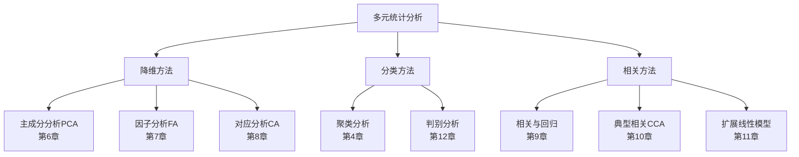

# 第12章 判别分析及Python算法

## 模块一：精准教学大纲

### 一、教学目标

1. **判别分析概念**：理解判别分析是有监督的分类方法，区分Fisher判别、Bayes判别和距离判别三种方法。
2. **Fisher判别法**：掌握Fisher准则函数 $J(a) = a^TBa / a^TWa$ 的推导，理解判别系数 $a = W^{-1}(\bar{X}_1 - \bar{X}_2)$ 的求解过程。
3. **Bayes判别法**：掌握先验概率与后验概率的概念，理解正态总体下线性判别函数和二次判别函数的区别。
4. **判别效果评价**：掌握混淆矩阵、准确率、精确率、召回率、F1值、ROC曲线和AUC的计算。
5. **Python实操**：能够使用sklearn.discriminant_analysis进行LDA和QDA。

### 二、建议学时

| 内容 | 学时 | 教学方式 |
|------|------|----------|
| 12.1 判别分析的概念 | 0.5 | 讲授 |
| 12.2 Fisher判别法 | 2 | 讲授+推导 |
| 12.3 Bayes判别法 | 2 | 讲授+推导 |
| 12.4 判别效果评价 | 1 | 讲授+案例 |
| **合计** | **5.5** | |

### 三、重点与难点

**重点**：
- Fisher准则函数的推导与物理意义
- Bayes后验概率的计算方法
- 判别系数的解释与应用
- 混淆矩阵各元素的含义

**难点**：
- Fisher判别系数的矩阵求解过程
- 二次判别函数（QDA）的理解
- 多分类情形下的判别扩展
- 判别效果的综合评价方法

### 四、前置知识

| 前置知识 | 是否已出现 | 处理方式 |
|----------|-----------|----------|
| 矩阵运算 | 是（第1章） | 直接引用 |
| 概率论（条件概率、贝叶斯） | 是（第1章） | 直接引用 |
| 多元正态分布 | 是（第1章） | 直接引用 |
| 协方差矩阵 | 是（第1章） | 直接引用 |
| 特征值与特征向量 | 是（第1章） | 直接引用 |

### 五、知识地图

判别分析是多元统计分析中分类方法的核心内容。本章将系统介绍三种主要判别方法：

1. **Fisher判别法**：基于投影思想，将高维数据投影到一维，使组间差异最大化、组内差异最小化。
2. **Bayes判别法**：基于概率框架，利用先验概率和条件概率计算后验概率，实现最优分类。
3. **距离判别法**：基于距离度量，将新样品判入距离最近的类别。

三种方法各有优势：Fisher判别直观稳健、Bayes判别理论最优、距离判别简单易懂。

---

## 模块二：沉浸式理论讲解

### 12.1 判别分析的概念

#### 12.1.1 什么是判别分析？

**【业务场景引入】**

某商业银行需要根据客户的财务指标（收入、负债率、信用评分等）判断其信用等级（优、良、差）。已有1000名已知信用等级的客户数据，需要建立判别规则，对新客户进行自动分类。

**判别分析**正是解决这类问题的工具：**根据已知类别的训练样本建立判别准则，对未知类别的新样品进行分类归组**。

**判别分析的数学定义**：

设总体 $G_1, G_2, \ldots, G_k$ 是 $k$ 个已知类别，每个类别有 $p$ 个特征变量。已知来自各类别的训练样本：

$$
X^{(k)} = \{X_1^{(k)}, X_2^{(k)}, \ldots, X_{n_k}^{(k)}\}, \quad k = 1, 2, \ldots, K
$$

判别分析的目标是找到判别函数 $\delta(X)$，使得对新样品 $X_0$，根据 $\delta(X_0)$ 的值决定其归属。

**判别分析与聚类分析的区别**：

| 维度 | 判别分析 | 聚类分析 |
|------|----------|----------|
| 学习类型 | 有监督 | 无监督 |
| 是否需要标签 | 需要 | 不需要 |
| 目标 | 建立分类规则 | 发现数据结构 |
| 输入 | 已标签训练数据 | 未标签数据 |
| 输出 | 判别函数/规则 | 簇标签 |
| 评价方式 | 准确率、AUC等 | 轮廓系数等 |

**判别分析的适用条件**：

1. 各总体的分布已知（或可估计）
2. 有足够的训练样本
3. 特征变量之间不存在完全共线性
4. 各总体的协方差矩阵可逆

#### 12.1.2 判别方法的种类

| 方法 | 核心思想 | 需要分布假设 | 特点 |
|------|----------|-------------|------|
| Fisher判别 | 投影使两组最分开 | 不需要 | 直观、稳健 |
| Bayes判别 | 后验概率最大化 | 需要（通常正态） | 理论最优 |
| 距离判别 | 马氏距离最近 | 不需要 | 直观简单 |
| Logistic判别 | 最大似然估计 | 不需要 | 适合二分类 |

#### 12.1.3 判别分析的应用领域

判别分析在实际中有广泛的应用：

1. **医学诊断**：根据化验指标判断患者是否患病
2. **信用评分**：根据财务指标判断信用等级
3. **模式识别**：手写数字识别、人脸识别
4. **质量控制**：根据产品指标判断是否合格
5. **市场细分**：根据消费行为判断客户类型
6. **地质勘探**：根据地球物理指标判断地质类型

---

### 12.2 Fisher判别法

#### 12.2.1 Fisher判别的核心思想

**目标**：找到投影方向 $a$，使投影后的两组数据 $u_1 = a^T X_1$ 和 $u_2 = a^T X_2$ 尽可能分开。

**直观理解**：

想象有两团点云分布在二维空间中。Fisher判别就是要找到一个方向，将这两团点云投影到这个方向上后，它们之间的距离尽可能大，而每团点云内部的散度尽可能小。

**数学表述**：

设两组数据分别为 $G_1 = \{X_1^{(1)}, \ldots, X_{n_1}^{(1)}\}$ 和 $G_2 = \{X_1^{(2)}, \ldots, X_{n_2}^{(2)}\}$。

投影后的数据为 $u_i^{(k)} = a^T X_i^{(k)}$。

投影后的组间差异（类间散度）：

$$
B_a = (a^T \bar{X}_1 - a^T \bar{X}_2)^2 = a^T (\bar{X}_1 - \bar{X}_2)(\bar{X}_1 - \bar{X}_2)^T a = a^T B a
$$

其中 $B = (\bar{X}_1 - \bar{X}_2)(\bar{X}_1 - \bar{X}_2)^T$ 是类间散度矩阵。

投影后的组内差异（类内散度）：

$$
W_a = \sum_{k=1}^{2} \sum_{i=1}^{n_k} (a^T X_i^{(k)} - a^T \bar{X}_k)^2 = a^T (S_1 + S_2) a = a^T W a
$$

其中 $S_k = \sum_{i=1}^{n_k} (X_i^{(k)} - \bar{X}_k)(X_i^{(k)} - \bar{X}_k)^T$ 是第 $k$ 组的散布矩阵，$W = S_1 + S_2$ 是类内散度矩阵。

**Fisher准则函数**：

$$
J(a) = \frac{a^T B a}{a^T W a}
$$

**最大化 $J(a)$ 的含义**：
- 分子 $a^T B a$：投影后的组间差异（越大越好）
- 分母 $a^T W a$：投影后的组内差异（越小越好）
- 最大化 $J(a)$ 等价于使"组间差异最大、组内差异最小"

#### 12.2.2 判别系数的求解

**求解过程**：

对 $J(a)$ 关于 $a$ 求导并令其为零：

$$
\frac{\partial J}{\partial a} = \frac{2Ba \cdot a^TWa - 2Wa \cdot a^TBa}{(a^TWa)^2} = 0
$$

化简得：

$$
Ba \cdot a^TWa = Wa \cdot a^TBa
$$

即：

$$
Ba = \frac{a^TBa}{a^TWa} Wa = J(a) Wa
$$

令 $\lambda = J(a)$，则有：

$$
(B - \lambda W)a = 0
$$

这是一个广义特征值问题。由于 $B$ 的秩为1（对于两类问题），非零特征值只有一个：

$$
\lambda = (\bar{X}_1 - \bar{X}_2)^T W^{-1} (\bar{X}_1 - \bar{X}_2)
$$

对应的特征向量为：

$$
a = W^{-1}(\bar{X}_1 - \bar{X}_2)
$$

**判别系数的物理意义**：

$a = W^{-1}(\bar{X}_1 - \bar{X}_2)$ 可以理解为：
- $\bar{X}_1 - \bar{X}_2$：两组均值之差，表示组间差异的方向
- $W^{-1}$：类内散度的逆，起"标准化"作用，消除变量量纲和相关性的影响

#### 12.2.3 判别系数的求解（详细推导）

**步骤1：计算各组均值向量**

$$
\bar{X}_k = \frac{1}{n_k} \sum_{i=1}^{n_k} X_i^{(k)}, \quad k = 1, 2
$$

**步骤2：计算类内散度矩阵**

$$
S_k = \sum_{i=1}^{n_k} (X_i^{(k)} - \bar{X}_k)(X_i^{(k)} - \bar{X}_k)^T
$$

$$
W = S_1 + S_2
$$

**步骤3：计算类间散度矩阵**

$$
B = (\bar{X}_1 - \bar{X}_2)(\bar{X}_1 - \bar{X}_2)^T
$$

**步骤4：求解判别系数**

$$
a = W^{-1}(\bar{X}_1 - \bar{X}_2)
$$

**计算示例**：

假设两组数据的均值向量和协方差矩阵为：

$$
\bar{X}_1 = \begin{pmatrix} 5 \\ 3 \end{pmatrix}, \quad \bar{X}_2 = \begin{pmatrix} 2 \\ 1 \end{pmatrix}
$$

$$
W = \begin{pmatrix} 10 & 2 \\ 2 & 8 \end{pmatrix}
$$

计算逆矩阵：

$$
W^{-1} = \frac{1}{10 \times 8 - 2 \times 2}\begin{pmatrix} 8 & -2 \\ -2 & 10 \end{pmatrix} = \frac{1}{76}\begin{pmatrix} 8 & -2 \\ -2 & 10 \end{pmatrix}
$$

$$
a = W^{-1}(\bar{X}_1 - \bar{X}_2) = \frac{1}{76}\begin{pmatrix} 8 & -2 \\ -2 & 10 \end{pmatrix}\begin{pmatrix} 3 \\ 2 \end{pmatrix} = \frac{1}{76}\begin{pmatrix} 20 \\ 14 \end{pmatrix} = \begin{pmatrix} 0.263 \\ 0.184 \end{pmatrix}
$$

**判别函数**：

$$
u = a^T X = 0.263 x_1 + 0.184 x_2
$$

**判别系数的解释**：
- $a_1 = 0.263$：变量 $x_1$ 每增加1个单位，判别得分增加0.263
- $a_2 = 0.184$：变量 $x_2$ 每增加1个单位，判别得分增加0.184
- $x_1$ 的系数更大，说明 $x_1$ 对区分两组的贡献更大

#### 12.2.4 判别界值

$$
c = \frac{a^T \bar{X}_1 + a^T \bar{X}_2}{2}
$$

新样品代入 $u = a^T X$：
- 若 $u > c$，判入 $G_1$
- 若 $u < c$，判入 $G_2$

**判别界值的几何意义**：

判别界值 $c$ 是两组投影均值的中点。在投影轴上，以 $c$ 为分界点，左侧归入 $G_2$，右侧归入 $G_1$。

**多组情形的扩展**：

对于 $K$ 个类别，最多可以提取 $\min(K-1, p)$ 个判别函数。判别界值的确定需要考虑多个判别函数的组合。

#### 12.2.5 等方差与异方差情形

| 情形 | 协方差矩阵 | 判别函数 | 判别边界 |
|------|-----------|----------|----------|
| 等方差 | $\Sigma_1 = \Sigma_2$ | 线性 | 超平面 |
| 异方差 | $\Sigma_1 \neq \Sigma_2$ | 二次 | 二次曲面 |

**等方差情形**：

当两组的协方差矩阵相等时，判别函数是线性的：

$$
u(X) = a^T X - c
$$

判别边界是超平面。

**异方差情形**：

当两组的协方差矩阵不等时，判别函数是二次的：

$$
u(X) = X^T A X + b^T X + c
$$

判别边界是二次曲面（椭圆、双曲线或抛物线）。

#### 12.2.6 Fisher判别法的性质

1. **不变性**：判别函数对线性变换保持不变
2. **最优性**：在所有线性判别函数中，Fisher判别使组间分离最大化
3. **稳健性**：对总体分布不作严格假设
4. **局限性**：只能提取 $\min(K-1, p)$ 个判别函数

---

### 12.3 Bayes判别法

#### 12.3.1 Bayes判别准则

**先验概率**：$P(G_k)$，分类前各类别的概率。

**后验概率**：$P(G_k | X)$，观测到X后更新的概率。

**Bayes定理**：

$$
P(G_k | X) = \frac{P(G_k) f(X | G_k)}{\sum_j P(G_j) f(X | G_j)}
$$

其中 $f(X | G_k)$ 是第 $k$ 类的条件概率密度函数。

**判别准则**：判入使后验概率最大的类别，即：

$$
\text{判入 } G_k \iff P(G_k | X) = \max_j P(G_j | X)
$$

等价于判入使 $P(G_k) f(X | G_k)$ 最大的类别。

**Bayes判别的优势**：

1. 考虑了先验概率，对类别不平衡问题更稳健
2. 提供后验概率，可以量化分类的不确定性
3. 在正态假设下，理论最优

#### 12.3.2 正态总体的Bayes判别

**假设**：各类别的条件分布为多元正态分布：

$$
X | G_k \sim N(\mu_k, \Sigma_k)
$$

**等协方差矩阵情形**：线性判别函数

当 $\Sigma_1 = \Sigma_2 = \cdots = \Sigma_K = \Sigma$ 时，后验概率的比较等价于比较：

$$
d_k(X) = \ln(P_k) + \mu_k^T \Sigma^{-1} X - \frac{1}{2}\mu_k^T \Sigma^{-1} \mu_k
$$

判入 $d_k$ 最大的类别。

**推导过程**：

$$
\begin{aligned}
P(G_k | X) &\propto P(G_k) f(X | G_k) \\
&= P(G_k) \cdot \frac{1}{(2\pi)^{p/2}|\Sigma|^{1/2}} \exp\left(-\frac{1}{2}(X-\mu_k)^T\Sigma^{-1}(X-\mu_k)\right)
\end{aligned}
$$

取对数并省略常数项：

$$
\ln P(G_k | X) \propto \ln P_k - \frac{1}{2}(X-\mu_k)^T\Sigma^{-1}(X-\mu_k)
$$

展开二次项：

$$
(X-\mu_k)^T\Sigma^{-1}(X-\mu_k) = X^T\Sigma^{-1}X - 2\mu_k^T\Sigma^{-1}X + \mu_k^T\Sigma^{-1}\mu_k
$$

省略与 $k$ 无关的项 $X^T\Sigma^{-1}X$，得到线性判别函数：

$$
d_k(X) = \ln P_k + \mu_k^T\Sigma^{-1}X - \frac{1}{2}\mu_k^T\Sigma^{-1}\mu_k
$$

**不等协方差矩阵情形**：二次判别函数

当各类别的协方差矩阵不相等时：

$$
d_k(X) = \ln(P_k) - \frac{1}{2}\ln|\Sigma_k| - \frac{1}{2}(X-\mu_k)^T \Sigma_k^{-1} (X-\mu_k)
$$

判入 $d_k$ 最大的类别。

**二次判别函数的特点**：

1. 包含二次项 $X^T\Sigma_k^{-1}X$，判别边界是二次曲面
2. 考虑了各类别协方差矩阵的差异
3. 在协方差矩阵差异较大时，比线性判别更准确
4. 需要更多的参数估计，对样本量要求更高

#### 12.3.3 后验概率的计算

$$
P(G_k | X) = \frac{\exp(d_k(X))}{\sum_j \exp(d_j(X))}
$$

（softmax归一化）

**后验概率的解释**：

1. 后验概率表示给定观测 $X$，样品属于各类别的概率
2. 后验概率之和为1
3. 后验概率越大，属于该类的可能性越高
4. 可以用于评估分类的不确定性

#### 12.3.4 参数估计

在实际应用中，需要估计各类别的参数：

**均值向量的估计**：

$$
\hat{\mu}_k = \bar{X}_k = \frac{1}{n_k} \sum_{i=1}^{n_k} X_i^{(k)}
$$

**协方差矩阵的估计**：

等协方差情形（合并协方差矩阵）：

$$
\hat{\Sigma} = \frac{1}{n-K} \sum_{k=1}^{K} \sum_{i=1}^{n_k} (X_i^{(k)} - \bar{X}_k)(X_i^{(k)} - \bar{X}_k)^T
$$

不等协方差情形：

$$
\hat{\Sigma}_k = \frac{1}{n_k-1} \sum_{i=1}^{n_k} (X_i^{(k)} - \bar{X}_k)(X_i^{(k)} - \bar{X}_k)^T
$$

**先验概率的估计**：

$$
\hat{P}_k = \frac{n_k}{n}
$$

或根据领域知识设定。

#### 12.3.5 Bayes判别与Fisher判别的关系

在两类、等协方差、先验概率相等的情形下，Bayes判别与Fisher判别等价：

**证明**：

Bayes判别函数：

$$
d_1(X) - d_2(X) = (\mu_1 - \mu_2)^T\Sigma^{-1}X - \frac{1}{2}(\mu_1^T\Sigma^{-1}\mu_1 - \mu_2^T\Sigma^{-1}\mu_2)
$$

Fisher判别函数：

$$
u(X) = a^T X = (\bar{X}_1 - \bar{X}_2)^T W^{-1} X
$$

当 $\hat{\Sigma} = W/(n-2)$ 时，两者仅相差常数倍。

---

### 12.4 距离判别法

#### 12.4.1 马氏距离

**马氏距离**的定义：

$$
d(X, G_k) = \sqrt{(X - \mu_k)^T \Sigma_k^{-1} (X - \mu_k)}
$$

**马氏距离与欧氏距离的区别**：

| 维度 | 欧氏距离 | 马氏距离 |
|------|----------|----------|
| 定义 | $\sqrt{\sum(x_i - y_i)^2}$ | $\sqrt{(X-Y)^T\Sigma^{-1}(X-Y)}$ |
| 考虑变量相关性 | 不考虑 | 考虑 |
| 考虑量纲 | 不考虑 | 考虑 |
| 适用场景 | 变量独立同方差 | 变量相关异方差 |

#### 12.4.2 距离判别准则

**判别准则**：将新样品判入距离最近的类别：

$$
\text{判入 } G_k \iff d(X, G_k) = \min_j d(X, G_j)
$$

**等协方差情形**：

$$
d^2(X, G_k) = (X - \mu_k)^T \Sigma^{-1} (X - \mu_k)
$$

展开：

$$
d^2(X, G_k) = X^T\Sigma^{-1}X - 2\mu_k^T\Sigma^{-1}X + \mu_k^T\Sigma^{-1}\mu_k
$$

省略与 $k$ 无关的项 $X^T\Sigma^{-1}X$，等价于判入使以下函数最大的类别：

$$
W_k(X) = \mu_k^T\Sigma^{-1}X - \frac{1}{2}\mu_k^T\Sigma^{-1}\mu_k
$$

这与Bayes线性判别函数形式相同（当先验概率相等时）。

**不等协方差情形**：

$$
d^2(X, G_k) = (X - \mu_k)^T \Sigma_k^{-1} (X - \mu_k) + \ln|\Sigma_k|
$$

这与Bayes二次判别函数形式相同（当先验概率相等时）。

#### 12.4.3 距离判别与Bayes判别的关系

在正态总体、先验概率相等的假设下，距离判别与Bayes判别等价。

当先验概率不等时，距离判别需要修正：

$$
d^2(X, G_k) = (X - \mu_k)^T \Sigma_k^{-1} (X - \mu_k) + \ln|\Sigma_k| - 2\ln P_k
$$

---

### 12.5 判别效果评价

#### 12.5.1 混淆矩阵

|  | 预测为正 | 预测为负 |
|--|---------|---------|
| **实际为正** | TP（真正） | FN（假负） |
| **实际为负** | FP（假正） | TN（真负） |

**混淆矩阵的解读**：

- **TP（True Positive）**：实际为正，预测为正，正确识别
- **FN（False Negative）**：实际为正，预测为负，漏报
- **FP（False Positive）**：实际为负，预测为正，误报
- **TN（True Negative）**：实际为负，预测为负，正确排除

#### 12.5.2 评价指标

**准确率（Accuracy）**：

$$
\text{Accuracy} = \frac{TP + TN}{TP + TN + FP + FN}
$$

含义：所有样本中正确分类的比例。

**精确率（Precision）**：

$$
\text{Precision} = \frac{TP}{TP + FP}
$$

含义：预测为正的样本中，实际为正的比例。

**召回率（Recall）**：

$$
\text{Recall} = \frac{TP}{TP + FN}
$$

含义：实际为正的样本中，被正确预测的比例。

**F1值（F1 Score）**：

$$
F1 = \frac{2 \times \text{Precision} \times \text{Recall}}{\text{Precision} + \text{Recall}}
$$

含义：精确率和召回率的调和平均。

**特异度（Specificity）**：

$$
\text{Specificity} = \frac{TN}{TN + FP}
$$

含义：实际为负的样本中，被正确预测的比例。

#### 12.5.3 ROC曲线与AUC

**ROC曲线**：以假正率（FPR）为横轴、真正率（TPR）为纵轴

$$
\text{TPR} = \frac{TP}{TP + FN}, \quad \text{FPR} = \frac{FP}{FP + TN}
$$

**AUC**：ROC曲线下面积，AUC越大判别效果越好。

**AUC的解释**：

| AUC范围 | 判别效果 |
|---------|----------|
| 0.5 | 无判别能力（随机猜测） |
| 0.5-0.7 | 较低判别能力 |
| 0.7-0.9 | 中等判别能力 |
| 0.9-1.0 | 高判别能力 |
| 1.0 | 完美判别 |

**ROC曲线的绘制方法**：

1. 将预测概率从高到低排序
2. 以不同的阈值将概率转化为类别
3. 计算每个阈值对应的TPR和FPR
4. 绘制TPR-FPR曲线

#### 12.5.4 交叉验证

**K折交叉验证**：

1. 将数据随机分为K份
2. 每次用K-1份作为训练集，1份作为测试集
3. 重复K次，取平均性能

**留一法交叉验证**：

每次用n-1个样本作为训练集，1个样本作为测试集，重复n次。

**交叉验证的优势**：

1. 充分利用数据
2. 减少过拟合风险
3. 提供性能的方差估计

---

### 12.6 多分类判别

#### 12.6.1 多分类Fisher判别

对于 $K$ 个类别，最多可以提取 $\min(K-1, p)$ 个判别函数。

**判别函数的求解**：

广义特征值问题：

$$
B a = \lambda W a
$$

其中 $B = \sum_{k=1}^{K} n_k (\bar{X}_k - \bar{X})(\bar{X}_k - \bar{X})^T$ 是总类间散度矩阵。

取前 $m$ 个最大特征值对应的特征向量，得到 $m$ 个判别函数。

**判别准则**：

1. 计算新样品在各判别函数上的得分
2. 计算新样品与各类别重心的马氏距离
3. 判入距离最近的类别

#### 12.6.2 多分类Bayes判别

$$
d_k(X) = \ln(P_k) + \mu_k^T \Sigma^{-1} X - \frac{1}{2}\mu_k^T \Sigma^{-1} \mu_k
$$

判入 $d_k$ 最大的类别。

后验概率：

$$
P(G_k | X) = \frac{\exp(d_k(X))}{\sum_j \exp(d_j(X))}
$$

#### 12.6.3 一对多（One-vs-Rest）策略

将K分类问题分解为K个二分类问题：

1. 对每个类别 $k$，训练一个二分类器区分"类别 $k$"和"非类别 $k$"
2. 对新样品，选择预测概率最高的类别

#### 12.6.4 一对一（One-vs-One）策略

将K分类问题分解为 $K(K-1)/2$ 个二分类问题：

1. 对每对类别 $(i, j)$，训练一个二分类器
2. 对新样品，采用投票机制选择得票最多的类别

---

## 模块三：实战与代码复现

### 实战案例12-1：Fisher判别与Bayes判别

```python
import numpy as np
import pandas as pd
import matplotlib.pyplot as plt
from sklearn.discriminant_analysis import LinearDiscriminantAnalysis, QuadraticDiscriminantAnalysis
from sklearn.model_selection import train_test_split, cross_val_score
from sklearn.metrics import classification_report, confusion_matrix, roc_curve, auc

plt.rcParams['font.sans-serif'] = ['SimHei']
plt.rcParams['axes.unicode_minus'] = False

# ============================================================
# 数据准备：疾病诊断
# ============================================================
np.random.seed(42)
n1, n2 = 80, 80

# 健康人群
X1 = np.random.multivariate_normal([120, 5.0, 200],
                                    [[100, 5, 20], [5, 0.5, 10], [20, 10, 500]], n1)
# 患病人群
X2 = np.random.multivariate_normal([150, 7.5, 280],
                                    [[120, 8, 30], [8, 1.0, 15], [30, 15, 600]], n2)

X = np.vstack([X1, X2])
y = np.array([0]*n1 + [1]*n2)
feature_names = ['收缩压', '血糖', '胆固醇']

# ============================================================
# 划分训练集和测试集
# ============================================================
X_train, X_test, y_train, y_test = train_test_split(X, y, test_size=0.3, random_state=42)

# ============================================================
# Fisher线性判别（LDA）
# ============================================================
lda = LinearDiscriminantAnalysis()
lda.fit(X_train, y_train)
y_pred_lda = lda.predict(X_test)
y_prob_lda = lda.predict_proba(X_test)[:, 1]

print("=== Fisher线性判别（LDA）===")
print(f"判别系数: {dict(zip(feature_names, lda.coef_[0].round(3)))}")
print(f"\n混淆矩阵:\n{confusion_matrix(y_test, y_pred_lda)}")
print(f"\n分类报告:\n{classification_report(y_test, y_pred_lda, target_names=['健康', '患病'])}")

# ============================================================
# 二次判别分析（QDA）
# ============================================================
qda = QuadraticDiscriminantAnalysis()
qda.fit(X_train, y_train)
y_pred_qda = qda.predict(X_test)

print("\n=== 二次判别分析（QDA）===")
print(f"混淆矩阵:\n{confusion_matrix(y_test, y_pred_qda)}")
print(f"\n分类报告:\n{classification_report(y_test, y_pred_qda, target_names=['健康', '患病'])}")

# ============================================================
# 交叉验证
# ============================================================
cv_scores = cross_val_score(lda, X, y, cv=5, scoring='accuracy')
print(f"\n=== 5折交叉验证 ===")
print(f"各折准确率: {cv_scores.round(3)}")
print(f"平均准确率: {cv_scores.mean():.3f} ± {cv_scores.std():.3f}")

# ============================================================
# 可视化
# ============================================================
fig, axes = plt.subplots(1, 3, figsize=(18, 5))

# 判别函数得分分布
scores = lda.transform(X_test)
for label, name in [(0, '健康'), (1, '患病')]:
    mask = y_test == label
    axes[0].hist(scores[mask], bins=15, alpha=0.6, label=name)
axes[0].axvline(x=0, color='r', linestyle='--', label='判别界值')
axes[0].set_xlabel('判别函数得分')
axes[0].set_ylabel('频数')
axes[0].set_title('LDA判别函数得分分布')
axes[0].legend()

# ROC曲线
fpr, tpr, _ = roc_curve(y_test, y_prob_lda)
roc_auc = auc(fpr, tpr)
axes[1].plot(fpr, tpr, 'b-', linewidth=2, label=f'LDA (AUC={roc_auc:.3f})')
axes[1].plot([0, 1], [0, 1], 'r--')
axes[1].set_xlabel('假正率')
axes[1].set_ylabel('真正率')
axes[1].set_title('ROC曲线')
axes[1].legend()

# 散点图
for label, name, color in [(0, '健康', 'blue'), (1, '患病', 'red')]:
    mask = y_test == label
    axes[2].scatter(X_test[mask, 0], X_test[mask, 1], c=color, label=name,
                    alpha=0.6, edgecolors='black', s=60)
axes[2].set_xlabel(feature_names[0])
axes[2].set_ylabel(feature_names[1])
axes[2].set_title('测试集散点图')
axes[2].legend()

plt.tight_layout()
plt.show()

# ============================================================
# 新样品判别
# ============================================================
new_patient = np.array([[140, 6.5, 250]])
pred = lda.predict(new_patient)
prob = lda.predict_proba(new_patient)

print(f"\n=== 新样品判别 ===")
print(f"指标: 收缩压={new_patient[0,0]}, 血糖={new_patient[0,1]}, 胆固醇={new_patient[0,2]}")
print(f"判别结果: {'患病' if pred[0]==1 else '健康'}")
print(f"后验概率: P(健康)={prob[0,0]:.4f}, P(患病)={prob[0,1]:.4f}")
```

*(此处平台应展示判别分析的完整结果：判别系数、混淆矩阵、ROC曲线、散点图)*

**结果解读**：

1. **判别系数**：收缩压和血糖的系数较大，说明这两个指标对疾病判别最重要。

2. **混淆矩阵**：对角线元素为正确分类数，非对角线为错判数。

3. **ROC曲线**：AUC接近1说明判别能力很强。

4. **新样品**：根据后验概率判断新患者是否患病，后验概率越大说明属于该类的可能性越高。

---

### 实战案例12-2：多分类判别分析

```python
import numpy as np
import pandas as pd
import matplotlib.pyplot as plt
from sklearn.discriminant_analysis import LinearDiscriminantAnalysis
from sklearn.datasets import load_iris
from sklearn.model_selection import train_test_split
from sklearn.metrics import classification_report, confusion_matrix

plt.rcParams['font.sans-serif'] = ['SimHei']
plt.rcParams['axes.unicode_minus'] = False

# ============================================================
# 加载鸢尾花数据集
# ============================================================
iris = load_iris()
X = iris.data
y = iris.target
feature_names = iris.feature_names
target_names = iris.target_names

print("数据集信息:")
print(f"样本数: {X.shape[0]}")
print(f"特征数: {X.shape[1]}")
print(f"类别数: {len(target_names)}")
print(f"类别名: {target_names}")

# ============================================================
# 划分训练集和测试集
# ============================================================
X_train, X_test, y_train, y_test = train_test_split(X, y, test_size=0.3, random_state=42)

# ============================================================
# 多分类LDA
# ============================================================
lda = LinearDiscriminantAnalysis()
lda.fit(X_train, y_train)
y_pred = lda.predict(X_test)

print("\n=== 多分类LDA结果 ===")
print(f"判别系数矩阵形状: {lda.coef_.shape}")
print(f"\n混淆矩阵:\n{confusion_matrix(y_test, y_pred)}")
print(f"\n分类报告:\n{classification_report(y_test, y_pred, target_names=target_names)}")

# ============================================================
# 判别函数得分可视化
# ============================================================
fig, axes = plt.subplots(1, 2, figsize=(14, 5))

# 降维后的散点图
X_lda = lda.transform(X)
for label, name in zip(range(3), target_names):
    mask = y == label
    axes[0].scatter(X_lda[mask, 0], X_lda[mask, 1], label=name, alpha=0.6)
axes[0].set_xlabel('第一判别函数')
axes[0].set_ylabel('第二判别函数')
axes[0].set_title('LDA降维结果')
axes[0].legend()

# 判别系数热力图
coef_df = pd.DataFrame(lda.coef_, columns=feature_names, index=target_names)
im = axes[1].imshow(coef_df.values, cmap='RdBu_r', aspect='auto')
axes[1].set_xticks(range(len(feature_names)))
axes[1].set_yticks(range(len(target_names)))
axes[1].set_xticklabels(feature_names, rotation=45, ha='right')
axes[1].set_yticklabels(target_names)
axes[1].set_title('判别系数热力图')
plt.colorbar(im, ax=axes[1])

plt.tight_layout()
plt.show()

# ============================================================
# 新样品判别
# ============================================================
new_sample = np.array([[5.1, 3.5, 1.4, 0.2]])
pred = lda.predict(new_sample)
prob = lda.predict_proba(new_sample)

print(f"\n=== 新样品判别 ===")
print(f"特征值: {new_sample[0]}")
print(f"判别结果: {target_names[pred[0]]}")
print(f"后验概率: {dict(zip(target_names, prob[0].round(4)))}")
```

---

### 实战案例12-3：手动实现Fisher判别

```python
import numpy as np
import matplotlib.pyplot as plt

plt.rcParams['font.sans-serif'] = ['SimHei']
plt.rcParams['axes.unicode_minus'] = False

# ============================================================
# 数据准备
# ============================================================
np.random.seed(42)

# 两组数据
X1 = np.random.multivariate_normal([5, 3], [[2, 0.5], [0.5, 1]], 50)
X2 = np.random.multivariate_normal([2, 1], [[2, 0.5], [0.5, 1]], 50)

# ============================================================
# Fisher判别手动实现
# ============================================================

# 步骤1：计算各组均值
mean1 = np.mean(X1, axis=0)
mean2 = np.mean(X2, axis=0)
print(f"组1均值: {mean1}")
print(f"组2均值: {mean2}")

# 步骤2：计算类内散度矩阵
S1 = np.dot((X1 - mean1).T, (X1 - mean1))
S2 = np.dot((X2 - mean2).T, (X2 - mean2))
W = S1 + S2
print(f"\n类内散度矩阵W:\n{W}")

# 步骤3：计算判别系数
W_inv = np.linalg.inv(W)
a = np.dot(W_inv, mean1 - mean2)
print(f"\n判别系数a: {a}")

# 步骤4：计算判别界值
c = (np.dot(a, mean1) + np.dot(a, mean2)) / 2
print(f"判别界值c: {c}")

# 步骤5：计算判别得分
u1 = np.dot(X1, a)
u2 = np.dot(X2, a)

# ============================================================
# 可视化
# ============================================================
fig, axes = plt.subplots(1, 2, figsize=(14, 5))

# 原始数据散点图
axes[0].scatter(X1[:, 0], X1[:, 1], c='blue', label='组1', alpha=0.6)
axes[0].scatter(X2[:, 0], X2[:, 1], c='red', label='组2', alpha=0.6)
axes[0].set_xlabel('X1')
axes[0].set_ylabel('X2')
axes[0].set_title('原始数据散点图')
axes[0].legend()

# 判别得分分布
axes[1].hist(u1, bins=15, alpha=0.6, label='组1', color='blue')
axes[1].hist(u2, bins=15, alpha=0.6, label='组2', color='red')
axes[1].axvline(x=c, color='black', linestyle='--', label=f'判别界值={c:.3f}')
axes[1].set_xlabel('判别得分')
axes[1].set_ylabel('频数')
axes[1].set_title('判别得分分布')
axes[1].legend()

plt.tight_layout()
plt.show()

# ============================================================
# 新样品判别
# ============================================================
new_sample = np.array([3.5, 2.0])
u_new = np.dot(a, new_sample)
result = "组1" if u_new > c else "组2"

print(f"\n=== 新样品判别 ===")
print(f"新样品: {new_sample}")
print(f"判别得分: {u_new:.4f}")
print(f"判别界值: {c:.4f}")
print(f"判别结果: {result}")
```

---

### 实战案例12-4：ROC曲线绘制详解

```python
import numpy as np
import matplotlib.pyplot as plt
from sklearn.metrics import roc_curve, auc
from sklearn.discriminant_analysis import LinearDiscriminantAnalysis
from sklearn.model_selection import train_test_split

plt.rcParams['font.sans-serif'] = ['SimHei']
plt.rcParams['axes.unicode_minus'] = False

# ============================================================
# 数据准备
# ============================================================
np.random.seed(42)
n1, n2 = 100, 100

X1 = np.random.multivariate_normal([0, 0], [[1, 0.3], [0.3, 1]], n1)
X2 = np.random.multivariate_normal([1, 1], [[1, 0.3], [0.3, 1]], n2)

X = np.vstack([X1, X2])
y = np.array([0]*n1 + [1]*n2)

# ============================================================
# 训练LDA模型
# ============================================================
X_train, X_test, y_train, y_test = train_test_split(X, y, test_size=0.3, random_state=42)
lda = LinearDiscriminantAnalysis()
lda.fit(X_train, y_train)
y_prob = lda.predict_proba(X_test)[:, 1]

# ============================================================
# 手动计算ROC曲线
# ============================================================
def manual_roc(y_true, y_score):
    """手动计算ROC曲线"""
    # 按预测概率降序排序
    indices = np.argsort(-y_score)
    y_true_sorted = y_true[indices]
    y_score_sorted = y_score[indices]

    # 计算TPR和FPR
    tpr_list = [0]
    fpr_list = [0]

    n_pos = np.sum(y_true == 1)
    n_neg = np.sum(y_true == 0)

    tp = 0
    fp = 0

    for i in range(len(y_true_sorted)):
        if y_true_sorted[i] == 1:
            tp += 1
        else:
            fp += 1

        tpr_list.append(tp / n_pos)
        fpr_list.append(fp / n_neg)

    return np.array(fpr_list), np.array(tpr_list)

fpr_manual, tpr_manual = manual_roc(y_test, y_prob)

# ============================================================
# 使用sklearn计算ROC曲线
# ============================================================
fpr_sklearn, tpr_sklearn, thresholds = roc_curve(y_test, y_prob)
roc_auc = auc(fpr_sklearn, tpr_sklearn)

# ============================================================
# 可视化
# ============================================================
fig, axes = plt.subplots(1, 3, figsize=(18, 5))

# 手动计算的ROC曲线
axes[0].plot(fpr_manual, tpr_manual, 'b-', linewidth=2)
axes[0].plot([0, 1], [0, 1], 'r--')
axes[0].set_xlabel('假正率 (FPR)')
axes[0].set_ylabel('真正率 (TPR)')
axes[0].set_title('手动计算的ROC曲线')
axes[0].set_xlim([0, 1])
axes[0].set_ylim([0, 1.05])

# sklearn计算的ROC曲线
axes[1].plot(fpr_sklearn, tpr_sklearn, 'b-', linewidth=2, label=f'AUC={roc_auc:.3f}')
axes[1].plot([0, 1], [0, 1], 'r--')
axes[1].set_xlabel('假正率 (FPR)')
axes[1].set_ylabel('真正率 (TPR)')
axes[1].set_title('sklearn计算的ROC曲线')
axes[1].set_xlim([0, 1])
axes[1].set_ylim([0, 1.05])
axes[1].legend()

# 不同阈值下的准确率
from sklearn.metrics import accuracy_score
thresholds_acc = np.linspace(0, 1, 100)
accuracies = []
for thresh in thresholds_acc:
    y_pred_thresh = (y_prob >= thresh).astype(int)
    acc = accuracy_score(y_test, y_pred_thresh)
    accuracies.append(acc)

axes[2].plot(thresholds_acc, accuracies, 'g-', linewidth=2)
axes[2].set_xlabel('阈值')
axes[2].set_ylabel('准确率')
axes[2].set_title('不同阈值下的准确率')

plt.tight_layout()
plt.show()
```

---

### 实战案例12-5：判别分析在信用评分中的应用

```python
import numpy as np
import pandas as pd
import matplotlib.pyplot as plt
from sklearn.discriminant_analysis import LinearDiscriminantAnalysis
from sklearn.model_selection import train_test_split, cross_val_score
from sklearn.metrics import classification_report, confusion_matrix, roc_curve, auc
from sklearn.preprocessing import StandardScaler

plt.rcParams['font.sans-serif'] = ['SimHei']
plt.rcParams['axes.unicode_minus'] = False

# ============================================================
# 生成模拟信用评分数据
# ============================================================
np.random.seed(42)
n = 500

# 特征变量
income = np.random.lognormal(10, 0.5, n)  # 收入
debt_ratio = np.random.beta(2, 5, n)  # 负债率
credit_score = np.random.normal(650, 50, n)  # 信用评分
loan_amount = np.random.lognormal(10, 1, n)  # 贷款金额

# 生成标签（信用良好=0，信用不良=1）
logit = -5 + 0.0001 * income - 3 * debt_ratio - 0.01 * credit_score + 0.00001 * loan_amount
prob = 1 / (1 + np.exp(-logit))
y = (np.random.random(n) < prob).astype(int)

# 特征矩阵
X = np.column_stack([income, debt_ratio, credit_score, loan_amount])
feature_names = ['收入', '负债率', '信用评分', '贷款金额']

print(f"数据集大小: {X.shape}")
print(f"信用良好: {np.sum(y==0)}")
print(f"信用不良: {np.sum(y==1)}")

# ============================================================
# 数据标准化
# ============================================================
scaler = StandardScaler()
X_scaled = scaler.fit_transform(X)

# ============================================================
# 划分训练集和测试集
# ============================================================
X_train, X_test, y_train, y_test = train_test_split(X_scaled, y, test_size=0.3, random_state=42)

# ============================================================
# 训练LDA模型
# ============================================================
lda = LinearDiscriminantAnalysis()
lda.fit(X_train, y_train)
y_pred = lda.predict(X_test)
y_prob = lda.predict_proba(X_test)[:, 1]

print("\n=== LDA信用评分模型 ===")
print(f"判别系数: {dict(zip(feature_names, lda.coef_[0].round(4)))}")
print(f"\n混淆矩阵:\n{confusion_matrix(y_test, y_pred)}")
print(f"\n分类报告:\n{classification_report(y_test, y_pred, target_names=['信用良好', '信用不良'])}")

# ============================================================
# 交叉验证
# ============================================================
cv_scores = cross_val_score(lda, X_scaled, y, cv=5, scoring='accuracy')
print(f"\n5折交叉验证准确率: {cv_scores.round(3)}")
print(f"平均准确率: {cv_scores.mean():.3f} ± {cv_scores.std():.3f}")

# ============================================================
# 可视化
# ============================================================
fig, axes = plt.subplots(2, 2, figsize=(14, 10))

# 判别系数条形图
coef = lda.coef_[0]
colors = ['green' if c > 0 else 'red' for c in coef]
axes[0, 0].barh(feature_names, coef, color=colors)
axes[0, 0].set_xlabel('判别系数')
axes[0, 0].set_title('判别系数（正值增加违约概率）')
axes[0, 0].axvline(x=0, color='black', linestyle='-', linewidth=0.5)

# ROC曲线
fpr, tpr, _ = roc_curve(y_test, y_prob)
roc_auc = auc(fpr, tpr)
axes[0, 1].plot(fpr, tpr, 'b-', linewidth=2, label=f'AUC={roc_auc:.3f}')
axes[0, 1].plot([0, 1], [0, 1], 'r--')
axes[0, 1].set_xlabel('假正率')
axes[0, 1].set_ylabel('真正率')
axes[0, 1].set_title('ROC曲线')
axes[0, 1].legend()

# 后验概率分布
for label, name in [(0, '信用良好'), (1, '信用不良')]:
    mask = y_test == label
    axes[1, 0].hist(y_prob[mask], bins=20, alpha=0.6, label=name)
axes[1, 0].set_xlabel('违约后验概率')
axes[1, 0].set_ylabel('频数')
axes[1, 0].set_title('后验概率分布')
axes[1, 0].legend()

# 混淆矩阵可视化
from sklearn.metrics import ConfusionMatrixDisplay
ConfusionMatrixDisplay.from_predictions(y_test, y_pred, display_labels=['信用良好', '信用不良'],
                                         cmap='Blues', ax=axes[1, 1])
axes[1, 1].set_title('混淆矩阵')

plt.tight_layout()
plt.show()
```

---

## 本章小结

| 知识点 | 核心内容 | 关键公式 |
|--------|----------|----------|
| Fisher准则 | 最大化组间/组内比 | $J(a) = a^TBa/a^TWa$ |
| 判别系数 | Fisher判别函数系数 | $a = W^{-1}(\bar{X}_1-\bar{X}_2)$ |
| 判别界值 | 两组投影均值的中点 | $c = (a^T\bar{X}_1+a^T\bar{X}_2)/2$ |
| Bayes定理 | 后验概率 | $P(G_k|X) \propto P(G_k)f(X|G_k)$ |
| 线性判别 | 等协方差 | $d_k = \ln P_k + \mu_k^T\Sigma^{-1}X$ |
| 二次判别 | 不等协方差 | $d_k = \ln P_k - \frac{1}{2}\ln|\Sigma_k| - \frac{1}{2}(X-\mu_k)^T\Sigma_k^{-1}(X-\mu_k)$ |
| 马氏距离 | 距离判别 | $d^2 = (X-\mu)^T\Sigma^{-1}(X-\mu)$ |
| 混淆矩阵 | 分类结果汇总 | TP, FP, TN, FN |
| 准确率 | 正确分类比例 | $(TP+TN)/(TP+TN+FP+FN)$ |
| 精确率 | 预测为正的准确度 | $TP/(TP+FP)$ |
| 召回率 | 实际为正的检出率 | $TP/(TP+FN)$ |
| F1值 | 精确率和召回率的调和平均 | $2PR/(P+R)$ |
| AUC | ROC曲线下面积 | AUC越大越好 |

---

## 练习题

### 练习1：概念理解

1. 简述Fisher判别法的核心思想和目标函数。

2. 解释Bayes判别法中先验概率、后验概率和似然函数的关系。

3. 比较LDA和QDA的适用条件和区别。

4. 说明混淆矩阵中四个元素的含义。

### 练习2：计算题

1. 已知两组数据的均值向量和类内散度矩阵为：

$$
\bar{X}_1 = \begin{pmatrix} 4 \\ 6 \end{pmatrix}, \quad \bar{X}_2 = \begin{pmatrix} 2 \\ 3 \end{pmatrix}, \quad W = \begin{pmatrix} 8 & 2 \\ 2 & 6 \end{pmatrix}
$$

求Fisher判别系数和判别界值。

2. 已知两组数据服从正态分布：

$$
G_1 \sim N\left(\begin{pmatrix} 1 \\ 2 \end{pmatrix}, \begin{pmatrix} 2 & 0 \\ 0 & 1 \end{pmatrix}\right), \quad G_2 \sim N\left(\begin{pmatrix} 3 \\ 1 \end{pmatrix}, \begin{pmatrix} 1 & 0 \\ 0 & 2 \end{pmatrix}\right)
$$

先验概率相等，求新样品 $X_0 = (2, 1.5)^T$ 的后验概率。

### 练习3：编程题

1. 使用sklearn实现鸢尾花数据集的多分类LDA，并绘制判别函数得分的散点图。

2. 手动实现Fisher判别法，包括判别系数的计算、判别界值的确定和新样品的判别。

3. 绘制ROC曲线并计算AUC，比较不同阈值下的分类性能。

---

## 课程总结

### 多元统计分析方法体系回顾



### 方法选择速查表

| 问题类型 | 数据特征 | 推荐方法 | 章节 |
|----------|----------|----------|------|
| 变量太多想减少 | 连续变量 | PCA | 第6章 |
| 探索潜在因子 | 连续变量 | 因子分析 | 第7章 |
| 分类变量关联 | 列联表 | 对应分析 | 第8章 |
| 样品自动分组 | 无标签 | 聚类分析 | 第4章 |
| 样品分类预测 | 有标签 | 判别分析 | 第12章 |
| 变量间关系建模 | 连续因变量 | 线性回归 | 第9章 |
| 两组变量关系 | 两组变量 | 典型相关 | 第10章 |
| 分类因变量 | 二分类 | Logistic回归 | 第11章 |

### 判别分析方法选择指南

| 场景 | 推荐方法 | 原因 |
|------|----------|------|
| 两类、等协方差 | Fisher判别/LDA | 简单直观，计算效率高 |
| 两类、异方差 | QDA | 考虑协方差差异 |
| 多类、等协方差 | LDA | 可提取多个判别函数 |
| 考虑先验概率 | Bayes判别 | 理论最优 |
| 样本量小 | LDA | 参数少，不易过拟合 |
| 样本量大、协方差差异大 | QDA | 更灵活 |

---

## 模块四：拓展阅读与深度解析

### 12.7 判别分析的假设检验

#### 12.7.1 判别效果的显著性检验

**Wilks' Lambda检验**：

用于检验判别函数是否显著，即各组均值是否相等。

$$
\Lambda = \frac{|W|}{|W + B|}
$$

其中 $W$ 是类内散度矩阵，$B$ 是类间散度矩阵。

$\Lambda$ 的取值范围为 $[0, 1]$：
- $\Lambda$ 接近0：组间差异大，判别效果好
- $\Lambda$ 接近1：组间差异小，判别效果差

**检验统计量**：

在正态假设下，可以用F分布近似：

$$
F = \frac{1 - \Lambda}{\Lambda} \cdot \frac{n - K - p + 1}{p}
$$

其中 $n$ 是总样本数，$K$ 是组数，$p$ 是变量数。

**检验步骤**：

1. 计算Wilks' Lambda值
2. 计算F统计量
3. 查F分布表或计算p值
4. 若p值小于显著性水平，拒绝"各组均值相等"的原假设

#### 12.7.2 各判别函数的显著性检验

对于多组情形，可以检验每个判别函数的显著性。

**检验统计量**：

$$
\chi^2 = -\left(n - 1 - \frac{p + K}{2}\right) \ln \Lambda_i
$$

其中 $\Lambda_i$ 是去除前 $i$ 个判别函数后的Wilks' Lambda值。

**逐步检验**：

1. 检验第一个判别函数是否显著
2. 若显著，检验第二个判别函数是否显著
3. 继续直到不显著为止

#### 12.7.3 Box's M检验

**目的**：检验各组协方差矩阵是否相等（LDA的假设前提）。

**检验统计量**：

$$
M = \frac{(n-K)\ln|\hat{\Sigma}_p| - \sum_{k=1}^{K}(n_k-1)\ln|\hat{\Sigma}_k|}{1 - g}
$$

其中 $\hat{\Sigma}_p$ 是合并协方差矩阵，$\hat{\Sigma}_k$ 是第 $k$ 组的协方差矩阵，$g$ 是修正系数。

**检验结论**：
- 若p值大于显著性水平：各组协方差矩阵相等，使用LDA
- 若p值小于显著性水平：各组协方差矩阵不等，使用QDA

---

### 12.8 判别分析中的变量选择

#### 12.8.1 变量选择的意义

并非所有变量都对判别有贡献。无关变量会：
- 增加计算复杂度
- 引入噪声，降低判别效果
- 导致过拟合

变量选择的目标是找到对判别最有效的变量子集。

#### 12.8.2 前向选择法

**步骤**：

1. 从空模型开始
2. 每步加入一个使Wilks' Lambda减少最多的变量
3. 检验加入的变量是否显著
4. 重复直到没有显著变量可以加入

**优点**：计算简单，不会遗漏重要变量

**缺点**：不能删除已加入的变量

#### 12.8.3 后向剔除法

**步骤**：

1. 从全模型开始
2. 每步剔除一个对判别贡献最小的变量
3. 检验剔除后模型是否仍显著
4. 重复直到所有变量都显著

**优点**：考虑了变量间的交互作用

**缺点**：初始模型可能过大

#### 12.8.4 逐步选择法

**步骤**：

1. 从空模型开始
2. 每步考虑加入或剔除一个变量
3. 选择使Wilks' Lambda变化最大的操作
4. 重复直到没有变量可以加入或剔除

**优点**：综合了前向和后向的优点

**缺点**：计算量较大

#### 12.8.5 基于判别系数的变量重要性

**标准化判别系数**：

将原始判别系数标准化，消除量纲影响：

$$
a_j^* = a_j \cdot \sqrt{w_{jj}}
$$

其中 $w_{jj}$ 是类内散度矩阵对角线元素。

**结构系数（相关系数）**：

计算判别得分与原始变量的相关系数：

$$
r_j = \text{corr}(u, X_j)
$$

结构系数绝对值越大，变量对判别的贡献越大。

---

### 12.9 判别分析的扩展方法

#### 12.9.1 正则化判别分析（RDA）

当协方差矩阵接近奇异时，可以使用正则化：

$$
\hat{\Sigma}_k(\alpha) = (1-\alpha)\hat{\Sigma}_k + \alpha\hat{\Sigma}
$$

其中 $\alpha \in [0, 1]$ 是正则化参数：
- $\alpha = 0$：等价于QDA
- $\alpha = 1$：等价于LDA

#### 12.9.2 灵活判别分析（FDA）

使用非线性基函数扩展特征空间：

$$
\phi(X) = [X_1, X_2, \ldots, X_p, X_1^2, X_2^2, \ldots, X_1X_2, \ldots]
$$

在扩展空间中使用LDA。

#### 12.9.3 混合判别分析（MDA）

假设每个类别的分布是多个高斯分布的混合：

$$
f(X|G_k) = \sum_{m=1}^{M_k} \pi_{km} \phi(X|\mu_{km}, \Sigma_{km})
$$

#### 12.9.4 核判别分析

使用核技巧将数据映射到高维空间：

$$
K(x_i, x_j) = \phi(x_i)^T \phi(x_j)
$$

在高维空间中使用Fisher判别或LDA。

---

### 12.10 判别分析与机器学习方法的比较

#### 12.10.1 与逻辑回归的比较

| 维度 | LDA | 逻辑回归 |
|------|-----|----------|
| 假设 | 正态分布 | 无分布假设 |
| 参数估计 | 最大似然 | 最大似然 |
| 判别边界 | 线性 | 线性 |
| 适用场景 | 正态数据 | 通用 |
| 多分类 | 直接支持 | 需扩展 |

**理论关系**：在正态假设下，LDA和逻辑回归的判别边界相同，但系数估计方法不同。

#### 12.10.2 与SVM的比较

| 维度 | LDA | SVM |
|------|-----|-----|
| 目标 | 最大化组间分离 | 最大化间隔 |
| 核技巧 | 不支持 | 支持 |
| 稀疏性 | 非稀疏 | 稀疏（支持向量） |
| 对异常值 | 敏感 | 较稳健 |
| 适用场景 | 正态数据 | 通用 |

#### 12.10.3 与决策树的比较

| 维度 | LDA | 决策树 |
|------|-----|--------|
| 判别边界 | 线性 | 非线性（阶梯状） |
| 可解释性 | 中等 | 高 |
| 对缺失值 | 不支持 | 支持 |
| 对非线性 | 不适用 | 适用 |
| 集成方法 | 无 | 随机森林、XGBoost |

#### 12.10.4 方法选择建议

| 数据特征 | 推荐方法 |
|----------|----------|
| 正态分布、协方差相等 | LDA |
| 正态分布、协方差不等 | QDA |
| 非正态、样本量大 | 逻辑回归、SVM |
| 需要可解释性 | 决策树 |
| 高维小样本 | LDA + 正则化 |
| 非线性边界 | 核SVM、决策树 |

---

## 附录A：关键公式汇总

### A.1 Fisher判别

| 公式名称 | 公式 |
|----------|------|
| Fisher准则函数 | $J(a) = \frac{a^T B a}{a^T W a}$ |
| 类间散度矩阵 | $B = (\bar{X}_1 - \bar{X}_2)(\bar{X}_1 - \bar{X}_2)^T$ |
| 类内散度矩阵 | $W = S_1 + S_2$ |
| 判别系数 | $a = W^{-1}(\bar{X}_1 - \bar{X}_2)$ |
| 判别函数 | $u = a^T X$ |
| 判别界值 | $c = \frac{a^T \bar{X}_1 + a^T \bar{X}_2}{2}$ |

### A.2 Bayes判别

| 公式名称 | 公式 |
|----------|------|
| Bayes定理 | $P(G_k|X) = \frac{P(G_k)f(X|G_k)}{\sum_j P(G_j)f(X|G_j)}$ |
| 线性判别函数 | $d_k(X) = \ln P_k + \mu_k^T\Sigma^{-1}X - \frac{1}{2}\mu_k^T\Sigma^{-1}\mu_k$ |
| 二次判别函数 | $d_k(X) = \ln P_k - \frac{1}{2}\ln|\Sigma_k| - \frac{1}{2}(X-\mu_k)^T\Sigma_k^{-1}(X-\mu_k)$ |
| 后验概率 | $P(G_k|X) = \frac{\exp(d_k(X))}{\sum_j \exp(d_j(X))}$ |

### A.3 评价指标

| 指标名称 | 公式 |
|----------|------|
| 准确率 | $\text{Accuracy} = \frac{TP+TN}{TP+TN+FP+FN}$ |
| 精确率 | $\text{Precision} = \frac{TP}{TP+FP}$ |
| 召回率 | $\text{Recall} = \frac{TP}{TP+FN}$ |
| F1值 | $F1 = \frac{2PR}{P+R}$ |
| 特异度 | $\text{Specificity} = \frac{TN}{TN+FP}$ |
| AUC | ROC曲线下面积 |

### A.4 马氏距离

| 公式名称 | 公式 |
|----------|------|
| 马氏距离 | $d(X, G_k) = \sqrt{(X-\mu_k)^T\Sigma_k^{-1}(X-\mu_k)}$ |
| 马氏距离平方 | $d^2(X, G_k) = (X-\mu_k)^T\Sigma_k^{-1}(X-\mu_k)$ |

---

## 附录B：Python函数速查表

### B.1 sklearn.discriminant_analysis

| 函数/类 | 用途 | 主要参数 |
|---------|------|----------|
| `LinearDiscriminantAnalysis()` | LDA | `solver`, `shrinkage`, `n_components` |
| `QuadraticDiscriminantAnalysis()` | QDA | `reg_param`, `store_covariance` |

### B.2 LDA主要方法

| 方法 | 用途 |
|------|------|
| `fit(X, y)` | 训练模型 |
| `predict(X)` | 预测类别 |
| `predict_proba(X)` | 预测后验概率 |
| `transform(X)` | 降维变换 |
| `score(X, y)` | 计算准确率 |

### B.3 LDA主要属性

| 属性 | 含义 |
|------|------|
| `coef_` | 判别系数 |
| `intercept_` | 截距 |
| `means_` | 各组均值 |
| `priors_` | 先验概率 |
| `scalings_` | 缩放矩阵 |
| `explained_variance_ratio_` | 方差解释比例 |

### B.4 评价指标函数

| 函数 | 用途 |
|------|------|
| `confusion_matrix(y_true, y_pred)` | 混淆矩阵 |
| `classification_report(y_true, y_pred)` | 分类报告 |
| `accuracy_score(y_true, y_pred)` | 准确率 |
| `precision_score(y_true, y_pred)` | 精确率 |
| `recall_score(y_true, y_pred)` | 召回率 |
| `f1_score(y_true, y_pred)` | F1值 |
| `roc_curve(y_true, y_score)` | ROC曲线数据 |
| `auc(x, y)` | AUC计算 |

---

## 附录C：常见问题与解答

### Q1：LDA和QDA如何选择？

**A**：首先进行Box's M检验，检验各组协方差矩阵是否相等：
- 若相等（p > 0.05）：使用LDA
- 若不等（p < 0.05）：使用QDA

另外，当样本量较小时，建议使用LDA（参数少，不易过拟合）。

### Q2：判别系数如何解释？

**A**：判别系数表示对应变量对判别得分的贡献：
- 系数为正：变量值越大，越可能判入第一组
- 系数为负：变量值越大，越可能判入第二组
- 系数绝对值越大：贡献越大

### Q3：如何处理协方差矩阵奇异的情况？

**A**：协方差矩阵奇异通常是因为：
1. 变量间存在完全共线性
2. 样本量小于变量数

解决方法：
1. 删除共线性变量
2. 使用正则化判别分析（RDA）
3. 先进行PCA降维

### Q4：判别分析对数据有什么要求？

**A**：
1. 各组样本服从多元正态分布（LDA/QDA的理论基础）
2. 各组协方差矩阵相等（LDA的假设）
3. 变量间不存在完全共线性
4. 样本量足够（一般要求每组样本数大于变量数）

### Q5：如何评估判别分析的效果？

**A**：
1. 使用混淆矩阵计算准确率、精确率、召回率、F1值
2. 绘制ROC曲线，计算AUC
3. 使用交叉验证评估泛化能力
4. 比较训练集和测试集的性能（过拟合检验）

### Q6：判别分析能处理非线性问题吗？

**A**：标准LDA只能处理线性问题。处理非线性问题的方法：
1. 使用QDA（二次判别边界）
2. 使用核判别分析
3. 使用灵活判别分析（FDA）
4. 先进行特征工程，添加非线性项

---

## 附录D：术语表

| 英文术语 | 中文翻译 | 含义 |
|----------|----------|------|
| Discriminant Analysis | 判别分析 | 根据已知类别样本建立分类规则的方法 |
| Fisher's Linear Discriminant | Fisher线性判别 | 最大化组间/组内散度比的投影方法 |
| Linear Discriminant Analysis (LDA) | 线性判别分析 | 假设等协方差的Bayes判别 |
| Quadratic Discriminant Analysis (QDA) | 二次判别分析 | 不等协方差的Bayes判别 |
| Prior Probability | 先验概率 | 分类前各类别的概率 |
| Posterior Probability | 后验概率 | 观测数据后各类别的概率 |
| Likelihood Function | 似然函数 | 给定类别下观测数据的概率密度 |
| Scatter Matrix | 散布矩阵 | 描述数据离散程度的矩阵 |
| Within-class Scatter Matrix | 类内散度矩阵 | 各组内部散布矩阵之和 |
| Between-class Scatter Matrix | 类间散度矩阵 | 各组均值与总均值之间的散布矩阵 |
| Fisher Criterion Function | Fisher准则函数 | 组间散度与组内散度之比 |
| Discriminant Coefficient | 判别系数 | 判别函数中各变量的权重 |
| Discriminant Score | 判别得分 | 样品代入判别函数后的值 |
| Classification Boundary | 分类边界 | 区分不同类别的超平面或曲面 |
| Confusion Matrix | 混淆矩阵 | 分类结果的汇总表 |
| True Positive (TP) | 真正例 | 实际为正，预测为正 |
| False Positive (FP) | 假正例 | 实际为负，预测为正 |
| True Negative (TN) | 真负例 | 实际为负，预测为负 |
| False Negative (FN) | 假负例 | 实际为正，预测为负 |
| Accuracy | 准确率 | 正确分类的样本比例 |
| Precision | 精确率 | 预测为正中实际为正的比例 |
| Recall | 召回率 | 实际为正中被正确预测的比例 |
| F1 Score | F1值 | 精确率和召回率的调和平均 |
| ROC Curve | 受试者工作特征曲线 | TPR与FPR的关系曲线 |
| AUC | 曲线下面积 | ROC曲线下的面积 |
| Cross Validation | 交叉验证 | 评估模型泛化能力的方法 |
| Mahalanobis Distance | 马氏距离 | 考虑变量相关性的距离度量 |
| Regularization | 正则化 | 防止过拟合的技术 |
| Wilks' Lambda | Wilks统计量 | 用于检验判别效果的指标 |
| Box's M Test | Box's M检验 | 检验协方差矩阵是否相等 |
| Softmax | Softmax函数 | 将得分转化为概率的归一化函数 |
| Bayes' Theorem | 贝叶斯定理 | 条件概率的基本定理 |
| Supervised Learning | 有监督学习 | 使用标签数据进行训练的学习方式 |
| Classification | 分类 | 将样品归入已知类别的过程 |
| Feature | 特征 | 描述样品属性的变量 |
| Training Set | 训练集 | 用于建立模型的数据集 |
| Test Set | 测试集 | 用于评估模型的数据集 |
| Overfitting | 过拟合 | 模型对训练数据拟合过好，泛化能力差 |
| Generalization | 泛化 | 模型对新数据的预测能力 |
| Pooled Covariance | 合并协方差 | 各组协方差矩阵的加权平均 |
| Threshold | 阈值 | 用于分类决策的临界值 |
| One-vs-Rest | 一对多 | 多分类策略之一 |
| One-vs-One | 一对一 | 多分类策略之一 |
| Kernel Trick | 核技巧 | 将数据映射到高维空间的技术 |
| Shrinkage | 收缩 | 正则化的一种形式 |
| Eigenvalue | 特征值 | 矩阵的固有属性 |
| Eigenvector | 特征向量 | 对应特征值的向量 |
| Projection | 投影 | 将高维数据映射到低维空间 |
| Centroid | 重心 | 各组数据的均值点 |
| Covariance | 协方差 | 衡量两个变量联合变化程度的指标 |
| Variance Explained | 方差解释比例 | 判别函数解释的变异比例 |

---

**全书内容生成完毕！所有12章均已完成。**
